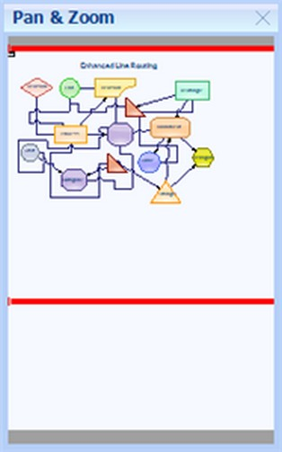

::: {style="DISPLAY: none"}
{#d2h_url_template}{#d2h_package_url style="WIDTH: 0px; DISPLAY: none; HEIGHT: 0px"}
:::

::::: {#nsbanner .d2h_main_nsbanner style="BORDER-BOTTOM: #999999 1px solid; POSITION: relative; PADDING-BOTTOM: 0px; BACKGROUND-COLOR: transparent; PADDING-LEFT: 0px; PADDING-RIGHT: 0px; DISPLAY: none; BORDER-TOP: #999999 1px solid; PADDING-TOP: 0px; LEFT: 0px"}
:::: {#TitleRow .d2h_main_titlerow style="PADDING-BOTTOM: 4px; BACKGROUND-COLOR: transparent; PADDING-LEFT: 22px; WIDTH: 100%; PADDING-RIGHT: 10px; DISPLAY: none; PADDING-TOP: 4px"}
::: {#ienav .d2h_main_ienav style="DISPLAY: none"}
{#D2HPrevious .D2HPreviousEnabled}  {#D2HNext .D2HNextEnabled}
:::
::::
:::::

::::: {#nstext .d2h_main_nstext style="PADDING-BOTTOM: 10px; BACKGROUND-COLOR: transparent; PADDING-LEFT: 22px; PADDING-RIGHT: 10px; HEIGHT: 100%; OVERFLOW: auto; PADDING-TOP: 5px" hasuserbackground="true" valign="bottom"}
::: {#d2h_breadcrumbs .d2h_breadcrumbs}
[Essential Studio User Guide Documentation](ms-xhelp:///?Id=12457748-09e3-4d74-a240-8e049cedf030){.d2h_breadcrumbsNormal}[ \> ]{.d2h_breadcrumbsLinkSeparator}[User Interface Edition](ms-xhelp:///?Id=c29296b7-531c-413b-a0ec-488ca1f7f669){.d2h_breadcrumbsNormal}[ \> ]{.d2h_breadcrumbsLinkSeparator}[Essential ASP.NET](ms-xhelp:///?Id=25c35330-c127-4dad-9a92-ed79dc7261a6){.d2h_breadcrumbsNormal}[ \> ]{.d2h_breadcrumbsLinkSeparator}[Essential Diagram]{.d2h_breadcrumbsContentsOnly}[ \> ]{.d2h_breadcrumbsLinkSeparator}[Concepts and Features](ms-xhelp:///?Id=f9aa55fb-f8cf-43da-a8be-de231dc0d949){.d2h_breadcrumbsNormal}[ \> ]{.d2h_breadcrumbsLinkSeparator}[Supported Controls](ms-xhelp:///?Id=38a5c852-c99d-4230-b3f3-26dc72ca57af){.d2h_breadcrumbsNormal}
:::

### OverviewWebControl[]{style="FONT-SIZE: 10pt"} {#overviewwebcontrol style="tab-stops: 0pt"}

[]{style="FONT-FAMILY: 'Trebuchet MS','sans-serif'; COLOR: #15428b; FONT-SIZE: 9pt"} 

OverviewWebControl provides a perspective view of a diagram model, and enables to dynamically pan and zoom diagrams. The control features a viewport window that can be moved or resized by using the mouse, to modify the diagram\'s origin and magnification properties at run time.

 

An important property of the OverviewWebControl is the **AssociatedDigramControlId** property.

[]{style="FONT-FAMILY: 'Trebuchet MS','sans-serif'; COLOR: #15428b; FONT-SIZE: 9pt"} 

::: {align="center"}
+-----------------------------------+----------------------------------------------------------------------------------------------+
|                                   |                                                                                              |
|                                   |                                                                                              |
| Property                          | Description                                                                                  |
+-----------------------------------+----------------------------------------------------------------------------------------------+
| BackColor                         | Gets or sets the Background color of the component.                                          |
+-----------------------------------+----------------------------------------------------------------------------------------------+
| BorderColor                       | Gets or sets the Color of the border around the control.                                     |
+-----------------------------------+----------------------------------------------------------------------------------------------+
| BorderStyle                       | Gets or sets the Border style for the OverviewWebControl. It includes the following options. |
|                                   |                                                                                              |
|                                   |                                                                                              |
|                                   |                                                                                              |
|                                   | [·      ]{style="FONT-FAMILY: Symbol"}FixedSingle                                            |
|                                   |                                                                                              |
|                                   | [·      ]{style="FONT-FAMILY: Symbol"}Fixed3D                                                |
|                                   |                                                                                              |
|                                   | [·      ]{style="FONT-FAMILY: Symbol"}None                                                   |
+-----------------------------------+----------------------------------------------------------------------------------------------+
| CssClass                          | Specifies the Css Class name applied to the control.                                         |
+-----------------------------------+----------------------------------------------------------------------------------------------+
| Enabled                           | Gets or sets the value indicating whether the control is enabled.                            |
+-----------------------------------+----------------------------------------------------------------------------------------------+
| AssociatedDigramControlId         | Gets or sets the associated diagram control.                                                 |
+-----------------------------------+----------------------------------------------------------------------------------------------+
| HTTPHandlerName                   | Specifies the Name of the HTTP Handler which draws the diagram at run time.                  |
+-----------------------------------+----------------------------------------------------------------------------------------------+
| Visible                           | Gets or sets the visibility of the control.                                                  |
+-----------------------------------+----------------------------------------------------------------------------------------------+
| ResizeFrameColor                  | Gets or sets the value indicating whether the view region can be moved and resized.          |
+-----------------------------------+----------------------------------------------------------------------------------------------+
:::

[                ]{style="FONT-FAMILY: 'Calibri','sans-serif'"}

HTTP Handler for OverviewWebControl

[                          ]{style="FONT-FAMILY: 'Calibri','sans-serif'; COLOR: blue"}

+------------------------------------------------------------------------------------------------------------------------------------------------------------------------------------------------------------------------------------------------------------------------------------------------------------------------------------------------------------------------------------------------------------------------------------------------------------------------------------------------------------------------------+
| **[\[ASPX\]]{style="FONT-FAMILY: 'Courier New'"}**                                                                                                                                                                                                                                                                                                                                                                                                                                                                           |
|                                                                                                                                                                                                                                                                                                                                                                                                                                                                                                                              |
| []{style="FONT-FAMILY: 'Courier New'"}                                                                                                                                                                                                                                                                                                                                                                                                                                                                                       |
|                                                                                                                                                                                                                                                                                                                                                                                                                                                                                                                              |
| [\<]{style="FONT-FAMILY: 'Courier New'; COLOR: blue"}[add]{style="FONT-FAMILY: 'Courier New'; COLOR: #a31515"}[ [verb]{style="COLOR: red"}[=\"\*\"]{style="COLOR: blue"} [path]{style="COLOR: red"}[=\"OverviewImgRequest.ashx\"]{style="COLOR: blue"} [type]{style="COLOR: red"}[=\"Syncfusion.Web.UI.WebControls.Diagram.OverviewDocumentRenderHandler,       Syncfusion.Diagram.Web, Version=7.103.0.30, Culture=neutral, PublicKeyToken=3d67ed1f87d44c89\"/\>]{style="COLOR: blue"}]{style="FONT-FAMILY: 'Courier New'"} |
+------------------------------------------------------------------------------------------------------------------------------------------------------------------------------------------------------------------------------------------------------------------------------------------------------------------------------------------------------------------------------------------------------------------------------------------------------------------------------------------------------------------------------+

[]{style="FONT-FAMILY: 'Trebuchet MS','sans-serif'; COLOR: #15428b; FONT-SIZE: 9pt"} 

The following code example illustrates how to set the properties for the OverviewWebControl.

[]{style="FONT-FAMILY: 'Trebuchet MS','sans-serif'; FONT-SIZE: 9pt"} 

+-------------------------------------------------------------------------------------------------------------------------------------------+
| **[\[C#\]]{style="FONT-FAMILY: 'Courier New'"}**                                                                                          |
|                                                                                                                                           |
| []{style="FONT-FAMILY: 'Courier New'"}                                                                                                    |
|                                                                                                                                           |
| [OverviewWebControl1.BackColor = System.Drawing.[SystemColors]{style="COLOR: #2b91af"}.AppWorkspace;]{style="FONT-FAMILY: 'Courier New'"} |
|                                                                                                                                           |
| [OverviewWebControl1.BorderColor = Color.Black;]{style="FONT-FAMILY: 'Courier New'"}                                                      |
|                                                                                                                                           |
| [OverviewWebControl1.BorderStyle = [BorderStyle]{style="COLOR: #2b91af"}.Groove; ]{style="FONT-FAMILY: 'Courier New'"}                    |
|                                                                                                                                           |
| [OverviewWebControl1.ForeColor = System.Drawing.[Color]{style="COLOR: #2b91af"}.Red;]{style="FONT-FAMILY: 'Courier New'"}                 |
|                                                                                                                                           |
| [OverviewWebControl1.TabIndex = 1;]{style="FONT-FAMILY: 'Courier New'"}                                                                   |
+-------------------------------------------------------------------------------------------------------------------------------------------+

[]{style="FONT-FAMILY: 'Trebuchet MS','sans-serif'; COLOR: #15428b; FONT-SIZE: 9pt"} 

{border="0"}

[]{style="FONT-FAMILY: 'Trebuchet MS','sans-serif'; COLOR: #15428b; FONT-SIZE: 9pt"} 

Figure 13: OverviewWebControl

[]{#related-topics}
:::::
