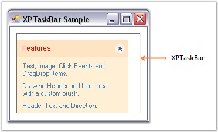
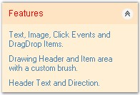

::: {style="DISPLAY: none"}
{#d2h_url_template}{#d2h_package_url style="WIDTH: 0px; DISPLAY: none; HEIGHT: 0px"}
:::

::::: {.d2h_secondary_topic style="PADDING-BOTTOM: 10pt; MARGIN: 0pt; PADDING-LEFT: 0pt; PADDING-RIGHT: 0pt; PADDING-TOP: 0pt"}
##### Padding {#padding style="MARGIN-LEFT: 18pt; tab-stops: 18.0pt"}

[]{style="COLOR: #15428b"} 

Padding Settings for XPTaskBar

[]{style="COLOR: #4a5c8c; FONT-SIZE: 8pt"} 

The interior spacing of the XPTaskBar control can be specified by setting the **DockPadding** property to integer values.

 

The horizontal and vertical padding can be specified using the **HorizontalPadding** and **VerticalPadding** properties. The default value of the both is \'Zero\'.

[]{style="COLOR: #15428b"} 

::: {align="center"}
  -------------------- ---------------------------------------------------------------
  XPTaskBar Property   Description
  DockPadding          Specifies dock padding settings for all edges of the control.
  HorizontalPadding    Specifies horizontal spacing between the layout taskbar.
  VerticalPadding      Specifies vertical spacing between the layout taskbar.
  -------------------- ---------------------------------------------------------------
:::

[]{style="COLOR: #15428b"} 

+---------------------------------------------------------------------------------------------------------------------------------+
| **[\[C#\]]{style="FONT-FAMILY: 'Courier New'; COLOR: black"}**                                                                  |
|                                                                                                                                 |
| []{style="FONT-FAMILY: 'Courier New'; COLOR: black"}                                                                            |
|                                                                                                                                 |
| [this]{style="FONT-FAMILY: 'Courier New'; COLOR: blue"}[.xpTaskBar1.DockPadding.All = 10;]{style="FONT-FAMILY: 'Courier New'"}  |
|                                                                                                                                 |
| [this]{style="FONT-FAMILY: 'Courier New'; COLOR: blue"}[.xpTaskBar1.HorizontalPadding = 3;]{style="FONT-FAMILY: 'Courier New'"} |
|                                                                                                                                 |
| [this]{style="FONT-FAMILY: 'Courier New'; COLOR: blue"}[.xpTaskBar1.VerticalPadding = 3;]{style="FONT-FAMILY: 'Courier New'"}   |
+---------------------------------------------------------------------------------------------------------------------------------+

[]{style="COLOR: #15428b"} 

+------------------------------------------------------------------------------------------------------------------------------+
| **[\[VB.NET\]]{style="FONT-FAMILY: 'Courier New'; COLOR: black"}**                                                           |
|                                                                                                                              |
| []{style="FONT-FAMILY: 'Courier New'; COLOR: black"}                                                                         |
|                                                                                                                              |
| [Me]{style="FONT-FAMILY: 'Courier New'; COLOR: blue"}[.xpTaskBar1.DockPadding.All = 10]{style="FONT-FAMILY: 'Courier New'"}  |
|                                                                                                                              |
| [Me]{style="FONT-FAMILY: 'Courier New'; COLOR: blue"}[.xpTaskBar1.HorizontalPadding = 3]{style="FONT-FAMILY: 'Courier New'"} |
|                                                                                                                              |
| [Me]{style="FONT-FAMILY: 'Courier New'; COLOR: blue"}[.xpTaskBar1.VerticalPadding = 3]{style="FONT-FAMILY: 'Courier New'"}   |
+------------------------------------------------------------------------------------------------------------------------------+

[]{style="COLOR: #15428b"} 

{border="0"}

[]{style="COLOR: #15428b"} 

Figure 948: Padding Settings of XP TaskBar Illustrated

[]{style="COLOR: #15428b"} 

Padding Settings for XPTaskBar Box Header

 

Padding provides spacing between the text of the header and it\'s borders. Horizontal and vertical padding can be set using the **PADX** and **PADY** properties.

 

::: {align="center"}
  ------------------------ ------------------------------------------------------------------------------------------------------------------------------------------------
  XPTaskBar Box Property   Description
  PADX                     It sets horizontal padding provided in pixels between the text of the header and header\'s left and right borders. The default value is \'5\'.
  PADY                     It sets vertical padding provided in pixels between the text of the header and header\'s top and bottom borders. The default value is \'5\'.
  ------------------------ ------------------------------------------------------------------------------------------------------------------------------------------------
:::

[]{style="COLOR: #15428b"} 

+-----------------------------------------------------------------------------------------------------------------------+
| **[\[C#\]]{style="FONT-FAMILY: 'Courier New'; COLOR: black"}**                                                        |
|                                                                                                                       |
| []{style="FONT-FAMILY: 'Courier New'; COLOR: black"}                                                                  |
|                                                                                                                       |
| [this]{style="FONT-FAMILY: 'Courier New'; COLOR: blue"}[.xpTaskBarBox1.PADX = 7;]{style="FONT-FAMILY: 'Courier New'"} |
|                                                                                                                       |
| [this]{style="FONT-FAMILY: 'Courier New'; COLOR: blue"}[.xpTaskBarBox1.PADY = 7;]{style="FONT-FAMILY: 'Courier New'"} |
+-----------------------------------------------------------------------------------------------------------------------+

**[]{style="COLOR: #15428b"}** 

+--------------------------------------------------------------------------------------------------------------------+
| **[\[VB.NET\]]{style="FONT-FAMILY: 'Courier New'; COLOR: black"}**                                                 |
|                                                                                                                    |
| []{style="FONT-FAMILY: 'Courier New'; COLOR: black"}                                                               |
|                                                                                                                    |
| [Me]{style="FONT-FAMILY: 'Courier New'; COLOR: blue"}[.xpTaskBarBox1.PADX = 7]{style="FONT-FAMILY: 'Courier New'"} |
|                                                                                                                    |
| [Me]{style="FONT-FAMILY: 'Courier New'; COLOR: blue"}[.xpTaskBarBox1.PADY = 7]{style="FONT-FAMILY: 'Courier New'"} |
+--------------------------------------------------------------------------------------------------------------------+

[]{style="COLOR: #15428b"} 

The following figure displays the XPTaskBar Box with padding settings.

[]{style="COLOR: #4a5c8c; FONT-SIZE: 8pt"} 

{border="0"}

[]{style="COLOR: #15428b"} 

Figure 949: Padding Settings of XPTaskBar Box Illustrated

 

 

[]{#p683} 

 

[]{#related-topics}
:::::
