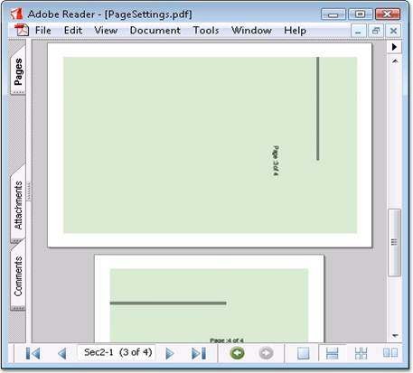

::: {style="DISPLAY: none"}
{#d2h_url_template}{#d2h_package_url style="WIDTH: 0px; DISPLAY: none; HEIGHT: 0px"}
:::

:::: {.d2h_secondary_topic style="PADDING-BOTTOM: 10pt; MARGIN: 0pt; PADDING-LEFT: 0pt; PADDING-RIGHT: 0pt; PADDING-TOP: 0pt"}
#### Page Settings {#page-settings style="tab-stops: 0pt"}

 

Essential PDF supports various page settings options that control the page display. They are as follows.

 

[·      ]{style="FONT-FAMILY: Symbol"}Page orientation

[·      ]{style="FONT-FAMILY: Symbol"}Page size

[·      ]{style="FONT-FAMILY: Symbol"}Page layout

[·      ]{style="FONT-FAMILY: Symbol"}Page mode

[·      ]{style="FONT-FAMILY: Symbol"}Page scale

[·      ]{style="FONT-FAMILY: Symbol"}Page transition

 

Some of the page sizes supported are as follows:

 

[·      ]{style="FONT-FAMILY: Symbol"}A0 to A9

[·      ]{style="FONT-FAMILY: Symbol"}B0 to B5

[·      ]{style="FONT-FAMILY: Symbol"}ArchA to ArchE

[·      ]{style="FONT-FAMILY: Symbol"}Half Letter

[·      ]{style="FONT-FAMILY: Symbol"}Ledger

[·      ]{style="FONT-FAMILY: Symbol"}Letter

[·      ]{style="FONT-FAMILY: Symbol"}Legal

[·      ]{style="FONT-FAMILY: Symbol"}Note

[·      ]{style="FONT-FAMILY: Symbol"}Letter11x17

 

Some of the page layouts supported are as follows:

 

[·      ]{style="FONT-FAMILY: Symbol"}OneColumn

[·      ]{style="FONT-FAMILY: Symbol"}SinglePage

[·      ]{style="FONT-FAMILY: Symbol"}TwoColumnLeft

[·      ]{style="FONT-FAMILY: Symbol"}TwoColumnRight

[·      ]{style="FONT-FAMILY: Symbol"}TwoPageRight

[·      ]{style="FONT-FAMILY: Symbol"}TwoPageLeft

 

Some of the page modes supported are as follows:

 

[·      ]{style="FONT-FAMILY: Symbol"}Full screen

[·      ]{style="FONT-FAMILY: Symbol"}UseAttachment.UseNone

[·      ]{style="FONT-FAMILY: Symbol"}UseOC

[·      ]{style="FONT-FAMILY: Symbol"}UseOutlines

[·      ]{style="FONT-FAMILY: Symbol"}UseThumbs

 

When a print dialog is displayed for a document, the values to be selected for the page scaling option are as follows:

 

[·      ]{style="FONT-FAMILY: Symbol"}**None-**Indicates that the print dialog should reflect no page scaling

[·      ]{style="FONT-FAMILY: Symbol"}**AppDefault-**Indicates that applications should use the current print scaling.

::: {style="BORDER-BOTTOM: windowtext 1pt solid; BORDER-LEFT: medium none; PADDING-BOTTOM: 1pt; MARGIN-TOP: 9pt; PADDING-LEFT: 0pt; PADDING-RIGHT: 0pt; MARGIN-BOTTOM: 9pt; BORDER-TOP: windowtext 1pt solid; BORDER-RIGHT: medium none; PADDING-TOP: 1pt"}
 

{border="0"}Note: If this entry has an unrecognized value, applications should use the current print scaling. The default value is AppDefault.
:::

 

The following code snippets illustrate the various page settings.

 

+------------------------------------------------------------------------------------------------------------------------------+
| **[\[C#\]]{style="FONT-FAMILY: 'Courier New'; COLOR: black"}**                                                               |
|                                                                                                                              |
| []{style="FONT-FAMILY: 'Courier New'; COLOR: black"}                                                                         |
|                                                                                                                              |
| [// To set landscape page orientation.]{style="FONT-FAMILY: 'Courier New'; COLOR: green"}                                    |
|                                                                                                                              |
| [doc.PageSettings.Orientation = PdfPageOrientation.Landscape;]{style="FONT-FAMILY: 'Courier New'"}                           |
|                                                                                                                              |
| []{style="FONT-FAMILY: 'Courier New'"}                                                                                       |
|                                                                                                                              |
| [// To set UseOC page Mode.]{style="FONT-FAMILY: 'Courier New'; COLOR: green"}                                               |
|                                                                                                                              |
| [doc.ViewerPreferences.PageMode = [PdfPageMode]{style="COLOR: teal"}.UseOC;]{style="FONT-FAMILY: 'Courier New'"}             |
|                                                                                                                              |
| []{style="FONT-FAMILY: 'Courier New'"}                                                                                       |
|                                                                                                                              |
| [// Setting pagescale option as None]{style="FONT-FAMILY: 'Courier New'; COLOR: green"}                                      |
|                                                                                                                              |
| [doc.ViewerPreferences.PageScaling = [PageScalingMode]{style="COLOR: teal"}.None;]{style="FONT-FAMILY: 'Courier New'"}       |
|                                                                                                                              |
| []{style="FONT-FAMILY: 'Courier New'"}                                                                                       |
|                                                                                                                              |
| [// To set two column left page layout.]{style="FONT-FAMILY: 'Courier New'; COLOR: green"}                                   |
|                                                                                                                              |
| [doc.ViewerPreferences.PageLayout = [PdfPageLayout]{style="COLOR: teal"}.TwoColumnLeft;]{style="FONT-FAMILY: 'Courier New'"} |
|                                                                                                                              |
| []{style="FONT-FAMILY: 'Courier New'"}                                                                                       |
|                                                                                                                              |
| [//Sets page transition.]{style="FONT-FAMILY: 'Courier New'; COLOR: green"}                                                  |
|                                                                                                                              |
| [doc.PageSettings.Transition.PageDuration = 1;]{style="FONT-FAMILY: 'Courier New'"}                                          |
|                                                                                                                              |
| [doc.PageSettings.Transition.Duration = 1; ]{style="FONT-FAMILY: 'Courier New'"}                                             |
+------------------------------------------------------------------------------------------------------------------------------+

[]{style="FONT-FAMILY: 'Trebuchet MS','sans-serif'; COLOR: #15428b; FONT-SIZE: 9pt"} 

+----------------------------------------------------------------------------------------------------------------------------------+
| **[\[]{style="FONT-FAMILY: 'Courier New'; COLOR: black"}[VB.NET[\]]{style="COLOR: black"}]{style="FONT-FAMILY: 'Courier New'"}** |
|                                                                                                                                  |
| **[]{style="FONT-FAMILY: 'Courier New'; COLOR: black"}**                                                                         |
|                                                                                                                                  |
| [\' To set landscape page orientation.]{style="FONT-FAMILY: 'Courier New'; COLOR: green"}                                        |
|                                                                                                                                  |
| [doc.PageSettings.Orientation = PdfPageOrientation.Landscape]{style="FONT-FAMILY: 'Courier New'"}                                |
|                                                                                                                                  |
| []{style="FONT-FAMILY: 'Courier New'"}                                                                                           |
|                                                                                                                                  |
| [\' To set UseOC page Mode.]{style="FONT-FAMILY: 'Courier New'; COLOR: green"}                                                   |
|                                                                                                                                  |
| [doc.ViewerPreferences.PageMode = PdfPageMode.UseOC]{style="FONT-FAMILY: 'Courier New'"}                                         |
|                                                                                                                                  |
| []{style="FONT-FAMILY: 'Courier New'"}                                                                                           |
|                                                                                                                                  |
| [\' Setting pagescale option as None]{style="FONT-FAMILY: 'Courier New'; COLOR: green"}                                          |
|                                                                                                                                  |
| [doc.ViewerPreferences.PageScaling = PageScalingMode.None]{style="FONT-FAMILY: 'Courier New'"}                                   |
|                                                                                                                                  |
| []{style="FONT-FAMILY: 'Courier New'"}                                                                                           |
|                                                                                                                                  |
| [\' To set two column left page layout.]{style="FONT-FAMILY: 'Courier New'; COLOR: green"}                                       |
|                                                                                                                                  |
| [ doc.ViewerPreferences.PageLayout = PdfPageLayout.TwoColumnLeft]{style="FONT-FAMILY: 'Courier New'"}                            |
|                                                                                                                                  |
| []{style="FONT-FAMILY: 'Courier New'"}                                                                                           |
|                                                                                                                                  |
| [\'Sets page transition.]{style="FONT-FAMILY: 'Courier New'; COLOR: green"}                                                      |
|                                                                                                                                  |
| [doc.PageSettings.Transition.PageDuration = 1]{style="FONT-FAMILY: 'Courier New'"}                                               |
|                                                                                                                                  |
| [doc.PageSettings.Transition.Duration = 1]{style="FONT-FAMILY: 'Courier New'"}                                                   |
+----------------------------------------------------------------------------------------------------------------------------------+

[]{style="COLOR: black; FONT-SIZE: 8pt"} 

{border="0"}

Figure 54: Page Settings

***[]{style="FONT-FAMILY: 'Trebuchet MS','sans-serif'; COLOR: #15428b; FONT-SIZE: 9pt"}*** 

Viewer Preference Settings

 

Essential PDF supports Viewer Preference options for the pdf pages such as hiding toolbar, hiding menubar and hiding window UI. The **HideToolbar**, **HideMenuBar** and **HideWindowUI** properties can be used for enabling these features. The following code example illustrates this.

 

+------------------------------------------------------------------------------------------------------------------------------------------------------------------------------------------------------------------------------------------------------+
| **[\[C#\]]{style="FONT-FAMILY: 'Courier New'; COLOR: black; FONT-SIZE: 9pt"}**                                                                                                                                                                       |
|                                                                                                                                                                                                                                                      |
| []{style="FONT-FAMILY: 'Courier New'; COLOR: black; FONT-SIZE: 9pt"}                                                                                                                                                                                 |
|                                                                                                                                                                                                                                                      |
| [//To hide the viewer application\'s Tool bar]{style="FONT-FAMILY: 'Courier New'; COLOR: green; FONT-SIZE: 9pt"}                                                                                                                                     |
|                                                                                                                                                                                                                                                      |
| [doc.ViewerPreferences.HideToolbar = ]{style="FONT-FAMILY: 'Courier New'; COLOR: black; FONT-SIZE: 9pt"}[true]{style="FONT-FAMILY: 'Courier New'; COLOR: blue; FONT-SIZE: 9pt"}[;]{style="FONT-FAMILY: 'Courier New'; COLOR: black; FONT-SIZE: 9pt"} |
|                                                                                                                                                                                                                                                      |
| []{style="FONT-FAMILY: 'Courier New'; COLOR: black; FONT-SIZE: 9pt"}                                                                                                                                                                                 |
|                                                                                                                                                                                                                                                      |
| [//To hide the viewer application\'s Menu bar]{style="FONT-FAMILY: 'Courier New'; COLOR: green; FONT-SIZE: 9pt"}                                                                                                                                     |
|                                                                                                                                                                                                                                                      |
| [doc.ViewerPreferences.HideMenubar = ]{style="FONT-FAMILY: 'Courier New'; COLOR: black; FONT-SIZE: 9pt"}[true]{style="FONT-FAMILY: 'Courier New'; COLOR: blue; FONT-SIZE: 9pt"}[;]{style="FONT-FAMILY: 'Courier New'; COLOR: black; FONT-SIZE: 9pt"} |
|                                                                                                                                                                                                                                                      |
| []{style="FONT-FAMILY: 'Courier New'; COLOR: black; FONT-SIZE: 9pt"}                                                                                                                                                                                 |
|                                                                                                                                                                                                                                                      |
| [//To hide the user interface elements such as Scroll bar, navigation controls]{style="FONT-FAMILY: 'Courier New'; COLOR: green; FONT-SIZE: 9pt"}                                                                                                    |
|                                                                                                                                                                                                                                                      |
| [doc.ViewerPreferences.HideWindowUI = ]{style="FONT-FAMILY: 'Courier New'; COLOR: black; FONT-SIZE: 9pt"}[true]{style="FONT-FAMILY: 'Courier New'; COLOR: blue; FONT-SIZE: 9pt"}                                                                     |
+------------------------------------------------------------------------------------------------------------------------------------------------------------------------------------------------------------------------------------------------------+

[]{style="FONT-FAMILY: 'Trebuchet MS','sans-serif'; COLOR: #15428b; FONT-SIZE: 9pt"} 

+----------------------------------------------------------------------------------------------------------------------------------------------------------------------------------+
| **[\[]{style="FONT-FAMILY: 'Courier New'; COLOR: black; FONT-SIZE: 9pt"}[VB.NET[\]]{style="COLOR: black"}]{style="FONT-FAMILY: 'Courier New'; FONT-SIZE: 9pt"}**                 |
|                                                                                                                                                                                  |
| **[]{style="FONT-FAMILY: 'Courier New'; COLOR: black; FONT-SIZE: 9pt"}**                                                                                                         |
|                                                                                                                                                                                  |
| [\'To hide the viewer application\'s Tool bar ]{style="FONT-FAMILY: 'Courier New'; COLOR: green; FONT-SIZE: 9pt"}                                                                |
|                                                                                                                                                                                  |
| [doc.ViewerPreferences.HideToolbar = ]{style="FONT-FAMILY: 'Courier New'; COLOR: black; FONT-SIZE: 9pt"}[True]{style="FONT-FAMILY: 'Courier New'; COLOR: blue; FONT-SIZE: 9pt"}  |
|                                                                                                                                                                                  |
| []{style="FONT-FAMILY: 'Courier New'; COLOR: blue; FONT-SIZE: 9pt"}                                                                                                              |
|                                                                                                                                                                                  |
| [\'To hide the viewer application\'s Menu bar ]{style="FONT-FAMILY: 'Courier New'; COLOR: green; FONT-SIZE: 9pt"}                                                                |
|                                                                                                                                                                                  |
| [doc.ViewerPreferences.HideMenubar = ]{style="FONT-FAMILY: 'Courier New'; COLOR: black; FONT-SIZE: 9pt"}[True]{style="FONT-FAMILY: 'Courier New'; COLOR: blue; FONT-SIZE: 9pt"}  |
|                                                                                                                                                                                  |
| []{style="FONT-FAMILY: 'Courier New'; COLOR: blue; FONT-SIZE: 9pt"}                                                                                                              |
|                                                                                                                                                                                  |
| [\'To hide the user interface elements such as Scroll bar, navigation controls ]{style="FONT-FAMILY: 'Courier New'; COLOR: green; FONT-SIZE: 9pt"}                               |
|                                                                                                                                                                                  |
| [doc.ViewerPreferences.HideWindowUI = ]{style="FONT-FAMILY: 'Courier New'; COLOR: black; FONT-SIZE: 9pt"}[True]{style="FONT-FAMILY: 'Courier New'; COLOR: blue; FONT-SIZE: 9pt"} |
+----------------------------------------------------------------------------------------------------------------------------------------------------------------------------------+

[]{style="FONT-FAMILY: 'Trebuchet MS','sans-serif'; COLOR: #15428b; FONT-SIZE: 9pt"} 

Sample Location

 

A sample which demonstrates the PDF Page Settings is available in the following sample installation location:

 

***\<Install Location\>\\Windows\\Pdf.Windows\\Samples\\2.0\\Settings\\Page Settings***

 

 

[]{#related-topics}
::::
