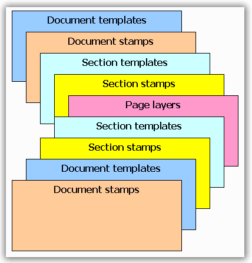

::: {style="DISPLAY: none"}
{#d2h_url_template}{#d2h_package_url style="WIDTH: 0px; DISPLAY: none; HEIGHT: 0px"}
:::

::::::: {.d2h_secondary_topic style="PADDING-BOTTOM: 10pt; MARGIN: 0pt; PADDING-LEFT: 0pt; PADDING-RIGHT: 0pt; PADDING-TOP: 0pt"}
##### Page Templates {#page-templates style="tab-stops: 0pt"}

 

Page Templates define similar graphics primitives for a range of pages. Each page has two sources of the templates (template on the document holding the section of the page, and template on the section containing the page) that apply sequentially.

 

Each page template has four properties for Left, Right, Top and Bottom docked templates, and a collection of the additional template elements (stamps). Also, there are eight additional templates that you can add to the odd / even pages (EvenTop, OddTop, etc.). If one of these eight templates is set, it overrides its usual template (OddTop overrides Top, etc.); Otherwise, the usual template is used.

[]{style="FONT-FAMILY: 'Trebuchet MS','sans-serif'; COLOR: #15428b; FONT-SIZE: 9pt"} 

::: {style="BORDER-BOTTOM: windowtext 1pt solid; BORDER-LEFT: medium none; PADDING-BOTTOM: 1pt; MARGIN-TOP: 9pt; PADDING-LEFT: 0pt; PADDING-RIGHT: 0pt; MARGIN-BOTTOM: 9pt; BORDER-TOP: windowtext 1pt solid; BORDER-RIGHT: medium none; PADDING-TOP: 1pt"}
{border="0"}Note: A PdfPageTemplateElement is added as one template. It can be assigned to Left, Right, Top or Bottom only once.
:::

 

Using the Page Templates

 

If you want to define some graphics content to all pages of the document, use the **Template** property of the **PdfDocument** class. You can define Left, Top, Right, Bottom templates, as well as arbitrary quantity of the other templates (stamps) that can be used for water marking or stamping of the pages.

 

If you have decided to use some custom templates for a specified range of the page, use **Template** property of the **PdfSection** class containing these pages. It involves the same functionality as in the PdfDocument class. Additionally, you can disable or enable the document templates from the section.

[]{style="FONT-FAMILY: 'Trebuchet MS','sans-serif'; COLOR: #15428b; FONT-SIZE: 9pt"} 

Default Behavior

 

Document templates are enabled, by default.

 

::: {style="BORDER-BOTTOM: windowtext 1pt solid; BORDER-LEFT: medium none; PADDING-BOTTOM: 1pt; MARGIN-TOP: 9pt; PADDING-LEFT: 0pt; PADDING-RIGHT: 0pt; MARGIN-BOTTOM: 9pt; BORDER-TOP: windowtext 1pt solid; BORDER-RIGHT: medium none; PADDING-TOP: 1pt"}
{border="0"}Note: Section template, which is printed over the parent template, does not replace document templates. If you want to insert a watermark or stamp on the page, use Stamps property of the PdfDocumentTemplate class.
:::

 

Behavior

 

**PdfPageTemplateElement** class has the functionality of aligning (use **Alignment** property) and docking (use **Dock** property) of this class. Docking to the Left, Top, Right, Bottom is implemented similar to Windows Forms Docking functionality (Top and Bottom have priority). Docking stamp elements do not have any priorities and the appearance depends on their order in the collection.

[]{style="FONT-FAMILY: 'Trebuchet MS','sans-serif'; COLOR: #15428b; FONT-SIZE: 9pt"} 

::: {style="BORDER-BOTTOM: windowtext 1pt solid; BORDER-LEFT: medium none; PADDING-BOTTOM: 1pt; MARGIN-TOP: 9pt; PADDING-LEFT: 0pt; PADDING-RIGHT: 0pt; MARGIN-BOTTOM: 9pt; BORDER-TOP: windowtext 1pt solid; BORDER-RIGHT: medium none; PADDING-TOP: 1pt"}
{border="0"}Note:[ ]{style="COLOR: black; FONT-SIZE: 8pt"}Alignment has higher priority than Docking in the template element, but Docking resets the Alignment.
:::

[]{style="FONT-FAMILY: 'Trebuchet MS','sans-serif'; COLOR: #15428b; FONT-SIZE: 9pt"} 

Each template element which is docked, sticks to its appropriate side of the page. It stretches itself according to the dimensions of the page and resets the alignment. Avoid printing any content that can be stretched in cases where the pages have different sizes. Also, define the size of the template elements according to its docking style on the page. But, if you want to use some template element as Left, Top, Right or Bottom, but do not want the element to be stretched, you can set the **Alignment** property, once you assigned the template element (or set Dock property) to any of the mentioned properties. In this case, the template will stick to the appropriate position but will not be stretched.

::: {style="BORDER-BOTTOM: windowtext 1pt solid; BORDER-LEFT: medium none; PADDING-BOTTOM: 1pt; MARGIN-TOP: 9pt; PADDING-LEFT: 0pt; PADDING-RIGHT: 0pt; MARGIN-BOTTOM: 9pt; BORDER-TOP: windowtext 1pt solid; BORDER-RIGHT: medium none; PADDING-TOP: 1pt"}
 

{border="0"}Note: In this scenario, you can set the Alignment property to the appropriate side only (depending on the Dock style). For example, if you set some template element as Top, the allowed values for Alignment are: TopLeft, TopCenter and TopRight. You cannot set any other value attributing to the possible inconsistency with Docking style.
:::

[]{style="FONT-FAMILY: 'Trebuchet MS','sans-serif'; COLOR: #15428b; FONT-SIZE: 9pt"} 

Z-Order of the Layers

[]{style="FONT-FAMILY: 'Trebuchet MS','sans-serif'; COLOR: #15428b; FONT-SIZE: 9pt"} 

Each page can contain page templates from the document and from the parent section. Also, it can contain its own layers. The order of the layers is as follows (from back to top):

[]{style="FONT-FAMILY: 'Trebuchet MS','sans-serif'; COLOR: #15428b; FONT-SIZE: 9pt"} 

1.   Document page templates (Left, Top, Right, Bottom) which have Background property set to ***True***.

2.   Document stamp elements which have Background property set to ***True***.

3.   Section page templates (Left, Top, Right, Bottom) which have Background property set to ***True***.

4.   Section stamp elements which have Background property set to ***True***.

5.   Page layers.

6.   Section page templates (Left, Top, Right, Bottom) which have Foreground property set to ***True***.

7.   Section stamp elements which have Foreground property set to ***True***.

8.   Document page templates (Left, Top, Right, Bottom) which have Foreground property set to ***True***.

9.   Document stamp elements which have Foreground property set to ***True***.

 

{border="0"}

Figure 27: Layers

[]{#related-topics}
:::::::
