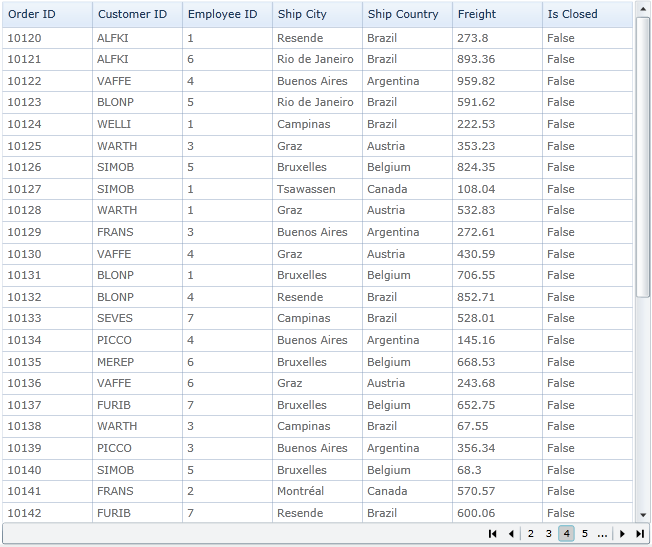

::: {style="DISPLAY: none"}
{#d2h_url_template}{#d2h_package_url style="WIDTH: 0px; DISPLAY: none; HEIGHT: 0px"}
:::

::: {.d2h_secondary_topic style="PADDING-BOTTOM: 10pt; MARGIN: 0pt; PADDING-LEFT: 0pt; PADDING-RIGHT: 0pt; PADDING-TOP: 0pt"}
#### Paging Support for GridDataControl {#paging-support-for-griddatacontrol style="tab-stops: 0pt"}

 

Paging support is used to return pages of data with entries where selection of the pages can be done using the numbered buttons. There are 3 types:

[·      ]{style="FONT-FAMILY: Symbol"}**OnDemandPaging[]{style="BACKGROUND: #d9d9d9"}**

[]{style="BACKGROUND: #d9d9d9"} 

           Current page item source adding by OnDemand basis.  Using this type you can fetch the data from the data source for the current page.

[·      ]{style="FONT-FAMILY: Symbol"}**ViewLevelPaging**

 

           ItemsSource for the page load on Grid load. In this type sorting, filtering and grouping applicable for the Current view element. Excellike filtering not applicable for this type.

 

[·      ]{style="FONT-FAMILY: Symbol"}**SourceLevelPaging**

                     Itemssource source for the page load while grid load. In this type sorting, filtering and grouping applicable for the whole collection. Excellike filtering not applicable for this type.

 

{border="0"}

Figure 126:Paging Support for GridDataControl

 

 

 

Properties, Methods and Events tables

Properties

  ----------------------- -------------------------------------------------------------------------------------- ---------------------------------- ----------- -----------------
  Property                Description                                                                            Type                               Data Type   Reference links
  **IsPagingOnDemand**    Loads the page based on demand                                                         NA                                 Boolean     NA
  **EnablePaging**        When the property is set as true, it will be loaded pagewise                           NA                                 Boolean     NA
  **IsViewLevelPaging**   It differentiated paging as view level or source level                                 NA                                 Boolean     NA
  PageCount               It sets the number of pages that can be viewed. This is valid only for OnDemandPage.   []{style="COLOR: red"}             Integer     NA
  PageSize                It sets the number of items to be displayed on a page.                                 Dependency[]{style="COLOR: red"}   Integer     NA
  ----------------------- -------------------------------------------------------------------------------------- ---------------------------------- ----------- -----------------

 

Events

+------------------------+--------------------------------------------------------------------------------+-------------+--------------------------------------+-----------------+
| Event                  | Description                                                                    | Arguments   | Type                                 | Reference links |
+------------------------+--------------------------------------------------------------------------------+-------------+--------------------------------------+-----------------+
| OnDemandDataSourceLoad | The event is triggered when it moves to the next page or when the page changes | PagedRows   | GridDataOnDemandPageLoadingEventArgs | NA              |
|                        |                                                                                |             |                                      |                 |
|                        |                                                                                | MaximumRows |                                      |                 |
+========================+================================================================================+=============+======================================+=================+

 

More:

[ ]{#related-topics}

[{border="0" align="absMiddle"}Features of Paging Support](ms-xhelp:///?Id=2f4ec2af-fcb2-4d8d-b7a9-a939503170a2){style="TEXT-DECORATION: none"}
:::
