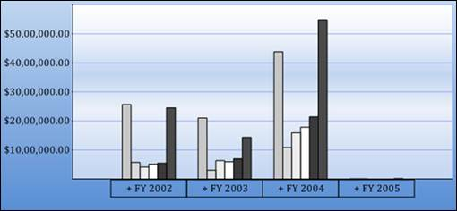

::: {style="DISPLAY: none"}
{#d2h_url_template}{#d2h_package_url style="WIDTH: 0px; DISPLAY: none; HEIGHT: 0px"}
:::

::::: {#nsbanner .d2h_main_nsbanner style="BORDER-BOTTOM: #999999 1px solid; POSITION: relative; PADDING-BOTTOM: 0px; BACKGROUND-COLOR: transparent; PADDING-LEFT: 0px; PADDING-RIGHT: 0px; DISPLAY: none; BORDER-TOP: #999999 1px solid; PADDING-TOP: 0px; LEFT: 0px"}
:::: {#TitleRow .d2h_main_titlerow style="PADDING-BOTTOM: 4px; BACKGROUND-COLOR: transparent; PADDING-LEFT: 22px; WIDTH: 100%; PADDING-RIGHT: 10px; DISPLAY: none; PADDING-TOP: 4px"}
::: {#ienav .d2h_main_ienav style="DISPLAY: none"}
{#D2HPrevious .D2HPreviousEnabled}  {#D2HNext .D2HNextEnabled}
:::
::::
:::::

::::: {#nstext .d2h_main_nstext style="PADDING-BOTTOM: 10px; BACKGROUND-COLOR: transparent; PADDING-LEFT: 22px; PADDING-RIGHT: 10px; HEIGHT: 100%; OVERFLOW: auto; PADDING-TOP: 5px" hasuserbackground="true" valign="bottom"}
::: {#d2h_breadcrumbs .d2h_breadcrumbs}
[Essential Studio User Guide Documentation](ms-xhelp:///?Id=12457748-09e3-4d74-a240-8e049cedf030){.d2h_breadcrumbsNormal}[ \> ]{.d2h_breadcrumbsLinkSeparator}[Business Intelligence Edition](ms-xhelp:///?Id=fdf33dd8-62b2-47b9-ad7b-fc50e590bca5){.d2h_breadcrumbsNormal}[ \> ]{.d2h_breadcrumbsLinkSeparator}[Essential BI ASP.NET](ms-xhelp:///?Id=99c6694e-59c3-4c59-abb5-ce9ce9a948bc){.d2h_breadcrumbsNormal}[ \> ]{.d2h_breadcrumbsLinkSeparator}[Essential BI Chart]{.d2h_breadcrumbsContentsOnly}[ \> ]{.d2h_breadcrumbsLinkSeparator}[Concepts and Features](ms-xhelp:///?Id=be4e11fe-e0a1-44d7-aa3a-05cf8b78bdb8){.d2h_breadcrumbsNormal}[ \> ]{.d2h_breadcrumbsLinkSeparator}[Chart Appearance](ms-xhelp:///?Id=6b450f80-063f-4b1a-8de8-c88c1c925ebe){.d2h_breadcrumbsNormal}
:::

### Palette {#palette style="tab-stops: 0pt"}

Palette refers to a set or combination of colors for a particular visual concept, that is, series. The Palette property is set accordingly to change the palette style and the following code snippet describes the default palette style setting.

[]{style="COLOR: black"} 

+-----------------------------------------------------------------------------------------------------------------------------------------------------------------------------------------------------------------+
| **[\[C#\]]{style="FONT-FAMILY: 'Courier New'"}**                                                                                                                                                                |
|                                                                                                                                                                                                                 |
| [this]{style="FONT-FAMILY: 'Courier New'; COLOR: blue"}[.olapChart1.Palette = [ChartColorPalette]{style="COLOR: #2b91af"}.GrayScale;]{style="FONT-FAMILY: 'Courier New'"}[]{style="FONT-FAMILY: 'Courier New'"} |
+-----------------------------------------------------------------------------------------------------------------------------------------------------------------------------------------------------------------+

 

+------------------------------------------------------------------------------------------------------------------------------------------------------------------------+
| [\[VB\]]{style="FONT-FAMILY: 'Courier New'"}                                                                                                                           |
|                                                                                                                                                                        |
| [Me]{style="FONT-FAMILY: 'Courier New'; COLOR: blue"}[.olapChart1.Palette = [ChartColorPalette]{style="COLOR: #2b91af"}.GrayScale]{style="FONT-FAMILY: 'Courier New'"} |
+------------------------------------------------------------------------------------------------------------------------------------------------------------------------+

**[]{style="FONT-FAMILY: 'Calibri','sans-serif'; FONT-SIZE: 12pt"}** 

In order to set the custom palette style, the following code snippets are used.

**[]{style="FONT-FAMILY: 'Calibri','sans-serif'; COLOR: black; FONT-SIZE: 12pt"}** 

+----------------------------------------------------------------------------------------------------------------------------------------------------------------------------------------------------------------------------------------------------------------------------------------------------------------------------------------------------------------------------------------------------------------------------------------------------------------------------------------------------------------------------------------------------------------------------------------------------------------------------------------------+
| **[\[C#\]]{style="FONT-FAMILY: 'Courier New'"}**[]{style="FONT-FAMILY: 'Courier New'"}                                                                                                                                                                                                                                                                                                                                                                                                                                                                                                                                                       |
|                                                                                                                                                                                                                                                                                                                                                                                                                                                                                                                                                                                                                                              |
| [Color]{style="FONT-FAMILY: 'Courier New'; COLOR: #2b91af"}[\[\] color = [new]{style="COLOR: blue"} [Color]{style="COLOR: #2b91af"}\[\] { [Color]{style="COLOR: #2b91af"}.FromArgb(246, 138, 18), [Color]{style="COLOR: #2b91af"}.FromArgb(0, 88, 165), [Color]{style="COLOR: #2b91af"}.FromArgb(218, 36, 36), [Color]{style="COLOR: #2b91af"}.FromArgb(103, 181, 19), [Color]{style="COLOR: #2b91af"}.FromArgb(246, 173, 65), [Color]{style="COLOR: #2b91af"}.FromArgb(220, 76, 34), [Color]{style="COLOR: #2b91af"}.FromArgb(55, 120, 212), [Color]{style="COLOR: #2b91af"}.FromArgb(100, 178, 77) };]{style="FONT-FAMILY: 'Courier New'"} |
|                                                                                                                                                                                                                                                                                                                                                                                                                                                                                                                                                                                                                                              |
| [this]{style="FONT-FAMILY: 'Courier New'; COLOR: blue"}[.olapChart1.Palette = [ChartColorPalette]{style="COLOR: #2b91af"}.Custom;]{style="FONT-FAMILY: 'Courier New'"}                                                                                                                                                                                                                                                                                                                                                                                                                                                                       |
|                                                                                                                                                                                                                                                                                                                                                                                                                                                                                                                                                                                                                                              |
| [this]{style="FONT-FAMILY: 'Courier New'; COLOR: blue"}[.olapChart1.Model.ColorModel.CustomColors = color;]{style="FONT-FAMILY: 'Courier New'"}[]{style="FONT-FAMILY: 'Courier New'"}                                                                                                                                                                                                                                                                                                                                                                                                                                                        |
+----------------------------------------------------------------------------------------------------------------------------------------------------------------------------------------------------------------------------------------------------------------------------------------------------------------------------------------------------------------------------------------------------------------------------------------------------------------------------------------------------------------------------------------------------------------------------------------------------------------------------------------------+

 

+------------------------------------------------------------------------------------------------------------------------------------------------------------------------------------------------------------------------------------------------------------------------------------------------------------------------------------------------------------------------------------------------------------------------------------------------------------------------------------------------------------------------------------------------+
| **[\[VB\]]{style="FONT-FAMILY: 'Courier New'"}**[]{style="FONT-FAMILY: 'Courier New'"}                                                                                                                                                                                                                                                                                                                                                                                                                                                         |
|                                                                                                                                                                                                                                                                                                                                                                                                                                                                                                                                                |
| [Dim]{style="FONT-FAMILY: 'Courier New'; COLOR: blue"}[ color() [As]{style="COLOR: blue"} Color = [New]{style="COLOR: blue"} Color() {System.Drawing.Color.FromArgb(246, 138, 18), System.Drawing.Color.FromArgb(0, 88, 165), System.Drawing.Color.FromArgb(218, 36, 36), System.Drawing.Color.FromArgb(103, 181, 19), System.Drawing.Color.FromArgb(246, 173, 65), System.Drawing.Color.FromArgb(220, 76, 34), System.Drawing.Color.FromArgb(55, 120, 212), System.Drawing.Color.FromArgb(100, 178, 77)}]{style="FONT-FAMILY: 'Courier New'"} |
|                                                                                                                                                                                                                                                                                                                                                                                                                                                                                                                                                |
| [Me]{style="FONT-FAMILY: 'Courier New'; COLOR: blue"}[.olapChart1.Palette = ChartColorPalette.Custom]{style="FONT-FAMILY: 'Courier New'"}                                                                                                                                                                                                                                                                                                                                                                                                      |
|                                                                                                                                                                                                                                                                                                                                                                                                                                                                                                                                                |
| [Me]{style="FONT-FAMILY: 'Courier New'; COLOR: blue"}[.olapChart1.Model.ColorModel.CustomColors = color]{style="FONT-FAMILY: 'Courier New'"}[]{style="FONT-FAMILY: 'Courier New'"}                                                                                                                                                                                                                                                                                                                                                             |
+------------------------------------------------------------------------------------------------------------------------------------------------------------------------------------------------------------------------------------------------------------------------------------------------------------------------------------------------------------------------------------------------------------------------------------------------------------------------------------------------------------------------------------------------+

**[]{style="FONT-FAMILY: 'Calibri','sans-serif'; FONT-SIZE: 12pt"}** 

{border="0"}

 

Figure 41: Palette - GrayScale[]{#_Chart_Style_Dialog_1}

 

Table 20: Palette Property

 

::: {align="center"}
+--------------+------------------------------------------------------------------------------------------------------------+-------------+-------------------+----------------+
| Property     | Descriptions                                                                                               | Type        | Data              | Reference Link |
|              |                                                                                                            |             |                   |                |
|              |                                                                                                            |             | type              |                |
+--------------+------------------------------------------------------------------------------------------------------------+-------------+-------------------+----------------+
| Palette      | Various range of colors are applied to the series based on the selected style.                             | Server side | ChartColorPalette | \-             |
+--------------+------------------------------------------------------------------------------------------------------------+-------------+-------------------+----------------+
| CustomColors | If the palette property is set to custom, then the user specified colors are  applied to each series item. | Server side | Color\[\]         | \-             |
+--------------+------------------------------------------------------------------------------------------------------------+-------------+-------------------+----------------+
:::

 

Sample Link

A sample demo is available at the following dlocation:

 

..\\Syncfusion\\EssentialStudio\\\<Version Number\>\\BI\\Web\\OlapChart.Web\\Samples\\3.5\\Chart Appearance\\Background Demo\\[]{style="FONT-FAMILY: 'Cambria','serif'; COLOR: black; FONT-SIZE: 12pt"}

[]{#related-topics}
:::::
