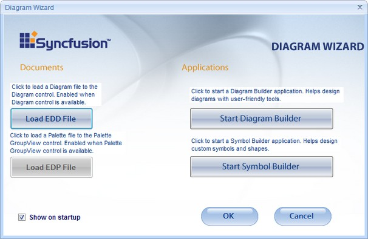

::: {style="DISPLAY: none"}
{#d2h_url_template}{#d2h_package_url style="WIDTH: 0px; DISPLAY: none; HEIGHT: 0px"}
:::

::::: {#nsbanner .d2h_main_nsbanner style="BORDER-BOTTOM: #999999 1px solid; POSITION: relative; PADDING-BOTTOM: 0px; BACKGROUND-COLOR: transparent; PADDING-LEFT: 0px; PADDING-RIGHT: 0px; DISPLAY: none; BORDER-TOP: #999999 1px solid; PADDING-TOP: 0px; LEFT: 0px"}
:::: {#TitleRow .d2h_main_titlerow style="PADDING-BOTTOM: 4px; BACKGROUND-COLOR: transparent; PADDING-LEFT: 22px; WIDTH: 100%; PADDING-RIGHT: 10px; DISPLAY: none; PADDING-TOP: 4px"}
::: {#ienav .d2h_main_ienav style="DISPLAY: none"}
{#D2HPrevious .D2HPreviousEnabled}  {#D2HNext .D2HNextEnabled}
:::
::::
:::::

:::::::: {#nstext .d2h_main_nstext style="PADDING-BOTTOM: 10px; BACKGROUND-COLOR: transparent; PADDING-LEFT: 22px; PADDING-RIGHT: 10px; HEIGHT: 100%; OVERFLOW: auto; PADDING-TOP: 5px" hasuserbackground="true" valign="bottom"}
::: {#d2h_breadcrumbs .d2h_breadcrumbs}
[Essential Studio User Guide Documentation](ms-xhelp:///?Id=12457748-09e3-4d74-a240-8e049cedf030){.d2h_breadcrumbsNormal}[ \> ]{.d2h_breadcrumbsLinkSeparator}[User Interface Edition](ms-xhelp:///?Id=c29296b7-531c-413b-a0ec-488ca1f7f669){.d2h_breadcrumbsNormal}[ \> ]{.d2h_breadcrumbsLinkSeparator}[Essential ASP.NET](ms-xhelp:///?Id=25c35330-c127-4dad-9a92-ed79dc7261a6){.d2h_breadcrumbsNormal}[ \> ]{.d2h_breadcrumbsLinkSeparator}[Essential Diagram]{.d2h_breadcrumbsContentsOnly}[ \> ]{.d2h_breadcrumbsLinkSeparator}[Concepts and Features](ms-xhelp:///?Id=f9aa55fb-f8cf-43da-a8be-de231dc0d949){.d2h_breadcrumbsNormal}[ \> ]{.d2h_breadcrumbsLinkSeparator}[Supported Controls](ms-xhelp:///?Id=38a5c852-c99d-4230-b3f3-26dc72ca57af){.d2h_breadcrumbsNormal}
:::

### PaletteGroupBar[]{style="FONT-SIZE: 10pt"} {#palettegroupbar style="tab-stops: 0pt"}

[]{style="FONT-FAMILY: 'Trebuchet MS','sans-serif'; COLOR: #15428b; FONT-SIZE: 9pt"} 

The PaletteGroupBar control provides support to drag symbols onto a diagram. It is based on the Syncfusion Essential Tools GroupBar control. Each symbol palette loaded in the PaletteGroupBar occupies a panel that can be selected by a bar button that is labeled with the name of the symbol palette. The symbols in the palette are shown as icons that can be dragged and dropped onto the diagram. This control enables you to add symbols to a palette, and save or load the palette whenever necessary. It provides a way to classify and maintain symbols.

           

Drag the PaletteGroupBar from the toolbox onto the web page. This will open the Diagram Wizard window.

[]{style="FONT-FAMILY: 'Trebuchet MS','sans-serif'; FONT-SIZE: 9pt"} 

{border="0"}

[]{style="FONT-FAMILY: 'Trebuchet MS','sans-serif'; COLOR: #15428b; FONT-SIZE: 9pt"} 

Figure 14: Diagram Wizard

[]{style="FONT-FAMILY: 'Trebuchet MS','sans-serif'; FONT-SIZE: 9pt"} 

This window provides you options to use documents and applications in a palette file. Following are the options provided:

[]{style="FONT-FAMILY: 'Trebuchet MS','sans-serif'; COLOR: #15428b; FONT-SIZE: 9pt"} 

1.   Documents-Allows you to load diagram and palette files

 

a.   Load EDD File-Allows you to load diagram file to the diagram control.

b.   Load EDP File-Allows you to load a Palette file to PaletteGroupView.

 

[]{style="FONT-FAMILY: 'Trebuchet MS','sans-serif'; COLOR: #15428b; FONT-SIZE: 9pt"} 

2.   Applications-Allows you to design diagram, custom symbols and shapes.[]{style="FONT-FAMILY: 'Trebuchet MS','sans-serif'; COLOR: #15428b; FONT-SIZE: 9pt"}

a.   Start Diagram Builder-Allows you to launch Diagram Builder application and design diagrams.

[b.   ]{style="FONT-FAMILY: 'Trebuchet MS','sans-serif'"}Start Symbol Builder-Allows you to launch Symbol Builder application and design custom shapes and symbols.[]{style="FONT-FAMILY: 'Trebuchet MS','sans-serif'; COLOR: #15428b; FONT-SIZE: 9pt"}

[]{style="FONT-FAMILY: 'Trebuchet MS','sans-serif'; COLOR: #15428b; FONT-SIZE: 9pt"} 

Symbol builder is a powerful application for creating different symbol palettes. Symbol Builder enables you to create palettes and save them as \*.edp files. If you do not want to start the diagram wizard after dragging the PaletteGroupBar onto the web page every time, select **Show on startup** option displayed in the diagram wizard.

3.   Click Ok, and then click Cancel, to view the PaletteGroupBar on your web page.

4.   Click on the PaletteGroupBar to view the PaletteGroupBar properties.

The following are the properties of the PaletteGroupBar control.

[]{style="FONT-FAMILY: 'Trebuchet MS','sans-serif'; COLOR: #15428b; FONT-SIZE: 9pt"} 

::: {align="center"}
+-----------------------------------+-------------------------------------------------------------------------------------------+
|                                   |                                                                                           |
|                                   |                                                                                           |
| Property                          | Description                                                                               |
+-----------------------------------+-------------------------------------------------------------------------------------------+
| BackColor                         | Gets or sets the background color of the component.                                       |
+-----------------------------------+-------------------------------------------------------------------------------------------+
| BorderColor                       | Gets or sets the color of the border around the control                                   |
+-----------------------------------+-------------------------------------------------------------------------------------------+
| BorderStyle                       | Gets or sets the Border style for the PaletteGroupBar. It includes the following options. |
|                                   |                                                                                           |
|                                   | [·      ]{style="FONT-FAMILY: Symbol"}FixedSingle                                         |
|                                   |                                                                                           |
|                                   | [·      ]{style="FONT-FAMILY: Symbol"}Fixed3D                                             |
|                                   |                                                                                           |
|                                   | [·      ]{style="FONT-FAMILY: Symbol"}None                                                |
+-----------------------------------+-------------------------------------------------------------------------------------------+
| CssClass                          | Specifies the Css class name applied to the control.                                      |
+-----------------------------------+-------------------------------------------------------------------------------------------+
| NodesLayout                       | Gets or sets the Symbols Layout.                                                          |
+-----------------------------------+-------------------------------------------------------------------------------------------+
| CollapsedDuration                 | Gets or sets the duration of animation collapse in milliseconds.                          |
+-----------------------------------+-------------------------------------------------------------------------------------------+
| CollapseSlideType                 | Specifies the type of slide effect to use during animation collapse.                      |
+-----------------------------------+-------------------------------------------------------------------------------------------+
| CollapseTransition                | Specifies the visual effect to use during animation collapse.                             |
+-----------------------------------+-------------------------------------------------------------------------------------------+
| ExpandDuration                    | Gets or sets the duration of animation expand in milliseconds.                            |
+-----------------------------------+-------------------------------------------------------------------------------------------+
| ExpandSlideType                   | Specifies the type of slide effect to use during animation expand.                        |
+-----------------------------------+-------------------------------------------------------------------------------------------+
| ExpandTransition                  | Specifies the visual effect to use during animation expand.                               |
+-----------------------------------+-------------------------------------------------------------------------------------------+
| HTTPHandlerName                   | Specifies the name of the HTTP Handler which draws images at run time.                    |
+-----------------------------------+-------------------------------------------------------------------------------------------+
| ImageFilesPath                    | Specifies the folder path where the control image resources are stored.                   |
+-----------------------------------+-------------------------------------------------------------------------------------------+
| ScriptFilesPath                   | Specifies the folder path where the control script resources are stored.                  |
+-----------------------------------+-------------------------------------------------------------------------------------------+
| SelectedItemColor                 | Specifies the color of the selected item.                                                 |
+-----------------------------------+-------------------------------------------------------------------------------------------+
| SelectedItemTextColor             | Specifies the text color of the selected item.                                            |
+-----------------------------------+-------------------------------------------------------------------------------------------+
:::

[]{style="FONT-FAMILY: 'Trebuchet MS','sans-serif'; FONT-SIZE: 9pt"} 

The following are the important events of the PaletteGroupBar control.

 

::: {align="center"}
+-----------------------------------+--------------------------------------------------------------------------------------------------------------+
|                                   |                                                                                                              |
|                                   |                                                                                                              |
| Event                             | Description                                                                                                  |
+-----------------------------------+--------------------------------------------------------------------------------------------------------------+
| CallbackRefresh                   | Server-side event that is fired with the client-side args, after calling client object Refresh(sArg) method. |
+-----------------------------------+--------------------------------------------------------------------------------------------------------------+
| NodeSelectChanged Event           | Triggered after a node is clicked.                                                                           |
+-----------------------------------+--------------------------------------------------------------------------------------------------------------+
:::

[]{style="FONT-FAMILY: 'Trebuchet MS','sans-serif'; FONT-SIZE: 9pt"} 

HTTP Handler for PaletteGroupBar

[]{style="FONT-FAMILY: 'Trebuchet MS','sans-serif'; COLOR: #15428b; FONT-SIZE: 9pt"} 

+-------------------------------------------------------------------------------------------------------------------------------------------------------------------------------------------------------------------------------------------------------------------------------------------------------------------------------------------------------------------------------------------------------------------------------------------------------------------------------------------------------------------+
| **[\[ASPX\]]{style="FONT-FAMILY: 'Courier New'"}**                                                                                                                                                                                                                                                                                                                                                                                                                                                                |
|                                                                                                                                                                                                                                                                                                                                                                                                                                                                                                                   |
| []{style="FONT-FAMILY: 'Courier New'"}                                                                                                                                                                                                                                                                                                                                                                                                                                                                            |
|                                                                                                                                                                                                                                                                                                                                                                                                                                                                                                                   |
| [\<]{style="FONT-FAMILY: 'Courier New'; COLOR: blue"}[add]{style="FONT-FAMILY: 'Courier New'; COLOR: #a31515"}[ [verb]{style="COLOR: red"}[=\"\*\"]{style="COLOR: blue"} [path]{style="COLOR: red"}[=\"PaletteImgRequest.ashx\"]{style="COLOR: blue"} [type]{style="COLOR: red"}[=\"Syncfusion.Web.UI.WebControls.Diagram.ThumbNodeRenderHandler,       Syncfusion.Diagram.Web, Version=X.X.X.X, Culture=neutral, PublicKeyToken=3d67ed1f87d44c89\"/\>]{style="COLOR: blue"}]{style="FONT-FAMILY: 'Courier New'"} |
+-------------------------------------------------------------------------------------------------------------------------------------------------------------------------------------------------------------------------------------------------------------------------------------------------------------------------------------------------------------------------------------------------------------------------------------------------------------------------------------------------------------------+

[]{style="FONT-FAMILY: 'Trebuchet MS','sans-serif'; COLOR: #15428b; FONT-SIZE: 9pt"} 

::: {style="BORDER-BOTTOM: windowtext 1pt solid; BORDER-LEFT: medium none; PADDING-BOTTOM: 1pt; MARGIN-TOP: 9pt; PADDING-LEFT: 0pt; PADDING-RIGHT: 0pt; MARGIN-BOTTOM: 9pt; BORDER-TOP: windowtext 1pt solid; BORDER-RIGHT: medium none; PADDING-TOP: 1pt"}
{border="0"}[Note:]{style="BACKGROUND: white"}[ ]{style="FONT-SIZE: 8pt"}X.X.X.X in the above code corresponds to the correct version number of the Essential Studio version that you are currently using.
:::

[]{style="FONT-FAMILY: 'Trebuchet MS','sans-serif'; COLOR: #15428b; FONT-SIZE: 9pt"} 

The following code example illustrates how to set the properties for the PaletteGroupBar.

[]{style="FONT-FAMILY: 'Trebuchet MS','sans-serif'; FONT-SIZE: 9pt"} 

+-------------------------------------------------------------------------------------------------------------------+
| **[\[C#\]]{style="FONT-FAMILY: 'Courier New'"}**                                                                  |
|                                                                                                                   |
| []{style="FONT-FAMILY: 'Courier New'"}                                                                            |
|                                                                                                                   |
| [PaletteGroupBar1.BackColor = Color.Cornsilk;]{style="FONT-FAMILY: 'Courier New'"}                                |
|                                                                                                                   |
| [PaletteGroupBar1.BorderColor = Color.Navy;]{style="FONT-FAMILY: 'Courier New'"}                                  |
|                                                                                                                   |
| [PaletteGroupBar1.BorderStyle = [BorderStyle]{style="COLOR: #2b91af"}.Solid;]{style="FONT-FAMILY: 'Courier New'"} |
|                                                                                                                   |
| [PaletteGroupBar1.SelectedItemColor = Color.Salmon;]{style="FONT-FAMILY: 'Courier New'"}                          |
+-------------------------------------------------------------------------------------------------------------------+

[]{style="FONT-FAMILY: 'Trebuchet MS','sans-serif'; COLOR: #15428b; FONT-SIZE: 9pt"} 

{border="0"}

[]{style="FONT-FAMILY: 'Trebuchet MS','sans-serif'; COLOR: #15428b; FONT-SIZE: 9pt"} 

Figure 15: PaletteGroupBar

**[]{style="FONT-FAMILY: 'Trebuchet MS','sans-serif'; COLOR: #15428b; FONT-SIZE: 9pt"}** 

Loading Files

**[]{style="FONT-FAMILY: 'Trebuchet MS','sans-serif'; COLOR: #15428b"}** 

1.   To display a diagram in the PaletteGroupBar, click the **Load EDD File** button, select required \*.edd file and run the application. The diagram is displayed.

2.   To display a palette file in the PaletteGroupView, click the **Load EDP File** button, select the required \*.edp file and run the application. The palette file is displayed.

[]{style="FONT-FAMILY: 'Trebuchet MS','sans-serif'; COLOR: #15428b; FONT-SIZE: 9pt"} 

***[]{style="FONT-FAMILY: 'Trebuchet MS','sans-serif'; COLOR: #15428b; FONT-SIZE: 9pt"}*** 

***[]{style="FONT-FAMILY: 'Trebuchet MS','sans-serif'; COLOR: #15428b; FONT-SIZE: 9pt"}*** 

::: {style="BORDER-BOTTOM: windowtext 1pt solid; BORDER-LEFT: medium none; PADDING-BOTTOM: 1pt; MARGIN-TOP: 9pt; PADDING-LEFT: 0pt; PADDING-RIGHT: 0pt; MARGIN-BOTTOM: 9pt; BORDER-TOP: windowtext 1pt solid; BORDER-RIGHT: medium none; PADDING-TOP: 1pt"}
 

{border="0"}Note: While loading older versions of palette files, the OldToNewDeserializationBinder class is used by the control. The class helps achieve compatibility between the versions using its BindToType method which performs binding of serialized object to a type. The following example illustrates a scenario where the old types in the older palette files are bound to the new types in the current palette files-Line Node type has been bound to Line type.
:::

[]{style="FONT-FAMILY: 'Trebuchet MS','sans-serif'; COLOR: #15428b; FONT-SIZE: 9pt"} 

+---------------------------------------------------------------------------------------------------------------------------------------------------------------------------------------------------------------------------------------+
| **[\[C#\]]{style="FONT-FAMILY: 'Courier New'; COLOR: black"}**                                                                                                                                                                        |
|                                                                                                                                                                                                                                       |
| **[]{style="FONT-FAMILY: 'Courier New'; COLOR: black"}**                                                                                                                                                                              |
|                                                                                                                                                                                                                                       |
| [sealed]{style="FONT-FAMILY: 'Courier New'; COLOR: blue"}[ [class]{style="COLOR: blue"} [OldToNewDeserializationBinder]{style="COLOR: #2b91af"} : SerializationBinder]{style="FONT-FAMILY: 'Courier New'"}                            |
|                                                                                                                                                                                                                                       |
| [{]{style="FONT-FAMILY: 'Courier New'"}                                                                                                                                                                                               |
|                                                                                                                                                                                                                                       |
| [    [public]{style="COLOR: blue"} [override]{style="COLOR: blue"} [Type]{style="COLOR: #2b91af"} BindToType([string]{style="COLOR: blue"} assemblyName, [string]{style="COLOR: blue"} typeName)]{style="FONT-FAMILY: 'Courier New'"} |
|                                                                                                                                                                                                                                       |
| [    {]{style="FONT-FAMILY: 'Courier New'"}                                                                                                                                                                                           |
|                                                                                                                                                                                                                                       |
| [        [Type]{style="COLOR: #2b91af"} typeToDeserialize;]{style="FONT-FAMILY: 'Courier New'"}                                                                                                                                       |
|                                                                                                                                                                                                                                       |
| []{style="FONT-FAMILY: 'Courier New'"}                                                                                                                                                                                                |
|                                                                                                                                                                                                                                       |
| [        [// For each assemblyName/typeName that you want to deserialize to]{style="COLOR: green"}]{style="FONT-FAMILY: 'Courier New'"}                                                                                               |
|                                                                                                                                                                                                                                       |
| [        [// a different type, set typeToDeserialize to the desired type.]{style="COLOR: green"}]{style="FONT-FAMILY: 'Courier New'"}                                                                                                 |
|                                                                                                                                                                                                                                       |
| [        [if]{style="COLOR: blue"} (typeName.IndexOf([\"LineNode\"]{style="COLOR: #a31515"}) != -1)]{style="FONT-FAMILY: 'Courier New'"}                                                                                              |
|                                                                                                                                                                                                                                       |
| [        {]{style="FONT-FAMILY: 'Courier New'"}                                                                                                                                                                                       |
|                                                                                                                                                                                                                                       |
| [            [// types binding to ensure loading previous versions]{style="COLOR: green"}]{style="FONT-FAMILY: 'Courier New'"}                                                                                                        |
|                                                                                                                                                                                                                                       |
| [            typeName = typeName.Replace([\"LineNode\"]{style="COLOR: #a31515"}, [\"Line\"]{style="COLOR: #a31515"});]{style="FONT-FAMILY: 'Courier New'"}                                                                            |
|                                                                                                                                                                                                                                       |
| [        }]{style="FONT-FAMILY: 'Courier New'"}                                                                                                                                                                                       |
|                                                                                                                                                                                                                                       |
| []{style="FONT-FAMILY: 'Courier New'"}                                                                                                                                                                                                |
|                                                                                                                                                                                                                                       |
| [        [// The following line of code returns the type.]{style="COLOR: green"}]{style="FONT-FAMILY: 'Courier New'"}                                                                                                                 |
|                                                                                                                                                                                                                                       |
| [        typeToDeserialize = [Type]{style="COLOR: #2b91af"}.GetType([String]{style="COLOR: #2b91af"}.Format([\"{0}, {1}\"]{style="COLOR: #a31515"}, typeName, assemblyName));]{style="FONT-FAMILY: 'Courier New'"}                    |
|                                                                                                                                                                                                                                       |
| []{style="FONT-FAMILY: 'Courier New'"}                                                                                                                                                                                                |
|                                                                                                                                                                                                                                       |
| [        [return]{style="COLOR: blue"} typeToDeserialize;]{style="FONT-FAMILY: 'Courier New'"}                                                                                                                                        |
|                                                                                                                                                                                                                                       |
| [    }]{style="FONT-FAMILY: 'Courier New'"}                                                                                                                                                                                           |
|                                                                                                                                                                                                                                       |
| [}]{style="FONT-FAMILY: 'Courier New'"}                                                                                                                                                                                               |
+---------------------------------------------------------------------------------------------------------------------------------------------------------------------------------------------------------------------------------------+

 

[]{#related-topics}
::::::::
