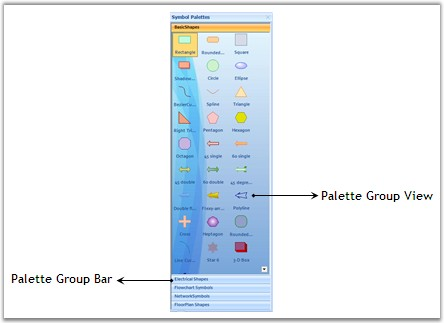

::: {style="DISPLAY: none"}
{#d2h_url_template}{#d2h_package_url style="WIDTH: 0px; DISPLAY: none; HEIGHT: 0px"}
:::

::::: {#nsbanner .d2h_main_nsbanner style="BORDER-BOTTOM: #999999 1px solid; POSITION: relative; PADDING-BOTTOM: 0px; BACKGROUND-COLOR: transparent; PADDING-LEFT: 0px; PADDING-RIGHT: 0px; DISPLAY: none; BORDER-TOP: #999999 1px solid; PADDING-TOP: 0px; LEFT: 0px"}
:::: {#TitleRow .d2h_main_titlerow style="PADDING-BOTTOM: 4px; BACKGROUND-COLOR: transparent; PADDING-LEFT: 22px; WIDTH: 100%; PADDING-RIGHT: 10px; DISPLAY: none; PADDING-TOP: 4px"}
::: {#ienav .d2h_main_ienav style="DISPLAY: none"}
{#D2HPrevious .D2HPreviousEnabled}  {#D2HNext .D2HNextEnabled}
:::
::::
:::::

::::::: {#nstext .d2h_main_nstext style="PADDING-BOTTOM: 10px; BACKGROUND-COLOR: transparent; PADDING-LEFT: 22px; PADDING-RIGHT: 10px; HEIGHT: 100%; OVERFLOW: auto; PADDING-TOP: 5px" hasuserbackground="true" valign="bottom"}
::: {#d2h_breadcrumbs .d2h_breadcrumbs}
[Essential Studio User Guide Documentation](ms-xhelp:///?Id=12457748-09e3-4d74-a240-8e049cedf030){.d2h_breadcrumbsNormal}[ \> ]{.d2h_breadcrumbsLinkSeparator}[User Interface Edition](ms-xhelp:///?Id=c29296b7-531c-413b-a0ec-488ca1f7f669){.d2h_breadcrumbsNormal}[ \> ]{.d2h_breadcrumbsLinkSeparator}[Essential Windows](ms-xhelp:///?Id=e60759d8-47a4-4570-9d7a-16a68d63f2ea){.d2h_breadcrumbsNormal}[ \> ]{.d2h_breadcrumbsLinkSeparator}[Essential Diagram]{.d2h_breadcrumbsContentsOnly}[ \> ]{.d2h_breadcrumbsLinkSeparator}[Concepts And Features](ms-xhelp:///?Id=008cec4b-5177-4859-8616-c062751d8fb6){.d2h_breadcrumbsNormal}[ \> ]{.d2h_breadcrumbsLinkSeparator}[Supported Controls](ms-xhelp:///?Id=aa17622e-7642-4f9d-b086-6c705e48f9fa){.d2h_breadcrumbsNormal}
:::

### Palette Groupbar And GroupView {#palette-groupbar-and-groupview style="tab-stops: 0pt"}

[]{style="FONT-FAMILY: 'Trebuchet MS','sans-serif'; COLOR: #15428b; FONT-SIZE: 9pt"} 

The Palette Groupbar control provides a way for users to drag-and-drop the symbols onto a diagram. It is based on the Syncfusion Essential Tools GroupBar control. Each symbol palette loaded in the PaletteGroupBar occupies a panel that can be selected by a bar button. The bar button is labeled with the name of the symbol palette. The symbols in the palette are shown as icons that can be dragged and dropped onto the diagram. This control allows users to add symbols to a palette, and save or load the palette whenever necessary. It provides a way to classify and maintain the symbols.

 

The PaletteGroupView control provides an easy way to serialize a symbol palette to and from the resource file of a form. At the design-time, users can attach a symbol palette to a PaletteGroupView control in a form. Selecting the PaletteGroupView, and clicking the **Palette** property in the Visual Studio .NET properties window, opens a standard **Open File** dialog, which allows the user to select a symbol palette file that has been created using the Symbol Designer.

 

The properties of the PaletteGroupBar and GroupView with their descriptions are given in the below table.

[]{style="FONT-FAMILY: 'Trebuchet MS','sans-serif'; COLOR: #15428b; FONT-SIZE: 9pt"} 

::: {align="center"}
  ----------------------- ---------------------------------------------------------------------------------------------------------------
  Property                Description
  BackColor               Sets the background color of the component.
  BorderStyle             Sets the border style to FixedSingle, Fixed3D or None.
  Collapsed               Indicates whether the GroupBar is collapsed.
  CollapsedText           Sets the text for the collapsed client area of the GroupBar.
  CollapsedWidth          Specifies the width of the collapsed GroupBar.
  CollapseImage           Image of the collapsed button in the expanded state.
  DrawClientBorder        Indicates whether border is drawn around the GroupBar\'s client window.
  ExpandImage             Sets image of the collapse button.
  FlatLook                Indicates whether control is displayed with a flat look.
  Font                    Sets font style for text in the control.
  ForeColor               Sets fore color of the display text in the component.
  GroupBarItemCursor      Cursor that is to be displayed when the mouse pointer is over the GroupBarItems.
  Office2007Theme         Sets the (blue, black or silver) office theme used for drawing the control.
  PopupClientSize         Sets the initial size of the pop-up for GroupBar client.
  PopupResizeMode         Gets / sets the pop-up resize mode.
  ShowPopupGripper        Boolean value indicating whether to show GroupBarItem\'s popup gripper.
  Text                    Text associated with the control.
  TextAlign               Alignment of the text set through Text property.
  ThemesEnabled           Specifies whether control should be themed.
  VisualStyle             Visual style for drawing the control. Styles are Default, OfficeXP, Office2003, VS2005 and Office2007.
  AllowCollapse           Indicates whether GroupBar can be collapsed.
  AnimatedSelection       Indicates whether animated selection is enabled.
  BarHighlight            Indicates whether GroupBar item is highlighted on mouse hovering over a GroupBar Item.
  EditMode                This property determines whether the symbols from the palette can be dragged and dropped onto the Diagram.
  Enabled                 Indicates whether component is enabled.
  ExpandButtonToolTip     Sets tooltip for Collapse button, when the control is collapsed.
  GroupBarItemHeight      Height of the GroupBarItems.
  MinimizeButtonToolTip   ToolTip for collapse button when control is expanded.
  NavigationPaneToolTip   ToolTip for navigation pane.
  PopupAutoClose          Indicates whether pop-up is closed after clicking an item.
  SelectedItem            Index of the selected GroupBarItem.
  StackedMode             Indicates whether GroupBarItem is stacked.
  Visible                 Sets the visibility of the GroupBar control.
  GroupBarItems           GroupBarItem collection in the control.
  ShowChevron             Indicates if chevron button of the navigation panel should be displayed when required.
  ShowItemImageInHeader   Gets / sets a value indicating whether the selected item\'s image is shown in the header in Stacked GroupBar.
  Palette                 Indicates the loaded palette is in palette view.
  ----------------------- ---------------------------------------------------------------------------------------------------------------
:::

[]{style="FONT-FAMILY: 'Calibri','sans-serif'"} 

::: {align="center"}
  ------------- -----------------------------------------------------
  Method        Description
  LoadPalette   Loads given Symbol Palette to the PaletteGroupView.
  ------------- -----------------------------------------------------
:::

[\
\
]{style="FONT-FAMILY: 'Calibri','sans-serif'"}[]{style="FONT-FAMILY: 'Trebuchet MS','sans-serif'; COLOR: #15428b; FONT-SIZE: 9pt"}

The important events of the PaletteGroupBar and GroupView with their descriptions are given in the below table.

[]{style="FONT-FAMILY: 'Trebuchet MS','sans-serif'; COLOR: #15428b; FONT-SIZE: 9pt"} 

::: {align="center"}
  -------------------------- ---------------------------------------------------------------------------------------------------
  Event                      Description
  Click                      Occurs when component is clicked.
  DoubleClick                Occurs when the component is double-clicked.
  GroupViewItemHighlighted   Event fired when an item in the GroupView control is highlighted.
  GroupViewItemSelected      Event fired when an item in the GroupView control is selected.
  GroupViewItemReordered     Event fired after the GroupView control items have been reordered by a drag--and--drop operation.
  GroupViewItemRenamed       Event fired after an in-place rename operation.
  ShowContextMenu Event      Event fired when the right mouse button is clicked over the control.
  -------------------------- ---------------------------------------------------------------------------------------------------
:::

[]{style="FONT-FAMILY: 'Calibri','sans-serif'"} 

Programmatically, the properties can be set as follows.

[]{style="FONT-FAMILY: 'Trebuchet MS','sans-serif'; COLOR: #15428b; FONT-SIZE: 9pt"} 

+---------------------------------------------------------------------------------------------------------------------------------------------------------------------------------------------------------------------------------------------+
| **[\[C#\]]{style="FONT-FAMILY: 'Courier New'; COLOR: black"}**                                                                                                                                                                              |
|                                                                                                                                                                                                                                             |
| []{style="FONT-FAMILY: 'Courier New'"}                                                                                                                                                                                                      |
|                                                                                                                                                                                                                                             |
| [paletteGroupBar1.AllowDrop = [true]{style="COLOR: blue"};]{style="FONT-FAMILY: 'Courier New'"}                                                                                                                                             |
|                                                                                                                                                                                                                                             |
| [paletteGroupBar1.Controls.Add(paletteGroupView1);]{style="FONT-FAMILY: 'Courier New'"}                                                                                                                                                     |
|                                                                                                                                                                                                                                             |
| [paletteGroupBar1.Controls.Add(paletteGroupView2);]{style="FONT-FAMILY: 'Courier New'"}                                                                                                                                                     |
|                                                                                                                                                                                                                                             |
| [paletteGroupBar1.Dock = System.Windows.Forms.[DockStyle]{style="COLOR: teal"}.Left;]{style="FONT-FAMILY: 'Courier New'"}                                                                                                                   |
|                                                                                                                                                                                                                                             |
| [paletteGroupBar1.EditMode = [false]{style="COLOR: blue"};]{style="FONT-FAMILY: 'Courier New'"}                                                                                                                                             |
|                                                                                                                                                                                                                                             |
| [paletteGroupBar1.GroupBarItems.AddRange([new]{style="COLOR: blue"} Syncfusion.Windows.Forms.Tools.GroupBarItem\[\]                                                 { groupBarItem1, groupBarItem2 });]{style="FONT-FAMILY: 'Courier New'"} |
|                                                                                                                                                                                                                                             |
| []{style="FONT-FAMILY: 'Courier New'"}                                                                                                                                                                                                      |
|                                                                                                                                                                                                                                             |
| []{style="FONT-FAMILY: 'Courier New'"}                                                                                                                                                                                                      |
|                                                                                                                                                                                                                                             |
| [paletteGroupBar1.Location = [new]{style="COLOR: blue"} System.Drawing.Point(0, 0);]{style="FONT-FAMILY: 'Courier New'"}                                                                                                                    |
|                                                                                                                                                                                                                                             |
| [paletteGroupBar1.Name = [\"paletteGroupBar1\"]{style="COLOR: maroon"};]{style="FONT-FAMILY: 'Courier New'"}                                                                                                                                |
|                                                                                                                                                                                                                                             |
| [paletteGroupBar1.SelectedItem = 1;]{style="FONT-FAMILY: 'Courier New'"}                                                                                                                                                                    |
|                                                                                                                                                                                                                                             |
| [paletteGroupBar1.Size = [new]{style="COLOR: blue"} System.Drawing.Size(114, 477);]{style="FONT-FAMILY: 'Courier New'"}                                                                                                                     |
|                                                                                                                                                                                                                                             |
| [paletteGroupBar1.TabIndex = 1;]{style="FONT-FAMILY: 'Courier New'"}                                                                                                                                                                        |
|                                                                                                                                                                                                                                             |
| [paletteGroupBar1.Text = [\"Symbol Palette\"]{style="COLOR: maroon"};]{style="FONT-FAMILY: 'Courier New'"}                                                                                                                                  |
|                                                                                                                                                                                                                                             |
| []{style="FONT-FAMILY: 'Courier New'"}                                                                                                                                                                                                      |
|                                                                                                                                                                                                                                             |
| [groupBarItem1.Client = paletteGroupView1;]{style="FONT-FAMILY: 'Courier New'"}                                                                                                                                                             |
|                                                                                                                                                                                                                                             |
| [groupBarItem1.Text = [\"Basic Shapes\"]{style="COLOR: maroon"};]{style="FONT-FAMILY: 'Courier New'"}                                                                                                                                       |
|                                                                                                                                                                                                                                             |
| [groupBarItem2.Client = paletteGroupView2;]{style="FONT-FAMILY: 'Courier New'"}                                                                                                                                                             |
|                                                                                                                                                                                                                                             |
| [groupBarItem2.Text = [\"ElectricalSymbols\"]{style="COLOR: maroon"};]{style="FONT-FAMILY: 'Courier New'"}                                                                                                                                  |
|                                                                                                                                                                                                                                             |
| [paletteGroupView1.ButtonView = [true]{style="COLOR: blue"};]{style="FONT-FAMILY: 'Courier New'"}                                                                                                                                           |
|                                                                                                                                                                                                                                             |
| [paletteGroupView1.Location = [new]{style="COLOR: blue"} System.Drawing.Point(2, 24);]{style="FONT-FAMILY: 'Courier New'"}                                                                                                                  |
|                                                                                                                                                                                                                                             |
| [paletteGroupView1.Name = [\"paletteGroupView1\"]{style="COLOR: maroon"};]{style="FONT-FAMILY: 'Courier New'"}                                                                                                                              |
|                                                                                                                                                                                                                                             |
| [paletteGroupView1.Size = [new]{style="COLOR: blue"} System.Drawing.Size(71, 0);]{style="FONT-FAMILY: 'Courier New'"}                                                                                                                       |
|                                                                                                                                                                                                                                             |
| [paletteGroupView1.TabIndex = 0;]{style="FONT-FAMILY: 'Courier New'"}                                                                                                                                                                       |
|                                                                                                                                                                                                                                             |
| []{style="FONT-FAMILY: 'Courier New'"}                                                                                                                                                                                                      |
|                                                                                                                                                                                                                                             |
| [paletteGroupView1.Text = [\"paletteGroupView1\"]{style="COLOR: maroon"};]{style="FONT-FAMILY: 'Courier New'"}                                                                                                                              |
|                                                                                                                                                                                                                                             |
| []{style="FONT-FAMILY: 'Courier New'"}                                                                                                                                                                                                      |
|                                                                                                                                                                                                                                             |
| [paletteGroupView1.LoadPalette]{style="FONT-FAMILY: 'Courier New'"}                                                                                                                                                                         |
|                                                                                                                                                                                                                                             |
| [([@\"..\\..\\..\\..\\..\\..\\..\\..\\..\\Common\\Data\\Diagram\\BasicShapes.edp\"]{style="COLOR: maroon"});]{style="FONT-FAMILY: 'Courier New'"}                                                                                           |
|                                                                                                                                                                                                                                             |
| []{style="FONT-FAMILY: 'Courier New'"}                                                                                                                                                                                                      |
|                                                                                                                                                                                                                                             |
| []{style="FONT-FAMILY: 'Courier New'"}                                                                                                                                                                                                      |
|                                                                                                                                                                                                                                             |
| [paletteGroupView2.LoadPalette]{style="FONT-FAMILY: 'Courier New'"}                                                                                                                                                                         |
|                                                                                                                                                                                                                                             |
| [([@\"..\\..\\..\\..\\..\\..\\..\\..\\..\\Common\\Data\\Diagram\\ElectricalSymbols.edp\"]{style="COLOR: maroon"});]{style="FONT-FAMILY: 'Courier New'"}                                                                                     |
+---------------------------------------------------------------------------------------------------------------------------------------------------------------------------------------------------------------------------------------------+

[]{style="FONT-FAMILY: 'Courier New'"} 

+----------------------------------------------------------------------------------------------------------------------------------------------------------------------------------------+
| **[\[VB\]]{style="FONT-FAMILY: 'Courier New'; COLOR: black"}**                                                                                                                         |
|                                                                                                                                                                                        |
| []{style="FONT-FAMILY: 'Courier New'; COLOR: blue"}                                                                                                                                    |
|                                                                                                                                                                                        |
| [paletteGroupBar1.AllowDrop = [True]{style="COLOR: blue"}]{style="FONT-FAMILY: 'Courier New'"}                                                                                         |
|                                                                                                                                                                                        |
| [paletteGroupBar1.Controls.Add(paletteGroupView1)]{style="FONT-FAMILY: 'Courier New'"}                                                                                                 |
|                                                                                                                                                                                        |
| [paletteGroupBar1.Controls.Add(paletteGroupView2)]{style="FONT-FAMILY: 'Courier New'"}                                                                                                 |
|                                                                                                                                                                                        |
| [paletteGroupBar1.Dock = System.Windows.Forms.DockStyle.Left]{style="FONT-FAMILY: 'Courier New'"}                                                                                      |
|                                                                                                                                                                                        |
| [paletteGroupBar1.EditMode = [False]{style="COLOR: blue"}]{style="FONT-FAMILY: 'Courier New'"}                                                                                         |
|                                                                                                                                                                                        |
| [paletteGroupBar1.GroupBarItems.AddRange([New]{style="COLOR: blue"} Syncfusion.Windows.Forms.Tools.GroupBarItem() {groupBarItem1, groupBarItem2})]{style="FONT-FAMILY: 'Courier New'"} |
|                                                                                                                                                                                        |
| []{style="FONT-FAMILY: 'Courier New'"}                                                                                                                                                 |
|                                                                                                                                                                                        |
| []{style="FONT-FAMILY: 'Courier New'"}                                                                                                                                                 |
|                                                                                                                                                                                        |
| [paletteGroupBar1.Location = [New]{style="COLOR: blue"} System.Drawing.Point(0, 0)]{style="FONT-FAMILY: 'Courier New'"}                                                                |
|                                                                                                                                                                                        |
| [paletteGroupBar1.Name = [\"paletteGroupBar1\"]{style="COLOR: maroon"}]{style="FONT-FAMILY: 'Courier New'"}                                                                            |
|                                                                                                                                                                                        |
| [paletteGroupBar1.SelectedItem = 1]{style="FONT-FAMILY: 'Courier New'"}                                                                                                                |
|                                                                                                                                                                                        |
| [paletteGroupBar1.Size = [New]{style="COLOR: blue"} System.Drawing.Size(114, 477)]{style="FONT-FAMILY: 'Courier New'"}                                                                 |
|                                                                                                                                                                                        |
| [paletteGroupBar1.TabIndex = 1]{style="FONT-FAMILY: 'Courier New'"}                                                                                                                    |
|                                                                                                                                                                                        |
| [paletteGroupBar1.Text = [\"Symbol Palette\"]{style="COLOR: maroon"}]{style="FONT-FAMILY: 'Courier New'"}                                                                              |
|                                                                                                                                                                                        |
| []{style="FONT-FAMILY: 'Courier New'; COLOR: maroon"}                                                                                                                                  |
|                                                                                                                                                                                        |
| [groupBarItem1.Client = paletteGroupView1]{style="FONT-FAMILY: 'Courier New'"}                                                                                                         |
|                                                                                                                                                                                        |
| [groupBarItem1.Text = [\"Basic Shapes\"]{style="COLOR: maroon"}]{style="FONT-FAMILY: 'Courier New'"}                                                                                   |
|                                                                                                                                                                                        |
| [groupBarItem2.Client = paletteGroupView2]{style="FONT-FAMILY: 'Courier New'"}                                                                                                         |
|                                                                                                                                                                                        |
| [groupBarItem2.Text = [\"ElectricalSymbols\"]{style="COLOR: maroon"}]{style="FONT-FAMILY: 'Courier New'"}                                                                              |
|                                                                                                                                                                                        |
| [paletteGroupView1.ButtonView = [True]{style="COLOR: blue"}]{style="FONT-FAMILY: 'Courier New'"}                                                                                       |
|                                                                                                                                                                                        |
| [paletteGroupView1.Location = [New]{style="COLOR: blue"} System.Drawing.Point(2, 24)]{style="FONT-FAMILY: 'Courier New'"}                                                              |
|                                                                                                                                                                                        |
| [paletteGroupView1.Name = [\"paletteGroupView1\"]{style="COLOR: maroon"}]{style="FONT-FAMILY: 'Courier New'"}                                                                          |
|                                                                                                                                                                                        |
| [paletteGroupView1.Size = [New]{style="COLOR: blue"} System.Drawing.Size(71, 0)]{style="FONT-FAMILY: 'Courier New'"}                                                                   |
|                                                                                                                                                                                        |
| [paletteGroupView1.TabIndex = 0]{style="FONT-FAMILY: 'Courier New'"}                                                                                                                   |
|                                                                                                                                                                                        |
| []{style="FONT-FAMILY: 'Courier New'"}                                                                                                                                                 |
|                                                                                                                                                                                        |
| [paletteGroupView1.Text = [\"paletteGroupView1\"]{style="COLOR: maroon"}]{style="FONT-FAMILY: 'Courier New'"}                                                                          |
|                                                                                                                                                                                        |
| []{style="FONT-FAMILY: 'Courier New'; COLOR: maroon"}                                                                                                                                  |
|                                                                                                                                                                                        |
| [paletteGroupView1.LoadPalette([\"..\\..\\..\\..\\..\\..\\..\\..\\..\\Common\\Data\\Diagram\\BasicShapes.edp\"]{style="COLOR: maroon"})]{style="FONT-FAMILY: 'Courier New'"}           |
|                                                                                                                                                                                        |
| []{style="FONT-FAMILY: 'Courier New'"}                                                                                                                                                 |
|                                                                                                                                                                                        |
| []{style="FONT-FAMILY: 'Courier New'"}                                                                                                                                                 |
|                                                                                                                                                                                        |
| [paletteGroupView2.LoadPalette([\"..\\..\\..\\..\\..\\..\\..\\..\\..\\Common\\Data\\Diagram\\ElectricalSymbols.edp\"]{style="COLOR: maroon"})]{style="FONT-FAMILY: 'Courier New'"}     |
+----------------------------------------------------------------------------------------------------------------------------------------------------------------------------------------+

[]{style="FONT-FAMILY: 'Trebuchet MS','sans-serif'; COLOR: #15428b; FONT-SIZE: 9pt"} 

Dynamically add Symbol Palette into PaletteGroupBar

[]{style="FONT-FAMILY: 'Trebuchet MS','sans-serif'; COLOR: #15428b; FONT-SIZE: 9pt"} 

You can add Symbol Palettes into PaletteGroupBar by means of deserializing the palette (\*.edp) file dynamically. The PaletteGroupBar control supports **PaletteGroupBar1.AddPalette()** method in order to add a palette into the PaletteGroupBar.

[]{style="FONT-FAMILY: 'Trebuchet MS','sans-serif'; COLOR: #15428b; FONT-SIZE: 9pt"} 

Follow the steps given below for adding symbol palette into PaletteGroupBar:

[]{style="FONT-FAMILY: 'Trebuchet MS','sans-serif'; COLOR: #15428b; FONT-SIZE: 9pt"} 

1.   Add OpenFileDialog control into form.

6\.

2.   Set the **Filter** property of OpenFileDialog as,

7\.

3.   Essential Diagram Palettes\|\*.edp\|Visio Stencils\|\*.vss; \*.vsx\|Visio Drawings(Shapes only)\|\*.vsd; \*.vdx\|All files\|\*.\*

8\.

4.   Add the following lines of code to your button click event.

[]{style="FONT-FAMILY: 'Calibri','sans-serif'"} 

+-----------------------------------------------------------------------------------------------------------------------------------------------------------------------------+
| **[\[C#\]]{style="FONT-FAMILY: 'Courier New'; COLOR: black"}**                                                                                                              |
|                                                                                                                                                                             |
| []{style="FONT-FAMILY: 'Courier New'; COLOR: blue"}                                                                                                                         |
|                                                                                                                                                                             |
| [if]{style="FONT-FAMILY: 'Courier New'; COLOR: blue"}[ (openPaletteDialog.ShowDialog([this]{style="COLOR: blue"}) == DialogResult.OK)]{style="FONT-FAMILY: 'Courier New'"}  |
|                                                                                                                                                                             |
| [{]{style="FONT-FAMILY: 'Courier New'"}                                                                                                                                     |
|                                                                                                                                                                             |
| [    SymbolPalette curSymbolPalette;]{style="FONT-FAMILY: 'Courier New'"}                                                                                                   |
|                                                                                                                                                                             |
| [    FileStream iStream;]{style="FONT-FAMILY: 'Courier New'"}                                                                                                               |
|                                                                                                                                                                             |
| [    [string]{style="COLOR: blue"} strFileName = openPaletteDialog.FileName;]{style="FONT-FAMILY: 'Courier New'"}                                                           |
|                                                                                                                                                                             |
| [    RegexOptions options = RegexOptions.IgnoreCase \| RegexOptions.RightToLeft;]{style="FONT-FAMILY: 'Courier New'"}                                                       |
|                                                                                                                                                                             |
| [    Match match = Regex.Match(strFileName, [\".vss\|.vsx\|.vsd\|.vdx\"]{style="COLOR: #a31515"}, options);]{style="FONT-FAMILY: 'Courier New'"}                            |
|                                                                                                                                                                             |
| [    [if]{style="COLOR: blue"} (match.Success)]{style="FONT-FAMILY: 'Courier New'"}                                                                                         |
|                                                                                                                                                                             |
| [    {]{style="FONT-FAMILY: 'Courier New'"}                                                                                                                                 |
|                                                                                                                                                                             |
| [        VisioStencilConverter converter = [new]{style="COLOR: blue"} VisioStencilConverter(strFileName, [this]{style="COLOR: blue"});]{style="FONT-FAMILY: 'Courier New'"} |
|                                                                                                                                                                             |
| [        converter.ShowProgressDialog = [true]{style="COLOR: blue"};]{style="FONT-FAMILY: 'Courier New'"}                                                                   |
|                                                                                                                                                                             |
| [        curSymbolPalette = converter.Convert();]{style="FONT-FAMILY: 'Courier New'"}                                                                                       |
|                                                                                                                                                                             |
| [        [if]{style="COLOR: blue"} (curSymbolPalette != [null]{style="COLOR: blue"})]{style="FONT-FAMILY: 'Courier New'"}                                                   |
|                                                                                                                                                                             |
| [            PaletteGroupBar1.AddPalette(curSymbolPalette);]{style="FONT-FAMILY: 'Courier New'"}                                                                            |
|                                                                                                                                                                             |
| [    }]{style="FONT-FAMILY: 'Courier New'"}                                                                                                                                 |
|                                                                                                                                                                             |
| [    [else]{style="COLOR: blue"}]{style="FONT-FAMILY: 'Courier New'"}                                                                                                       |
|                                                                                                                                                                             |
| [    {]{style="FONT-FAMILY: 'Courier New'"}                                                                                                                                 |
|                                                                                                                                                                             |
| [        [try]{style="COLOR: blue"}]{style="FONT-FAMILY: 'Courier New'"}                                                                                                    |
|                                                                                                                                                                             |
| [        {]{style="FONT-FAMILY: 'Courier New'"}                                                                                                                             |
|                                                                                                                                                                             |
| [            iStream = [new]{style="COLOR: blue"} FileStream(strFileName, FileMode.Open, FileAccess.Read);]{style="FONT-FAMILY: 'Courier New'"}                             |
|                                                                                                                                                                             |
| []{style="FONT-FAMILY: 'Courier New'"}                                                                                                                                      |
|                                                                                                                                                                             |
| [            [// Deserialize  the Binary format]{style="COLOR: green"}]{style="FONT-FAMILY: 'Courier New'"}                                                                 |
|                                                                                                                                                                             |
| [            IFormatter formatter = [new]{style="COLOR: blue"} BinaryFormatter();]{style="FONT-FAMILY: 'Courier New'"}                                                      |
|                                                                                                                                                                             |
| [            [AppDomain]{style="COLOR: #2b91af"}.CurrentDomain.AssemblyResolve +=]{style="FONT-FAMILY: 'Courier New'"}                                                      |
|                                                                                                                                                                             |
| [                      [new]{style="COLOR: blue"} [ResolveEventHandler]{style="COLOR: #2b91af"}(DiagramBaseAssembly.AssemblyResolver);]{style="FONT-FAMILY: 'Courier New'"} |
|                                                                                                                                                                             |
| [            curSymbolPalette = (SymbolPalette)formatter.Deserialize(iStream);]{style="FONT-FAMILY: 'Courier New'"}                                                         |
|                                                                                                                                                                             |
| [            PaletteGroupBar1.AddPalette(curSymbolPalette);]{style="FONT-FAMILY: 'Courier New'"}                                                                            |
|                                                                                                                                                                             |
| [        }]{style="FONT-FAMILY: 'Courier New'"}                                                                                                                             |
|                                                                                                                                                                             |
| [        [catch]{style="COLOR: blue"} ([Exception]{style="COLOR: #2b91af"} se)]{style="FONT-FAMILY: 'Courier New'"}                                                         |
|                                                                                                                                                                             |
| [        {]{style="FONT-FAMILY: 'Courier New'"}                                                                                                                             |
|                                                                                                                                                                             |
| [            MessageBox.Show([this]{style="COLOR: blue"}, se.Message);]{style="FONT-FAMILY: 'Courier New'"}                                                                 |
|                                                                                                                                                                             |
| [        }]{style="FONT-FAMILY: 'Courier New'"}                                                                                                                             |
|                                                                                                                                                                             |
| [        [finally]{style="COLOR: blue"}]{style="FONT-FAMILY: 'Courier New'"}                                                                                                |
|                                                                                                                                                                             |
| [        {]{style="FONT-FAMILY: 'Courier New'"}                                                                                                                             |
|                                                                                                                                                                             |
| [            iStream.Close();]{style="FONT-FAMILY: 'Courier New'"}                                                                                                          |
|                                                                                                                                                                             |
| [        }]{style="FONT-FAMILY: 'Courier New'"}                                                                                                                             |
|                                                                                                                                                                             |
| [    }]{style="FONT-FAMILY: 'Courier New'"}                                                                                                                                 |
|                                                                                                                                                                             |
| [}]{style="FONT-FAMILY: 'Courier New'"}                                                                                                                                     |
+-----------------------------------------------------------------------------------------------------------------------------------------------------------------------------+

[]{style="FONT-FAMILY: 'Trebuchet MS','sans-serif'; COLOR: #15428b; FONT-SIZE: 9pt"} 

Saving the active Palette

[]{style="FONT-FAMILY: 'Trebuchet MS','sans-serif'; COLOR: #15428b; FONT-SIZE: 9pt"} 

You can save the current active palette of PaletteGroupBar window by means of serializing the palette (.edp) file. The **PaletteGroupBar.CurrentSymbolPalette** property returns the currently selected symbol palette.

[]{style="FONT-FAMILY: 'Trebuchet MS','sans-serif'; COLOR: #15428b; FONT-SIZE: 9pt"} 

Follow the steps given below for saving current symbol palette

[]{style="FONT-FAMILY: 'Trebuchet MS','sans-serif'; COLOR: #15428b; FONT-SIZE: 9pt"} 

1.   Add SaveFileDialog control into form.

2.   Set the **Filter** property of SaveFileDialog as

9\.      Essential Diagram Palettes\|\*.edp\|All files\|\*.\*

3.   Add the following lines of code to your button click event.

[]{style="FONT-FAMILY: 'Trebuchet MS','sans-serif'; COLOR: #15428b; FONT-SIZE: 9pt"} 

+----------------------------------------------------------------------------------------------------------------------------------------------------------------------------+
| **[\[C#\]]{style="FONT-FAMILY: 'Courier New'; COLOR: black"}**                                                                                                             |
|                                                                                                                                                                            |
| []{style="FONT-FAMILY: 'Courier New'"}                                                                                                                                     |
|                                                                                                                                                                            |
| [if]{style="FONT-FAMILY: 'Courier New'; COLOR: blue"}[ (savePaletteDialog.ShowDialog([this]{style="COLOR: blue"}) == DialogResult.OK)]{style="FONT-FAMILY: 'Courier New'"} |
|                                                                                                                                                                            |
| [{]{style="FONT-FAMILY: 'Courier New'"}                                                                                                                                    |
|                                                                                                                                                                            |
| [    SymbolPalette symbolPalette = PaletteGroupBar1.CurrentSymbolPalette;]{style="FONT-FAMILY: 'Courier New'"}                                                             |
|                                                                                                                                                                            |
| [    [string]{style="COLOR: blue"} strSavePath = savePaletteDialog.FileName;]{style="FONT-FAMILY: 'Courier New'"}                                                          |
|                                                                                                                                                                            |
| []{style="FONT-FAMILY: 'Courier New'"}                                                                                                                                     |
|                                                                                                                                                                            |
| [    [if]{style="COLOR: blue"} (symbolPalette != [null]{style="COLOR: blue"})]{style="FONT-FAMILY: 'Courier New'"}                                                         |
|                                                                                                                                                                            |
| [    {]{style="FONT-FAMILY: 'Courier New'"}                                                                                                                                |
|                                                                                                                                                                            |
| [        FileStream fStream = [new]{style="COLOR: blue"} FileStream(strSavePath, FileMode.OpenOrCreate, FileAccess.Write);]{style="FONT-FAMILY: 'Courier New'"}            |
|                                                                                                                                                                            |
| [        BinaryFormatter formatter = [new]{style="COLOR: blue"} BinaryFormatter();]{style="FONT-FAMILY: 'Courier New'"}                                                    |
|                                                                                                                                                                            |
| [        formatter.Serialize(fStream, symbolPalette);]{style="FONT-FAMILY: 'Courier New'"}                                                                                 |
|                                                                                                                                                                            |
| [        fStream.Close();]{style="FONT-FAMILY: 'Courier New'"}                                                                                                             |
|                                                                                                                                                                            |
| [    }]{style="FONT-FAMILY: 'Courier New'"}                                                                                                                                |
|                                                                                                                                                                            |
| [}]{style="FONT-FAMILY: 'Courier New'"}                                                                                                                                    |
+----------------------------------------------------------------------------------------------------------------------------------------------------------------------------+

[]{style="FONT-FAMILY: 'Trebuchet MS','sans-serif'; COLOR: #15428b; FONT-SIZE: 9pt"} 

{border="0"}

[]{style="FONT-FAMILY: 'Trebuchet MS','sans-serif'; COLOR: #15428b; FONT-SIZE: 9pt"} 

Figure 40: Palette GroupBar and Palette GroupView

 

[]{#p23} 

 

[]{#related-topics}
:::::::
