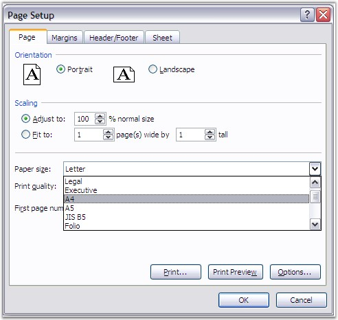

::: {style="DISPLAY: none"}
{#d2h_url_template}{#d2h_package_url style="WIDTH: 0px; DISPLAY: none; HEIGHT: 0px"}
:::

::: {.d2h_secondary_topic style="PADDING-BOTTOM: 10pt; MARGIN: 0pt; PADDING-LEFT: 0pt; PADDING-RIGHT: 0pt; PADDING-TOP: 0pt"}
#### Paper Size {#paper-size style="tab-stops: 0pt"}

**[]{style="FONT-FAMILY: 'Segoe UI','sans-serif'; COLOR: black"}** 

In order to fit information on a page or change the appearance of the page, you may want to customize your page layout. One better option is to change the paper size of the worksheet, as per the need.

[]{style="FONT-FAMILY: 'Trebuchet MS','sans-serif'; COLOR: #15428b; FONT-SIZE: 9pt"} 

The default paper size in Excel is 8 1/2\" x 11\" sheets, but it can be changed through the **Page Setup** dialog box. XlsIO allows to change the paper size through the **PaperSize** property.

[]{style="FONT-FAMILY: 'Trebuchet MS','sans-serif'; COLOR: #15428b; FONT-SIZE: 9pt"} 

{border="0"}

Figure 111: Page Setup - Page \[Paper Size\][]{style="FONT-FAMILY: 'Trebuchet MS','sans-serif'; COLOR: #15428b"}

[]{style="FONT-FAMILY: 'Trebuchet MS','sans-serif'; COLOR: #15428b; FONT-SIZE: 9pt"} 

Following code example illustrates how to set the paper size in XlsIO.

[]{style="FONT-FAMILY: 'Trebuchet MS','sans-serif'; COLOR: #15428b; FONT-SIZE: 9pt"} 

+---------------------------------------------------------------------------------------------------------+
| **[\[C#\]]{style="FONT-FAMILY: 'Courier New'"}**                                                        |
|                                                                                                         |
| []{style="FONT-FAMILY: 'Courier New'"}                                                                  |
|                                                                                                         |
| [// Setting the Paper Type.]{style="FONT-FAMILY: 'Courier New'; COLOR: green"}                          |
|                                                                                                         |
| [sheet.PageSetup.PaperSize = ExcelPaperSize.PaperA3;]{style="FONT-FAMILY: 'Courier New'; COLOR: black"} |
+---------------------------------------------------------------------------------------------------------+

[]{style="FONT-FAMILY: 'Trebuchet MS','sans-serif'; COLOR: #15428b; FONT-SIZE: 9pt"} 

+--------------------------------------------------------------------------------------------------------+
| **[\[VB.NET\]]{style="FONT-FAMILY: 'Courier New'"}**                                                   |
|                                                                                                        |
| []{style="FONT-FAMILY: 'Courier New'"}                                                                 |
|                                                                                                        |
| [\' Setting the Paper Type.]{style="FONT-FAMILY: 'Courier New'; COLOR: green"}                         |
|                                                                                                        |
| [sheet.PageSetup.PaperSize = ExcelPaperSize.PaperA3]{style="FONT-FAMILY: 'Courier New'; COLOR: black"} |
+--------------------------------------------------------------------------------------------------------+

 

[]{#related-topics}
:::
