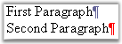

::: {style="DISPLAY: none"}
{#d2h_url_template}{#d2h_package_url style="WIDTH: 0px; DISPLAY: none; HEIGHT: 0px"}
:::

::::: {#nsbanner .d2h_main_nsbanner style="BORDER-BOTTOM: #999999 1px solid; POSITION: relative; PADDING-BOTTOM: 0px; BACKGROUND-COLOR: transparent; PADDING-LEFT: 0px; PADDING-RIGHT: 0px; DISPLAY: none; BORDER-TOP: #999999 1px solid; PADDING-TOP: 0px; LEFT: 0px"}
:::: {#TitleRow .d2h_main_titlerow style="PADDING-BOTTOM: 4px; BACKGROUND-COLOR: transparent; PADDING-LEFT: 22px; WIDTH: 100%; PADDING-RIGHT: 10px; DISPLAY: none; PADDING-TOP: 4px"}
::: {#ienav .d2h_main_ienav style="DISPLAY: none"}
{#D2HPrevious .D2HPreviousEnabled}  {#D2HNext .D2HNextEnabled}
:::
::::
:::::

::::::: {#nstext .d2h_main_nstext style="PADDING-BOTTOM: 10px; BACKGROUND-COLOR: transparent; PADDING-LEFT: 22px; PADDING-RIGHT: 10px; HEIGHT: 100%; OVERFLOW: auto; PADDING-TOP: 5px" hasuserbackground="true" valign="bottom"}
::: {#d2h_breadcrumbs .d2h_breadcrumbs}
[Essential Studio User Guide Documentation](ms-xhelp:///?Id=12457748-09e3-4d74-a240-8e049cedf030){.d2h_breadcrumbsNormal}[ \> ]{.d2h_breadcrumbsLinkSeparator}[Reporting Edition](ms-xhelp:///?Id=027aa5b6-6676-4f93-ad23-c20e8c45792e){.d2h_breadcrumbsNormal}[ \> ]{.d2h_breadcrumbsLinkSeparator}[Essential DocIO](ms-xhelp:///?Id=b88d77b3-4c51-460f-a761-d2ef6d5b0ca6){.d2h_breadcrumbsNormal}[ \> ]{.d2h_breadcrumbsLinkSeparator}[Concepts and Features](ms-xhelp:///?Id=c1881696-52ce-4414-9f3d-97433d8e9775){.d2h_breadcrumbsNormal}
:::

## Paragraph {#paragraph style="tab-stops: 0pt"}

 

**WParagraph** class represents a single paragraph in a document. DocIO paragraph contains paragraph items inside. You can add paragraph items by using the Items property. This property returns the collection of paragraph items (object of ParagraphItemCollection type).

 

Each paragraph has a paragraph format. The format of the paragraph is set by using the **ParagraphFormat** property. This  property is used to define the paragraph border, style of texture, foreground and background color, paragraph spacing, and so on. For more details on Paragraph Formatting, see [[WParagraphFormat.]{style="COLOR: windowtext"}](ms-xhelp:///?Id=044bea7a-9921-4e67-b528-6ded19bff386)

[[[[]{style="COLOR: windowtext"}](ms-xhelp:///?Id=044bea7a-9921-4e67-b528-6ded19bff386)]{style="COLOR: windowtext"}]{.MsoHyperlink} 

**IsInCell**: defines whether current paragraph belongs to the table cell (is in the table cell)

[·      ]{style="FONT-FAMILY: Symbol"}**IsEndOfSection**: defines whether the current paragraph is the last paragraph in the section

[·      ]{style="FONT-FAMILY: Symbol"}**IsEndOfDocument**: defines whether the current paragraph is the last paragraph in the document

 

**Formatting Break Symbol**

 

**BreakCharacterFormat** property is used to set the character formatting for the break symbol.

 

{border="0"}

Figure 42: Formatted Break Symbol

 

**DocIO List**

 

DocIO paragraphs can also be displayed as a list by using the ListFormat property. This property returns the object of the WListFormat type. The WListFormat class defines the formatting for the list (applied list style, list level number and so on). For more details on WListFormat class, see [[WListFormat]{.UGHyperlink}.](ms-xhelp:///?Id=b817a5ed-ca59-40d5-b3e0-a3a354a4fd05)

 

**Adding Paragraph Items**

 

DocIO paragraph enables to add paragraph items to the end of the current paragraph by using the Append function. For example, the AppendText method, AppendBreak method, and so on, are used for this purpose.

 

Class Hierarchy

 

TextBodyItem

                 \|   

            WParagraph

 

**Public Constructor**

 

::: {align="center"}
  --------------------------------------- ------------------------------------------------------
  Name                                    Description
  WParagraph.WParagraph (IWordDocument)   Initializes a new instance of the WParagraph class. 
  --------------------------------------- ------------------------------------------------------
:::

 

**Public Properties**

 

::: {align="center"}
+-----------------------------------+-----------------------------------------------------------------------------+
| **Name**                          | **Description**                                                             |
+-----------------------------------+-----------------------------------------------------------------------------+
| BreakCharacterFormat              | Gets character format for the break symbol.                                 |
+-----------------------------------+-----------------------------------------------------------------------------+
| ChildEntities                     | Gets the child entities.                                                    |
+-----------------------------------+-----------------------------------------------------------------------------+
| EntityType                        | Gets the type of the entity.                                                |
+-----------------------------------+-----------------------------------------------------------------------------+
| IsEndOfDocument                   | Gets a value indicating whether this paragraph is the end of document.      |
+-----------------------------------+-----------------------------------------------------------------------------+
| IsEndOfSection                    | Gets a value indicating whether this paragraph is the end of the section.   |
|                                   |                                                                             |
|                                   |                                                                             |
+-----------------------------------+-----------------------------------------------------------------------------+
| IsInCell                          | Gets a value indicating whether this paragraph is in cell.                  |
+-----------------------------------+-----------------------------------------------------------------------------+
| Items                             | Gets paragraph items.                                                       |
+-----------------------------------+-----------------------------------------------------------------------------+
| ListFormat                        | Gets format of the list for the paragraph.                                  |
+-----------------------------------+-----------------------------------------------------------------------------+
| ParagraphFormat                   | Gets paragraph format.                                                      |
+-----------------------------------+-----------------------------------------------------------------------------+
| StyleName                         | Gets paragraph style name.                                                  |
+-----------------------------------+-----------------------------------------------------------------------------+
| Text                              | Gets or sets paragraph text.                                                |
+-----------------------------------+-----------------------------------------------------------------------------+
:::

 

**Public Methods**

 

::: {align="center"}
  ------------------------- -------------------------------------------------------------------
  **Name**                  **Description**
  AppendBookmarkEnd         Appends end of the bookmark with specified name into paragraph.
  AppendBookmarkStart       Appends start of the bookmark with specified name into paragraph.
  AppendBreak               Appends break to end of the paragraph.  
  AppendCheckBox            Appends checkbox to end of paragraph.
  AppendComment             Appends comment to end of paragraph.
  AppendDropDownFormField   Appends DropDown form field to end of paragraph.
  AppendField               Appends field to end of paragraph.  
  AppendFootnote            Appends footnote to end of paragraph.
  AppendPicture             Appends picture to end of paragraph.
  AppendSymbol              Appends special symbol to end of paragraph.  
  AppendTable               Append Table.  
  AppendText                Appends text to end of document.  
  AppendTextBox             Append Text box to the end of the paragraph.  
  AppendTextFormField       Appends text form field to end of paragraph. 
  AppendTOC                 Appends the TOC.  
  ApplyStyle                Applies style to the paragraph.
  Find                      Finds text inside the paragraph.
  GetStyle                  Gets related style.
  Replace                   Replaced text inside the paragraph.
  InsertSectionBreak        Inserts a section break.
  ------------------------- -------------------------------------------------------------------
:::

 

The following example illustrates how to add various formats to paragraphs.

 

+---------------------------------------------------------------------------------------------------------------------------------------------------+
| **[\[C#\]]{style="FONT-FAMILY: 'Courier New'; COLOR: black"}**                                                                                    |
|                                                                                                                                                   |
|                                                                                                                                                   |
|                                                                                                                                                   |
| [// Add paragraph and apply formatting.]{style="FONT-FAMILY: 'Courier New'; COLOR: green"}                                                        |
|                                                                                                                                                   |
| [paragraph = section.AddParagraph();]{style="FONT-FAMILY: 'Courier New'"}                                                                         |
|                                                                                                                                                   |
| [paragraph.ParagraphFormat.Borders.Bottom.BorderType = [BorderStyle]{style="COLOR: teal"}.ThinThickSmallGap;]{style="FONT-FAMILY: 'Courier New'"} |
|                                                                                                                                                   |
| [paragraph.ParagraphFormat.HorizontalAlignment = [HorizontalAlignment]{style="COLOR: teal"}.Center;]{style="FONT-FAMILY: 'Courier New'"}          |
|                                                                                                                                                   |
| [paragraph.ParagraphFormat.BeforeSpacing = 18;]{style="FONT-FAMILY: 'Courier New'"}                                                               |
|                                                                                                                                                   |
| [textRange = paragraph.AppendText([\"Windows Forms. \"]{style="COLOR: maroon"});]{style="FONT-FAMILY: 'Courier New'"}                             |
|                                                                                                                                                   |
| []{style="FONT-FAMILY: 'Courier New'"}                                                                                                            |
|                                                                                                                                                   |
| [paragraph = section.AddParagraph();]{style="FONT-FAMILY: 'Courier New'"}                                                                         |
|                                                                                                                                                   |
| [paragraph.ParagraphFormat.PageBreakBefore = [true]{style="COLOR: blue"};]{style="FONT-FAMILY: 'Courier New'"}                                    |
|                                                                                                                                                   |
| [paragraph.ParagraphFormat.BackColor = [Color]{style="COLOR: teal"}.FromArgb(102, 102, 153);]{style="FONT-FAMILY: 'Courier New'"}                 |
|                                                                                                                                                   |
| [paragraph.ParagraphFormat.BeforeSpacing = 18;]{style="FONT-FAMILY: 'Courier New'"}                                                               |
|                                                                                                                                                   |
| [paragraph.ParagraphFormat.AfterSpacing = 6;]{style="FONT-FAMILY: 'Courier New'"}                                                                 |
|                                                                                                                                                   |
| [paragraph.ParagraphFormat.FirstLineIndent = 45;]{style="FONT-FAMILY: 'Courier New'"}                                                             |
+---------------------------------------------------------------------------------------------------------------------------------------------------+

 

+--------------------------------------------------------------------------------------------------------------------------------------------------------------------------------------------------------------------------------+
| **[\[VB.NET\]]{style="FONT-FAMILY: 'Courier New'; COLOR: black"}**                                                                                                                                                             |
|                                                                                                                                                                                                                                |
| []{style="COLOR: black"}                                                                                                                                                                                                       |
|                                                                                                                                                                                                                                |
| [\' Add paragraph and apply formatting.]{style="FONT-FAMILY: 'Courier New'; COLOR: green"}                                                                                                                                     |
|                                                                                                                                                                                                                                |
| [paragraph = section.AddParagraph()]{style="FONT-FAMILY: 'Courier New'; COLOR: black"}                                                                                                                                         |
|                                                                                                                                                                                                                                |
| [paragraph.ParagraphFormat.Borders.Bottom.BorderType = BorderStyle.ThinThickSmallGap]{style="FONT-FAMILY: 'Courier New'; COLOR: black"}                                                                                        |
|                                                                                                                                                                                                                                |
| [paragraph.ParagraphFormat.HorizontalAlignment = HorizontalAlignment.Center]{style="FONT-FAMILY: 'Courier New'; COLOR: black"}                                                                                                 |
|                                                                                                                                                                                                                                |
| [paragraph.ParagraphFormat.BeforeSpacing = 18]{style="FONT-FAMILY: 'Courier New'; COLOR: black"}                                                                                                                               |
|                                                                                                                                                                                                                                |
| [textRange = paragraph.AppendText(\"Windows Forms. \")]{style="FONT-FAMILY: 'Courier New'; COLOR: black"}                                                                                                                      |
|                                                                                                                                                                                                                                |
| []{style="FONT-FAMILY: 'Courier New'; COLOR: black"}                                                                                                                                                                           |
|                                                                                                                                                                                                                                |
| [paragraph = section.AddParagraph()]{style="FONT-FAMILY: 'Courier New'; COLOR: black"}                                                                                                                                         |
|                                                                                                                                                                                                                                |
| [paragraph.ParagraphFormat.PageBreakBefore = ]{style="FONT-FAMILY: 'Courier New'; COLOR: black"}[True]{style="FONT-FAMILY: 'Courier New'; COLOR: blue"}                                                                        |
|                                                                                                                                                                                                                                |
| [paragraph.ParagraphFormat.BackColor = ]{style="FONT-FAMILY: 'Courier New'; COLOR: black"}[Color]{style="FONT-FAMILY: 'Courier New'; COLOR: teal"}[.FromArgb(102, 102, 153)]{style="FONT-FAMILY: 'Courier New'; COLOR: black"} |
|                                                                                                                                                                                                                                |
| [paragraph.ParagraphFormat.BeforeSpacing = 18]{style="FONT-FAMILY: 'Courier New'; COLOR: black"}                                                                                                                               |
|                                                                                                                                                                                                                                |
| [paragraph.ParagraphFormat.AfterSpacing = 6]{style="FONT-FAMILY: 'Courier New'; COLOR: black"}                                                                                                                                 |
|                                                                                                                                                                                                                                |
| [paragraph.ParagraphFormat.FirstLineIndent = 45]{style="FONT-FAMILY: 'Courier New'; COLOR: black"}                                                                                                                             |
+--------------------------------------------------------------------------------------------------------------------------------------------------------------------------------------------------------------------------------+

 

**For More Information Refer:**

 

[[Paragraph Items]{.UGHyperlink}](ms-xhelp:///?Id=9202533e-a9c3-47c0-9762-dad7bcfdc47a), [[Styles and Formatting]{.UGHyperlink}](ms-xhelp:///?Id=45ea8b0c-ada0-4971-9ed7-ba19064882cd)

More:

[ ]{#related-topics}

[{border="0" align="absMiddle"}Paragraph Item](ms-xhelp:///?Id=9202533e-a9c3-47c0-9762-dad7bcfdc47a){style="TEXT-DECORATION: none"}

[{border="0" align="absMiddle"}Styles and Formatting](ms-xhelp:///?Id=5bbf911e-d8da-438d-a30b-115f1ac2b02a){style="TEXT-DECORATION: none"}
:::::::
