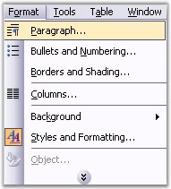
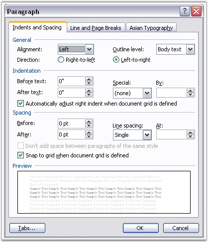

::: {style="DISPLAY: none"}
{#d2h_url_template}{#d2h_package_url style="WIDTH: 0px; DISPLAY: none; HEIGHT: 0px"}
:::

::::: {.d2h_secondary_topic style="PADDING-BOTTOM: 10pt; MARGIN: 0pt; PADDING-LEFT: 0pt; PADDING-RIGHT: 0pt; PADDING-TOP: 0pt"}
#### Paragraph Formats {#paragraph-formats style="tab-stops: 0pt"}

 

**WParagraphFormat** class represents paragraph formatting in the Word document. To apply paragraph formatting in MS Word, open **Format** menu and click **Paragraph**.

 

{border="0"}

Figure 72: Paragraph Option in Format Menu

 

 

 

{border="0"}

Figure 73[: ]{style="FONT-STYLE: normal"}Paragraph[ Dialog Box]{style="FONT-STYLE: normal"}

 

 

**WParagraphFormat** class gets or sets the formatting for the paragraph. **Tabs** property returns the collection of tabs.

 

**Class Hierarchy**

 

FormatBase

           \|

            WParagraphFormat

 

**Public Constructors**

 

::: {align="center"}
  --------------------------------------------------- --------------------------------------------------------
  Name                                                Description
  WParagraphFormat.WParagraphFormat ()                Initializes a new instance of WParagraphFormat class. 
  WParagraphFormat.WParagraphFormat (IWordDocument)   Initializes a new instance of WParagraphFormat class.
  --------------------------------------------------- --------------------------------------------------------
:::

 

Public Properties

 

::: {align="center"}
  --------------------- ---------------------------------------------------------------------------------------------------------------------------------
  Name                  Description
  AfterSpacing          Gets or sets the spacing (in points) after the paragraph.
  BackColor             Gets or sets background color of the paragraph.
  BeforeSpacing         Gets or sets the spacing (in points) before the paragraph.
  Bidi                  Gets or sets right-to-left property of the paragraph.
  Borders               Gets collection of borders in the paragraph.
  ColumnBreakAfter      True if a column break is forced after the paragraph.
  FirstLineIndent       Gets or sets first paragraph line indent.
  HorizontalAlignment   Gets or sets horizontal alignment for the paragraph.  
  Keep                  True if all lines in the paragraph are to remain on the same page.  
  KeepFollow            True if the paragraph is to remains on the same page as the paragraph that follows it.  
  FirstLineIndent       Gets or sets first paragraph line indent (in points).
  HorizontalAlignment   Gets or sets horizontal alignment for the paragraph.  
  Keep                  True if all lines in the paragraph are to remain on the same page.  
  KeepFollow            True if the paragraph is to remains on the same page as the paragraph that follows it.  
  LeftIndent            Gets or sets the value that represents the left indent for paragraph (in points)  
  LineSpacing           Gets or sets the line spacing property of the paragraph   (in points) that specifies the space between two paragraphs.
  LineSpacingRule       Gets or sets the line spacing rule property of the paragraph.  
  PageBreakAfter        True if a page break is forced after the paragraph.  
  PageBreakBefore       True if a page break is forced before the paragraph.
  RightIndent           Gets or sets the right indent for paragraph (in points). 
  MirrorIndents         Gets or sets a value indicating whether the indentation type is mirror indents (Microsoft Word 2007 and 2010 specific property)
  --------------------- ---------------------------------------------------------------------------------------------------------------------------------
:::

 

+------------------------------------------------------------------------------------------------+
| **[\[C#\]]{style="FONT-FAMILY: 'Courier New'; COLOR: black"}**                                 |
|                                                                                                |
| []{style="FONT-FAMILY: 'Courier New'"}                                                         |
|                                                                                                |
| [para.ParagraphFormat.OutlineLevel = OutlineLevel.Level8;]{style="FONT-FAMILY: 'Courier New'"} |
+------------------------------------------------------------------------------------------------+

 

+-----------------------------------------------------------------------------------------------+
| **[\[VB\]]{style="FONT-FAMILY: 'Courier New'; COLOR: black"}**                                |
|                                                                                               |
| []{style="FONT-FAMILY: 'Courier New'; COLOR: blue"}                                           |
|                                                                                               |
| [para.ParagraphFormat.OutlineLevel = OutlineLevel.Level8]{style="FONT-FAMILY: 'Courier New'"} |
+-----------------------------------------------------------------------------------------------+

[]{#p70}**[]{style="COLOR: #4e84c4; FONT-SIZE: 13pt"}** 

More:

[ ]{#related-topics}

[{border="0" align="absMiddle"}Tabs](ms-xhelp:///?Id=81f6d062-14fd-4e22-85e7-ba245e246764){style="TEXT-DECORATION: none"}
:::::
