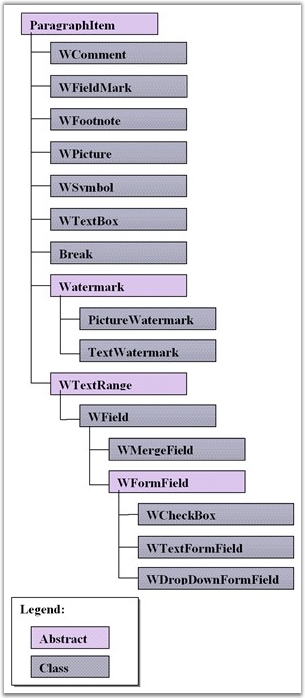

::: {style="DISPLAY: none"}
{#d2h_url_template}{#d2h_package_url style="WIDTH: 0px; DISPLAY: none; HEIGHT: 0px"}
:::

::::: {#nsbanner .d2h_main_nsbanner style="BORDER-BOTTOM: #999999 1px solid; POSITION: relative; PADDING-BOTTOM: 0px; BACKGROUND-COLOR: transparent; PADDING-LEFT: 0px; PADDING-RIGHT: 0px; DISPLAY: none; BORDER-TOP: #999999 1px solid; PADDING-TOP: 0px; LEFT: 0px"}
:::: {#TitleRow .d2h_main_titlerow style="PADDING-BOTTOM: 4px; BACKGROUND-COLOR: transparent; PADDING-LEFT: 22px; WIDTH: 100%; PADDING-RIGHT: 10px; DISPLAY: none; PADDING-TOP: 4px"}
::: {#ienav .d2h_main_ienav style="DISPLAY: none"}
{#D2HPrevious .D2HPreviousEnabled}  {#D2HNext .D2HNextEnabled}
:::
::::
:::::

::::: {#nstext .d2h_main_nstext style="PADDING-BOTTOM: 10px; BACKGROUND-COLOR: transparent; PADDING-LEFT: 22px; PADDING-RIGHT: 10px; HEIGHT: 100%; OVERFLOW: auto; PADDING-TOP: 5px" hasuserbackground="true" valign="bottom"}
::: {#d2h_breadcrumbs .d2h_breadcrumbs}
[Essential Studio User Guide Documentation](ms-xhelp:///?Id=12457748-09e3-4d74-a240-8e049cedf030){.d2h_breadcrumbsNormal}[ \> ]{.d2h_breadcrumbsLinkSeparator}[Reporting Edition](ms-xhelp:///?Id=027aa5b6-6676-4f93-ad23-c20e8c45792e){.d2h_breadcrumbsNormal}[ \> ]{.d2h_breadcrumbsLinkSeparator}[Essential DocIO](ms-xhelp:///?Id=b88d77b3-4c51-460f-a761-d2ef6d5b0ca6){.d2h_breadcrumbsNormal}[ \> ]{.d2h_breadcrumbsLinkSeparator}[Concepts and Features](ms-xhelp:///?Id=c1881696-52ce-4414-9f3d-97433d8e9775){.d2h_breadcrumbsNormal}[ \> ]{.d2h_breadcrumbsLinkSeparator}[Paragraph](ms-xhelp:///?Id=2ca51ad2-2f2e-40ba-9220-4c0bdf3eba1b){.d2h_breadcrumbsNormal}
:::

### Paragraph Item {#paragraph-item style="tab-stops: 0pt"}

 

**ParagraphItem** class is the base class for all paragraph items (pictures, text ranges, comments, watermarks, etc).

 

**Class Hierarchy**

 

{border="0"}

Figure 43: ParagraphItem Class Hierarchy

 

 

Public Property

 

::: {align="center"}
  ---------------- -----------------------
  Name             Description
  OwnerParagraph   Gets owner paragraph.
  ---------------- -----------------------
:::

 

**For More Information Refer:**

 

[[Text Range]{.UGHyperlink}](ms-xhelp:///?Id=4762306d-608b-41d4-a64b-cb86121b60d8), [[Fields]{.UGHyperlink}](ms-xhelp:///?Id=62e29461-d0b2-4ed1-b83e-ddf73f34fbf5), [[Bookmark]{.UGHyperlink}](ms-xhelp:///?Id=04fa0a51-9b81-4f2b-adcc-8d8b3502f038), [[Shapes,]{.UGHyperlink}](ms-xhelp:///?Id=578ae524-f29b-4163-8add-469ab91c04ec) [[Footnote and Endnote]{.UGHyperlink}](ms-xhelp:///?Id=9b6bab69-b305-46ad-b9e3-46315084aec6), [[Symbol]{.UGHyperlink}](ms-xhelp:///?Id=9b6bab69-b305-46ad-b9e3-46315084aec6), [[Break]{.UGHyperlink}](ms-xhelp:///?Id=c38a553c-a780-4c23-8d64-1c1a43c3bf7a), [[Table Of Contents]{.UGHyperlink}](ms-xhelp:///?Id=c38a553c-a780-4c23-8d64-1c1a43c3bf7a), [[[[OLE Object]{style="COLOR: blue"}]{.underline}](ms-xhelp:///?Id=c38a553c-a780-4c23-8d64-1c1a43c3bf7a)]{.UGHyperlink}

[]{#p43} 

 

More:

[ ]{#related-topics}

[{border="0" align="absMiddle"}Text Range](ms-xhelp:///?Id=4762306d-608b-41d4-a64b-cb86121b60d8){style="TEXT-DECORATION: none"}

[{border="0" align="absMiddle"}Fields](ms-xhelp:///?Id=62e29461-d0b2-4ed1-b83e-ddf73f34fbf5){style="TEXT-DECORATION: none"}

[{border="0" align="absMiddle"}Bookmark](ms-xhelp:///?Id=04fa0a51-9b81-4f2b-adcc-8d8b3502f038){style="TEXT-DECORATION: none"}

[{border="0" align="absMiddle"}Shapes](ms-xhelp:///?Id=578ae524-f29b-4163-8add-469ab91c04ec){style="TEXT-DECORATION: none"}

[{border="0" align="absMiddle"}Footnote and Endnote](ms-xhelp:///?Id=9b6bab69-b305-46ad-b9e3-46315084aec6){style="TEXT-DECORATION: none"}

[{border="0" align="absMiddle"}Symbol](ms-xhelp:///?Id=620b193b-c4e7-4dfe-8c2c-00f0aa548c46){style="TEXT-DECORATION: none"}

[{border="0" align="absMiddle"}Break](ms-xhelp:///?Id=c38a553c-a780-4c23-8d64-1c1a43c3bf7a){style="TEXT-DECORATION: none"}

[{border="0" align="absMiddle"}Table Of Contents](ms-xhelp:///?Id=f184d2f1-bdd2-4514-ba58-dd1048022ca0){style="TEXT-DECORATION: none"}

[{border="0" align="absMiddle"}OLE Object](ms-xhelp:///?Id=45ea8b0c-ada0-4971-9ed7-ba19064882cd){style="TEXT-DECORATION: none"}
:::::
