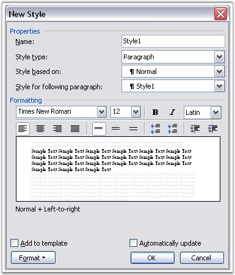

::: {style="DISPLAY: none"}
{#d2h_url_template}{#d2h_package_url style="WIDTH: 0px; DISPLAY: none; HEIGHT: 0px"}
:::

:::::: {.d2h_secondary_topic style="PADDING-BOTTOM: 10pt; MARGIN: 0pt; PADDING-LEFT: 0pt; PADDING-RIGHT: 0pt; PADDING-TOP: 0pt"}
#### Paragraph Styles {#paragraph-styles style="tab-stops: 0pt"}

 

**WParagraphStyle** class represents paragraph style in the Word document. Paragraph style is a pattern of paragraph formatting. You can also apply custom paragraph styles in MS Word.

 

{border="0"}

Figure 71: Paragraph Styles

 

WParagraphStyle class has three properties.

 

[·      ]{style="FONT-FAMILY: Symbol"}**ParagraphFormat**: defines formatting for the paragraph to which the style is applied to

[·      ]{style="FONT-FAMILY: Symbol"}**BaseStyle**: defines base paragraph style

[·      ]{style="FONT-FAMILY: Symbol"}**StyleType**: returns type of style (StyleType.ParagraphStyle)

 

 

You can add your own paragraph styles to the document. Collection of DocIO paragraph styles is accessible through **WordDocument.Styles** property. You can apply one of the built-in Word paragraph styles by using the **WParagraph.ApplyStyle** method.

 

Also, you can use the **ApplyBaseStyle** method to apply the base style for the current paragraph style.

 

**Class Hierarchy**

 

Style

  \|

    WParagraphStyle

 

**Public Constructor**

 

::: {align="center"}
  ------------------------------------------------- ------------------------------------------------------------
  Name                                              Description
  WParagraphStyle.WParagraphStyle (IWordDocument)   Initializes a new instance of the WParagraphStyle class.  
  ------------------------------------------------- ------------------------------------------------------------
:::

 

Public Properties

 

::: {align="center"}
  ----------------- -----------------------------------
  Name              Description
  BaseStyle         Gets a base style of paragraph.  
  ParagraphFormat   Gets formatting of paragraph.  
  StyleType         Gets the type of the style.
  ----------------- -----------------------------------
:::

 

Public Methods

 

::: {align="center"}
  ---------------- ---------------------------------------
  **Name**         **Description**
  ApplyBaseStyle   Applies base style for current style.
  Clone            Clones itself.
  ---------------- ---------------------------------------
:::

 

The following example illustrates how to create user-defined paragraph styles by using DocIO.

 

+------------------------------------------------------------------------------------------------------------------------------------------------------------------------------------------------------------------------+
| **[\[C#\]]{style="FONT-FAMILY: 'Courier New'; COLOR: black"}**                                                                                                                                                         |
|                                                                                                                                                                                                                        |
| []{style="COLOR: black"}                                                                                                                                                                                               |
|                                                                                                                                                                                                                        |
| [IWordDocument]{style="FONT-FAMILY: 'Courier New'; COLOR: teal"}[ doc = [new]{style="COLOR: blue"} [WordDocument]{style="COLOR: teal"}();]{style="FONT-FAMILY: 'Courier New'"}                                         |
|                                                                                                                                                                                                                        |
| []{style="FONT-FAMILY: 'Courier New'"}                                                                                                                                                                                 |
|                                                                                                                                                                                                                        |
| [IWParagraphStyle]{style="FONT-FAMILY: 'Courier New'; COLOR: teal"}[ style = ([IWParagraphStyle]{style="COLOR: teal"})doc.AddParagraphStyle([\"Normal\"]{style="COLOR: maroon"});]{style="FONT-FAMILY: 'Courier New'"} |
|                                                                                                                                                                                                                        |
| []{style="FONT-FAMILY: 'Courier New'"}                                                                                                                                                                                 |
|                                                                                                                                                                                                                        |
| [style = ([IWParagraphStyle]{style="COLOR: teal"})doc.AddParagraphStyle([\"UserStyle_Heading1\"]{style="COLOR: maroon"});]{style="FONT-FAMILY: 'Courier New'"}                                                         |
|                                                                                                                                                                                                                        |
| [style.CharacterFormat.Bold = [true]{style="COLOR: blue"};]{style="FONT-FAMILY: 'Courier New'"}                                                                                                                        |
|                                                                                                                                                                                                                        |
| [style.CharacterFormat.FontName = [\"Verdana\"]{style="COLOR: maroon"};]{style="FONT-FAMILY: 'Courier New'"}                                                                                                           |
|                                                                                                                                                                                                                        |
| [style.CharacterFormat.FontSize = 25;]{style="FONT-FAMILY: 'Courier New'"}                                                                                                                                             |
|                                                                                                                                                                                                                        |
| []{style="FONT-FAMILY: 'Courier New'"}                                                                                                                                                                                 |
|                                                                                                                                                                                                                        |
| [style = ([IWParagraphStyle]{style="COLOR: teal"})doc.AddParagraphStyle([\"UserStyle_Heading2\"]{style="COLOR: maroon"});]{style="FONT-FAMILY: 'Courier New'"}                                                         |
|                                                                                                                                                                                                                        |
| [style.CharacterFormat.Italic = [true]{style="COLOR: blue"};]{style="FONT-FAMILY: 'Courier New'"}                                                                                                                      |
|                                                                                                                                                                                                                        |
| [style.CharacterFormat.FontName = [\"Verdana\"]{style="COLOR: maroon"};]{style="FONT-FAMILY: 'Courier New'"}                                                                                                           |
|                                                                                                                                                                                                                        |
| [style.CharacterFormat.FontSize = 20;]{style="FONT-FAMILY: 'Courier New'"}                                                                                                                                             |
|                                                                                                                                                                                                                        |
| []{style="FONT-FAMILY: 'Courier New'"}                                                                                                                                                                                 |
|                                                                                                                                                                                                                        |
| [style = ([IWParagraphStyle]{style="COLOR: teal"})doc.AddParagraphStyle([\"UserStyle_Heading3\"]{style="COLOR: maroon"});]{style="FONT-FAMILY: 'Courier New'"}                                                         |
|                                                                                                                                                                                                                        |
| [style.CharacterFormat.Bold = [true]{style="COLOR: blue"};]{style="FONT-FAMILY: 'Courier New'"}                                                                                                                        |
|                                                                                                                                                                                                                        |
| [style.CharacterFormat.FontName = [\"Times New Roman\"]{style="COLOR: maroon"};]{style="FONT-FAMILY: 'Courier New'"}                                                                                                   |
|                                                                                                                                                                                                                        |
| [style.CharacterFormat.FontSize = 20;]{style="FONT-FAMILY: 'Courier New'"}                                                                                                                                             |
|                                                                                                                                                                                                                        |
| [style.CharacterFormat.UnderlineStyle = [UnderlineStyle]{style="COLOR: teal"}.Single;]{style="FONT-FAMILY: 'Courier New'"}                                                                                             |
|                                                                                                                                                                                                                        |
| []{style="FONT-FAMILY: 'Courier New'"}                                                                                                                                                                                 |
|                                                                                                                                                                                                                        |
| [IWSection]{style="FONT-FAMILY: 'Courier New'; COLOR: teal"}[ section = doc.AddSection();]{style="FONT-FAMILY: 'Courier New'"}                                                                                         |
|                                                                                                                                                                                                                        |
| []{style="FONT-FAMILY: 'Courier New'"}                                                                                                                                                                                 |
|                                                                                                                                                                                                                        |
| [for]{style="FONT-FAMILY: 'Courier New'; COLOR: blue"}[ ([int]{style="COLOR: blue"} i = 0; i \< doc.Styles.Count; i++)]{style="FONT-FAMILY: 'Courier New'"}                                                            |
|                                                                                                                                                                                                                        |
| [{]{style="FONT-FAMILY: 'Courier New'"}                                                                                                                                                                                |
|                                                                                                                                                                                                                        |
| [    style = ([IWParagraphStyle]{style="COLOR: teal"})doc.Styles\[i\];]{style="FONT-FAMILY: 'Courier New'"}                                                                                                            |
|                                                                                                                                                                                                                        |
| [    [IWParagraph]{style="COLOR: teal"} paragraph = section.AddParagraph();]{style="FONT-FAMILY: 'Courier New'"}                                                                                                       |
|                                                                                                                                                                                                                        |
| [    paragraph.ApplyStyle(style.Name);]{style="FONT-FAMILY: 'Courier New'"}                                                                                                                                            |
|                                                                                                                                                                                                                        |
| [    paragraph.AppendText([\"\[ Style Applied \]: \"]{style="COLOR: maroon"});]{style="FONT-FAMILY: 'Courier New'"}                                                                                                    |
|                                                                                                                                                                                                                        |
| [    paragraph.AppendText(style.Name);]{style="FONT-FAMILY: 'Courier New'"}                                                                                                                                            |
|                                                                                                                                                                                                                        |
| [}]{style="FONT-FAMILY: 'Courier New'"}                                                                                                                                                                                |
|                                                                                                                                                                                                                        |
| [section.AddParagraph();]{style="FONT-FAMILY: 'Courier New'"}                                                                                                                                                          |
|                                                                                                                                                                                                                        |
| [doc.Save([\"UserStyle.doc\"]{style="COLOR: maroon"});]{style="FONT-FAMILY: 'Courier New'"}                                                                                                                            |
+------------------------------------------------------------------------------------------------------------------------------------------------------------------------------------------------------------------------+

 

+------------------------------------------------------------------------------------------------------------------------------------------------------------------------------------------------------------------------------------------------------------+
| **[\[VB.NET\]]{style="FONT-FAMILY: 'Courier New'; COLOR: black"}**                                                                                                                                                                                         |
|                                                                                                                                                                                                                                                            |
| []{style="COLOR: black"}                                                                                                                                                                                                                                   |
|                                                                                                                                                                                                                                                            |
| [Dim]{style="FONT-FAMILY: 'Courier New'; COLOR: blue"}[ doc [As]{style="COLOR: blue"} IWordDocument = [New]{style="COLOR: blue"} WordDocument()]{style="FONT-FAMILY: 'Courier New'"}                                                                       |
|                                                                                                                                                                                                                                                            |
| []{style="FONT-FAMILY: 'Courier New'"}                                                                                                                                                                                                                     |
|                                                                                                                                                                                                                                                            |
| [Dim]{style="FONT-FAMILY: 'Courier New'; COLOR: blue"}[ style [As]{style="COLOR: blue"} IWParagraphStyle = [CType]{style="COLOR: blue"}(doc.AddParagraphStyle([\"Normal\"]{style="COLOR: maroon"}), IWParagraphStyle)]{style="FONT-FAMILY: 'Courier New'"} |
|                                                                                                                                                                                                                                                            |
| [Dim]{style="FONT-FAMILY: 'Courier New'; COLOR: blue"}[ style = [CType]{style="COLOR: blue"}(doc.AddParagraphStyle([\"UserStyle_Heading1\"]{style="COLOR: maroon"}), IWParagraphStyle)]{style="FONT-FAMILY: 'Courier New'"}                                |
|                                                                                                                                                                                                                                                            |
| [style.CharacterFormat.Bold = [True]{style="COLOR: blue"}]{style="FONT-FAMILY: 'Courier New'"}                                                                                                                                                             |
|                                                                                                                                                                                                                                                            |
| [style.CharacterFormat.FontName = [\"Verdana\"]{style="COLOR: maroon"}]{style="FONT-FAMILY: 'Courier New'"}                                                                                                                                                |
|                                                                                                                                                                                                                                                            |
| [style.CharacterFormat.FontSize = 25]{style="FONT-FAMILY: 'Courier New'"}                                                                                                                                                                                  |
|                                                                                                                                                                                                                                                            |
| []{style="FONT-FAMILY: 'Courier New'"}                                                                                                                                                                                                                     |
|                                                                                                                                                                                                                                                            |
| [style = [CType]{style="COLOR: blue"}(doc.AddParagraphStyle([\"UserStyle_Heading2\"]{style="COLOR: maroon"}), IWParagraphStyle)]{style="FONT-FAMILY: 'Courier New'"}                                                                                       |
|                                                                                                                                                                                                                                                            |
| [style.CharacterFormat.Italic = [True]{style="COLOR: blue"}]{style="FONT-FAMILY: 'Courier New'"}                                                                                                                                                           |
|                                                                                                                                                                                                                                                            |
| [style.CharacterFormat.FontName = [\"Verdana\"]{style="COLOR: maroon"}]{style="FONT-FAMILY: 'Courier New'"}                                                                                                                                                |
|                                                                                                                                                                                                                                                            |
| [style.CharacterFormat.FontSize = 20]{style="FONT-FAMILY: 'Courier New'"}                                                                                                                                                                                  |
|                                                                                                                                                                                                                                                            |
| []{style="FONT-FAMILY: 'Courier New'"}                                                                                                                                                                                                                     |
|                                                                                                                                                                                                                                                            |
| [style = [CType]{style="COLOR: blue"}(doc.AddParagraphStyle([\"UserStyle_Heading3\"]{style="COLOR: maroon"}), IWParagraphStyle)]{style="FONT-FAMILY: 'Courier New'"}                                                                                       |
|                                                                                                                                                                                                                                                            |
| [style.CharacterFormat.Bold = [True]{style="COLOR: blue"}]{style="FONT-FAMILY: 'Courier New'"}                                                                                                                                                             |
|                                                                                                                                                                                                                                                            |
| [style.CharacterFormat.FontName = [\"Times New Roman\"]{style="COLOR: maroon"}]{style="FONT-FAMILY: 'Courier New'"}                                                                                                                                        |
|                                                                                                                                                                                                                                                            |
| [style.CharacterFormat.FontSize = 20]{style="FONT-FAMILY: 'Courier New'"}                                                                                                                                                                                  |
|                                                                                                                                                                                                                                                            |
| [style.CharacterFormat.UnderlineStyle = UnderlineStyle.Single]{style="FONT-FAMILY: 'Courier New'"}                                                                                                                                                         |
|                                                                                                                                                                                                                                                            |
| []{style="FONT-FAMILY: 'Courier New'"}                                                                                                                                                                                                                     |
|                                                                                                                                                                                                                                                            |
| [Dim]{style="FONT-FAMILY: 'Courier New'; COLOR: blue"}[ section [As]{style="COLOR: blue"} IWSection = doc.AddSection()]{style="FONT-FAMILY: 'Courier New'"}                                                                                                |
|                                                                                                                                                                                                                                                            |
| []{style="FONT-FAMILY: 'Courier New'"}                                                                                                                                                                                                                     |
|                                                                                                                                                                                                                                                            |
| [Dim]{style="FONT-FAMILY: 'Courier New'; COLOR: blue"}[ i [As]{style="COLOR: blue"} [Integer]{style="COLOR: blue"} = 0]{style="FONT-FAMILY: 'Courier New'"}                                                                                                |
|                                                                                                                                                                                                                                                            |
| []{style="FONT-FAMILY: 'Courier New'"}                                                                                                                                                                                                                     |
|                                                                                                                                                                                                                                                            |
| [Do]{style="FONT-FAMILY: 'Courier New'; COLOR: blue"}[ [While]{style="COLOR: blue"} i \< doc.Styles.Count]{style="FONT-FAMILY: 'Courier New'"}                                                                                                             |
|                                                                                                                                                                                                                                                            |
| [      style = [CType]{style="COLOR: blue"}(doc.Styles(i), IWParagraphStyle)]{style="FONT-FAMILY: 'Courier New'"}                                                                                                                                          |
|                                                                                                                                                                                                                                                            |
| [Dim]{style="FONT-FAMILY: 'Courier New'; COLOR: blue"}[ paragraph [As]{style="COLOR: blue"} IWParagraph = section.AddParagraph()]{style="FONT-FAMILY: 'Courier New'"}                                                                                      |
|                                                                                                                                                                                                                                                            |
| [      paragraph.ApplyStyle(style.Name)]{style="FONT-FAMILY: 'Courier New'"}                                                                                                                                                                               |
|                                                                                                                                                                                                                                                            |
| [      paragraph.AppendText([\"\[ Style Applied \]: \"]{style="COLOR: maroon"})]{style="FONT-FAMILY: 'Courier New'"}                                                                                                                                       |
|                                                                                                                                                                                                                                                            |
| [      paragraph.AppendText(style.Name)]{style="FONT-FAMILY: 'Courier New'"}                                                                                                                                                                               |
|                                                                                                                                                                                                                                                            |
| [      i += 1]{style="FONT-FAMILY: 'Courier New'"}                                                                                                                                                                                                         |
|                                                                                                                                                                                                                                                            |
| [Loop]{style="FONT-FAMILY: 'Courier New'; COLOR: blue"}                                                                                                                                                                                                    |
|                                                                                                                                                                                                                                                            |
| [section.AddParagraph()]{style="FONT-FAMILY: 'Courier New'"}                                                                                                                                                                                               |
|                                                                                                                                                                                                                                                            |
| [doc.Save([\"UserStyle.doc\"]{style="COLOR: maroon"})]{style="FONT-FAMILY: 'Courier New'"}                                                                                                                                                                 |
+------------------------------------------------------------------------------------------------------------------------------------------------------------------------------------------------------------------------------------------------------------+

 

The following code illustrates how to apply built-in paragraph styles to the Word document.

 

+--------------------------------------------------------------------------------------------------------------------------------------------------------------------------------+
| **[\[C#\]]{style="FONT-FAMILY: 'Courier New'; COLOR: black"}**                                                                                                                 |
|                                                                                                                                                                                |
| []{style="COLOR: black"}                                                                                                                                                       |
|                                                                                                                                                                                |
| [IWordDocument]{style="FONT-FAMILY: 'Courier New'; COLOR: teal"}[ doc = [new]{style="COLOR: blue"} [WordDocument]{style="COLOR: teal"}();]{style="FONT-FAMILY: 'Courier New'"} |
|                                                                                                                                                                                |
| [doc.EnsureMinimal();]{style="FONT-FAMILY: 'Courier New'"}                                                                                                                     |
|                                                                                                                                                                                |
| []{style="FONT-FAMILY: 'Courier New'"}                                                                                                                                         |
|                                                                                                                                                                                |
| [doc.LastParagraph.AppendText([\"Heading 1\"]{style="COLOR: #a31515"});]{style="FONT-FAMILY: 'Courier New'"}                                                                   |
|                                                                                                                                                                                |
| [doc.LastParagraph.ApplyStyle([BuiltinStyle]{style="COLOR: #2b91af"}.Heading1);]{style="FONT-FAMILY: 'Courier New'"}                                                           |
|                                                                                                                                                                                |
| []{style="FONT-FAMILY: 'Courier New'"}                                                                                                                                         |
|                                                                                                                                                                                |
| [doc.Save([\"BuiltinStyle.doc\"]{style="COLOR: maroon"});]{style="FONT-FAMILY: 'Courier New'"}                                                                                 |
+--------------------------------------------------------------------------------------------------------------------------------------------------------------------------------+

 

+--------------------------------------------------------------------------------------------------------------------------------------------------------------------------------------+
| **[\[VB.NET\]]{style="FONT-FAMILY: 'Courier New'; COLOR: black"}**                                                                                                                   |
|                                                                                                                                                                                      |
| []{style="COLOR: black"}                                                                                                                                                             |
|                                                                                                                                                                                      |
| [Dim]{style="FONT-FAMILY: 'Courier New'; COLOR: blue"}[ doc [As]{style="COLOR: blue"} IWordDocument = [New]{style="COLOR: blue"} WordDocument()]{style="FONT-FAMILY: 'Courier New'"} |
|                                                                                                                                                                                      |
| []{style="FONT-FAMILY: 'Courier New'"}                                                                                                                                               |
|                                                                                                                                                                                      |
| [doc.EnsureMinimal()]{style="FONT-FAMILY: 'Courier New'"}                                                                                                                            |
|                                                                                                                                                                                      |
| []{style="FONT-FAMILY: 'Courier New'"}                                                                                                                                               |
|                                                                                                                                                                                      |
| [doc.LastParagraph.AppendText([\"Heading 1\"]{style="COLOR: #a31515"})]{style="FONT-FAMILY: 'Courier New'"}                                                                          |
|                                                                                                                                                                                      |
| [doc.LastParagraph.ApplyStyle([BuiltinStyle]{style="COLOR: #2b91af"}.Heading1)]{style="FONT-FAMILY: 'Courier New'"}                                                                  |
|                                                                                                                                                                                      |
| []{style="FONT-FAMILY: 'Courier New'"}                                                                                                                                               |
|                                                                                                                                                                                      |
| [doc.Save([\"BuiltinStyle.doc\"]{style="COLOR: maroon"})]{style="FONT-FAMILY: 'Courier New'"}                                                                                        |
+--------------------------------------------------------------------------------------------------------------------------------------------------------------------------------------+

[]{#related-topics}
::::::
