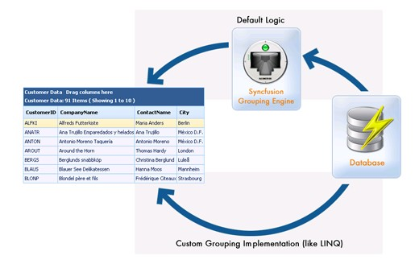

::: {style="DISPLAY: none"}
{#d2h_url_template}{#d2h_package_url style="WIDTH: 0px; DISPLAY: none; HEIGHT: 0px"}
:::

::::: {#nsbanner .d2h_main_nsbanner style="BORDER-BOTTOM: #999999 1px solid; POSITION: relative; PADDING-BOTTOM: 0px; BACKGROUND-COLOR: transparent; PADDING-LEFT: 0px; PADDING-RIGHT: 0px; DISPLAY: none; BORDER-TOP: #999999 1px solid; PADDING-TOP: 0px; LEFT: 0px"}
:::: {#TitleRow .d2h_main_titlerow style="PADDING-BOTTOM: 4px; BACKGROUND-COLOR: transparent; PADDING-LEFT: 22px; WIDTH: 100%; PADDING-RIGHT: 10px; DISPLAY: none; PADDING-TOP: 4px"}
::: {#ienav .d2h_main_ienav style="DISPLAY: none"}
{#D2HPrevious .D2HPreviousEnabled}  {#D2HNext .D2HNextEnabled}
:::
::::
:::::

:::: {#nstext .d2h_main_nstext style="PADDING-BOTTOM: 10px; BACKGROUND-COLOR: transparent; PADDING-LEFT: 22px; PADDING-RIGHT: 10px; HEIGHT: 100%; OVERFLOW: auto; PADDING-TOP: 5px" hasuserbackground="true" valign="bottom"}
::: {#d2h_breadcrumbs .d2h_breadcrumbs}
[Essential Studio User Guide Documentation](ms-xhelp:///?Id=12457748-09e3-4d74-a240-8e049cedf030){.d2h_breadcrumbsNormal}[ \> ]{.d2h_breadcrumbsLinkSeparator}[User Interface Edition](ms-xhelp:///?Id=c29296b7-531c-413b-a0ec-488ca1f7f669){.d2h_breadcrumbsNormal}[ \> ]{.d2h_breadcrumbsLinkSeparator}[Essential ASP.NET](ms-xhelp:///?Id=25c35330-c127-4dad-9a92-ed79dc7261a6){.d2h_breadcrumbsNormal}[ \> ]{.d2h_breadcrumbsLinkSeparator}[Essential Grid]{.d2h_breadcrumbsContentsOnly}[ \> ]{.d2h_breadcrumbsLinkSeparator}[Concepts and Features](ms-xhelp:///?Id=9e489974-524d-457c-9881-e458b1321685){.d2h_breadcrumbsNormal}[ \> ]{.d2h_breadcrumbsLinkSeparator}[Performance Tuning](ms-xhelp:///?Id=b9170524-3d6a-4c3f-86f5-7ad60274dd58){.d2h_breadcrumbsNormal}
:::

### PassThrough Grouping {#passthrough-grouping style="tab-stops: 0pt"}

[]{style="FONT-FAMILY: 'Trebuchet MS','sans-serif'; COLOR: #15428b; FONT-SIZE: 9pt"} 

PassThroughGrouping - Querying the Database

[]{style="FONT-FAMILY: 'Trebuchet MS','sans-serif'; FONT-SIZE: 9pt"} 

PassThrough grouping is a great way to take control of the data being retrieved from the datasource. By default, the grid would pull all the records in the underlying datasource, to be able to effectively perform grouping and calculate summaries. However, you can override this behavior using \"passthrough grouping\" and retrieve only the required records from the datasource, typically only the ones required to display the current page. Using this approach, the grid could be bound to millions of records, but there will only be a few records retrieved from the datasource at a time, based on the grid\'s page size.

 

PassThrough grouping can be implemented against any datasource, using any data retrieval technique. But, this is the most ideal technique while retrieving data through LINQ, as elaborated in the next section.

 

[]{#DDE_LINK}You can create a PassThroughGrouping instance using the code given below.

[]{style="FONT-FAMILY: 'Trebuchet MS','sans-serif'; COLOR: #15428b; FONT-SIZE: 9pt"} 

+---------------------------------------------------------------------------------------------------------------------------------------------------------------------------------------------------------------------------------------------------------------------------------------------------------+
| **[\[C#\]]{style="FONT-FAMILY: 'Courier New'; COLOR: black"}**                                                                                                                                                                                                                                          |
|                                                                                                                                                                                                                                                                                                         |
| []{style="FONT-FAMILY: 'Courier New'; COLOR: black"}                                                                                                                                                                                                                                                    |
|                                                                                                                                                                                                                                                                                                         |
| [private]{style="FONT-FAMILY: 'Courier New'; COLOR: blue"}[ DataClasses1DataContext dContext;]{style="FONT-FAMILY: 'Courier New'"}                                                                                                                                                                      |
|                                                                                                                                                                                                                                                                                                         |
| [///]{style="FONT-FAMILY: 'Courier New'; COLOR: gray"}[ ]{style="FONT-FAMILY: 'Courier New'; COLOR: green"}[\<summary\>]{style="FONT-FAMILY: 'Courier New'; COLOR: gray"}                                                                                                                               |
|                                                                                                                                                                                                                                                                                                         |
| [///]{style="FONT-FAMILY: 'Courier New'; COLOR: gray"}[ Gets the DataContext]{style="FONT-FAMILY: 'Courier New'; COLOR: green"}                                                                                                                                                                         |
|                                                                                                                                                                                                                                                                                                         |
| [///]{style="FONT-FAMILY: 'Courier New'; COLOR: gray"}[ ]{style="FONT-FAMILY: 'Courier New'; COLOR: green"}[\</summary\>]{style="FONT-FAMILY: 'Courier New'; COLOR: gray"}                                                                                                                              |
|                                                                                                                                                                                                                                                                                                         |
| [public]{style="FONT-FAMILY: 'Courier New'; COLOR: blue"}[ DataClasses1DataContext DContext { [get]{style="COLOR: blue"} { [if]{style="COLOR: blue"} ( dContext == [null]{style="COLOR: blue"} ) dContext = [new]{style="COLOR: blue"} DataClasses1DataContext( );]{style="FONT-FAMILY: 'Courier New'"} |
|                                                                                                                                                                                                                                                                                                         |
| [return]{style="FONT-FAMILY: 'Courier New'; COLOR: blue"}[ dContext;]{style="FONT-FAMILY: 'Courier New'"}                                                                                                                                                                                               |
|                                                                                                                                                                                                                                                                                                         |
| [    }]{style="FONT-FAMILY: 'Courier New'"}                                                                                                                                                                                                                                                             |
|                                                                                                                                                                                                                                                                                                         |
| [}]{style="FONT-FAMILY: 'Courier New'"}                                                                                                                                                                                                                                                                 |
|                                                                                                                                                                                                                                                                                                         |
| []{style="FONT-FAMILY: 'Courier New'"}                                                                                                                                                                                                                                                                  |
|                                                                                                                                                                                                                                                                                                         |
| [private]{style="FONT-FAMILY: 'Courier New'; COLOR: blue"}[ [PassThroughGroupingResult]{style="COLOR: teal"} GetOrders( ) {]{style="FONT-FAMILY: 'Courier New'"}                                                                                                                                        |
|                                                                                                                                                                                                                                                                                                         |
| [List]{style="FONT-FAMILY: 'Courier New'; COLOR: teal"}[\<Order\> orders = ( from o [in]{style="COLOR: blue"} DContext.Orders select o ).ToList( );]{style="FONT-FAMILY: 'Courier New'"}                                                                                                                |
|                                                                                                                                                                                                                                                                                                         |
| [return]{style="FONT-FAMILY: 'Courier New'; COLOR: blue"}[ [new]{style="COLOR: blue"} [PassThroughGroupingResult]{style="COLOR: teal"}( [\"Order\"]{style="COLOR: maroon"}, orders, [typeof]{style="COLOR: blue"}( Order ), orders.Count( ) );]{style="FONT-FAMILY: 'Courier New'"}                     |
|                                                                                                                                                                                                                                                                                                         |
| [}]{style="FONT-FAMILY: 'Courier New'"}                                                                                                                                                                                                                                                                 |
+---------------------------------------------------------------------------------------------------------------------------------------------------------------------------------------------------------------------------------------------------------------------------------------------------------+

[]{style="FONT-FAMILY: 'Trebuchet MS','sans-serif'; COLOR: #4a5c8c; FONT-SIZE: 9pt"} 

+---------------------------------------------------------------------------------------------------------------------------------------------------------------------------------------------------------------------------------------------------------------------------------------------------------------------+
| **[\[VB.NET\]]{style="FONT-FAMILY: 'Courier New'; COLOR: black"}**                                                                                                                                                                                                                                                  |
|                                                                                                                                                                                                                                                                                                                     |
| []{style="FONT-FAMILY: 'Courier New'; COLOR: black"}                                                                                                                                                                                                                                                                |
|                                                                                                                                                                                                                                                                                                                     |
| [Private]{style="FONT-FAMILY: 'Courier New'; COLOR: blue"}[ DContext [As]{style="COLOR: blue"} GridModelClassesDataContext]{style="FONT-FAMILY: 'Courier New'"}                                                                                                                                                     |
|                                                                                                                                                                                                                                                                                                                     |
| []{style="FONT-FAMILY: 'Courier New'"}                                                                                                                                                                                                                                                                              |
|                                                                                                                                                                                                                                                                                                                     |
| [Public]{style="FONT-FAMILY: 'Courier New'; COLOR: blue"}[ [ReadOnly]{style="COLOR: blue"} [Property]{style="COLOR: blue"} GridModelClassesDataContext() [As]{style="COLOR: blue"} Content]{style="FONT-FAMILY: 'Courier New'"}                                                                                     |
|                                                                                                                                                                                                                                                                                                                     |
| [\'Public ReadOnly Property DContext() As GridModelClassesDataContext]{style="FONT-FAMILY: 'Courier New'; COLOR: green"}                                                                                                                                                                                            |
|                                                                                                                                                                                                                                                                                                                     |
| [Get]{style="FONT-FAMILY: 'Courier New'; COLOR: blue"}                                                                                                                                                                                                                                                              |
|                                                                                                                                                                                                                                                                                                                     |
| [If]{style="FONT-FAMILY: 'Courier New'; COLOR: blue"}[ DContext [Is]{style="COLOR: blue"} [Nothing]{style="COLOR: blue"} [Then]{style="COLOR: blue"}]{style="FONT-FAMILY: 'Courier New'"}                                                                                                                           |
|                                                                                                                                                                                                                                                                                                                     |
| [DContext = [New]{style="COLOR: blue"} GridModelClassesDataContext()]{style="FONT-FAMILY: 'Courier New'"}                                                                                                                                                                                                           |
|                                                                                                                                                                                                                                                                                                                     |
| [End]{style="FONT-FAMILY: 'Courier New'; COLOR: blue"}[ [If]{style="COLOR: blue"}]{style="FONT-FAMILY: 'Courier New'"}                                                                                                                                                                                              |
|                                                                                                                                                                                                                                                                                                                     |
| [Return]{style="FONT-FAMILY: 'Courier New'; COLOR: blue"}[ DContext]{style="FONT-FAMILY: 'Courier New'"}                                                                                                                                                                                                            |
|                                                                                                                                                                                                                                                                                                                     |
| [End]{style="FONT-FAMILY: 'Courier New'; COLOR: blue"}[ [Get]{style="COLOR: blue"}]{style="FONT-FAMILY: 'Courier New'"}                                                                                                                                                                                             |
|                                                                                                                                                                                                                                                                                                                     |
| [End]{style="FONT-FAMILY: 'Courier New'; COLOR: blue"}[ [Property]{style="COLOR: blue"}]{style="FONT-FAMILY: 'Courier New'"}                                                                                                                                                                                        |
|                                                                                                                                                                                                                                                                                                                     |
| []{style="FONT-FAMILY: 'Courier New'; COLOR: blue"}                                                                                                                                                                                                                                                                 |
|                                                                                                                                                                                                                                                                                                                     |
| [Private]{style="FONT-FAMILY: 'Courier New'; COLOR: blue"}[ [Function]{style="COLOR: blue"} GetOrders() [As]{style="COLOR: blue"} Syncfusion.Grouping.PassThroughGroupingResult]{style="FONT-FAMILY: 'Courier New'"}                                                                                                |
|                                                                                                                                                                                                                                                                                                                     |
| [Dim]{style="FONT-FAMILY: 'Courier New'; COLOR: blue"}[ orders [As]{style="COLOR: blue"} List([Of]{style="COLOR: blue"} Order) = (From o [In]{style="COLOR: blue"} DContext.Orders [Select]{style="COLOR: blue"} o).ToList()]{style="FONT-FAMILY: 'Courier New'"}                                                   |
|                                                                                                                                                                                                                                                                                                                     |
| [Return]{style="FONT-FAMILY: 'Courier New'; COLOR: blue"}[ [New]{style="COLOR: blue"} Syncfusion.Grouping.PassThroughGroupingResult([\"Order\"]{style="COLOR: maroon"}, orders, [GetType]{style="COLOR: blue"}(Syncfusion.Grouping.PassThroughGroupingResult), orders.Count())]{style="FONT-FAMILY: 'Courier New'"} |
|                                                                                                                                                                                                                                                                                                                     |
| [End]{style="FONT-FAMILY: 'Courier New'; COLOR: blue"}[ [Function]{style="COLOR: blue"}]{style="FONT-FAMILY: 'Courier New'"}                                                                                                                                                                                        |
+---------------------------------------------------------------------------------------------------------------------------------------------------------------------------------------------------------------------------------------------------------------------------------------------------------------------+

[]{style="FONT-SIZE: 8pt"} 

{border="0"}

Figure 139

[]{style="FONT-SIZE: 8pt"} 

The PassThroughGrouping class accepts several different types of variables in its constructor, allowing various types of initialization with the IEnumerable list. You can even load the nested tables on demand into the Grid engine. The Grid engine would first generate a shallow copy of the child table with only columns and no data. Then when the record gets expanded, it will raise the delegate provided with the NestedQueryDelegateHandler.

 

Consider the following code for getting the \'OrderDetails\' child table.

[]{style="FONT-SIZE: 8pt"} 

+-------------------------------------------------------------------------------------------------------------------------------------------------------------------------------------------------------------------------------------------------------------------------------------------------------------------------------------------------------------------------------------------------+
| **[\[C#\]]{style="FONT-FAMILY: 'Courier New'; COLOR: black"}**                                                                                                                                                                                                                                                                                                                                  |
|                                                                                                                                                                                                                                                                                                                                                                                                 |
| []{style="FONT-FAMILY: 'Courier New'; COLOR: black"}                                                                                                                                                                                                                                                                                                                                            |
|                                                                                                                                                                                                                                                                                                                                                                                                 |
| [private]{style="FONT-FAMILY: 'Courier New'; COLOR: blue"}[ [PassThroughGroupingResult]{style="COLOR: teal"} GetOrderDetails( ) { [return]{style="COLOR: blue"} [new]{style="COLOR: blue"} [PassThroughGroupingResult]{style="COLOR: teal"}( [\"Order_Details\"]{style="COLOR: maroon"}, GetOrderDetails, [typeof]{style="COLOR: blue"}( Order_Detail ) );]{style="FONT-FAMILY: 'Courier New'"} |
|                                                                                                                                                                                                                                                                                                                                                                                                 |
| [}]{style="FONT-FAMILY: 'Courier New'"}                                                                                                                                                                                                                                                                                                                                                         |
|                                                                                                                                                                                                                                                                                                                                                                                                 |
| []{style="FONT-FAMILY: 'Courier New'"}                                                                                                                                                                                                                                                                                                                                                          |
|                                                                                                                                                                                                                                                                                                                                                                                                 |
| [private]{style="FONT-FAMILY: 'Courier New'; COLOR: blue"}[ IEnumerable GetOrderDetails( [object]{style="COLOR: blue"}\[ \] keys, [out]{style="COLOR: blue"} [object]{style="COLOR: blue"} totals ) {]{style="FONT-FAMILY: 'Courier New'"}                                                                                                                                                      |
|                                                                                                                                                                                                                                                                                                                                                                                                 |
| [List]{style="FONT-FAMILY: 'Courier New'; COLOR: teal"}[\<Order_Detail\> orderDetails = ( from o [in]{style="COLOR: blue"} DContext.Order_Details where o.OrderID == ( [int]{style="COLOR: blue"} ) keys\[ 0 \] select o ).ToList( );]{style="FONT-FAMILY: 'Courier New'"}                                                                                                                      |
|                                                                                                                                                                                                                                                                                                                                                                                                 |
| [totals = orderDetails.Count( );]{style="FONT-FAMILY: 'Courier New'"}                                                                                                                                                                                                                                                                                                                           |
|                                                                                                                                                                                                                                                                                                                                                                                                 |
| [return]{style="FONT-FAMILY: 'Courier New'; COLOR: blue"}[ orderDetails;]{style="FONT-FAMILY: 'Courier New'"}                                                                                                                                                                                                                                                                                   |
|                                                                                                                                                                                                                                                                                                                                                                                                 |
| [}]{style="FONT-FAMILY: 'Courier New'"}                                                                                                                                                                                                                                                                                                                                                         |
+-------------------------------------------------------------------------------------------------------------------------------------------------------------------------------------------------------------------------------------------------------------------------------------------------------------------------------------------------------------------------------------------------+

[]{style="FONT-FAMILY: 'Trebuchet MS','sans-serif'; COLOR: #4a5c8c; FONT-SIZE: 9pt"} 

+---------------------------------------------------------------------------------------------------------------------------------------------------------------------------------------------------------------------------------------------------------------------------------------------------------------------------------------------------------------------------------------------------------------------------+
| **[\[VB.NET\]]{style="FONT-FAMILY: 'Courier New'; COLOR: black"}**                                                                                                                                                                                                                                                                                                                                                        |
|                                                                                                                                                                                                                                                                                                                                                                                                                           |
| []{style="FONT-FAMILY: 'Courier New'; COLOR: black"}                                                                                                                                                                                                                                                                                                                                                                      |
|                                                                                                                                                                                                                                                                                                                                                                                                                           |
| [Private]{style="FONT-FAMILY: 'Courier New'; COLOR: blue"}[ [Function]{style="COLOR: blue"} GetOrders() [As]{style="COLOR: blue"} Syncfusion.Grouping.PassThroughGroupingResult]{style="FONT-FAMILY: 'Courier New'"}                                                                                                                                                                                                      |
|                                                                                                                                                                                                                                                                                                                                                                                                                           |
| [Dim]{style="FONT-FAMILY: 'Courier New'; COLOR: blue"}[ orders [As]{style="COLOR: blue"} List([Of]{style="COLOR: blue"} Order) = (From o [In]{style="COLOR: blue"} DContext.Orders [Select]{style="COLOR: blue"} o).ToList()]{style="FONT-FAMILY: 'Courier New'"}                                                                                                                                                         |
|                                                                                                                                                                                                                                                                                                                                                                                                                           |
| [Return]{style="FONT-FAMILY: 'Courier New'; COLOR: blue"}[ [New]{style="COLOR: blue"} Syncfusion.Grouping.PassThroughGroupingResult([\"Order\"]{style="COLOR: maroon"}, orders, [GetType]{style="COLOR: blue"}(Syncfusion.Grouping.PassThroughGroupingResult), orders.Count())]{style="FONT-FAMILY: 'Courier New'"}                                                                                                       |
|                                                                                                                                                                                                                                                                                                                                                                                                                           |
| [End]{style="FONT-FAMILY: 'Courier New'; COLOR: blue"}[ [Function]{style="COLOR: blue"}]{style="FONT-FAMILY: 'Courier New'"}                                                                                                                                                                                                                                                                                              |
|                                                                                                                                                                                                                                                                                                                                                                                                                           |
| []{style="FONT-FAMILY: 'Courier New'; COLOR: blue"}                                                                                                                                                                                                                                                                                                                                                                       |
|                                                                                                                                                                                                                                                                                                                                                                                                                           |
| [Private]{style="FONT-FAMILY: 'Courier New'; COLOR: blue"}[ [Function]{style="COLOR: blue"} GetOrderDetails() [As]{style="COLOR: blue"} Syncfusion.Grouping.PassThroughGroupingResult]{style="FONT-FAMILY: 'Courier New'"}                                                                                                                                                                                                |
|                                                                                                                                                                                                                                                                                                                                                                                                                           |
| [Return]{style="FONT-FAMILY: 'Courier New'; COLOR: blue"}[ [New]{style="COLOR: blue"} Syncfusion.Grouping.PassThroughGroupingResult([\"Order_Details\"]{style="COLOR: maroon"}, GetOrderDetails, [GetType]{style="COLOR: blue"}(Syncfusion.Grouping.PassThroughGroupingResult))]{style="FONT-FAMILY: 'Courier New'"}                                                                                                      |
|                                                                                                                                                                                                                                                                                                                                                                                                                           |
| [End]{style="FONT-FAMILY: 'Courier New'; COLOR: blue"}[ [Function]{style="COLOR: blue"}]{style="FONT-FAMILY: 'Courier New'"}                                                                                                                                                                                                                                                                                              |
|                                                                                                                                                                                                                                                                                                                                                                                                                           |
| []{style="FONT-FAMILY: 'Courier New'; COLOR: blue"}                                                                                                                                                                                                                                                                                                                                                                       |
|                                                                                                                                                                                                                                                                                                                                                                                                                           |
| [Private]{style="FONT-FAMILY: 'Courier New'; COLOR: blue"}[ [Function]{style="COLOR: blue"} GetOrderDetails([ByVal]{style="COLOR: blue"} keys [As]{style="COLOR: blue"} [Object]{style="COLOR: blue"}(), \<System.Runtime.InteropServices.Out()\> [ByRef]{style="COLOR: blue"} totals [As]{style="COLOR: blue"} [Object]{style="COLOR: blue"}) [As]{style="COLOR: blue"} IEnumerable]{style="FONT-FAMILY: 'Courier New'"} |
|                                                                                                                                                                                                                                                                                                                                                                                                                           |
| [Dim]{style="FONT-FAMILY: 'Courier New'; COLOR: blue"}[ orderDetails [As]{style="COLOR: blue"} List([Of]{style="COLOR: blue"} Order_Detail) = (From o [In]{style="COLOR: blue"} DContext.Order_Details Where o.OrderID = [CInt]{style="COLOR: blue"}(keys(0)) [Select]{style="COLOR: blue"} o).ToList()]{style="FONT-FAMILY: 'Courier New'"}                                                                              |
|                                                                                                                                                                                                                                                                                                                                                                                                                           |
| [totals = orderDetails.Count()]{style="FONT-FAMILY: 'Courier New'"}                                                                                                                                                                                                                                                                                                                                                       |
|                                                                                                                                                                                                                                                                                                                                                                                                                           |
| [Return]{style="FONT-FAMILY: 'Courier New'; COLOR: blue"}[ orderDetails]{style="FONT-FAMILY: 'Courier New'"}                                                                                                                                                                                                                                                                                                              |
|                                                                                                                                                                                                                                                                                                                                                                                                                           |
| [End]{style="FONT-FAMILY: 'Courier New'; COLOR: blue"}[ [Function]{style="COLOR: blue"}]{style="FONT-FAMILY: 'Courier New'"}                                                                                                                                                                                                                                                                                              |
+---------------------------------------------------------------------------------------------------------------------------------------------------------------------------------------------------------------------------------------------------------------------------------------------------------------------------------------------------------------------------------------------------------------------------+

[]{style="FONT-FAMILY: 'Trebuchet MS','sans-serif'; FONT-SIZE: 9pt"} 

\"GetOrderDetails\" is the NestedQueryDelegate that would be called at run time when the parent record is getting expanded, thus enabling real fast updates with the nested tables.

[]{#p109} 

[]{#related-topics}
::::
