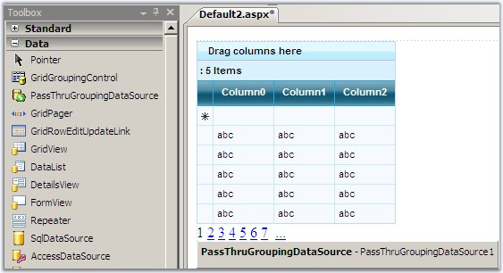
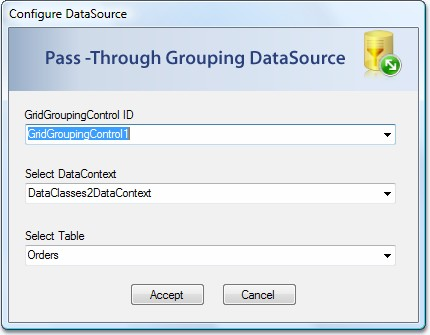

::: {style="DISPLAY: none"}
{#d2h_url_template}{#d2h_package_url style="WIDTH: 0px; DISPLAY: none; HEIGHT: 0px"}
:::

::::: {#nsbanner .d2h_main_nsbanner style="BORDER-BOTTOM: #999999 1px solid; POSITION: relative; PADDING-BOTTOM: 0px; BACKGROUND-COLOR: transparent; PADDING-LEFT: 0px; PADDING-RIGHT: 0px; DISPLAY: none; BORDER-TOP: #999999 1px solid; PADDING-TOP: 0px; LEFT: 0px"}
:::: {#TitleRow .d2h_main_titlerow style="PADDING-BOTTOM: 4px; BACKGROUND-COLOR: transparent; PADDING-LEFT: 22px; WIDTH: 100%; PADDING-RIGHT: 10px; DISPLAY: none; PADDING-TOP: 4px"}
::: {#ienav .d2h_main_ienav style="DISPLAY: none"}
{#D2HPrevious .D2HPreviousEnabled}  {#D2HNext .D2HNextEnabled}
:::
::::
:::::

:::: {#nstext .d2h_main_nstext style="PADDING-BOTTOM: 10px; BACKGROUND-COLOR: transparent; PADDING-LEFT: 22px; PADDING-RIGHT: 10px; HEIGHT: 100%; OVERFLOW: auto; PADDING-TOP: 5px" hasuserbackground="true" valign="bottom"}
::: {#d2h_breadcrumbs .d2h_breadcrumbs}
[Essential Studio User Guide Documentation](ms-xhelp:///?Id=12457748-09e3-4d74-a240-8e049cedf030){.d2h_breadcrumbsNormal}[ \> ]{.d2h_breadcrumbsLinkSeparator}[User Interface Edition](ms-xhelp:///?Id=c29296b7-531c-413b-a0ec-488ca1f7f669){.d2h_breadcrumbsNormal}[ \> ]{.d2h_breadcrumbsLinkSeparator}[Essential ASP.NET](ms-xhelp:///?Id=25c35330-c127-4dad-9a92-ed79dc7261a6){.d2h_breadcrumbsNormal}[ \> ]{.d2h_breadcrumbsLinkSeparator}[Essential Grid]{.d2h_breadcrumbsContentsOnly}[ \> ]{.d2h_breadcrumbsLinkSeparator}[Concepts and Features](ms-xhelp:///?Id=9e489974-524d-457c-9881-e458b1321685){.d2h_breadcrumbsNormal}
:::

## PassThruGroupingDataSource {#passthrugroupingdatasource style="tab-stops: 0pt"}

[]{style="FONT-FAMILY: 'Trebuchet MS','sans-serif'; COLOR: #15428b; FONT-SIZE: 9pt"} 

Introduction

[]{style="FONT-FAMILY: 'Trebuchet MS','sans-serif'; COLOR: #15428b; FONT-SIZE: 9pt"} 

LINQ is a great way to retrieve data from your data source. LINQ lets you build intuitive query expressions in any language of your choice, with optional support for transforming, projecting and shaping data into different forms, before it is displayed in the UI.

 

For more information on LINQ, see [[http://msdn.microsoft.com/en-us/netframework/aa904594.aspx]{style="COLOR: blue"}](http://msdn.microsoft.com/en-us/netframework/aa904594.aspx).

 

Essential Grid now supports binding to LINQ through the PassThruGroupingDataSource. Binding the grid to LINQ results, gives many advantages. Without binding to LINQ, by default, the grid will retrieve all the records in the bound data source to the client, even if only few of them are displayed in the current view. This could become a serious overhead while dealing with large data sources. To overcome this, instead of binding the grid to the data source directly, bind it to the LINQ query results. When you do so, data from your data source is retrieved on demand, when the user requests it (by expanding a collapsed group, for example).

 

The Grid is bound to LINQ results, generated by the Pass-Through Grouping DataSource engine. Thus, data from the datasource will be retrieved on-demand upon user request (ex. By expanding a collapsed group). When the Pass-Through Grouping DataSource is bound to the Grid, the datasource does the Paging, Sorting, Grouping all tasks internally in the engine and emits an IEnumerable datasource. The Engine generates the LINQ queries dynamically on demand. This improves the performance and reduces the overhead of the server. Now it also supports **MultiColumn Grouping** and **Sorting** features.

[]{style="FONT-FAMILY: 'Trebuchet MS','sans-serif'; COLOR: #15428b; FONT-SIZE: 9pt"} 

Usage

[]{style="FONT-FAMILY: 'Trebuchet MS','sans-serif'; COLOR: #15428b; FONT-SIZE: 9pt"} 

1.   Drag the **PassThruGroupingDatasource** component from the Toolbox onto the web page.

[]{style="FONT-FAMILY: 'Trebuchet MS','sans-serif'; COLOR: #15428b; FONT-SIZE: 9pt"} 

{border="0"}

Figure 55

[]{style="FONT-FAMILY: 'Trebuchet MS','sans-serif'; COLOR: #15428b; FONT-SIZE: 9pt"} 

2.   Click on **Configure DataSource**. The following options have to be configured in the Configure DataSource form.

[]{style="FONT-FAMILY: 'Trebuchet MS','sans-serif'; COLOR: #15428b; FONT-SIZE: 9pt"} 

{border="0"}

Figure 56

[]{style="FONT-FAMILY: 'Trebuchet MS','sans-serif'; COLOR: #15428b; FONT-SIZE: 9pt"} 

[·      ]{style="FONT-FAMILY: Symbol"}GridGroupingControl

[]{style="FONT-FAMILY: 'Trebuchet MS','sans-serif'; COLOR: #15428b; FONT-SIZE: 9pt"} 

[]{style="FONT-FAMILY: 'Trebuchet MS','sans-serif'; COLOR: #15428b; FONT-SIZE: 9pt"} 

The GridGroupingControl ID in that page will be populated automatically. You have to select the \"Grid\" that you want to bind with the data source.

[]{style="FONT-FAMILY: 'Trebuchet MS','sans-serif'; COLOR: #15428b; FONT-SIZE: 9pt"} 

[·      ]{style="FONT-FAMILY: Symbol"}DataContext

[]{style="FONT-FAMILY: 'Trebuchet MS','sans-serif'; COLOR: #15428b; FONT-SIZE: 9pt"} 

The DataContext Type will be automatically populated. You have to select the \"DataContext\".

[]{style="FONT-FAMILY: 'Trebuchet MS','sans-serif'; COLOR: #15428b; FONT-SIZE: 9pt"} 

[·      ]{style="FONT-FAMILY: Symbol"}Table

[            ]{style="FONT-FAMILY: 'Trebuchet MS','sans-serif'; COLOR: #15428b; FONT-SIZE: 9pt"}

The Tables in the selected Context will be populated automatically. You have to select the \"Table\" planned as the source.

[]{style="FONT-FAMILY: 'Trebuchet MS','sans-serif'; COLOR: #15428b; FONT-SIZE: 9pt"} 

Requirements

[]{style="FONT-FAMILY: 'Trebuchet MS','sans-serif'; COLOR: #15428b; FONT-SIZE: 9pt"} 

[·      ]{style="FONT-FAMILY: Symbol"}The Datasource should be a LINQ to SQL. The DataContext should have a parameter less constructor.

[·      ]{style="FONT-FAMILY: Symbol"}The DataContext should be placed inside the App_Code folder of the Web Application.

[·      ]{style="FONT-FAMILY: Symbol"}The Web Config file should have the connection String of the Database or else the Parameter Less constructor will be removed automatically.

 

[]{#related-topics}
::::
