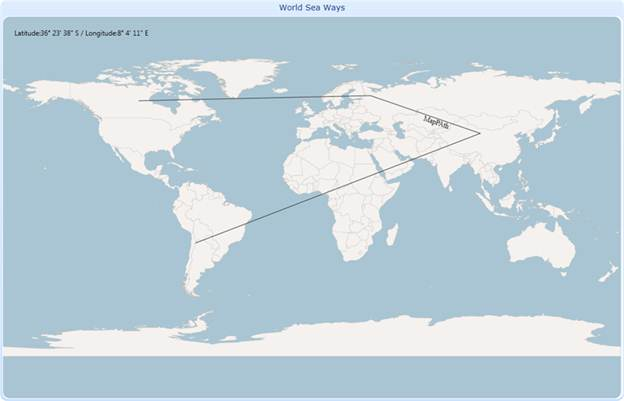

::: {style="DISPLAY: none"}
{#d2h_url_template}{#d2h_package_url style="WIDTH: 0px; DISPLAY: none; HEIGHT: 0px"}
:::

::::: {#nsbanner .d2h_main_nsbanner style="BORDER-BOTTOM: #999999 1px solid; POSITION: relative; PADDING-BOTTOM: 0px; BACKGROUND-COLOR: transparent; PADDING-LEFT: 0px; PADDING-RIGHT: 0px; DISPLAY: none; BORDER-TOP: #999999 1px solid; PADDING-TOP: 0px; LEFT: 0px"}
:::: {#TitleRow .d2h_main_titlerow style="PADDING-BOTTOM: 4px; BACKGROUND-COLOR: transparent; PADDING-LEFT: 22px; WIDTH: 100%; PADDING-RIGHT: 10px; DISPLAY: none; PADDING-TOP: 4px"}
::: {#ienav .d2h_main_ienav style="DISPLAY: none"}
{#D2HPrevious .D2HPreviousEnabled}  {#D2HNext .D2HNextEnabled}
:::
::::
:::::

:::: {#nstext .d2h_main_nstext style="PADDING-BOTTOM: 10px; BACKGROUND-COLOR: transparent; PADDING-LEFT: 22px; PADDING-RIGHT: 10px; HEIGHT: 100%; OVERFLOW: auto; PADDING-TOP: 5px" hasuserbackground="true" valign="bottom"}
::: {#d2h_breadcrumbs .d2h_breadcrumbs}
[Essential Studio User Guide Documentation](ms-xhelp:///?Id=12457748-09e3-4d74-a240-8e049cedf030){.d2h_breadcrumbsNormal}[ \> ]{.d2h_breadcrumbsLinkSeparator}[User Interface Edition](ms-xhelp:///?Id=c29296b7-531c-413b-a0ec-488ca1f7f669){.d2h_breadcrumbsNormal}[ \> ]{.d2h_breadcrumbsLinkSeparator}[Essential WPF](ms-xhelp:///?Id=7f4f82c5-151c-4262-94d0-75c4626c77bc){.d2h_breadcrumbsNormal}[ \> ]{.d2h_breadcrumbsLinkSeparator}[Essential Maps]{.d2h_breadcrumbsContentsOnly}[ \> ]{.d2h_breadcrumbsLinkSeparator}[Concepts and Features](ms-xhelp:///?Id=11705b50-1209-46fb-bfde-18237d32998e){.d2h_breadcrumbsNormal}
:::

## Path Support for Maps {#path-support-for-maps style="tab-stops: 0pt"}

Paths are the lines which are used to depict the way or route between two points. Paths are drawn through given points. By using Paths we can show train, road, air and sea ways in the maps. With path support street view for the particular city can also implemented.

{border="0"}

Figure 17: Map Path

Properties

  --------------------- ------------------------------------------------ ------------ --------------------------------------------------------- ------------------------------
  Property              Description                                      Type         Data Type                                                 Reference links
  PathPoints            The start and end points of a particular path.   Dependency   ObservableCollection\<Point\>[]{style="COLOR: #c00000"}   NA[]{style="COLOR: #c00000"}
  PathLabel             The name of a particular path.                   Dependency   string                                                    NA
  PathLabelFontStyle    The font style for PathLabel.                    Dependency   FontStyle                                                 NA
  PathColor             The color options for the path.                  Dependency   Brush                                                     NA
  PathStroke            Gets or sets stroke color of the MapPath.        Dependency   Brush                                                     NA
  PathStrokeThickness   Gets or sets stroke thickness of the MapPath.    Dependency   double                                                    NA
  PathLabelForeground   The color options of PathLabel.                  Dependency   Brush                                                     NA
  PathLabelFontFamily   Font names can be changed for the PathLabel.     Dependency   FontFamily                                                NA
  PathLabelFontSize     Font size can be changed for the Path Label.     Dependency   Double                                                    NA
  LabelPoint            The location of the LabelPoint.                  Dependency   Point                                                     NA
  PathLabelPosition     OnPoint and OnMiddlePoint.                       Dependency   PathLabelPosition                                         NA
  IsDynamicCreatePath   A dynamic path is created when enabled.          Dependency   bool                                                      NA[]{style="COLOR: #c00000"}
  --------------------- ------------------------------------------------ ------------ --------------------------------------------------------- ------------------------------

 

More:

[ ]{#related-topics}

[{border="0" align="absMiddle"}Features of Path Support for Maps](ms-xhelp:///?Id=8ef9d2c2-2bd6-4ae1-a447-f56108a8fb77){style="TEXT-DECORATION: none"}
::::
