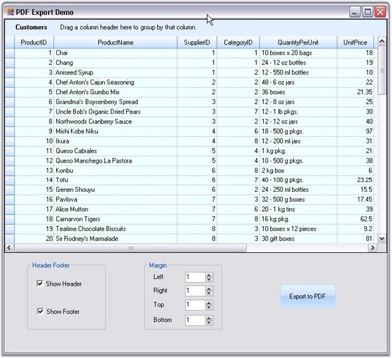
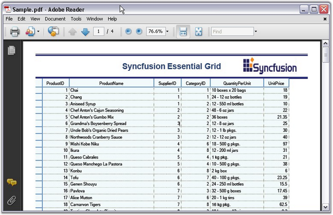

::: {style="DISPLAY: none"}
{#d2h_url_template}{#d2h_package_url style="WIDTH: 0px; DISPLAY: none; HEIGHT: 0px"}
:::

::: {.d2h_secondary_topic style="PADDING-BOTTOM: 10pt; MARGIN: 0pt; PADDING-LEFT: 0pt; PADDING-RIGHT: 0pt; PADDING-TOP: 0pt"}
##### PDF Converter {#pdf-converter style="tab-stops: 0pt"}

[]{style="FONT-FAMILY: 'Trebuchet MS','sans-serif'; COLOR: #15428b; FONT-SIZE: 9pt"} 

PDF Export

 

Essential Grid Grouping control supports conversion of grid contents to a PDF file. Users can convert data from the Grid Grouping control into a PDF document using the GridPDFConverter class. PDF libraries are used to support the conversion of grid content to a PDF page.

 

To ensure the convertion of grid data to PDF document, the following dll files should be added, along with the default dll files in the reference folder:

[]{style="FONT-FAMILY: 'Trebuchet MS','sans-serif'; COLOR: #15428b; FONT-SIZE: 9pt"} 

[·      ]{style="FONT-FAMILY: Symbol"}Syncfusion.Pdf.Base 

[·      ]{style="FONT-FAMILY: Symbol"}Syncfusion.GridHelperClasses.Windows

[]{style="FONT-FAMILY: 'Trebuchet MS','sans-serif'; COLOR: #15428b; FONT-SIZE: 9pt"} 

The **ExportToPdf** method should be used to export the grid to a PDF file.

 

The following code example illustrates the conversion of grid data to PDF document.

[]{style="FONT-FAMILY: 'Trebuchet MS','sans-serif'; COLOR: #15428b; FONT-SIZE: 9pt"} 

+--------------------------------------------------------------------------------------------------------------------------------------------------------------------------------------------------------------------------------------+
| **[\[C#\]]{style="FONT-FAMILY: 'Courier New'; COLOR: black"}**                                                                                                                                                                       |
|                                                                                                                                                                                                                                      |
| **[]{style="FONT-FAMILY: 'Courier New'; COLOR: black"}**                                                                                                                                                                             |
|                                                                                                                                                                                                                                      |
| [GridPDFConverter]{style="FONT-FAMILY: 'Courier New'; COLOR: #2b91af; FONT-SIZE: 9pt"}[ pdfConvertor = [new]{style="COLOR: blue"} [GridPDFConverter]{style="COLOR: #2b91af"}();]{style="FONT-FAMILY: 'Courier New'; FONT-SIZE: 9pt"} |
|                                                                                                                                                                                                                                      |
| [pdfConvertor.ExportToPdf([\"Sample.pdf\"]{style="COLOR: #a31515"}, [this]{style="COLOR: blue"}.gridGroupingControl1.TableControl);]{style="FONT-FAMILY: 'Courier New'; FONT-SIZE: 9pt"}                                             |
|                                                                                                                                                                                                                                      |
| []{style="FONT-FAMILY: 'Courier New'; FONT-SIZE: 9pt"}                                                                                                                                                                               |
|                                                                                                                                                                                                                                      |
| [// Launching the PDF file by using the default Application \[Acrobat Reader\].]{style="FONT-FAMILY: 'Courier New'; COLOR: green; FONT-SIZE: 9pt"}                                                                                   |
|                                                                                                                                                                                                                                      |
| [System.Diagnostics.[Process]{style="COLOR: #2b91af"}.Start([\"Sample.pdf\"]{style="COLOR: #a31515"});]{style="FONT-FAMILY: 'Courier New'; FONT-SIZE: 9pt"}                                                                          |
+--------------------------------------------------------------------------------------------------------------------------------------------------------------------------------------------------------------------------------------+

[]{style="FONT-FAMILY: 'Trebuchet MS','sans-serif'; COLOR: #15428b; FONT-SIZE: 9pt"} 

+------------------------------------------------------------------------------------------------------------------------------------------------------------------------------------------------------------------------------------------------------------------------------------------+
| **[\[VB.NET\]]{style="FONT-FAMILY: 'Courier New'; COLOR: black"}**                                                                                                                                                                                                                       |
|                                                                                                                                                                                                                                                                                          |
| []{style="FONT-FAMILY: 'Courier New'; COLOR: black; FONT-SIZE: 9pt"}                                                                                                                                                                                                                     |
|                                                                                                                                                                                                                                                                                          |
| [Dim]{style="FONT-FAMILY: 'Courier New'; COLOR: blue; FONT-SIZE: 9pt"}[ pdfConvertor [As]{style="COLOR: blue"} [GridPDFConverter]{style="COLOR: #2b91af"} = [New]{style="COLOR: blue"} [GridPDFConverter]{style="COLOR: #2b91af"}()]{style="FONT-FAMILY: 'Courier New'; FONT-SIZE: 9pt"} |
|                                                                                                                                                                                                                                                                                          |
| [pdfConvertor.ExportToPdf(\"Sample.pdf\", [Me]{style="COLOR: blue"}.gridGroupingControl1.TableControl)]{style="FONT-FAMILY: 'Courier New'; FONT-SIZE: 9pt"}                                                                                                                              |
|                                                                                                                                                                                                                                                                                          |
| []{style="FONT-FAMILY: 'Courier New'; COLOR: green; FONT-SIZE: 9pt"}                                                                                                                                                                                                                     |
|                                                                                                                                                                                                                                                                                          |
| [\' Launching the PDF file by using the default Application \[Acrobat Reader\].]{style="FONT-FAMILY: 'Courier New'; COLOR: green; FONT-SIZE: 9pt"}                                                                                                                                       |
|                                                                                                                                                                                                                                                                                          |
| [System.Diagnostics.Process.Start(\"Sample.pdf\")]{style="FONT-FAMILY: 'Courier New'; FONT-SIZE: 9pt"}                                                                                                                                                                                   |
+------------------------------------------------------------------------------------------------------------------------------------------------------------------------------------------------------------------------------------------------------------------------------------------+

[]{style="FONT-FAMILY: 'Trebuchet MS','sans-serif'; COLOR: #15428b; FONT-SIZE: 9pt"} 

{border="0"}

[]{style="FONT-FAMILY: 'Trebuchet MS','sans-serif'; COLOR: #15428b; FONT-SIZE: 9pt"} 

*[Figure ]{style="FONT-SIZE: 9pt"}[379]{style="FONT-SIZE: 9pt"}[:  Grid Grouping Data]{style="FONT-SIZE: 9pt"}*

[]{style="FONT-FAMILY: 'Trebuchet MS','sans-serif'; COLOR: #15428b; FONT-SIZE: 9pt"} 

{border="0"}

[]{style="FONT-FAMILY: 'Trebuchet MS','sans-serif'; COLOR: #15428b; FONT-SIZE: 9pt"} 

*[Figure ]{style="FONT-SIZE: 9pt"}[380]{style="FONT-SIZE: 9pt"}[:  Grid Grouping Data converted to PDF]{style="FONT-SIZE: 9pt"}*

 

[]{#p472} 

 

[]{#related-topics}
:::
