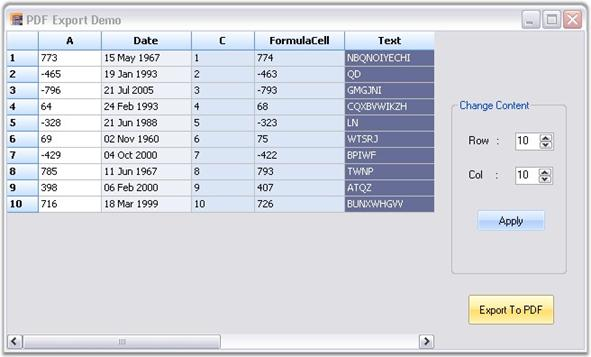

::: {style="DISPLAY: none"}
{#d2h_url_template}{#d2h_package_url style="WIDTH: 0px; DISPLAY: none; HEIGHT: 0px"}
:::

:::: {.d2h_secondary_topic style="PADDING-BOTTOM: 10pt; MARGIN: 0pt; PADDING-LEFT: 0pt; PADDING-RIGHT: 0pt; PADDING-TOP: 0pt"}
##### PDF Export {#pdf-export style="tab-stops: 0pt"}

[]{style="FONT-FAMILY: 'Trebuchet MS','sans-serif'; COLOR: #15428b; FONT-SIZE: 9pt"} 

Our Essential Grid control supports conversion of grid content to a PDF file. Data in Grid control can be converted to a PDF document for offline verification and/or computation. This can be achieved by making use of the **GridPDFConverter** class. The PDF libraries are used to support the conversion of grid content to a PDF page.

[]{style="FONT-FAMILY: 'Trebuchet MS','sans-serif'; COLOR: #15428b; FONT-SIZE: 9pt"} 

For making the control functional, the following dll files should be added along with the default dll files in the reference folder:

[]{style="FONT-FAMILY: 'Trebuchet MS','sans-serif'; COLOR: #15428b; FONT-SIZE: 9pt"} 

[·      ]{style="FONT-FAMILY: Symbol"}Syncfusion.Pdf.Base

[·      ]{style="FONT-FAMILY: Symbol"}Syncfusion.GridHelperClasses.Windows.

[]{style="FONT-FAMILY: 'Trebuchet MS','sans-serif'; COLOR: #15428b; FONT-SIZE: 9pt"} 

The **ExportToPdf** method is used to export the grid content to a PDF file. Following code example illustrates how to convert the content in grid to PDF.

[]{style="FONT-FAMILY: 'Trebuchet MS','sans-serif'; COLOR: #15428b; FONT-SIZE: 9pt"} 

1.   Using C#

[]{style="FONT-FAMILY: 'Trebuchet MS','sans-serif'; COLOR: #15428b; FONT-SIZE: 9pt"} 

+------------------------------------------------------------------------------------------------------------------------------------------------------------------------------------------------------+
| **[\[C#\]]{style="FONT-FAMILY: 'Courier New'; COLOR: black"}**                                                                                                                                       |
|                                                                                                                                                                                                      |
| []{style="FONT-FAMILY: 'Courier New'; COLOR: black"}                                                                                                                                                 |
|                                                                                                                                                                                                      |
| [GridPDFConverter]{style="FONT-FAMILY: 'Courier New'; COLOR: #2b91af"}[ pdfConvertor = [new]{style="COLOR: blue"} [GridPDFConverter]{style="COLOR: #2b91af"}();]{style="FONT-FAMILY: 'Courier New'"} |
|                                                                                                                                                                                                      |
| [pdfConvertor.ExportToPdf([\"Sample1.pdf\"]{style="COLOR: #a31515"}, [this]{style="COLOR: blue"}.gridControl1);]{style="FONT-FAMILY: 'Courier New'"}                                                 |
+------------------------------------------------------------------------------------------------------------------------------------------------------------------------------------------------------+

[]{style="FONT-FAMILY: 'Trebuchet MS','sans-serif'; COLOR: #15428b; FONT-SIZE: 9pt"} 

2.   Using VB.NET

[]{style="FONT-FAMILY: 'Trebuchet MS','sans-serif'; COLOR: #15428b; FONT-SIZE: 9pt"} 

+------------------------------------------------------------------------------------------------------------------------------------------------------------------------------------------------------+
| **[\[VB.NET\]]{style="FONT-FAMILY: 'Courier New'; COLOR: black"}**                                                                                                                                   |
|                                                                                                                                                                                                      |
| []{style="FONT-FAMILY: 'Courier New'; COLOR: black"}                                                                                                                                                 |
|                                                                                                                                                                                                      |
| [Dim]{style="FONT-FAMILY: 'Courier New'; COLOR: blue"}[ pdfConvertor [As]{style="COLOR: blue"} GridPDFConverter = [New]{style="COLOR: blue"} GridPDFConverter()]{style="FONT-FAMILY: 'Courier New'"} |
|                                                                                                                                                                                                      |
| [pdfConvertor.ExportToPdf([\"Sample1.pdf\"]{style="COLOR: #a31515"}, [Me]{style="COLOR: blue"}.gridControl1)]{style="FONT-FAMILY: 'Courier New'"}                                                    |
+------------------------------------------------------------------------------------------------------------------------------------------------------------------------------------------------------+

[]{style="FONT-FAMILY: 'Trebuchet MS','sans-serif'; COLOR: #15428b; FONT-SIZE: 9pt"} 

[]{style="FONT-FAMILY: 'Trebuchet MS','sans-serif'; COLOR: #15428b; FONT-SIZE: 9pt"} 

{border="0"}

 

*[Figure ]{style="FONT-SIZE: 9pt"}[142]{style="FONT-SIZE: 9pt"}[: Grid to be Exported]{style="FONT-SIZE: 9pt"}*

***[]{style="FONT-FAMILY: 'Trebuchet MS','sans-serif'; COLOR: #15428b; FONT-SIZE: 9pt"}*** 

***[]{style="FONT-FAMILY: 'Trebuchet MS','sans-serif'; COLOR: #15428b; FONT-SIZE: 9pt"}*** 

A sample demonstrating this feature is available under the following sample installation path.

[]{style="FONT-FAMILY: 'Trebuchet MS','sans-serif'; COLOR: #15428b; FONT-SIZE: 9pt"} 

***\<Install Location\>\\Syncfusion\\EssentialStudio\\\[Version Number\]\\Windows\\Grid.Windows\\Samples\\2.0\\Export\\PDF Converter Demo***

 

[]{#p302} 

Support to Access or Modify Document Attributes of Exported PDF

 

This feature allows you to access and modify PDF document attributes while exporting, or after exporting, a grid to PDF. When you want to check the page count of the exporting document, you can use this feature.

 

Events

*[]{style="FONT-SIZE: 9pt"}* 

*[Table ]{style="FONT-SIZE: 9pt"}[5]{style="FONT-SIZE: 9pt"}[: Export Event table]{style="FONT-SIZE: 9pt"}*

::: {align="center"}
  **[Event ]{style="LINE-HEIGHT: 115%; FONT-FAMILY: 'Calibri','sans-serif'; COLOR: black; FONT-SIZE: 11pt"}**[]{style="LINE-HEIGHT: 115%; FONT-FAMILY: 'Calibri','sans-serif'; COLOR: black; FONT-SIZE: 11pt"}   **[Description ]{style="LINE-HEIGHT: 115%; FONT-FAMILY: 'Calibri','sans-serif'; COLOR: black; FONT-SIZE: 11pt"}**[]{style="LINE-HEIGHT: 115%; FONT-FAMILY: 'Calibri','sans-serif'; COLOR: black; FONT-SIZE: 11pt"}   **[Arguments ]{style="LINE-HEIGHT: 115%; FONT-FAMILY: 'Calibri','sans-serif'; COLOR: black; FONT-SIZE: 11pt"}**[]{style="LINE-HEIGHT: 115%; FONT-FAMILY: 'Calibri','sans-serif'; COLOR: black; FONT-SIZE: 11pt"}   **[Type ]{style="LINE-HEIGHT: 115%; FONT-FAMILY: 'Calibri','sans-serif'; COLOR: black; FONT-SIZE: 11pt"}**[]{style="LINE-HEIGHT: 115%; FONT-FAMILY: 'Calibri','sans-serif'; COLOR: black; FONT-SIZE: 11pt"}   **[Reference links ]{style="LINE-HEIGHT: 115%; FONT-FAMILY: 'Calibri','sans-serif'; COLOR: black; FONT-SIZE: 11pt"}**[]{style="LINE-HEIGHT: 115%; FONT-FAMILY: 'Calibri','sans-serif'; COLOR: black; FONT-SIZE: 11pt"}
  -------------------------------------------------------------------------------------------------------------------------------------------------------------------------------------------------------------- -------------------------------------------------------------------------------------------------------------------------------------------------------------------------------------------------------------------- ------------------------------------------------------------------------------------------------------------------------------------------------------------------------------------------------------------------ ------------------------------------------------------------------------------------------------------------------------------------------------------------------------------------------------------------- ------------------------------------------------------------------------------------------------------------------------------------------------------------------------------------------------------------------------
  Exporting                                                                                                                                                                                                      This will be triggered before exporting grid to PDF.                                                                                                                                                                 (object sender, Eventargs e)                                                                                                                                                                                       **event**                                                                                                                                                                                                     N/A
  Exported                                                                                                                                                                                                       This will be triggered after exporting grid to PDF.                                                                                                                                                                  (object sender, Eventargs e)                                                                                                                                                                                       event                                                                                                                                                                                                         N/A
:::

[]{style="FONT-FAMILY: 'Calibri','sans-serif'; COLOR: black"} 

[]{style="COLOR: #c00000"} 

Sample Link

A demo of this feature is available in the following location:

***\\..\\..\\AppData\\Local\\Syncfusion\\EssentialStudio\\{Version}\\Windows\\Grid.Windows\\Samples\\2.0\\Export\\PDF Export Demo***

**** 

Hooking the events in an application

You can hook the events using the *ExportToPdf()* method of *PDFconverter*. The following code illustrates this:[]{style="FONT-FAMILY: 'Courier New'"}

+----------------------------------------------------------------------------------------------------------------------------------------+
| **[\[C#\]]{style="FONT-FAMILY: 'Courier New'"}**                                                                                       |
|                                                                                                                                        |
| []{style="FONT-FAMILY: 'Courier New'"}                                                                                                 |
|                                                                                                                                        |
| [GridPDFConverter pdfConvertor = [new]{style="COLOR: blue"} GridPDFConverter();]{style="FONT-FAMILY: 'Courier New'"}                   |
|                                                                                                                                        |
| [pdfConvertor.Exporting += new GridPDFConverter.PDFExportingEventHandler(pdfConvertor_Exporting);]{style="FONT-FAMILY: 'Courier New'"} |
|                                                                                                                                        |
| [pdfConvertor.Exported += new GridPDFConverter.PDFExportedEventHandler(pdfConvertor_Exported);]{style="FONT-FAMILY: 'Courier New'"}    |
|                                                                                                                                        |
| []{style="FONT-FAMILY: 'Courier New'"}                                                                                                 |
+----------------------------------------------------------------------------------------------------------------------------------------+

 

+------------------------------------------------------------------------------------------------------------------------------------------------------------------------------------------------------+
| **[\[VB\]]{style="FONT-FAMILY: 'Courier New'; FONT-SIZE: 9pt"}**                                                                                                                                     |
|                                                                                                                                                                                                      |
| []{style="FONT-FAMILY: 'Courier New'; FONT-SIZE: 9pt"}                                                                                                                                               |
|                                                                                                                                                                                                      |
| [Dim]{style="FONT-FAMILY: 'Courier New'; COLOR: blue"}[ pdfConvertor [As]{style="COLOR: blue"} GridPDFConverter = [New]{style="COLOR: blue"} GridPDFConverter()]{style="FONT-FAMILY: 'Courier New'"} |
|                                                                                                                                                                                                      |
| [AddHandler]{style="FONT-FAMILY: 'Courier New'; COLOR: blue"}[ pdfConvertor.Exporting, [AddressOf]{style="COLOR: blue"} pdfConvertor_Exporting]{style="FONT-FAMILY: 'Courier New'"}                  |
|                                                                                                                                                                                                      |
| [AddHandler]{style="FONT-FAMILY: 'Courier New'; COLOR: blue"}[ pdfConvertor.Exported, [AddressOf]{style="COLOR: blue"} pdfConvertor_Exported]{style="FONT-FAMILY: 'Courier New'"}                    |
|                                                                                                                                                                                                      |
| []{style="FONT-FAMILY: 'Courier New'; FONT-SIZE: 9pt"}                                                                                                                                               |
+------------------------------------------------------------------------------------------------------------------------------------------------------------------------------------------------------+

 

 

 

[]{#related-topics}
::::
