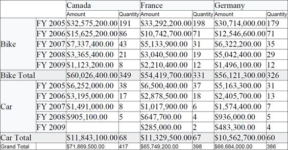

::: {style="DISPLAY: none"}
{#d2h_url_template}{#d2h_package_url style="WIDTH: 0px; DISPLAY: none; HEIGHT: 0px"}
:::

::::: {#nsbanner .d2h_main_nsbanner style="BORDER-BOTTOM: #999999 1px solid; POSITION: relative; PADDING-BOTTOM: 0px; BACKGROUND-COLOR: transparent; PADDING-LEFT: 0px; PADDING-RIGHT: 0px; DISPLAY: none; BORDER-TOP: #999999 1px solid; PADDING-TOP: 0px; LEFT: 0px"}
:::: {#TitleRow .d2h_main_titlerow style="PADDING-BOTTOM: 4px; BACKGROUND-COLOR: transparent; PADDING-LEFT: 22px; WIDTH: 100%; PADDING-RIGHT: 10px; DISPLAY: none; PADDING-TOP: 4px"}
::: {#ienav .d2h_main_ienav style="DISPLAY: none"}
{#D2HPrevious .D2HPreviousEnabled}  {#D2HNext .D2HNextEnabled}
:::
::::
:::::

:::: {#nstext .d2h_main_nstext style="PADDING-BOTTOM: 10px; BACKGROUND-COLOR: transparent; PADDING-LEFT: 22px; PADDING-RIGHT: 10px; HEIGHT: 100%; OVERFLOW: auto; PADDING-TOP: 5px" hasuserbackground="true" valign="bottom"}
::: {#d2h_breadcrumbs .d2h_breadcrumbs}
[Essential Studio User Guide Documentation](ms-xhelp:///?Id=12457748-09e3-4d74-a240-8e049cedf030){.d2h_breadcrumbsNormal}[ \> ]{.d2h_breadcrumbsLinkSeparator}[Business Intelligence Edition](ms-xhelp:///?Id=fdf33dd8-62b2-47b9-ad7b-fc50e590bca5){.d2h_breadcrumbsNormal}[ \> ]{.d2h_breadcrumbsLinkSeparator}[Essential BI Silverlight](ms-xhelp:///?Id=c006b39c-6aa2-4637-b7de-3e7b6cb3f9f9){.d2h_breadcrumbsNormal}[ \> ]{.d2h_breadcrumbsLinkSeparator}[Essential Pivot Grid]{.d2h_breadcrumbsContentsOnly}[ \> ]{.d2h_breadcrumbsLinkSeparator}[Features](ms-xhelp:///?Id=9d7968f1-d52c-4e79-a6ae-fb01305e9f98){.d2h_breadcrumbsNormal}[ \> ]{.d2h_breadcrumbsLinkSeparator}[Exporting](ms-xhelp:///?Id=7670cf74-8a8e-4c2a-99ab-d78f2ef11e9b){.d2h_breadcrumbsNormal}
:::

### PDF Export {#pdf-export style="tab-stops: 0pt"}

BI Pivot Grid for Silverlight can be exported as a PDF file using Essential PDF. The user can export the contents of the **PivotGrid** to the PDF document for further archival, references and analysis purposes.

 

Call Export Method

The [GridPdfExport]{style="FONT-FAMILY: 'Courier New'; COLOR: #2b91af"}[ ]{style="FONT-FAMILY: 'Courier New'"}class provides support for exporting data from a PivotGrid to a PDF document for verification. The following dlls should be added, along with the default dlls in the reference folder:

 

[·      ]{style="FONT-FAMILY: Symbol"}Syncfusion.PivotGridConverter.Silverlight

[]{style="COLOR: #c00000"} 

+---------------------------------------------------------------------------------------------------------------------------------------------------------------------------------------------------------------------------------------------------------------------------------------------------------------+
| **[\[C#\]]{style="FONT-FAMILY: 'Courier New'"}**                                                                                                                                                                                                                                                              |
|                                                                                                                                                                                                                                                                                                               |
| [//// Export to PDF]{style="FONT-FAMILY: 'Courier New'; COLOR: green"}                                                                                                                                                                                                                                        |
|                                                                                                                                                                                                                                                                                                               |
| [SaveFileDialog]{style="FONT-FAMILY: 'Courier New'; COLOR: #2b91af"}[ saveFileDialog = [new]{style="COLOR: blue"} [SaveFileDialog]{style="COLOR: #2b91af"} { DefaultExt = [\".pdf\"]{style="COLOR: #a31515"}, Filter = [\"(\*.pdf)\|\*.pdf\"]{style="COLOR: #a31515"} };]{style="FONT-FAMILY: 'Courier New'"} |
|                                                                                                                                                                                                                                                                                                               |
| [if]{style="FONT-FAMILY: 'Courier New'; COLOR: blue"}[ (saveFileDialog.ShowDialog() == [true]{style="COLOR: blue"})\                                                                                                                                                                                          |
| {\                                                                                                                                                                                                                                                                                                            |
|     [Stream]{style="COLOR: #2b91af"} stream = saveFileDialog.OpenFile();\                                                                                                                                                                                                                                     |
|     [GridPdfExport]{style="COLOR: #2b91af"} exporttopdf = [new]{style="COLOR: blue"} [GridPdfExport]{style="COLOR: #2b91af"}([this]{style="COLOR: blue"}.pivotGrid1);\                                                                                                                                        |
|     exporttopdf.Export(stream);\                                                                                                                                                                                                                                                                              |
|     stream.Close();\                                                                                                                                                                                                                                                                                          |
| }]{style="FONT-FAMILY: 'Courier New'"}                                                                                                                                                                                                                                                                        |
|                                                                                                                                                                                                                                                                                                               |
| []{style="FONT-FAMILY: 'Courier New'"}                                                                                                                                                                                                                                                                        |
+---------------------------------------------------------------------------------------------------------------------------------------------------------------------------------------------------------------------------------------------------------------------------------------------------------------+

[]{style="COLOR: #c00000"} 

+-----------------------------------------------------------------------------------------------------------------------------------------------------------------------------------+
| **[\[VB\]]{style="FONT-FAMILY: 'Courier New'"}**                                                                                                                                  |
|                                                                                                                                                                                   |
| [' Export to PDF]{style="FONT-FAMILY: 'Courier New'; COLOR: green"}                                                                                                               |
|                                                                                                                                                                                   |
| [Dim]{style="FONT-FAMILY: 'Courier New'; COLOR: blue"}[ saveFileDialog [As New]{style="COLOR: blue"} SaveFileDialog() With { \_]{style="FONT-FAMILY: 'Courier New'"}              |
|                                                                                                                                                                                   |
| [        Key .DefaultExt = [\".pdf\"]{style="COLOR: #a31515"}, \_]{style="FONT-FAMILY: 'Courier New'"}                                                                            |
|                                                                                                                                                                                   |
| [        Key .Filter = [\"(\*.pdf)\|\*.pdf\"]{style="COLOR: #a31515"} \_]{style="FONT-FAMILY: 'Courier New'"}                                                                     |
|                                                                                                                                                                                   |
| [}]{style="FONT-FAMILY: 'Courier New'"}                                                                                                                                           |
|                                                                                                                                                                                   |
| [If]{style="FONT-FAMILY: 'Courier New'; COLOR: blue"}[ saveFileDialog.ShowDialog() = [True]{style="COLOR: blue"} [Then]{style="COLOR: blue"}]{style="FONT-FAMILY: 'Courier New'"} |
|                                                                                                                                                                                   |
| [        [Dim]{style="COLOR: blue"} stream [As ]{style="COLOR: blue"}Stream = saveFileDialog.OpenFile()]{style="FONT-FAMILY: 'Courier New'"}                                      |
|                                                                                                                                                                                   |
| [        [Dim]{style="COLOR: blue"} gridPdfExport [As New ]{style="COLOR: blue"}GridPdfExport([Me]{style="COLOR: blue"}.pivotGrid1)]{style="FONT-FAMILY: 'Courier New'"}          |
|                                                                                                                                                                                   |
| [        gridPdfExport.Export(stream)]{style="FONT-FAMILY: 'Courier New'"}                                                                                                        |
|                                                                                                                                                                                   |
| [        stream.Close()]{style="FONT-FAMILY: 'Courier New'"}                                                                                                                      |
|                                                                                                                                                                                   |
| [End]{style="FONT-FAMILY: 'Courier New'; COLOR: blue"}[ [If]{style="COLOR: blue"}]{style="FONT-FAMILY: 'Courier New'"}                                                            |
+-----------------------------------------------------------------------------------------------------------------------------------------------------------------------------------+

[]{style="COLOR: #c00000"} 

[]{style="COLOR: #c00000"} 

{border="0"}

Figure 16: Exported PDF from PivotGrid

[]{style="BACKGROUND: lightgrey"} 

[]{#related-topics}
::::
