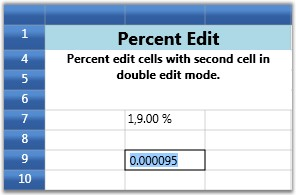

::: {style="DISPLAY: none"}
{#d2h_url_template}{#d2h_package_url style="WIDTH: 0px; DISPLAY: none; HEIGHT: 0px"}
:::

::::: {.d2h_secondary_topic style="PADDING-BOTTOM: 10pt; MARGIN: 0pt; PADDING-LEFT: 0pt; PADDING-RIGHT: 0pt; PADDING-TOP: 0pt"}
##### Percent Edit Cells[]{#p27} {#percent-edit-cells style="tab-stops: 0pt"}

The PercentEdit cell type restricts the data entry to percentage values only. The following are the style properties used with this cell type.

 

[ ]{style="FONT-FAMILY: 'Calibri','sans-serif'"}Table 11: GridStyleInfo Property**[]{style="FONT-FAMILY: 'Calibri','sans-serif'"}**

::: {align="center"}
+-----------------------------------+-------------------------------------------------------------------+
| GridStyleInfo Property            | Description                                                       |
+-----------------------------------+-------------------------------------------------------------------+
| Cell Type                         | Set to "PercentEdit".                                             |
+-----------------------------------+-------------------------------------------------------------------+
| PercentEditMode                   | Indicates the way of editing the text in percent edit cells.      |
|                                   |                                                                   |
|                                   | Possible values -- PercentMode and DoubleMode                     |
+-----------------------------------+-------------------------------------------------------------------+
| PercentSymbol                     | String to use as the percent symbol.                              |
+-----------------------------------+-------------------------------------------------------------------+
| PercentGroupSizes                 | Number of digits in each group to the left of the decimal.        |
+-----------------------------------+-------------------------------------------------------------------+
| PercentGroupSeparator             | String that separates group of digits to the left of the decimal. |
+-----------------------------------+-------------------------------------------------------------------+
| PercentDecimalDigits              | Number of digits that appear after the decimal.                   |
+-----------------------------------+-------------------------------------------------------------------+
:::

**[]{style="FONT-FAMILY: 'Calibri','sans-serif'"}** 

Example

Setting up two Percent Edit cells with different group sizes and decimal digits.

The first cell operates in Percent mode of editing while the second cell follows Double mode.

Double mode displays the values in System.Double format and Percent mode adds a percent sign next to the numbers.

+---------------------------------------------------------------------------------------------------------------------------------------+
| [\[C#\]]{style="FONT-FAMILY: 'Courier New'; COLOR: black"}                                                                            |
|                                                                                                                                       |
| []{style="FONT-FAMILY: 'Courier New'"}                                                                                                |
|                                                                                                                                       |
| [var percentStyleInfo = [this]{style="COLOR: blue"}.grid.Model\[7, 2\];]{style="FONT-FAMILY: 'Courier New'"}                          |
|                                                                                                                                       |
| [percentStyleInfo.CellType = [\"PercentEdit\"]{style="COLOR: #a31515"};]{style="FONT-FAMILY: 'Courier New'"}                          |
|                                                                                                                                       |
| []{style="FONT-FAMILY: 'Courier New'"}                                                                                                |
|                                                                                                                                       |
| [percentStyleInfo.NumberFormat = [new]{style="COLOR: blue"} NumberFormatInfo()]{style="FONT-FAMILY: 'Courier New'"}                   |
|                                                                                                                                       |
| [{]{style="FONT-FAMILY: 'Courier New'"}                                                                                               |
|                                                                                                                                       |
| [    PercentSymbol = [\"%\"]{style="COLOR: #a31515"},]{style="FONT-FAMILY: 'Courier New'"}                                            |
|                                                                                                                                       |
| [    PercentGroupSizes = [new]{style="COLOR: blue"} [int]{style="COLOR: blue"}\[\] { 1, 2,  3 },]{style="FONT-FAMILY: 'Courier New'"} |
|                                                                                                                                       |
| [    PercentDecimalDigits = 2,]{style="FONT-FAMILY: 'Courier New'"}                                                                   |
|                                                                                                                                       |
| [    PercentGroupSeparator = [\",\"]{style="COLOR: #a31515"},]{style="FONT-FAMILY: 'Courier New'"}                                    |
|                                                                                                                                       |
| [    ]{style="FONT-FAMILY: 'Courier New'"}                                                                                            |
|                                                                                                                                       |
| [};]{style="FONT-FAMILY: 'Courier New'"}                                                                                              |
|                                                                                                                                       |
| [percentStyleInfo.PercentEditMode = PercentEditMode.PercentMode;]{style="FONT-FAMILY: 'Courier New'"}                                 |
|                                                                                                                                       |
| [percentStyleInfo.CellValue = 19;]{style="FONT-FAMILY: 'Courier New'"}                                                                |
|                                                                                                                                       |
| []{style="FONT-FAMILY: 'Courier New'"}                                                                                                |
|                                                                                                                                       |
| [var percentStyleInfo2 = [this]{style="COLOR: blue"}.grid.Model\[9, 2\];]{style="FONT-FAMILY: 'Courier New'"}                         |
|                                                                                                                                       |
| [percentStyleInfo2.CellType = [\"PercentEdit\"]{style="COLOR: #a31515"};]{style="FONT-FAMILY: 'Courier New'"}                         |
|                                                                                                                                       |
| [percentStyleInfo2.NumberFormat = [new]{style="COLOR: blue"} NumberFormatInfo()]{style="FONT-FAMILY: 'Courier New'"}                  |
|                                                                                                                                       |
| [{]{style="FONT-FAMILY: 'Courier New'"}                                                                                               |
|                                                                                                                                       |
| [    PercentSymbol = [\"%\"]{style="COLOR: #a31515"},]{style="FONT-FAMILY: 'Courier New'"}                                            |
|                                                                                                                                       |
| [    PercentGroupSizes = [new]{style="COLOR: blue"} [int]{style="COLOR: blue"}\[\] { 3 },]{style="FONT-FAMILY: 'Courier New'"}        |
|                                                                                                                                       |
| [    PercentDecimalDigits = 4,]{style="FONT-FAMILY: 'Courier New'"}                                                                   |
|                                                                                                                                       |
| [    PercentGroupSeparator = [\",\"]{style="COLOR: #a31515"},]{style="FONT-FAMILY: 'Courier New'"}                                    |
|                                                                                                                                       |
| []{style="FONT-FAMILY: 'Courier New'"}                                                                                                |
|                                                                                                                                       |
| [};]{style="FONT-FAMILY: 'Courier New'"}                                                                                              |
|                                                                                                                                       |
| [percentStyleInfo2.PercentEditMode = PercentEditMode.DoubleMode;]{style="FONT-FAMILY: 'Courier New'"}                                 |
|                                                                                                                                       |
| [percentStyleInfo2.CellValue = 91;]{style="FONT-FAMILY: 'Courier New'"}                                                               |
+---------------------------------------------------------------------------------------------------------------------------------------+

 

Output

The following output is generated using the code above.

[]{style="COLOR: #15428b"} 

{border="0"}

Figure 32: Percent Edit Cell

::: {style="BORDER-BOTTOM: windowtext 1pt solid; BORDER-LEFT: medium none; PADDING-BOTTOM: 1pt; MARGIN-TOP: 9pt; PADDING-LEFT: 0pt; PADDING-RIGHT: 0pt; MARGIN-BOTTOM: 9pt; BORDER-TOP: windowtext 1pt solid; BORDER-RIGHT: medium none; PADDING-TOP: 1pt"}
{border="0"}Note: For complete code, please refer to the following browser sample.
:::

 

***\...\\My Documents\\Syncfusion\\EssentialStudio\\\<Version Number\>\\WPF\\Grid.WPF\\Samples\\3.5\\WindowsSamples\\Cell Types\\Percent Edit Cell Demo***

 

[]{#related-topics}
:::::
