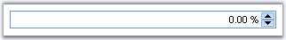

::: {style="DISPLAY: none"}
{#d2h_url_template}{#d2h_package_url style="WIDTH: 0px; DISPLAY: none; HEIGHT: 0px"}
:::

::: {.d2h_secondary_topic style="PADDING-BOTTOM: 10pt; MARGIN: 0pt; PADDING-LEFT: 0pt; PADDING-RIGHT: 0pt; PADDING-TOP: 0pt"}
#### PercentTextBox {#percenttextbox style="tab-stops: 0pt"}

 

 The PercentTextBox is a control that allows you to display only percentage values within the textbox.

 

{border="0"}

Figure 68

 

Features

[·      ]{style="FONT-FAMILY: Symbol"}Supports client side validation of key strokes.

[·      ]{style="FONT-FAMILY: Symbol"}Supports setting minimum and maximum values.

[·      ]{style="FONT-FAMILY: Symbol"}Uses globalization features of .NET platform to provide locale-specific formatting.

 

More:

[ ]{#related-topics}

[{border="0" align="absMiddle"}Creating PercentTextBox](ms-xhelp:///?Id=dc431c0b-46b4-447a-9f09-788472cd9dbd){style="TEXT-DECORATION: none"}

[{border="0" align="absMiddle"}Concepts and Features](ms-xhelp:///?Id=0a66c59b-a8a2-442b-ab37-8eebe9724f17){style="TEXT-DECORATION: none"}

[{border="0" align="absMiddle"}Events](ms-xhelp:///?Id=b9bfee53-4da0-4f3a-8027-7c7a14ab43db){style="TEXT-DECORATION: none"}
:::
