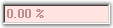

::: {style="DISPLAY: none"}
{#d2h_url_template}{#d2h_package_url style="WIDTH: 0px; DISPLAY: none; HEIGHT: 0px"}
:::

::: {.d2h_secondary_topic style="PADDING-BOTTOM: 10pt; MARGIN: 0pt; PADDING-LEFT: 0pt; PADDING-RIGHT: 0pt; PADDING-TOP: 0pt"}
#### PercentTextBox {#percenttextbox style="tab-stops: 0pt"}

The **PercentTextBox** is a textbox-derived control that can display double data type values in percentage form.[]{style="COLOR: black"}

[]{style="COLOR: black"} 

{border="0"}

[]{style="COLOR: black"} 

Figure 477: PercentTextBox Control

[]{style="COLOR: black"} 

The PercentTextBox is derived from Windows Forms framework textbox control. The PercentTextBox supports display and collection of percentage values. It handles user keyboard input and percent formatting and uses the globalization features of the .NET platform to provide locale-specific formatting.[]{style="COLOR: black"}

 

More:

[ ]{#related-topics}

[{border="0" align="absMiddle"}Features](ms-xhelp:///?Id=797ac96c-d64d-4303-9252-1b16f9f11186){style="TEXT-DECORATION: none"}

[{border="0" align="absMiddle"}Creating PercentTextBox](ms-xhelp:///?Id=bc10a887-5b56-4655-9f85-6e6bb04cee04){style="TEXT-DECORATION: none"}

[{border="0" align="absMiddle"}Concepts and Features](ms-xhelp:///?Id=23fcb3f1-689e-4722-9891-5d417e6cfffa){style="TEXT-DECORATION: none"}

[{border="0" align="absMiddle"}PercentTextBox Events](ms-xhelp:///?Id=302bf8d9-d1d8-47ae-9efd-24ca987fdc0f){style="TEXT-DECORATION: none"}
:::
