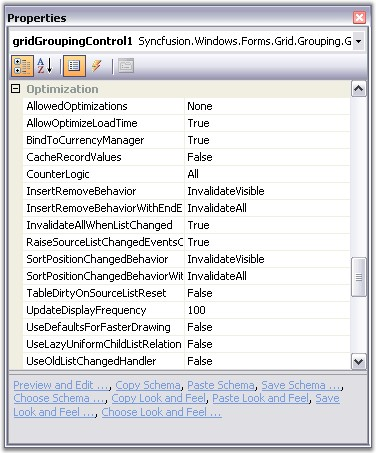

::: {style="DISPLAY: none"}
{#d2h_url_template}{#d2h_package_url style="WIDTH: 0px; DISPLAY: none; HEIGHT: 0px"}
:::

::: {.d2h_secondary_topic style="PADDING-BOTTOM: 10pt; MARGIN: 0pt; PADDING-LEFT: 0pt; PADDING-RIGHT: 0pt; PADDING-TOP: 0pt"}
#### Performance {#performance style="tab-stops: 0pt"}

[]{style="FONT-FAMILY: 'Trebuchet MS','sans-serif'; COLOR: #15428b; FONT-SIZE: 9pt"} 

Grid Grouping control has an **extremely** **high performance standard**. It can handle very high frequency updates and refresh scenarios. It also offers complete support for Virtual Mode wherein the data will be loaded only on demand. By simply setting few properties, you can have the grid, work with large amounts of data without a performance hit.

 

All the properties that affects grid performance are wrapped into a category named **Optimization**. Here is an image of the property grid listing various optimization properties.

[]{style="FONT-FAMILY: 'Trebuchet MS','sans-serif'; COLOR: #15428b; FONT-SIZE: 9pt"} 

{border="0"}

[]{style="FONT-FAMILY: 'Trebuchet MS','sans-serif'; COLOR: #15428b; FONT-SIZE: 9pt"} 

*[Figure ]{style="FONT-SIZE: 9pt"}[252]{style="FONT-SIZE: 9pt"}[: Optimization options in the Grid Grouping Control]{style="FONT-SIZE: 9pt"}*

[]{style="FONT-FAMILY: 'Trebuchet MS','sans-serif'; COLOR: #15428b; FONT-SIZE: 9pt"} 

Optimization Properties - A Glance

 

Below is a brief overview on the above properties. We will discuss these properties further in detail with suitable examples in the forth coming chapters.

[]{style="FONT-FAMILY: 'Verdana','sans-serif'; FONT-SIZE: 8pt"} 

[·      ]{style="FONT-FAMILY: Symbol"}**AllowedOptimizations**

[]{style="FONT-FAMILY: 'Verdana','sans-serif'; COLOR: #4a5c8c; FONT-SIZE: 8pt"} 

Specifies the optimizations, the engine is allowed to use, when applicable. These optimizations can be used in combination with EngineCounter setting. EngineOptimizations enum defines the values for this property which will be discussed in the next chapter.

[]{style="FONT-FAMILY: 'Verdana','sans-serif'; FONT-SIZE: 8pt"} 

[·      ]{style="FONT-FAMILY: Symbol"}**AllowOptimizeLoadTime**

[]{style="FONT-FAMILY: 'Verdana','sans-serif'; COLOR: #4a5c8c; FONT-SIZE: 8pt"} 

This property might help in reducing the flickering issue at startup. When enabled, the grid will be rendered once into an offline bitmap before the form is shown for the first time. This offline rendering of the grid ensures that all the required data is loaded into the memory and all grid data are initialized. Default value is true.

[]{style="FONT-FAMILY: 'Segoe UI','sans-serif'"} 

[·      ]{style="FONT-FAMILY: Symbol"}**BindToCurrencyManager**

[]{style="FONT-FAMILY: 'Verdana','sans-serif'; COLOR: #4a5c8c; FONT-SIZE: 8pt"} 

When you assign a DataTable to the grid grouping control, it will get access to the Default View of that Data Table through the Currency Manager that would listen to the updates to the underlying data table. The benefit of using CurrencyManager is that all the form elements would be kept in synchronization.

 

Using Currency Manager may cause performance issues in certain scenarios. In such cases you can bypass this Currency Manager and access the list directly without ever involving the CurrencyManager by setting this property to false (which is true by default). This will in turn detach the grid from the Currency Manager and hence the Grid Engine does not register the list with Windows Forms Currency Manager and it will solely relies on listening to ListChanged events.

[]{style="FONT-FAMILY: 'Verdana','sans-serif'; FONT-SIZE: 8pt"} 

[·      ]{style="FONT-FAMILY: Symbol"}**CacheRecordValues**

[]{style="FONT-FAMILY: 'Verdana','sans-serif'; COLOR: #4a5c8c; FONT-SIZE: 8pt"} 

If you have custom collections, you can choose to have the engine to cache record values with this property. When set to true, the engine will cache copies of the old values from a record in the record object. You can get these values with the Record.GetOldValue method. With custom collections, the engine can also determine exactly which values in a record were changed when the engine receives the ListChanged event and previous values were cached.

[]{style="FONT-FAMILY: 'Verdana','sans-serif'; COLOR: #4a5c8c; FONT-SIZE: 8pt"} 

[·      ]{style="FONT-FAMILY: Symbol"}**CounterLogic**

[]{style="FONT-FAMILY: 'Segoe UI','sans-serif'"} 

It specifies the CounterLogic to be used within the engine. GroupingEngine maintains the counters for the VisibleColumns, FilteredRecords, YAmount, HiddenRecords, and the like. These counters occupies a countable portion of the grid tree in memory. On every list change, all these counters need to be refreshed too along with the data records.

 

Invalidating all the counters is not required at all times. For instance, if you have a larger data source and you don\'t want support for groups and filtered records, then there is no need to maintain the counters such as FilteredRecords and the like. Keeping all the counters in memory will greatly increase the memory consumption which is not necessary in this case and this will give a big degradation on grid performance.

 

To handle such scenarios, Grid Grouping control provides options to skip allocating these counters. By setting this property, you can reduce the memory footprint by selectively disabling the counters which are not required in your application. EngineCounters enum defines the values for this property which will be discussed in the next chapter.

[]{style="COLOR: #4a5c8c; FONT-SIZE: 8pt"} 

[·      ]{style="FONT-FAMILY: Symbol"}**InsertRemoveBehavior / InsertRemoveBehaviorWithEndEdit**

[]{style="FONT-FAMILY: 'Verdana','sans-serif'; COLOR: #4a5c8c; FONT-SIZE: 8pt"} 

These properties determine how the grid should react when a record is inserted or deleted. One or multiple records need to be shifted up and down. By default, the whole display is invalidated and all the rows are repainted though only one record needs to be redrawn.

 

By setting these properties to **ListChangedInsertRemoveBehavior.ScrollWithImmediateUpdate**, you can instruct the engine not to repaint the whole screen. The engine will now determine the area affected by this change and use the ScrollWindow API to shift records up and down and only repaint the one record that was really changed. This will have a big impact if you have a larger grid and repainting the whole display is expensive.

**[]{style="FONT-FAMILY: 'Verdana','sans-serif'; COLOR: #4a5c8c; FONT-SIZE: 8pt"}** 

[·      ]{style="FONT-FAMILY: Symbol"}**InvalidateAllWhenListChanged**

**[]{style="FONT-FAMILY: 'Verdana','sans-serif'; COLOR: #4a5c8c; FONT-SIZE: 8pt"}** 

It lets you specify whether the grid should simply call **Invalidate** when a ListChanged event is handled or if it should determine the area that is affected by the change and call **InvalidateRange**.

 

On first sight, you might think its better to determine the area that is affected by a change and call InvalidateRange. But when calling InvalidateRange, the grid needs to know the exact position of the record in the table before it can mark that area dirty. In order to determine the record position (and y-position of the row in the display), counters need to be evaluated. This operation can cost more time than simply calling Invalidate in high-frequency update scenarios. The group caption bar also needs to be updated when a record changes.

 

InsertRemoveBehavior, SortPositionChangedBehavior properties and UpdateDisplayFrequency can speed up the things a lot when InvalidateAllWhenListChanged is set to false.

[]{style="COLOR: green; FONT-SIZE: 8pt"} 

[·      ]{style="FONT-FAMILY: Symbol"}**RaiseSourceListChangedEventsOnEngineOnly**

[]{style="FONT-FAMILY: 'Verdana','sans-serif'; COLOR: #4a5c8c; FONT-SIZE: 8pt"} 

When the engine handles the ListChanged event it will itself raise numerous events. When this property is set to true, the events will only be raised on the Engine object. If set to false then events will also be raised on inner objects (will bubble up on nested tables which causes some performance overhead). It will only have effect if UseOldListChangedHandler is set to false.

 

[·      ]{style="FONT-FAMILY: Symbol"}**SortPositionChangedBehavior / SortPositionChangedBehaviorWithEndEdit**

[]{style="FONT-FAMILY: 'Verdana','sans-serif'; COLOR: #4a5c8c; FONT-SIZE: 8pt"} 

These properties determine how to update the display with a change in the sort position of a record. By default, the whole display is invalidated and all the rows are repainted though only one record needs to be redrawn. This will degrade the performance and will not be efficient if you have a larger grid and repainting the whole display is expensive.

 

By setting these properties to ListChangedInsertRemoveBehavior.ScrollWithImmediateUpdate, you can instruct the engine not to repaint the whole screen. This will only repaint the one record that was really changed.

[]{style="FONT-FAMILY: 'Verdana','sans-serif'; COLOR: #4a5c8c; FONT-SIZE: 8pt"} 

[·      ]{style="FONT-FAMILY: Symbol"}**UpdateDisplayFrequency**

[]{style="FONT-FAMILY: 'Verdana','sans-serif'; COLOR: #4a5c8c; FONT-SIZE: 8pt"} 

This property lets you specify the number of milliseconds to wait between display updates when new ListChanged event handler logic is used. This property doesn\'t have any effect if UseOldListChangedHandler = true. Special values are 0 - only manually update display by calling grid.Update() and 1 - update display immediately after each change.

[]{style="FONT-FAMILY: 'Verdana','sans-serif'; FONT-SIZE: 8pt"} 

[·      ]{style="FONT-FAMILY: Symbol"}**UseDefaultsForFasterDrawing**

[]{style="FONT-FAMILY: 'Verdana','sans-serif'; COLOR: #4a5c8c; FONT-SIZE: 8pt"} 

By setting this to true, you can quickly switch to faster GDI Draw Text, Solid Borders and more efficient calculation of the optimal width of a column. Initializes recommended settings to improve handling of ListChanged events and scrolling through grid. Affected settings are: TableOptions.ColumnsMaxLengthStrategy, TableOptions.GridLineBorder, TableOptions.DrawTextWithGdiInterop, TableOptions.VerticalPixelScroll, Appearance.AnyRecordFieldCell.WrapText and Appearance.AnyRecordFieldCell.Trimming.

[]{style="FONT-FAMILY: 'Verdana','sans-serif'; FONT-SIZE: 8pt"} 

[·      ]{style="FONT-FAMILY: Symbol"}**UseOldListChangedHandler**

[]{style="FONT-FAMILY: 'Verdana','sans-serif'; COLOR: #4a5c8c; FONT-SIZE: 8pt"} 

With version 4.4 the engine changed the way how the ListChanged event is handled internally to fix short-comings with performance of the code that was in place earlier. This property lets you switch back the behavior of the engine to the old mechanism if you notice compatibility issues. The default value is false.

[]{style="FONT-FAMILY: 'Verdana','sans-serif'; FONT-SIZE: 8pt"} 

[·      ]{style="FONT-FAMILY: Symbol"}**BlinkTime**

[]{style="FONT-FAMILY: 'Verdana','sans-serif'; COLOR: #4a5c8c; FONT-SIZE: 8pt"} 

Grid Grouping control has in-built support for highlighting cells for a short period of time after a change was detected to a cell. The BlinkTime property lets you specify the amount of time in milliseconds how long the values should be highlighted. You could also enable or disable this feature for individual columns by toggling GridColumnDescriptor.AllowBlink property.

[]{style="FONT-FAMILY: 'Trebuchet MS','sans-serif'; COLOR: #15428b; FONT-SIZE: 9pt"} 

See Also

[]{style="FONT-FAMILY: 'Trebuchet MS','sans-serif'; COLOR: #15428b; FONT-SIZE: 9pt"} 

More:

[ ]{#related-topics}

[{border="0" align="absMiddle"}Memory Performance - Engine Optimizations](ms-xhelp:///?Id=aef9d3e3-9e36-4039-9c98-31905eae7f6d){style="TEXT-DECORATION: none"}

[{border="0" align="absMiddle"}ListChanged Performance](ms-xhelp:///?Id=53cefedf-fdb4-4df8-a016-97c63fd7fd4c){style="TEXT-DECORATION: none"}

[{border="0" align="absMiddle"}High Frequency Updates](ms-xhelp:///?Id=bfc114ce-203a-43c7-96fb-31eafd794247){style="TEXT-DECORATION: none"}

[{border="0" align="absMiddle"}Grouping Performance](ms-xhelp:///?Id=1c9edba7-e7e8-4134-b64f-89f2ce8210dd){style="TEXT-DECORATION: none"}

[{border="0" align="absMiddle"}IList Grouping Performance](ms-xhelp:///?Id=f78ef832-63a5-4fe5-bc06-87ee848edb57){style="TEXT-DECORATION: none"}
:::
