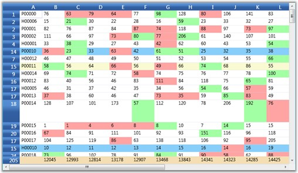

::: {style="DISPLAY: none"}
{#d2h_url_template}{#d2h_package_url style="WIDTH: 0px; DISPLAY: none; HEIGHT: 0px"}
:::

::::: {#nsbanner .d2h_main_nsbanner style="BORDER-BOTTOM: #999999 1px solid; POSITION: relative; PADDING-BOTTOM: 0px; BACKGROUND-COLOR: transparent; PADDING-LEFT: 0px; PADDING-RIGHT: 0px; DISPLAY: none; BORDER-TOP: #999999 1px solid; PADDING-TOP: 0px; LEFT: 0px"}
:::: {#TitleRow .d2h_main_titlerow style="PADDING-BOTTOM: 4px; BACKGROUND-COLOR: transparent; PADDING-LEFT: 22px; WIDTH: 100%; PADDING-RIGHT: 10px; DISPLAY: none; PADDING-TOP: 4px"}
::: {#ienav .d2h_main_ienav style="DISPLAY: none"}
{#D2HPrevious .D2HPreviousEnabled}  {#D2HNext .D2HNextEnabled}
:::
::::
:::::

:::::: {#nstext .d2h_main_nstext style="PADDING-BOTTOM: 10px; BACKGROUND-COLOR: transparent; PADDING-LEFT: 22px; PADDING-RIGHT: 10px; HEIGHT: 100%; OVERFLOW: auto; PADDING-TOP: 5px" hasuserbackground="true" valign="bottom"}
::: {#d2h_breadcrumbs .d2h_breadcrumbs}
[Essential Studio User Guide Documentation](ms-xhelp:///?Id=12457748-09e3-4d74-a240-8e049cedf030){.d2h_breadcrumbsNormal}[ \> ]{.d2h_breadcrumbsLinkSeparator}[User Interface Edition](ms-xhelp:///?Id=c29296b7-531c-413b-a0ec-488ca1f7f669){.d2h_breadcrumbsNormal}[ \> ]{.d2h_breadcrumbsLinkSeparator}[Essential WPF](ms-xhelp:///?Id=7f4f82c5-151c-4262-94d0-75c4626c77bc){.d2h_breadcrumbsNormal}[ \> ]{.d2h_breadcrumbsLinkSeparator}[Essential Grid]{.d2h_breadcrumbsContentsOnly}[ \> ]{.d2h_breadcrumbsLinkSeparator}[Installation and Deployment](ms-xhelp:///?Id=094c35c7-db8e-4341-9619-16644b2a4e34){.d2h_breadcrumbsNormal}[ \> ]{.d2h_breadcrumbsLinkSeparator}[Grid WPF Controls](ms-xhelp:///?Id=1249c159-5431-465a-b1af-1cf1e5e90ac8){.d2h_breadcrumbsNormal}[ \> ]{.d2h_breadcrumbsLinkSeparator}[Grid Control](ms-xhelp:///?Id=7b54a403-0e9e-4539-948b-dbe0726ed273){.d2h_breadcrumbsNormal}
:::

### Performance {#performance style="tab-stops: 0pt"}

Essential Grid is well known for its optimized performance. This section points out a sample that illustrates how to do high frequency updates in Grid control.

 

Example

 

Let us consider a sample using a FlatDataViewGrid control, which is a regular grid that is bound to a flat data view (flat table, which is not nested and without relations) and is customized to handle refresh updates (refreshing the grid values, which in turn replaces old values with new values). It has a header row with field names and a footer row with summaries.

 

Sample Architecture

**[]{style="COLOR: #15428b"}** 

Inside SampleGridControl.cs file, you can define various test scenarios. The basic test will load a data table with values and then modify the records inside a timer (timer is used to keep changing the grid values at regular intervals in order to illustrate run time updates) at run time. This will trigger ListChanged event. FlatDataViewGrid control listens to these events and updates the data displayed, by highlighting the cells that were changed, and also updates the resulting summaries.

 

Sample Features

 

The features of this sample are listed below:

 

[·      ]{style="FONT-FAMILY: Symbol"}This FlatDataViewGrid control is implemented using a virtual grid approach by wiring the grid to the data view using the QueryCellInfo and CommitCellInfo event handlers.

[·      ]{style="FONT-FAMILY: Symbol"}Blinking behavior in the sample is implemented by handling OnPrepareRenderCell event using the PrepareRenderCellInfo handler.

**[]{style="COLOR: #15428b"}** 

::: {style="BORDER-BOTTOM: windowtext 1pt solid; BORDER-LEFT: medium none; PADDING-BOTTOM: 1pt; MARGIN-TOP: 9pt; PADDING-LEFT: 0pt; PADDING-RIGHT: 0pt; MARGIN-BOTTOM: 9pt; BORDER-TOP: windowtext 1pt solid; BORDER-RIGHT: medium none; PADDING-TOP: 1pt"}
{border="0"}Note: Blinking Behavior-You cud see random values get updated frequently and those changed fields are highlighted by colors. For ex., increase in value is indicated in green color and decrease in value in red color. It also highlights the insertion of new records.
:::

**[]{style="COLOR: #15428b"}** 

[·      ]{style="FONT-FAMILY: Symbol"}The grid handles all ListChanged notifications including ItemAdded, ItemMoved, ItemDeleted, Reset, PropertyDescriptorAdded, PropertyDescriptorDeleted and PropertyDescriptorChanged.

[·      ]{style="FONT-FAMILY: Symbol"}When the current cell is active, you can continue editing and modify the contents of the currently active cell even while rows are re-arranged. This is often a requirement in applications that wish to maintain editing compatibility even while processing a large number of updates.

[]{style="COLOR: #15428b"} 

{border="0"}

Figure 135: Trader Grid Test Demo - Performance

::: {style="BORDER-BOTTOM: windowtext 1pt solid; BORDER-LEFT: medium none; PADDING-BOTTOM: 1pt; MARGIN-TOP: 9pt; PADDING-LEFT: 0pt; PADDING-RIGHT: 0pt; MARGIN-BOTTOM: 9pt; BORDER-TOP: windowtext 1pt solid; BORDER-RIGHT: medium none; PADDING-TOP: 1pt"}
 

{border="0"}Note: For complete code for this example, refer the following browser sample:
:::

**** 

***\...\\My Documents\\Syncfusion\\EssentialStudio\\\<Version Number\>\\WPF\\Grid.WPF\\Samples\\3.5\\WindowsSamples\\Performance\\Trader Grid Test Demo***

**** 

[]{#related-topics}
::::::
