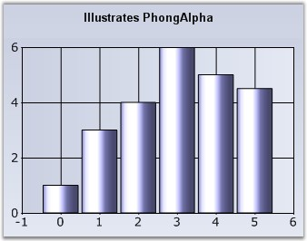

::: {style="DISPLAY: none"}
{#d2h_url_template}{#d2h_package_url style="WIDTH: 0px; DISPLAY: none; HEIGHT: 0px"}
:::

:::: {.d2h_secondary_topic style="PADDING-BOTTOM: 10pt; MARGIN: 0pt; PADDING-LEFT: 0pt; PADDING-RIGHT: 0pt; PADDING-TOP: 0pt"}
#### PhongAlpha {#phongalpha style="tab-stops: 0pt"}

**[]{style="FONT-FAMILY: 'Trebuchet MS','sans-serif'; FONT-SIZE: 9pt"}** 

Specifies the Phong\'s alpha co-efficient used for calculating specular lighting.

[]{style="FONT-FAMILY: 'Trebuchet MS','sans-serif'; FONT-SIZE: 9pt"} 

::: {align="center"}
+---------------------------------------+----------------------------------------------------------------------------------------------------------------------------------------------------------------------------------+
| **[]{style="FONT-FAMILY: 'Trebuchet MS','sans-serif'; FONT-SIZE: 9pt"}**                                                                                                                                                 |
|                                                                                                                                                                                                                          |
| Details                                                                                                                                                                                                                  |
+---------------------------------------+----------------------------------------------------------------------------------------------------------------------------------------------------------------------------------+
| Possible Values                       | Any double value                                                                                                                                                                 |
+---------------------------------------+----------------------------------------------------------------------------------------------------------------------------------------------------------------------------------+
| Default Value                         | 20                                                                                                                                                                               |
+---------------------------------------+----------------------------------------------------------------------------------------------------------------------------------------------------------------------------------+
| 2D / 3D Limitations                   | No                                                                                                                                                                               |
+---------------------------------------+----------------------------------------------------------------------------------------------------------------------------------------------------------------------------------+
| Applies to Chart Element              | Any Series                                                                                                                                                                       |
+---------------------------------------+----------------------------------------------------------------------------------------------------------------------------------------------------------------------------------+
| Applies to Chart Types                | Column Chart, Bar Chart, Box and Whisker Chart, Gantt Chart, Histogram Chart, Tornado Chart, Polar and Radar Chart, HiLo Chart, HiLoOpenClose Chart, Candle Chart, Scatter Chart |
+---------------------------------------+----------------------------------------------------------------------------------------------------------------------------------------------------------------------------------+
:::

**[]{style="FONT-FAMILY: 'Trebuchet MS','sans-serif'; FONT-SIZE: 9pt"}** 

Here is code snippet using PhongAlpha in Column Chart.

[]{style="FONT-FAMILY: 'Trebuchet MS','sans-serif'; FONT-SIZE: 9pt"} 

+-----------------------------------------------------------------------------------------------------------------------------------------------------------------------------------+
| **[\[C#\]]{style="FONT-FAMILY: 'Courier New'; COLOR: black"}**                                                                                                                    |
|                                                                                                                                                                                   |
| **[]{style="FONT-FAMILY: 'Courier New'; COLOR: black"}**                                                                                                                          |
|                                                                                                                                                                                   |
| [this]{style="FONT-FAMILY: 'Courier New'; COLOR: blue"}[.ChartWebControl1.Series\[0\].ConfigItems.ColumnItem.PhongAlpha = 2.0;]{style="FONT-FAMILY: 'Courier New'; COLOR: black"} |
+-----------------------------------------------------------------------------------------------------------------------------------------------------------------------------------+

[]{style="FONT-FAMILY: 'Trebuchet MS','sans-serif'; FONT-SIZE: 9pt"} 

+--------------------------------------------------------------------------------------------------------------------------------------------------------------------------------------+
| **[\[VB.NET\]]{style="FONT-FAMILY: 'Courier New'; COLOR: black"}**                                                                                                                   |
|                                                                                                                                                                                      |
| **[]{style="FONT-FAMILY: 'Courier New'; COLOR: black"}**                                                                                                                             |
|                                                                                                                                                                                      |
| [Private Me]{style="FONT-FAMILY: 'Courier New'; COLOR: blue"}[.ChartWebControl1.Series(0).ConfigItems.ColumnItem.PhongAlpha = 2.0]{style="FONT-FAMILY: 'Courier New'; COLOR: black"} |
+--------------------------------------------------------------------------------------------------------------------------------------------------------------------------------------+

**[]{style="FONT-FAMILY: 'Trebuchet MS','sans-serif'; FONT-SIZE: 9pt"}** 

{border="0"}

**[]{style="FONT-FAMILY: 'Trebuchet MS','sans-serif'; FONT-SIZE: 9pt"}** 

Figure 164: Normal Column Chart

**[]{style="FONT-FAMILY: 'Trebuchet MS','sans-serif'; FONT-SIZE: 9pt"}** 

{border="0"}

**[]{style="FONT-FAMILY: 'Trebuchet MS','sans-serif'; FONT-SIZE: 9pt"}** 

Figure 165: Column Chart with Phong Alpha Set

**[]{style="FONT-FAMILY: 'Trebuchet MS','sans-serif'; FONT-SIZE: 9pt"}** 

See Also

**[]{style="FONT-FAMILY: 'Trebuchet MS','sans-serif'; FONT-SIZE: 9pt"}** 

[Pyramid Chart]{.UGHyperlink}[, ]{.UGHyperlink}[Funnel Chart]{.UGHyperlink}[, ]{.UGHyperlink}[Area Charts]{.UGHyperlink}[, ]{.UGHyperlink}[Bar Charts]{.UGHyperlink}[, ]{.UGHyperlink}[Bubble Chart]{.UGHyperlink}[, ]{.UGHyperlink}[Column Charts]{.UGHyperlink}[, ]{.UGHyperlink}[Candle Chart]{.UGHyperlink}[, ]{.UGHyperlink}[Renko chart]{.UGHyperlink}[, ]{.UGHyperlink}[Three Line Break Chart]{.UGHyperlink}[, ]{.UGHyperlink}[Box and Whisker Chart]{.UGHyperlink}[, ]{.UGHyperlink}[Gantt Chart]{.UGHyperlink}[, ]{.UGHyperlink}[Histogram Chart]{.UGHyperlink}[, ]{.UGHyperlink}[Tornado Chart]{.UGHyperlink}[, ]{.UGHyperlink}[Polar and Radar Chart]{.UGHyperlink}[, ]{.UGHyperlink}[Pie Chart]{.UGHyperlink}[]{.UGHyperlink}

[]{#p129} 

[]{#related-topics}
::::
