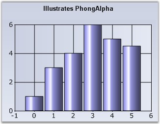

::: {style="DISPLAY: none"}
{#d2h_url_template}{#d2h_package_url style="WIDTH: 0px; DISPLAY: none; HEIGHT: 0px"}
:::

:::: {.d2h_secondary_topic style="PADDING-BOTTOM: 10pt; MARGIN: 0pt; PADDING-LEFT: 0pt; PADDING-RIGHT: 0pt; PADDING-TOP: 0pt"}
#### PhongAlpha {#phongalpha style="tab-stops: 0pt"}

 

Specifies the Phong\'s alpha co-efficient used for calculating specular lighting.

 

::: {align="center"}
+------------------------------+----------------------------------------------------------------------------------------------------------------------------------------------------------------------------------+
| Details                                                                                                                                                                                                         |
+------------------------------+----------------------------------------------------------------------------------------------------------------------------------------------------------------------------------+
| **Possible Values**          | Any double value                                                                                                                                                                 |
+------------------------------+----------------------------------------------------------------------------------------------------------------------------------------------------------------------------------+
| **Default Value    **        | **20**                                                                                                                                                                           |
+------------------------------+----------------------------------------------------------------------------------------------------------------------------------------------------------------------------------+
| **2D / 3D Limitations**      | No                                                                                                                                                                               |
+------------------------------+----------------------------------------------------------------------------------------------------------------------------------------------------------------------------------+
| **Applies to Chart Element** | Any Series                                                                                                                                                                       |
+------------------------------+----------------------------------------------------------------------------------------------------------------------------------------------------------------------------------+
| **Applies to Chart Types**   | Column Chart, Bar Chart, Box and Whisker Chart, Gantt Chart, Histogram Chart, Tornado Chart, Polar and Radar Chart, HiLo Chart, HiLoOpenClose Chart, Candle Chart, Scatter Chart |
+------------------------------+----------------------------------------------------------------------------------------------------------------------------------------------------------------------------------+
:::

 

Here is code snippet using PhongAlpha in Column Chart.

 

+--------------------------------------------------------------------------------------------------------------------------------------------------------------------------------+
| **[\[C#\]]{style="FONT-FAMILY: 'Courier New'; COLOR: black"}**                                                                                                                 |
|                                                                                                                                                                                |
| **[]{style="FONT-FAMILY: 'Courier New'; COLOR: black"}**                                                                                                                       |
|                                                                                                                                                                                |
| [this]{style="FONT-FAMILY: 'Courier New'; COLOR: blue"}[.chartControl1.Series\[0\].ConfigItems.ColumnItem.PhongAlpha = 2.0;]{style="FONT-FAMILY: 'Courier New'; COLOR: black"} |
+--------------------------------------------------------------------------------------------------------------------------------------------------------------------------------+

 

+-----------------------------------------------------------------------------------------------------------------------------------------------------------------------------------+
| **[\[VB.NET\]]{style="FONT-FAMILY: 'Courier New'; COLOR: black"}**                                                                                                                |
|                                                                                                                                                                                   |
| **[]{style="FONT-FAMILY: 'Courier New'; COLOR: black"}**                                                                                                                          |
|                                                                                                                                                                                   |
| [Private Me]{style="FONT-FAMILY: 'Courier New'; COLOR: blue"}[.chartControl1.Series(0).ConfigItems.ColumnItem.PhongAlpha = 2.0]{style="FONT-FAMILY: 'Courier New'; COLOR: black"} |
+-----------------------------------------------------------------------------------------------------------------------------------------------------------------------------------+

 

{border="0"}

 

Figure 169: Normal Column Chart

 

{border="0"}

 

Figure 170: Column Chart with Phong Alpha Set

 

**See Also**

 

[Bar Charts]{.UGHyperlink} , [Box and Whisker]{.UGHyperlink}[[ ]{style="TEXT-DECORATION: none; text-underline: none"}]{.MsoHyperlink}, [Column Charts]{.UGHyperlink} , [Candle Chart]{.UGHyperlink} , [Gantt Chart]{.UGHyperlink} , [HiLo Chart]{.UGHyperlink} , [HiLoOpenClose Chart]{.UGHyperlink}[ ]{.UGHyperlink},  [Histogram Chart]{.UGHyperlink}[[ ]{style="TEXT-DECORATION: none; text-underline: none"}]{.MsoHyperlink}, [Tornado Chart]{.UGHyperlink}, [Radar Chart]{.UGHyperlink},[ ]{.UGHyperlink}[Scatter Chart]{.UGHyperlink}, []{style="COLOR: black"}

 

[]{#p128} 

 

[]{#related-topics}
::::
