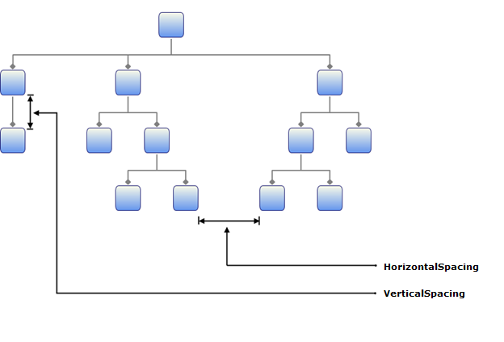
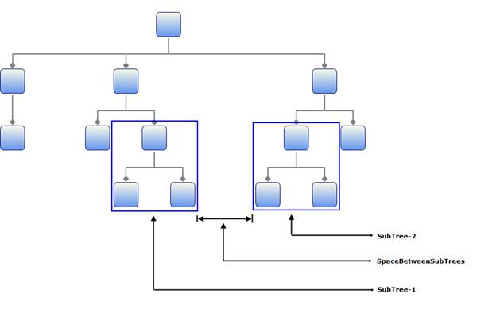

::: {style="DISPLAY: none"}
{#d2h_url_template}{#d2h_package_url style="WIDTH: 0px; DISPLAY: none; HEIGHT: 0px"}
:::

::::: {#nsbanner .d2h_main_nsbanner style="BORDER-BOTTOM: #999999 1px solid; POSITION: relative; PADDING-BOTTOM: 0px; BACKGROUND-COLOR: transparent; PADDING-LEFT: 0px; PADDING-RIGHT: 0px; DISPLAY: none; BORDER-TOP: #999999 1px solid; PADDING-TOP: 0px; LEFT: 0px"}
:::: {#TitleRow .d2h_main_titlerow style="PADDING-BOTTOM: 4px; BACKGROUND-COLOR: transparent; PADDING-LEFT: 22px; WIDTH: 100%; PADDING-RIGHT: 10px; DISPLAY: none; PADDING-TOP: 4px"}
::: {#ienav .d2h_main_ienav style="DISPLAY: none"}
{#D2HPrevious .D2HPreviousEnabled}  {#D2HNext .D2HNextEnabled}
:::
::::
:::::

:::: {#nstext .d2h_main_nstext style="PADDING-BOTTOM: 10px; BACKGROUND-COLOR: transparent; PADDING-LEFT: 22px; PADDING-RIGHT: 10px; HEIGHT: 100%; OVERFLOW: auto; PADDING-TOP: 5px" hasuserbackground="true" valign="bottom"}
::: {#d2h_breadcrumbs .d2h_breadcrumbs}
[Essential Studio User Guide Documentation](ms-xhelp:///?Id=12457748-09e3-4d74-a240-8e049cedf030){.d2h_breadcrumbsNormal}[ \> ]{.d2h_breadcrumbsLinkSeparator}[User Interface Edition](ms-xhelp:///?Id=c29296b7-531c-413b-a0ec-488ca1f7f669){.d2h_breadcrumbsNormal}[ \> ]{.d2h_breadcrumbsLinkSeparator}[Essential WPF](ms-xhelp:///?Id=7f4f82c5-151c-4262-94d0-75c4626c77bc){.d2h_breadcrumbsNormal}[ \> ]{.d2h_breadcrumbsLinkSeparator}[Essential Diagram]{.d2h_breadcrumbsContentsOnly}[ \> ]{.d2h_breadcrumbsLinkSeparator}[Concepts and Features](ms-xhelp:///?Id=8625d466-6e21-495a-b811-4ecee754da81){.d2h_breadcrumbsNormal}[ \> ]{.d2h_breadcrumbsLinkSeparator}[Diagram Model](ms-xhelp:///?Id=1442c676-f993-4e57-8811-297030794ef0){.d2h_breadcrumbsNormal}
:::

### Pictorial Representation of Spacing Properties {#pictorial-representation-of-spacing-properties style="tab-stops: 0pt"}

The following are general spacing properties used in Directed and Hierarchical tree layouts:

[·          ]{style="FONT-FAMILY: Symbol"}VerticalSpacing

[·          ]{style="FONT-FAMILY: Symbol"}HorizontalSpacing

[·          ]{style="FONT-FAMILY: Symbol"}SpaceBetweenSubTrees

 

Representation for Horizontal and Vertical Spacing Properties

Horizontal Spacing refers to the spaces between the edges of the adjacent nodes (Siblings) and the Vertical Spacing refers to spaces between the nodes that lie at the next levels of the tree layout.

 

{border="0"}

Figure 119: Horizontal and Vertical Spacing Properties

 

Representation for SpaceBetweenSubTrees properties

SpaceBetweenSubTrees refers to the spaces between adjacent Subtrees.

 

{border="0"}

Figure 120: SpaceBetweenSubTrees property

 

 

 

 

 

 

 

 

 

 

 

 

 

[]{#related-topics}
::::
