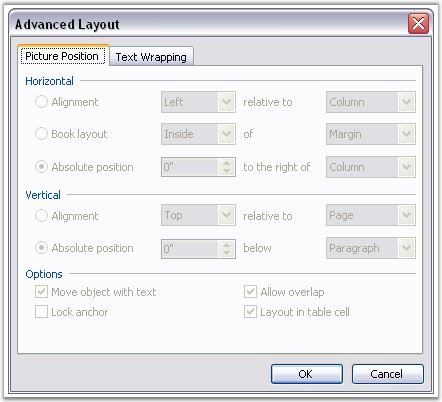

::: {style="DISPLAY: none"}
{#d2h_url_template}{#d2h_package_url style="WIDTH: 0px; DISPLAY: none; HEIGHT: 0px"}
:::

:::::: {.d2h_secondary_topic style="PADDING-BOTTOM: 10pt; MARGIN: 0pt; PADDING-LEFT: 0pt; PADDING-RIGHT: 0pt; PADDING-TOP: 0pt"}
##### Picture {#picture style="tab-stops: 0pt"}

 

WPicture class represents a picture in the Word document.

 

A picture is a shape. Positioning properties of WPicture class are almost the same as the other shapes.

 

A picture is positioned by using the VerticalPosition and HorizontalPosition properties. Measure unit is Point. Relative positioning is defined by using the HorizontalAlignment and VerticalAlignment properties.

 

HorizontalAlignment property returns the object of the ShapeHorizontalAlignment type. The following are the variants for the HorizontalAlignment property.

 

[·      ]{style="FONT-FAMILY: Symbol"}None

[·      ]{style="FONT-FAMILY: Symbol"}Left

[·      ]{style="FONT-FAMILY: Symbol"}Center

[·      ]{style="FONT-FAMILY: Symbol"}Right

[·      ]{style="FONT-FAMILY: Symbol"}Inside

[·      ]{style="FONT-FAMILY: Symbol"}Outside

 

VerticalAlignment property returns the object of the ShapeVerticalAlignment type. The following are the variants for the VerticalAlignment property.

 

[·      ]{style="FONT-FAMILY: Symbol"}Bottom

[·      ]{style="FONT-FAMILY: Symbol"}Center

[·      ]{style="FONT-FAMILY: Symbol"}Inline

[·      ]{style="FONT-FAMILY: Symbol"}Inside

[·      ]{style="FONT-FAMILY: Symbol"}None

[·      ]{style="FONT-FAMILY: Symbol"}Outside

[·      ]{style="FONT-FAMILY: Symbol"}Top

 

**HorizontalOrigin** and **VerticalOrigin** properties define the reference origin, which is used for relative positioning of a picture.

 

HorizontalOrigin property returns the value of the HorizontalOrigin type. The following are the variants for the HorizontalOrigin property.

 

[·      ]{style="FONT-FAMILY: Symbol"}Margin

[·      ]{style="FONT-FAMILY: Symbol"}Page

[·      ]{style="FONT-FAMILY: Symbol"}Column

[·      ]{style="FONT-FAMILY: Symbol"}Character

 

VerticalOrigin property returns value of VerticalOrigin type. The following are the variants for the VerticalOrigin property.

 

[·      ]{style="FONT-FAMILY: Symbol"}Margin

[·      ]{style="FONT-FAMILY: Symbol"}Page

[·      ]{style="FONT-FAMILY: Symbol"}Paragraph

[·      ]{style="FONT-FAMILY: Symbol"}Line

 

You can set the width and height of the picture by using the **Width** and **Height** properties, and the **HeightScale** and **WidthScale** properties to get or set picture scaling.

 

The **LoadImage** function is used to set an image by loading the System.Drawing.Image object, or image bytes array. Also, you can use the **AppendPicture** function of the WParagraph class to append a picture to a paragraph.

 

Class Hierarchy

 

ParagraphItem

                \|

            WPicture

 

Public Constructor

 

::: {align="center"}
  ----------------------------------- ------------------------------
  Name                                Description
  WPicture.WPicture (IWordDocument)   Gets the type of the entity.
  ----------------------------------- ------------------------------
:::

 

**Public Properties**

 

::: {align="center"}
  --------------------- -----------------------------------------------------------
  Name                  Description
  EntityType            Gets the type of the entity.
  Height                Gets or sets picture height.
  HeightScale           Gets or sets picture height scale factor in percent.
  HorizontalAlignment   Gets or sets picture horizontal alignment.
  HorizontalOrigin      Gets sets horizontal origin of the picture.  
  HorizontalPosition    Gets sets absolute vertical position of the picture.  
  Image                 Gets internal System.Drawing.Image object.  
  ImageBytes            Gets image byte array.  
  IsBelowText           Gets or sets whether picture is below image.  
  Size                  Gets or sets size of the picture object.  
  TextWrappingStyle     Gets or sets text wrapping style of the picture.  
  TextWrappingType      Gets or sets text wrapping type of the picture.  
  VerticalAlignment     Gets or sets picture vertical alignment.  
  VerticalOrigin        Gets or sets absolute horizontal position of the picture.
  VerticalPosition      Gets or sets text wrapping style of the picture.  
  Width                 Gets or sets picture width (in points).  .  
  WidthScale            Gets or sets picture width scale factor in percent.  
  --------------------- -----------------------------------------------------------
:::

 

Public Methods

 

::: {align="center"}
  ------------ ----------------------------------
  Name         Description
  AddCaption   Add Caption for current Picture.
  LoadImage    Loads image.
  ------------ ----------------------------------
:::

 

The following screen shot illustrates the various layout formats available in MS Word.

 

{border="0"}

Figure 62: Layout Formats in MS Word

 

The following code illustrates how to use the **WPicture** class.

 

+-------------------------------------------------------------------------------------------------------------------------------------------------------------------------------------------------------------------------------+
| **[\[C#\]]{style="FONT-FAMILY: 'Courier New'; COLOR: black"}**                                                                                                                                                                |
|                                                                                                                                                                                                                               |
| []{style="COLOR: black"}                                                                                                                                                                                                      |
|                                                                                                                                                                                                                               |
| [IWordDocument]{style="FONT-FAMILY: 'Courier New'; COLOR: teal"}[ doc = [new]{style="COLOR: blue"} [WordDocument]{style="COLOR: teal"}();]{style="FONT-FAMILY: 'Courier New'"}                                                |
|                                                                                                                                                                                                                               |
| [IWSection]{style="FONT-FAMILY: 'Courier New'; COLOR: teal"}[ section = doc.AddSection();]{style="FONT-FAMILY: 'Courier New'"}                                                                                                |
|                                                                                                                                                                                                                               |
| [IWParagraph]{style="FONT-FAMILY: 'Courier New'; COLOR: teal"}[ paragraph = section.AddParagraph();]{style="FONT-FAMILY: 'Courier New'"}                                                                                      |
|                                                                                                                                                                                                                               |
| [paragraph.AppendText([\"First image\"]{style="COLOR: maroon"});]{style="FONT-FAMILY: 'Courier New'"}                                                                                                                         |
|                                                                                                                                                                                                                               |
| [IWPicture]{style="FONT-FAMILY: 'Courier New'; COLOR: teal"}[ picture = paragraph.AppendPicture([new]{style="COLOR: blue"} [Bitmap]{style="COLOR: teal"}(ImagesPath + DEF_IMAGE1_NAME));]{style="FONT-FAMILY: 'Courier New'"} |
|                                                                                                                                                                                                                               |
| [picture.HeightScale = 50f;]{style="FONT-FAMILY: 'Courier New'"}                                                                                                                                                              |
|                                                                                                                                                                                                                               |
| [picture.WidthScale = 50f;]{style="FONT-FAMILY: 'Courier New'"}                                                                                                                                                               |
|                                                                                                                                                                                                                               |
| []{style="FONT-FAMILY: 'Courier New'"}                                                                                                                                                                                        |
|                                                                                                                                                                                                                               |
| [paragraph = section.AddParagraph();]{style="FONT-FAMILY: 'Courier New'"}                                                                                                                                                     |
|                                                                                                                                                                                                                               |
| [paragraph.AppendText([\"Second image\"]{style="COLOR: maroon"});]{style="FONT-FAMILY: 'Courier New'"}                                                                                                                        |
|                                                                                                                                                                                                                               |
| [picture = paragraph.AppendPicture([new]{style="COLOR: blue"} [Bitmap]{style="COLOR: teal"}(ImagesPath + DEF_IMAGE2_NAME));]{style="FONT-FAMILY: 'Courier New'"}                                                              |
|                                                                                                                                                                                                                               |
| [picture.HeightScale = 50f;]{style="FONT-FAMILY: 'Courier New'"}                                                                                                                                                              |
|                                                                                                                                                                                                                               |
| [picture.WidthScale = 50f;]{style="FONT-FAMILY: 'Courier New'"}                                                                                                                                                               |
|                                                                                                                                                                                                                               |
| []{style="FONT-FAMILY: 'Courier New'"}                                                                                                                                                                                        |
|                                                                                                                                                                                                                               |
| [section.HeadersFooters.OddHeader.Paragraphs.Add(paragraph);]{style="FONT-FAMILY: 'Courier New'"}                                                                                                                             |
+-------------------------------------------------------------------------------------------------------------------------------------------------------------------------------------------------------------------------------+

 

+-------------------------------------------------------------------------------------------------------------------------------------------------------------------------------------------------------------------------------------+
| **[\[VB.NET\]]{style="FONT-FAMILY: 'Courier New'; COLOR: black"}**                                                                                                                                                                  |
|                                                                                                                                                                                                                                     |
| []{style="COLOR: black"}                                                                                                                                                                                                            |
|                                                                                                                                                                                                                                     |
| [Dim]{style="FONT-FAMILY: 'Courier New'; COLOR: blue"}[ doc [As]{style="COLOR: blue"} IWordDocument = [New]{style="COLOR: blue"} WordDocument()]{style="FONT-FAMILY: 'Courier New'"}                                                |
|                                                                                                                                                                                                                                     |
| [Dim]{style="FONT-FAMILY: 'Courier New'; COLOR: blue"}[ section [As]{style="COLOR: blue"} IWSection = doc.AddSection()]{style="FONT-FAMILY: 'Courier New'"}                                                                         |
|                                                                                                                                                                                                                                     |
| [Dim]{style="FONT-FAMILY: 'Courier New'; COLOR: blue"}[ paragraph [As]{style="COLOR: blue"} IWParagraph = section.AddParagraph()]{style="FONT-FAMILY: 'Courier New'"}                                                               |
|                                                                                                                                                                                                                                     |
| [paragraph.AppendText([\"First image\"]{style="COLOR: maroon"})]{style="FONT-FAMILY: 'Courier New'"}                                                                                                                                |
|                                                                                                                                                                                                                                     |
| [Dim]{style="FONT-FAMILY: 'Courier New'; COLOR: blue"}[ picture [As]{style="COLOR: blue"} IWPicture = paragraph.AppendPicture([New]{style="COLOR: blue"} Bitmap(ImagesPath + DEF_IMAGE1_NAME))]{style="FONT-FAMILY: 'Courier New'"} |
|                                                                                                                                                                                                                                     |
| [picture.HeightScale = 50f]{style="FONT-FAMILY: 'Courier New'"}                                                                                                                                                                     |
|                                                                                                                                                                                                                                     |
| [picture.WidthScale = 50f]{style="FONT-FAMILY: 'Courier New'"}                                                                                                                                                                      |
|                                                                                                                                                                                                                                     |
| []{style="FONT-FAMILY: 'Courier New'"}                                                                                                                                                                                              |
|                                                                                                                                                                                                                                     |
| [paragraph = section.AddParagraph()]{style="FONT-FAMILY: 'Courier New'"}                                                                                                                                                            |
|                                                                                                                                                                                                                                     |
| [paragraph.AppendText([\"Second image\"]{style="COLOR: maroon"})]{style="FONT-FAMILY: 'Courier New'"}                                                                                                                               |
|                                                                                                                                                                                                                                     |
| [picture = paragraph.AppendPicture([New]{style="COLOR: blue"} Bitmap(ImagesPath + DEF_IMAGE2_NAME))]{style="FONT-FAMILY: 'Courier New'"}                                                                                            |
|                                                                                                                                                                                                                                     |
| [picture.HeightScale = 50f]{style="FONT-FAMILY: 'Courier New'"}                                                                                                                                                                     |
|                                                                                                                                                                                                                                     |
| [picture.WidthScale = 50f]{style="FONT-FAMILY: 'Courier New'"}                                                                                                                                                                      |
|                                                                                                                                                                                                                                     |
| []{style="FONT-FAMILY: 'Courier New'"}                                                                                                                                                                                              |
|                                                                                                                                                                                                                                     |
| [section.HeadersFooters.OddHeader.Paragraphs.Add(paragraph)]{style="FONT-FAMILY: 'Courier New'"}                                                                                                                                    |
+-------------------------------------------------------------------------------------------------------------------------------------------------------------------------------------------------------------------------------------+

[]{#related-topics}
::::::
