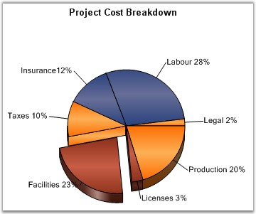

::: {style="DISPLAY: none"}
{#d2h_url_template}{#d2h_package_url style="WIDTH: 0px; DISPLAY: none; HEIGHT: 0px"}
:::

::::: {#nsbanner .d2h_main_nsbanner style="BORDER-BOTTOM: #999999 1px solid; POSITION: relative; PADDING-BOTTOM: 0px; BACKGROUND-COLOR: transparent; PADDING-LEFT: 0px; PADDING-RIGHT: 0px; DISPLAY: none; BORDER-TOP: #999999 1px solid; PADDING-TOP: 0px; LEFT: 0px"}
:::: {#TitleRow .d2h_main_titlerow style="PADDING-BOTTOM: 4px; BACKGROUND-COLOR: transparent; PADDING-LEFT: 22px; WIDTH: 100%; PADDING-RIGHT: 10px; DISPLAY: none; PADDING-TOP: 4px"}
::: {#ienav .d2h_main_ienav style="DISPLAY: none"}
{#D2HPrevious .D2HPreviousEnabled}  {#D2HNext .D2HNextEnabled}
:::
::::
:::::

::::: {#nstext .d2h_main_nstext style="PADDING-BOTTOM: 10px; BACKGROUND-COLOR: transparent; PADDING-LEFT: 22px; PADDING-RIGHT: 10px; HEIGHT: 100%; OVERFLOW: auto; PADDING-TOP: 5px" hasuserbackground="true" valign="bottom"}
::: {#d2h_breadcrumbs .d2h_breadcrumbs}
[Essential Studio User Guide Documentation](ms-xhelp:///?Id=12457748-09e3-4d74-a240-8e049cedf030){.d2h_breadcrumbsNormal}[ \> ]{.d2h_breadcrumbsLinkSeparator}[User Interface Edition](ms-xhelp:///?Id=c29296b7-531c-413b-a0ec-488ca1f7f669){.d2h_breadcrumbsNormal}[ \> ]{.d2h_breadcrumbsLinkSeparator}[Essential Windows](ms-xhelp:///?Id=e60759d8-47a4-4570-9d7a-16a68d63f2ea){.d2h_breadcrumbsNormal}[ \> ]{.d2h_breadcrumbsLinkSeparator}[Essential Chart]{.d2h_breadcrumbsContentsOnly}[ \> ]{.d2h_breadcrumbsLinkSeparator}[Concepts and Features](ms-xhelp:///?Id=71321e9c-336c-4c1c-a127-be9f135ad4bb){.d2h_breadcrumbsNormal}[ \> ]{.d2h_breadcrumbsLinkSeparator}[Chart Types](ms-xhelp:///?Id=cf461556-638d-4482-bf48-b839cfdbac14){.d2h_breadcrumbsNormal}
:::

### Pie Chart {#pie-chart style="tab-stops: 0pt"}

 

A Pie Chart renders y values as slices in a pie. These slices are rendered in proportion to the whole, which is simply the sum of all the y values in the series. Consequently, Pie Charts are used to visualize the proportional contribution (in terms of percentage or fraction) of categories of data to the whole data set. The x values in the data series will only be treated as nominal (categorical, qualitative) data. The Pie Chart can display only one Data Series at a time.

 

{border="0"}

 

Figure 81: Chart displaying Pie Series

 

Chart Details

 

::: {align="center"}
+----------------------------------+------------------------+
| Details                                                   |
+----------------------------------+------------------------+
| **Number of Y values per point** | 1                      |
+----------------------------------+------------------------+
| **Number of Series         **    | One.                   |
+----------------------------------+------------------------+
| **Cannot be Combined with   **   | Any other chart types. |
+----------------------------------+------------------------+
:::

 

Pie series can be added to the chart using the following code.

 

+----------------------------------------------------------------------------------------------------------------------------------------------------------------------------------------------------------------------------------------------------------+
| **[\[C#\]]{style="FONT-FAMILY: 'Courier New'; COLOR: black"}**                                                                                                                                                                                           |
|                                                                                                                                                                                                                                                          |
| **[]{style="FONT-FAMILY: 'Courier New'; COLOR: black"}**                                                                                                                                                                                                 |
|                                                                                                                                                                                                                                                          |
| [// Create chart series and add data points into it.]{style="FONT-FAMILY: 'Courier New'; COLOR: green"}                                                                                                                                                  |
|                                                                                                                                                                                                                                                          |
| [ChartSeries series = ]{style="FONT-FAMILY: 'Courier New'; COLOR: black"}[this]{style="FONT-FAMILY: 'Courier New'; COLOR: blue"}[.chartControl1.Model.NewSeries(\"Series Name\",ChartSeriesType.Pie);]{style="FONT-FAMILY: 'Courier New'; COLOR: black"} |
|                                                                                                                                                                                                                                                          |
| [series.Points.Add(0, 1);]{style="FONT-FAMILY: 'Courier New'; COLOR: black"}                                                                                                                                                                             |
|                                                                                                                                                                                                                                                          |
| [series.Points.Add(1, 3);]{style="FONT-FAMILY: 'Courier New'; COLOR: black"}                                                                                                                                                                             |
|                                                                                                                                                                                                                                                          |
| [series.Points.Add(2, 4);]{style="FONT-FAMILY: 'Courier New'; COLOR: black"}                                                                                                                                                                             |
|                                                                                                                                                                                                                                                          |
| []{style="FONT-FAMILY: 'Courier New'; COLOR: black"}                                                                                                                                                                                                     |
|                                                                                                                                                                                                                                                          |
| [// Add the series to the chart series collection.]{style="FONT-FAMILY: 'Courier New'; COLOR: green"}                                                                                                                                                    |
|                                                                                                                                                                                                                                                          |
| [this]{style="FONT-FAMILY: 'Courier New'; COLOR: blue"}[.chartControl1.Series.Add(series);]{style="FONT-FAMILY: 'Courier New'; COLOR: black"}                                                                                                            |
+----------------------------------------------------------------------------------------------------------------------------------------------------------------------------------------------------------------------------------------------------------+

 

+-------------------------------------------------------------------------------------------------------------------------------------------------------------------------------------------------------------------------------------------------------------------------------------------------------------------------------------------------------------------------------------------------------------------------+
| **[\[VB.NET\]]{style="FONT-FAMILY: 'Courier New'; COLOR: black"}**                                                                                                                                                                                                                                                                                                                                                      |
|                                                                                                                                                                                                                                                                                                                                                                                                                         |
| **[]{style="FONT-FAMILY: 'Courier New'; COLOR: black"}**                                                                                                                                                                                                                                                                                                                                                                |
|                                                                                                                                                                                                                                                                                                                                                                                                                         |
| [\' Create chart series and add data points into it.]{style="FONT-FAMILY: 'Courier New'; COLOR: green"}                                                                                                                                                                                                                                                                                                                 |
|                                                                                                                                                                                                                                                                                                                                                                                                                         |
| [Dim]{style="FONT-FAMILY: 'Courier New'; COLOR: blue"}[ series ]{style="FONT-FAMILY: 'Courier New'; COLOR: black"}[As]{style="FONT-FAMILY: 'Courier New'; COLOR: blue"}[ ChartSeries =]{style="FONT-FAMILY: 'Courier New'; COLOR: black"}[ Me]{style="FONT-FAMILY: 'Courier New'; COLOR: blue"}[.chartControl1.Model.NewSeries(\"Series Name\", ChartSeriesType.Pie)]{style="FONT-FAMILY: 'Courier New'; COLOR: black"} |
|                                                                                                                                                                                                                                                                                                                                                                                                                         |
| [series.Points.Add(0, 1)]{style="FONT-FAMILY: 'Courier New'; COLOR: black"}                                                                                                                                                                                                                                                                                                                                             |
|                                                                                                                                                                                                                                                                                                                                                                                                                         |
| [series.Points.Add(1, 3)]{style="FONT-FAMILY: 'Courier New'; COLOR: black"}                                                                                                                                                                                                                                                                                                                                             |
|                                                                                                                                                                                                                                                                                                                                                                                                                         |
| [series.Points.Add(2, 4)]{style="FONT-FAMILY: 'Courier New'; COLOR: black"}                                                                                                                                                                                                                                                                                                                                             |
|                                                                                                                                                                                                                                                                                                                                                                                                                         |
| []{style="FONT-FAMILY: 'Courier New'; COLOR: black"}                                                                                                                                                                                                                                                                                                                                                                    |
|                                                                                                                                                                                                                                                                                                                                                                                                                         |
| [// Add the series to the chart series collection.]{style="FONT-FAMILY: 'Courier New'; COLOR: green"}                                                                                                                                                                                                                                                                                                                   |
|                                                                                                                                                                                                                                                                                                                                                                                                                         |
| [Me]{style="FONT-FAMILY: 'Courier New'; COLOR: blue"}[.chartControl1.Series.Add(series)]{style="FONT-FAMILY: 'Courier New'; COLOR: black"}                                                                                                                                                                                                                                                                              |
+-------------------------------------------------------------------------------------------------------------------------------------------------------------------------------------------------------------------------------------------------------------------------------------------------------------------------------------------------------------------------------------------------------------------------+

 

+--------------------------------------------------------------------------------------------------------------------------------------------------------------------------------+
|                                                                                                                                                                                |
|                                                                                                                                                                                |
| Customization Options                                                                                                                                                          |
+--------------------------------------------------------------------------------------------------------------------------------------------------------------------------------+
| AngleOffset[, ]{style="COLOR: blue"}Border, DisplayShadow, DisplayText, DoughnutCoeficient, DrawSeriesNameInDepth, ElementBorders, ExplodedAll, ExplodedIndex, ExplosionOffset |
|                                                                                                                                                                                |
| FillMode, Gradient, HeightByAreaDepth, HeightCoeficient, HighlightInterior, InSideRadius, OptimizePiePointPositions, PieType, ShadowInterior, ShadowOffset                     |
|                                                                                                                                                                                |
| ShowTicks, VisibleAllPies, FancyToolTip, Font, Interior, LegendItem, Name, PointsToolTipFormat, SmartLabels,                                                                   |
|                                                                                                                                                                                |
| Summary, Text, TextColor, TextFormat, TextOffset, TextOrientation, Visible, ShowDataBindLabels                                                                                 |
+--------------------------------------------------------------------------------------------------------------------------------------------------------------------------------+

 

**See Also**

 

More:

[ ]{#related-topics}

[{border="0" align="absMiddle"}Doughnut Chart](ms-xhelp:///?Id=d2f76df0-23b3-4d63-a7a5-8a9d04002a91){style="TEXT-DECORATION: none"}
:::::
