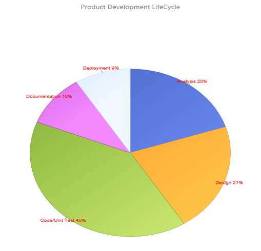

::: {style="DISPLAY: none"}
{#d2h_url_template}{#d2h_package_url style="WIDTH: 0px; DISPLAY: none; HEIGHT: 0px"}
:::

::::: {#nsbanner .d2h_main_nsbanner style="BORDER-BOTTOM: #999999 1px solid; POSITION: relative; PADDING-BOTTOM: 0px; BACKGROUND-COLOR: transparent; PADDING-LEFT: 0px; PADDING-RIGHT: 0px; DISPLAY: none; BORDER-TOP: #999999 1px solid; PADDING-TOP: 0px; LEFT: 0px"}
:::: {#TitleRow .d2h_main_titlerow style="PADDING-BOTTOM: 4px; BACKGROUND-COLOR: transparent; PADDING-LEFT: 22px; WIDTH: 100%; PADDING-RIGHT: 10px; DISPLAY: none; PADDING-TOP: 4px"}
::: {#ienav .d2h_main_ienav style="DISPLAY: none"}
{#D2HPrevious .D2HPreviousEnabled}  {#D2HNext .D2HNextEnabled}
:::
::::
:::::

::::: {#nstext .d2h_main_nstext style="PADDING-BOTTOM: 10px; BACKGROUND-COLOR: transparent; PADDING-LEFT: 22px; PADDING-RIGHT: 10px; HEIGHT: 100%; OVERFLOW: auto; PADDING-TOP: 5px" hasuserbackground="true" valign="bottom"}
::: {#d2h_breadcrumbs .d2h_breadcrumbs}
[Essential Studio User Guide Documentation](ms-xhelp:///?Id=12457748-09e3-4d74-a240-8e049cedf030){.d2h_breadcrumbsNormal}[ \> ]{.d2h_breadcrumbsLinkSeparator}[User Interface Edition](ms-xhelp:///?Id=c29296b7-531c-413b-a0ec-488ca1f7f669){.d2h_breadcrumbsNormal}[ \> ]{.d2h_breadcrumbsLinkSeparator}[Essential ASP.NET](ms-xhelp:///?Id=25c35330-c127-4dad-9a92-ed79dc7261a6){.d2h_breadcrumbsNormal}[ \> ]{.d2h_breadcrumbsLinkSeparator}[Essential Chart in HTML 5]{.d2h_breadcrumbsContentsOnly}[ \> ]{.d2h_breadcrumbsLinkSeparator}[Concepts and Features](ms-xhelp:///?Id=895ee437-1738-49ea-b2a5-247d41ce7a5b){.d2h_breadcrumbsNormal}[ \> ]{.d2h_breadcrumbsLinkSeparator}[Chart Types](ms-xhelp:///?Id=59d0a638-d4ee-4651-8f42-fae3a6ce7e78){.d2h_breadcrumbsNormal}
:::

### Pie Chart {#pie-chart style="tab-stops: 0pt"}

A pie chart renders the y values as slices in a pie. These slices are rendered in proportion to the whole, which is simply the sum of all the y values in the series. Consequently, pie charts are used to visualize the proportional contribution (in terms of percentage or fraction) of categories of data to the whole data set. The x values in the data series will only be treated as nominal (categorical and qualitative) data. The pie chart can display only one data series at a time.                      

Chart Details

::: {align="center"}
  ---------------------------------- -----------------------
  **Number of Y values per point**   1
  **Number of Series         **      One
  **Cannot be Combined with   **     Any other chart type.
  ---------------------------------- -----------------------
:::

[]{style="FONT-FAMILY: 'Calibri','sans-serif'"} 

Column series can be added to the chart using the following code.

 

+-----------------------------------------------------------------------------------------------------------------------------------------------------------------------------------------------------------+
| **[\[C#\]]{style="FONT-FAMILY: 'Courier New'"}[      ]{style="FONT-FAMILY: Consolas; FONT-SIZE: 9.5pt"}[]{style="FONT-FAMILY: 'Courier New'"}**                                                           |
|                                                                                                                                                                                                           |
| [       [Series]{style="COLOR: #2b91af"} Series1 = [new]{style="COLOR: blue"} [Series]{style="COLOR: #2b91af"}([\"PieChart\"]{style="COLOR: #a31515"});]{style="FONT-FAMILY: Consolas; FONT-SIZE: 9.5pt"} |
|                                                                                                                                                                                                           |
| [        Series1.Type = [SeriesType]{style="COLOR: #2b91af"}.Pie;]{style="FONT-FAMILY: Consolas; FONT-SIZE: 9.5pt"}                                                                                       |
|                                                                                                                                                                                                           |
| [        Series1.Points.Add(1, 20);]{style="FONT-FAMILY: Consolas; FONT-SIZE: 9.5pt"}                                                                                                                     |
|                                                                                                                                                                                                           |
| [        Series1.Points.Add(2, 21);]{style="FONT-FAMILY: Consolas; FONT-SIZE: 9.5pt"}                                                                                                                     |
|                                                                                                                                                                                                           |
| [        Series1.Points.Add(3, 40);]{style="FONT-FAMILY: Consolas; FONT-SIZE: 9.5pt"}                                                                                                                     |
|                                                                                                                                                                                                           |
| [        Series1.Points.Add(4, 10);]{style="FONT-FAMILY: Consolas; FONT-SIZE: 9.5pt"}                                                                                                                     |
|                                                                                                                                                                                                           |
| [        Series1.Points.Add(5, 9);]{style="FONT-FAMILY: Consolas; FONT-SIZE: 9.5pt"}                                                                                                                      |
|                                                                                                                                                                                                           |
| []{style="FONT-FAMILY: Consolas; FONT-SIZE: 9.5pt"}                                                                                                                                                       |
|                                                                                                                                                                                                           |
| [        [this]{style="COLOR: blue"}.ChartAdv1.Series.Add(Series1);]{style="FONT-FAMILY: Consolas; FONT-SIZE: 9.5pt"}                                                                                     |
|                                                                                                                                                                                                           |
| []{style="FONT-FAMILY: Consolas; FONT-SIZE: 9.5pt"}                                                                                                                                                       |
|                                                                                                                                                                                                           |
| []{style="FONT-FAMILY: Consolas; FONT-SIZE: 9.5pt"}                                                                                                                                                       |
|                                                                                                                                                                                                           |
| [        Series1.Points\[0\].Text = [\"Analysis 20%\"]{style="COLOR: #a31515"};]{style="FONT-FAMILY: Consolas; FONT-SIZE: 9.5pt"}                                                                         |
|                                                                                                                                                                                                           |
| [        Series1.Points\[1\].Text = [\"Design 21%\"]{style="COLOR: #a31515"};]{style="FONT-FAMILY: Consolas; FONT-SIZE: 9.5pt"}                                                                           |
|                                                                                                                                                                                                           |
| [        Series1.Points\[2\].Text = [\"Code/Unit Test 40%\"]{style="COLOR: #a31515"};]{style="FONT-FAMILY: Consolas; FONT-SIZE: 9.5pt"}                                                                   |
|                                                                                                                                                                                                           |
| [        Series1.Points\[3\].Text = [\"Documentation 10%\"]{style="COLOR: #a31515"};]{style="FONT-FAMILY: Consolas; FONT-SIZE: 9.5pt"}                                                                    |
|                                                                                                                                                                                                           |
| [        Series1.Points\[4\].Text = [\"Deployment 9%\"]{style="COLOR: #a31515"};]{style="FONT-FAMILY: Consolas; FONT-SIZE: 9.5pt"}                                                                        |
|                                                                                                                                                                                                           |
| []{style="FONT-FAMILY: Consolas; FONT-SIZE: 9.5pt"}                                                                                                                                                       |
|                                                                                                                                                                                                           |
| [        Series1.DisplayText = [true]{style="COLOR: blue"};]{style="FONT-FAMILY: Consolas; FONT-SIZE: 9.5pt"}                                                                                             |
|                                                                                                                                                                                                           |
| [        Series1.TextColor = [Color]{style="COLOR: #2b91af"}.Red;]{style="FONT-FAMILY: Consolas; FONT-SIZE: 9.5pt"}                                                                                       |
|                                                                                                                                                                                                           |
| [        Series1.ShowTicks = [true]{style="COLOR: blue"};]{style="FONT-FAMILY: Consolas; FONT-SIZE: 9.5pt"}                                                                                               |
|                                                                                                                                                                                                           |
| [        [this]{style="COLOR: blue"}.ChartAdv1.Legend.Visible = [false]{style="COLOR: blue"};]{style="FONT-FAMILY: Consolas; FONT-SIZE: 9.5pt"}                                                           |
|                                                                                                                                                                                                           |
| [        [this]{style="COLOR: blue"}.ChartAdv1.LegendAlignment = [StringAlignment]{style="COLOR: #2b91af"}.Center;]{style="FONT-FAMILY: Consolas; FONT-SIZE: 9.5pt"}                                      |
|                                                                                                                                                                                                           |
| [        [this]{style="COLOR: blue"}.ChartAdv1.LegendPosition = [DockPosition]{style="COLOR: #2b91af"}.Top;]{style="FONT-FAMILY: Consolas; FONT-SIZE: 9.5pt"}                                             |
|                                                                                                                                                                                                           |
| [        [this]{style="COLOR: blue"}.ChartAdv1.ElementSpacing = 10;]{style="FONT-FAMILY: Consolas; FONT-SIZE: 9.5pt"}                                                                                     |
|                                                                                                                                                                                                           |
| []{style="FONT-FAMILY: Consolas; FONT-SIZE: 9.5pt"}                                                                                                                                                       |
|                                                                                                                                                                                                           |
| []{style="FONT-FAMILY: Consolas; FONT-SIZE: 9.5pt"}                                                                                                                                                       |
+-----------------------------------------------------------------------------------------------------------------------------------------------------------------------------------------------------------+

 

 

+--------------------------------------------------------------------------------------------------------------------------------------------------------------------------------------------------------------------------------------------------------------------------------------------------------+
| **[\[VB\]]{style="FONT-FAMILY: 'Courier New'"}[      ]{style="FONT-FAMILY: Consolas; FONT-SIZE: 9.5pt"}[]{style="FONT-FAMILY: 'Courier New'"}**                                                                                                                                                        |
|                                                                                                                                                                                                                                                                                                        |
| [       Dim]{style="FONT-FAMILY: Consolas; COLOR: blue; FONT-SIZE: 9.5pt"}[ Series1 [As]{style="COLOR: blue"} [Series]{style="COLOR: #2b91af"} = [New]{style="COLOR: blue"} [Series]{style="COLOR: #2b91af"}([\"PieChart\"]{style="COLOR: #a31515"})]{style="FONT-FAMILY: Consolas; FONT-SIZE: 9.5pt"} |
|                                                                                                                                                                                                                                                                                                        |
| [        Series1.Type = [SeriesType]{style="COLOR: #2b91af"}.Pie]{style="FONT-FAMILY: Consolas; FONT-SIZE: 9.5pt"}                                                                                                                                                                                     |
|                                                                                                                                                                                                                                                                                                        |
| [        Series1.Points.Add(1, 20)]{style="FONT-FAMILY: Consolas; FONT-SIZE: 9.5pt"}                                                                                                                                                                                                                   |
|                                                                                                                                                                                                                                                                                                        |
| [        Series1.Points.Add(2, 21)]{style="FONT-FAMILY: Consolas; FONT-SIZE: 9.5pt"}                                                                                                                                                                                                                   |
|                                                                                                                                                                                                                                                                                                        |
| [        Series1.Points.Add(3, 40)]{style="FONT-FAMILY: Consolas; FONT-SIZE: 9.5pt"}                                                                                                                                                                                                                   |
|                                                                                                                                                                                                                                                                                                        |
| [        Series1.Points.Add(4, 10)]{style="FONT-FAMILY: Consolas; FONT-SIZE: 9.5pt"}                                                                                                                                                                                                                   |
|                                                                                                                                                                                                                                                                                                        |
| [        Series1.Points.Add(5, 9)]{style="FONT-FAMILY: Consolas; FONT-SIZE: 9.5pt"}                                                                                                                                                                                                                    |
|                                                                                                                                                                                                                                                                                                        |
| []{style="FONT-FAMILY: Consolas; FONT-SIZE: 9.5pt"}                                                                                                                                                                                                                                                    |
|                                                                                                                                                                                                                                                                                                        |
| [        [Me]{style="COLOR: blue"}.ChartAdv1.Series.Add(Series1)]{style="FONT-FAMILY: Consolas; FONT-SIZE: 9.5pt"}                                                                                                                                                                                     |
|                                                                                                                                                                                                                                                                                                        |
| []{style="FONT-FAMILY: Consolas; FONT-SIZE: 9.5pt"}                                                                                                                                                                                                                                                    |
|                                                                                                                                                                                                                                                                                                        |
| []{style="FONT-FAMILY: Consolas; FONT-SIZE: 9.5pt"}                                                                                                                                                                                                                                                    |
|                                                                                                                                                                                                                                                                                                        |
| [        Series1.Points(0).Text = [\"Analysis 20%\"]{style="COLOR: #a31515"}]{style="FONT-FAMILY: Consolas; FONT-SIZE: 9.5pt"}                                                                                                                                                                         |
|                                                                                                                                                                                                                                                                                                        |
| [        Series1.Points(1).Text = [\"Design 21%\"]{style="COLOR: #a31515"}]{style="FONT-FAMILY: Consolas; FONT-SIZE: 9.5pt"}                                                                                                                                                                           |
|                                                                                                                                                                                                                                                                                                        |
| [        Series1.Points(2).Text = [\"Code/Unit Test 40%\"]{style="COLOR: #a31515"}]{style="FONT-FAMILY: Consolas; FONT-SIZE: 9.5pt"}                                                                                                                                                                   |
|                                                                                                                                                                                                                                                                                                        |
| [        Series1.Points(3).Text = [\"Documentation 10%\"]{style="COLOR: #a31515"}]{style="FONT-FAMILY: Consolas; FONT-SIZE: 9.5pt"}                                                                                                                                                                    |
|                                                                                                                                                                                                                                                                                                        |
| [        Series1.Points(4).Text = [\"Deployment 9%\"]{style="COLOR: #a31515"}]{style="FONT-FAMILY: Consolas; FONT-SIZE: 9.5pt"}                                                                                                                                                                        |
|                                                                                                                                                                                                                                                                                                        |
| []{style="FONT-FAMILY: Consolas; FONT-SIZE: 9.5pt"}                                                                                                                                                                                                                                                    |
|                                                                                                                                                                                                                                                                                                        |
| [        Series1.DisplayText = [True]{style="COLOR: blue"}]{style="FONT-FAMILY: Consolas; FONT-SIZE: 9.5pt"}                                                                                                                                                                                           |
|                                                                                                                                                                                                                                                                                                        |
| [        Series1.TextColor = [Color]{style="COLOR: #2b91af"}.Red]{style="FONT-FAMILY: Consolas; FONT-SIZE: 9.5pt"}                                                                                                                                                                                     |
|                                                                                                                                                                                                                                                                                                        |
| [        Series1.ShowTicks = [True]{style="COLOR: blue"}]{style="FONT-FAMILY: Consolas; FONT-SIZE: 9.5pt"}                                                                                                                                                                                             |
|                                                                                                                                                                                                                                                                                                        |
| [        [Me]{style="COLOR: blue"}.ChartAdv1.Legend.Visible = [False]{style="COLOR: blue"}]{style="FONT-FAMILY: Consolas; FONT-SIZE: 9.5pt"}                                                                                                                                                           |
|                                                                                                                                                                                                                                                                                                        |
| [        [Me]{style="COLOR: blue"}.ChartAdv1.LegendAlignment = [StringAlignment]{style="COLOR: #2b91af"}.Center]{style="FONT-FAMILY: Consolas; FONT-SIZE: 9.5pt"}                                                                                                                                      |
|                                                                                                                                                                                                                                                                                                        |
| [        [Me]{style="COLOR: blue"}.ChartAdv1.LegendPosition = [DockPosition]{style="COLOR: #2b91af"}.Top]{style="FONT-FAMILY: Consolas; FONT-SIZE: 9.5pt"}                                                                                                                                             |
|                                                                                                                                                                                                                                                                                                        |
| [        [Me]{style="COLOR: blue"}.ChartAdv1.ElementSpacing = 10]{style="FONT-FAMILY: Consolas; FONT-SIZE: 9.5pt"}                                                                                                                                                                                     |
|                                                                                                                                                                                                                                                                                                        |
| []{style="FONT-FAMILY: Consolas; FONT-SIZE: 9.5pt"}                                                                                                                                                                                                                                                    |
|                                                                                                                                                                                                                                                                                                        |
| []{style="FONT-FAMILY: Consolas; FONT-SIZE: 9.5pt"}                                                                                                                                                                                                                                                    |
+--------------------------------------------------------------------------------------------------------------------------------------------------------------------------------------------------------------------------------------------------------------------------------------------------------+

 

{border="0"}{border="0"}

 

{border="0"}

Figure 16: Pie Chart Showing the Product Development Cycle

 

[]{#related-topics}
:::::
