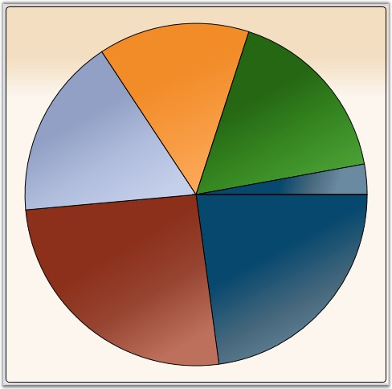
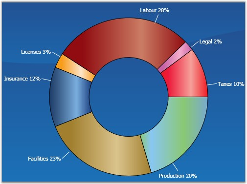

::: {style="DISPLAY: none"}
{#d2h_url_template}{#d2h_package_url style="WIDTH: 0px; DISPLAY: none; HEIGHT: 0px"}
:::

::::::::: {.d2h_secondary_topic style="PADDING-BOTTOM: 10pt; MARGIN: 0pt; PADDING-LEFT: 0pt; PADDING-RIGHT: 0pt; PADDING-TOP: 0pt"}
##### Pie Charts {#pie-charts style="tab-stops: 0pt"}

###### []{#p113}4.1.1.4.8.1 Pie Chart {#pie-chart style="tab-stops: 0pt"}

A Pie Chart renders Y values as slices in a pie. These slices are rendered in proportion to the whole which is simply the sum of all the Y values in the series. Consequently, Pie Charts are used to visualize the proportional contribution (in terms of percentage or fraction) of categories of data to the whole data set. The X values in the data series will only be treated as nominal (categorical, qualitative) data. The Pie Chart can display only one DataSeries at a time.

[]{style="FONT-FAMILY: 'Verdana','sans-serif'; FONT-SIZE: 8pt"} 

{border="0"}

Figure 154: Pie Chart

[]{style="FONT-FAMILY: 'Trebuchet MS','sans-serif'; COLOR: #15428b; FONT-SIZE: 9pt"} 

Data Requirements

[]{style="FONT-FAMILY: 'Trebuchet MS','sans-serif'; COLOR: #15428b; FONT-SIZE: 9pt"} 

Table 112: Data Requirement

::: {align="center"}
+------------------------------+-------------+
| Details                                    |
+------------------------------+-------------+
| Number of y values per point | one         |
+------------------------------+-------------+
| Number of points             | one or more |
+------------------------------+-------------+
| Number of series             | one or more |
+------------------------------+-------------+
:::

[]{style="FONT-FAMILY: 'Trebuchet MS','sans-serif'; COLOR: #15428b; FONT-SIZE: 9pt"} 

Pie Type Properties

[]{style="FONT-FAMILY: 'Trebuchet MS','sans-serif'; COLOR: #15428b; FONT-SIZE: 9pt"} 

Table 113: Pie Type Properties

::: {align="center"}
  ---------------------------- -------- ----------- --------------------------------------------
  Name                         Type     Container   Description
  ChartPieType.ExplodedIndex   double   ChartArea   index of segment which should be leant out
  ---------------------------- -------- ----------- --------------------------------------------
:::

[]{style="FONT-FAMILY: 'Trebuchet MS','sans-serif'; COLOR: #15428b; FONT-SIZE: 9pt"} 

Template

While setting template, the following parameters can be used.

[]{style="FONT-FAMILY: 'Trebuchet MS','sans-serif'; COLOR: #15428b; FONT-SIZE: 9pt"} 

Table 114: Template Parameter

::: {align="center"}
+-----------------------+-----------------------+-------------------------------------------------------------------+
| Name                  | Type                  | Description                                                       |
+-----------------------+-----------------------+-------------------------------------------------------------------+
| TickX                 | double                | x-coordinate of sector center                                     |
+-----------------------+-----------------------+-------------------------------------------------------------------+
| TickY                 | double                | y-coordinate of sector center                                     |
+-----------------------+-----------------------+-------------------------------------------------------------------+
| IsExploded            | double                | *true -* if segment is leant out                                  |
+-----------------------+-----------------------+-------------------------------------------------------------------+
| ExplodRadius          | double                | radius to which the segment should be leant out                   |
+-----------------------+-----------------------+-------------------------------------------------------------------+
| Geometry              | Geometry              | segment geometry                                                  |
+-----------------------+-----------------------+-------------------------------------------------------------------+
| Interior              | Brush                 | column color                                                      |
+-----------------------+-----------------------+-------------------------------------------------------------------+
| Series                | ChartSeries           | reference to series-owner                                         |
+-----------------------+-----------------------+-------------------------------------------------------------------+
| AngleOfSliceRotation  | double                | specifies the angle (in radians) at which the segment is rendered |
|                       |                       |                                                                   |
|                       |                       | It is useful for creating animated templates.                     |
+-----------------------+-----------------------+-------------------------------------------------------------------+
| StartAngle            | double                | specifies the angle (in radians) of one side of the pie           |
+-----------------------+-----------------------+-------------------------------------------------------------------+
| EndAngle              | double                | specifies the angle (in radians) of the other side of the pie     |
+-----------------------+-----------------------+-------------------------------------------------------------------+
:::

[]{style="COLOR: red; FONT-SIZE: 8pt"} 

A sample which demonstrates Pie Chart Types is available in the following sample installation path.

**** 

***..My Documents\\Syncfusion\\EssentialStudio\\\<Version Number\>\\WPF\\Chart.WPF\\Samples\\3.5\\WindowsSamples\\Chart Gallery\\Pie Chart Demo***

 

See Also

[[Chart Types]{.UGHyperlink}](ms-xhelp:///?Id=b53fb06f-e786-4792-8c6c-a9753ff091ca)[, ]{style="FONT-FAMILY: 'Trebuchet MS','sans-serif'; COLOR: #15428b; FONT-SIZE: 9pt"}[[ChartSegment Labels]{.UGHyperlink}](ms-xhelp:///?Id=e2a90a92-24f8-401c-91df-8ecbf132b958)[]{style="FONT-FAMILY: 'Trebuchet MS','sans-serif'; COLOR: #15428b; FONT-SIZE: 9pt"}

 

[]{#p114} 

###### 4.1.1.4.8.2 Doughnut Chart {#doughnut-chart style="tab-stops: 0pt"}

Doughnut charts are pie charts with a hole, whose value is specified as the doughnut coefficient. The Doughnut Chart is best suited for presenting data in proportions.

 

{border="0"}

Figure 155: Doughnut Chart

[]{style="FONT-FAMILY: 'Trebuchet MS','sans-serif'; COLOR: #15428b; FONT-SIZE: 9pt"} 

Data Requirements

[]{style="FONT-FAMILY: 'Trebuchet MS','sans-serif'; COLOR: #15428b; FONT-SIZE: 9pt"} 

Table 115: Data Requirement

::: {align="center"}
+------------------------------+-------------+
| Details                                    |
+------------------------------+-------------+
| Number of y values per point | one         |
+------------------------------+-------------+
| Number of points             | one or more |
+------------------------------+-------------+
| Number of series             | one or more |
+------------------------------+-------------+
:::

**[]{style="FONT-FAMILY: 'Trebuchet MS','sans-serif'; COLOR: #15428b"}** 

Doughnut Type Properties

[]{style="FONT-FAMILY: 'Trebuchet MS','sans-serif'; COLOR: #15428b; FONT-SIZE: 9pt"} 

Table 116: Doughnut Type Properties

::: {align="center"}
  --------------------------------------- -------- ------------- -------------------------------------------------------------
  Name                                    Type     Container     Description
  ChartDoughnutType.ExplodedIndex         int      ChartSeries   index of segment which should be leant out
  ChartDoughnutType.DoughnutCoefficient   double   ChartSeries   number which shows relation of inner radius to outer radius
  --------------------------------------- -------- ------------- -------------------------------------------------------------
:::

[]{style="FONT-FAMILY: 'Trebuchet MS','sans-serif'; COLOR: #15428b; FONT-SIZE: 9pt"} 

Template

While setting template the following parameters can be used:

[]{style="FONT-FAMILY: 'Trebuchet MS','sans-serif'; COLOR: #15428b"} 

Table 117: Template Parameters

::: {align="center"}
  --------------------- ------------- ------------------------------------------------------
  Name                  Type          Description
  TickX                 double        x-coordinate of sector center
  TickY                 double        y-coordinate of sector center
  IsExploded            double        *true -* if segment is leant out
  DoughnutCoefficient   double        number which shows relation of inner radius to outer
  ExplodRadius          double        radius to which the segment should be leant out
  Geometry              Geometry      segment geometry
  Interior              Brush         column color
  Series                ChartSeries   reference to series-owner
  --------------------- ------------- ------------------------------------------------------
:::

[]{style="FONT-FAMILY: 'Trebuchet MS','sans-serif'; COLOR: #15428b; FONT-SIZE: 9pt"} 

A sample which demonstrates Pie Chart Types is available in the following sample installation path.

**** 

***..My Documents\\Syncfusion\\EssentialStudio\\\<Version Number\>\\WPF\\Chart.WPF\\Samples\\3.5\\WindowsSamples\\Chart Gallery\\Pie Chart Demo***

 

See Also

[[Chart Types]{.UGHyperlink}](ms-xhelp:///?Id=d8d54a6a-7167-4d2a-8638-6f8755b33844)[, ]{style="FONT-FAMILY: 'Trebuchet MS','sans-serif'; COLOR: #15428b; FONT-SIZE: 9pt"}[[ChartSegment Labels]{.UGHyperlink}](ms-xhelp:///?Id=6b787e40-d6b7-4521-ad55-8091ed16787f)[]{style="FONT-FAMILY: 'Trebuchet MS','sans-serif'; COLOR: #15428b; FONT-SIZE: 9pt"}

[]{#p115} 

 

[]{#related-topics}
:::::::::
