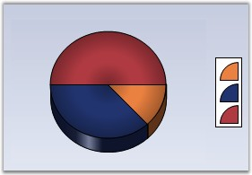
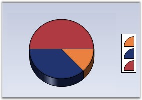

::: {style="DISPLAY: none"}
{#d2h_url_template}{#d2h_package_url style="WIDTH: 0px; DISPLAY: none; HEIGHT: 0px"}
:::

:::: {.d2h_secondary_topic style="PADDING-BOTTOM: 10pt; MARGIN: 0pt; PADDING-LEFT: 0pt; PADDING-RIGHT: 0pt; PADDING-TOP: 0pt"}
#### PieType {#pietype style="tab-stops: 0pt"}

 

Sets pre-defined types for pie charts.

 

::: {align="center"}
+-------------------------------------+-----------------------------------------------------------------------------+
| Details                                                                                                           |
+-------------------------------------+-----------------------------------------------------------------------------+
| **Possible Values**                 | [·      ]{style="FONT-FAMILY: Symbol"}None - It has no specific type.       |
|                                     |                                                                             |
|                                     | [·      ]{style="FONT-FAMILY: Symbol"}OutSide - Specifies outside pie type. |
|                                     |                                                                             |
|                                     | [·      ]{style="FONT-FAMILY: Symbol"}InSide - Specifies inside pie type.   |
|                                     |                                                                             |
|                                     | [·      ]{style="FONT-FAMILY: Symbol"}Round - Specifies Round pie type.     |
|                                     |                                                                             |
|                                     | [·      ]{style="FONT-FAMILY: Symbol"}Bevel - Specifies Bevel pie type.     |
|                                     |                                                                             |
|                                     | [·      ]{style="FONT-FAMILY: Symbol"}Custom - Specifies custom pie type.   |
+-------------------------------------+-----------------------------------------------------------------------------+
| **Default Value    **               | **None**                                                                    |
+-------------------------------------+-----------------------------------------------------------------------------+
| **2D / 3D Limitations**             | No                                                                          |
+-------------------------------------+-----------------------------------------------------------------------------+
| **Applies to Chart Element**        | Any Pie Series                                                              |
+-------------------------------------+-----------------------------------------------------------------------------+
| **Applies to Chart Types**          | PieChart                                                                    |
+-------------------------------------+-----------------------------------------------------------------------------+
:::

 

+------------------------------------------------------------------------------------------------------------------------------------------------------------------------------------------------+
| **[\[C#\]]{style="FONT-FAMILY: 'Courier New'; COLOR: black"}**                                                                                                                                 |
|                                                                                                                                                                                                |
| **[]{style="FONT-FAMILY: 'Courier New'; COLOR: black"}**                                                                                                                                       |
|                                                                                                                                                                                                |
| [this]{style="FONT-FAMILY: 'Courier New'; COLOR: blue"}[.chartControl1.Series\[0\].ConfigItems.PieItem.PieType=[ChartPieType]{style="COLOR: teal"}.Bevel;]{style="FONT-FAMILY: 'Courier New'"} |
+------------------------------------------------------------------------------------------------------------------------------------------------------------------------------------------------+

 

+---------------------------------------------------------------------------------------------------------------------------------------------------------------------------------------------+
| **[\[VB.NET\]]{style="FONT-FAMILY: 'Courier New'; COLOR: black"}**                                                                                                                          |
|                                                                                                                                                                                             |
| **[]{style="FONT-FAMILY: 'Courier New'; COLOR: black"}**                                                                                                                                    |
|                                                                                                                                                                                             |
| [Me]{style="FONT-FAMILY: 'Courier New'; COLOR: blue"}[.chartControl1.Series(0).ConfigItems.PieItem.PieType = [ChartPieType]{style="COLOR: teal"}.Bevel]{style="FONT-FAMILY: 'Courier New'"} |
+---------------------------------------------------------------------------------------------------------------------------------------------------------------------------------------------+

 

The following screen shots depict these types.

 

{border="0"}

 

Figure 171: Pie Chart

 

{border="0"}

 

Figure 172: Pie Bevel Chart

 

{border="0"}

**                        **

Figure 173: Pie Inside Chart

 

{border="0"}

 

Figure 174: Pie Outside Chart

 

{border="0"}

 

Figure 175: Pie Round Chart

 

See Also

 

[PieChart]{.UGHyperlink}[]{.UGHyperlink}

 

[]{#p129} 

 

[]{#related-topics}
::::
