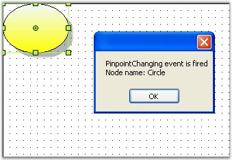
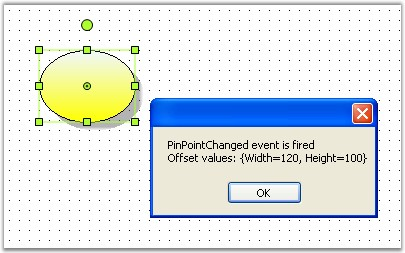

::: {style="DISPLAY: none"}
{#d2h_url_template}{#d2h_package_url style="WIDTH: 0px; DISPLAY: none; HEIGHT: 0px"}
:::

::::: {.d2h_secondary_topic style="PADDING-BOTTOM: 10pt; MARGIN: 0pt; PADDING-LEFT: 0pt; PADDING-RIGHT: 0pt; PADDING-TOP: 0pt"}
#### PinPoint Events {#pinpoint-events style="tab-stops: 0pt"}

 When changing the node\'s location,the pinpoint of the node will be  reset. The below table contains pinpoint events and descriptions.

[]{style="FONT-FAMILY: 'Trebuchet MS','sans-serif'; COLOR: #15428b; FONT-SIZE: 9pt"} 

[]{style="FONT-FAMILY: 'Trebuchet MS','sans-serif'; COLOR: #15428b; FONT-SIZE: 9pt"} 

::: {align="center"}
  ------------------- -------------------------------------------------------
  DocumentEventSink   Description
  PinOffsetChanged    Triggered after the offset of the pinpoint is reset.
  PinOffsetChanging   Triggered when the offset of the pinpoint is changed.
  PinPointChanged     Triggered after the pinpoint is repositioned.
  PinPointChanging    Triggered when the pinpoint is moved.
  ------------------- -------------------------------------------------------
:::

[]{style="FONT-FAMILY: 'Trebuchet MS','sans-serif'; COLOR: #15428b; FONT-SIZE: 9pt"} 

Data can be retrieved or set using the following members.

[]{style="FONT-FAMILY: 'Trebuchet MS','sans-serif'; COLOR: #15428b; FONT-SIZE: 9pt"} 

::: {align="center"}
  -------------------------------------------- ----------------------------------------------------------
  PinPoint / PinPointOffset EventArgs Member   Description
  Cancel                                       Cancels the PinPoint Changing events.
  NodeAffected                                 Returns the node\'s name by which the node was affected.
  Offset                                       Returns the X and Y values.
  -------------------------------------------- ----------------------------------------------------------
:::

[]{style="FONT-FAMILY: 'Trebuchet MS','sans-serif'; COLOR: #15428b; FONT-SIZE: 9pt"} 

Programmatically the events are written as follows:

[]{style="FONT-FAMILY: 'Trebuchet MS','sans-serif'; COLOR: #15428b; FONT-SIZE: 9pt"} 

+----------------------------------------------------------------------------------------------------------------------------------------------------------------------------------------------------------------------------------------------------------------------+
| **[\[C#\]]{style="FONT-FAMILY: 'Courier New'; COLOR: black"}**                                                                                                                                                                                                       |
|                                                                                                                                                                                                                                                                      |
| []{style="FONT-FAMILY: 'Courier New'"}                                                                                                                                                                                                                               |
|                                                                                                                                                                                                                                                                      |
| [public]{style="FONT-FAMILY: 'Courier New'; COLOR: blue"}[ [void]{style="COLOR: blue"} Form1_Load([object]{style="COLOR: blue"} sender, [EventArgs]{style="COLOR: teal"} e)]{style="FONT-FAMILY: 'Courier New'"}                                                     |
|                                                                                                                                                                                                                                                                      |
| [{]{style="FONT-FAMILY: 'Courier New'"}                                                                                                                                                                                                                              |
|                                                                                                                                                                                                                                                                      |
| []{style="FONT-FAMILY: 'Courier New'"}                                                                                                                                                                                                                               |
|                                                                                                                                                                                                                                                                      |
| [    ((DocumentEventSink)model4.EventSink).PinOffsetChanged += [new]{style="COLOR: blue"} PinOffsetChangedEventHandler(Form1_PinOffsetChanged);]{style="FONT-FAMILY: 'Courier New'"}                                                                                 |
|                                                                                                                                                                                                                                                                      |
| [    ((DocumentEventSink)model4.EventSink).PinOffsetChanging += [new]{style="COLOR: blue"} PinOffsetChangingEventHandler(Form1_PinOffsetChanging);]{style="FONT-FAMILY: 'Courier New'"}                                                                              |
|                                                                                                                                                                                                                                                                      |
| [    ((DocumentEventSink)model4.EventSink).PinPointChanged += [new]{style="COLOR: blue"} PinPointChangedEventHandler(Form1_PinPointChanged);]{style="FONT-FAMILY: 'Courier New'"}                                                                                    |
|                                                                                                                                                                                                                                                                      |
| [    ((DocumentEventSink)model4.EventSink).PinPointChanging += [new]{style="COLOR: blue"} PinPointChangingEventHandler(Form1_PinPointChanging);]{style="FONT-FAMILY: 'Courier New'"}                                                                                 |
|                                                                                                                                                                                                                                                                      |
| []{style="FONT-FAMILY: 'Courier New'"}                                                                                                                                                                                                                               |
|                                                                                                                                                                                                                                                                      |
| [    [// Circle]{style="COLOR: green"}]{style="FONT-FAMILY: 'Courier New'"}                                                                                                                                                                                          |
|                                                                                                                                                                                                                                                                      |
| [    Syncfusion.Windows.Forms.Diagram.Ellipse circle = [new]{style="COLOR: blue"} Syncfusion.Windows.Forms.Diagram.Ellipse(0, 0, 96, 72);]{style="FONT-FAMILY: 'Courier New'"}                                                                                       |
|                                                                                                                                                                                                                                                                      |
| [    circle.Name = [\"Circle\"]{style="COLOR: maroon"};]{style="FONT-FAMILY: 'Courier New'"}                                                                                                                                                                         |
|                                                                                                                                                                                                                                                                      |
| [    circle.FillStyle.Type = FillStyleType.LinearGradient;]{style="FONT-FAMILY: 'Courier New'"}                                                                                                                                                                      |
|                                                                                                                                                                                                                                                                      |
| [    circle.FillStyle.ForeColor = [Color]{style="COLOR: teal"}.AliceBlue;]{style="FONT-FAMILY: 'Courier New'"}                                                                                                                                                       |
|                                                                                                                                                                                                                                                                      |
| [    circle.ShadowStyle.Visible = [true]{style="COLOR: blue"};]{style="FONT-FAMILY: 'Courier New'"}                                                                                                                                                                  |
|                                                                                                                                                                                                                                                                      |
| [    model4.AppendChild(circle);]{style="FONT-FAMILY: 'Courier New'"}                                                                                                                                                                                                |
|                                                                                                                                                                                                                                                                      |
| [}]{style="FONT-FAMILY: 'Courier New'"}                                                                                                                                                                                                                              |
|                                                                                                                                                                                                                                                                      |
| []{style="FONT-FAMILY: 'Courier New'"}                                                                                                                                                                                                                               |
|                                                                                                                                                                                                                                                                      |
| [void]{style="FONT-FAMILY: 'Courier New'; COLOR: blue"}[ Form1_PinPointChanging(PinPointChangingEventArgs evtArgs)]{style="FONT-FAMILY: 'Courier New'"}                                                                                                              |
|                                                                                                                                                                                                                                                                      |
| [{]{style="FONT-FAMILY: 'Courier New'"}                                                                                                                                                                                                                              |
|                                                                                                                                                                                                                                                                      |
| [    [MessageBox]{style="COLOR: teal"}.Show([\"PinpointChanging event is fired\"]{style="COLOR: maroon"} + [\"\\n\"]{style="COLOR: maroon"} + [\"Node name: \"]{style="COLOR: maroon"} + evtArgs.NodeAffected.Name.ToString());]{style="FONT-FAMILY: 'Courier New'"} |
|                                                                                                                                                                                                                                                                      |
| [}]{style="FONT-FAMILY: 'Courier New'"}                                                                                                                                                                                                                              |
|                                                                                                                                                                                                                                                                      |
| []{style="FONT-FAMILY: 'Courier New'"}                                                                                                                                                                                                                               |
|                                                                                                                                                                                                                                                                      |
| [void]{style="FONT-FAMILY: 'Courier New'; COLOR: blue"}[ Form1_PinPointChanged(PinPointChangedEventArgs evtArgs)]{style="FONT-FAMILY: 'Courier New'"}                                                                                                                |
|                                                                                                                                                                                                                                                                      |
| [{]{style="FONT-FAMILY: 'Courier New'"}                                                                                                                                                                                                                              |
|                                                                                                                                                                                                                                                                      |
| [    [MessageBox]{style="COLOR: teal"}.Show([\"PinPointChanged event is fired\"]{style="COLOR: maroon"} + [\"\\n\"]{style="COLOR: maroon"} + [\"Offset values: \"]{style="COLOR: maroon"} + evtArgs.Offset.ToString());]{style="FONT-FAMILY: 'Courier New'"}         |
|                                                                                                                                                                                                                                                                      |
| [}]{style="FONT-FAMILY: 'Courier New'"}                                                                                                                                                                                                                              |
|                                                                                                                                                                                                                                                                      |
| []{style="FONT-FAMILY: 'Courier New'"}                                                                                                                                                                                                                               |
|                                                                                                                                                                                                                                                                      |
| [void]{style="FONT-FAMILY: 'Courier New'; COLOR: blue"}[ Form1_PinOffsetChanging(PinOffsetChangingEventArgs evtArgs)]{style="FONT-FAMILY: 'Courier New'"}                                                                                                            |
|                                                                                                                                                                                                                                                                      |
| [{]{style="FONT-FAMILY: 'Courier New'"}                                                                                                                                                                                                                              |
|                                                                                                                                                                                                                                                                      |
| [    [MessageBox]{style="COLOR: teal"}.Show([\"PinOffsetChanging event is fired\"]{style="COLOR: maroon"} + [\"\\n\"]{style="COLOR: maroon"} + [\"Node name: \"]{style="COLOR: maroon"} + evtArgs.NodeAffected.Name);]{style="FONT-FAMILY: 'Courier New'"}           |
|                                                                                                                                                                                                                                                                      |
| [}]{style="FONT-FAMILY: 'Courier New'"}                                                                                                                                                                                                                              |
|                                                                                                                                                                                                                                                                      |
| []{style="FONT-FAMILY: 'Courier New'"}                                                                                                                                                                                                                               |
|                                                                                                                                                                                                                                                                      |
| [void]{style="FONT-FAMILY: 'Courier New'; COLOR: blue"}[ Form1_PinOffsetChanged(PinOffsetChangedEventArgs evtArgs)]{style="FONT-FAMILY: 'Courier New'"}                                                                                                              |
|                                                                                                                                                                                                                                                                      |
| [{]{style="FONT-FAMILY: 'Courier New'"}                                                                                                                                                                                                                              |
|                                                                                                                                                                                                                                                                      |
| [    [MessageBox]{style="COLOR: teal"}.Show([\"PinOffsetChanged event is fired\"]{style="COLOR: maroon"} + [\"\\n\"]{style="COLOR: maroon"} + [\"Offset values: \"]{style="COLOR: maroon"} + evtArgs.Offset.ToString());]{style="FONT-FAMILY: 'Courier New'"}        |
|                                                                                                                                                                                                                                                                      |
| [}]{style="FONT-FAMILY: 'Courier New'"}                                                                                                                                                                                                                              |
+----------------------------------------------------------------------------------------------------------------------------------------------------------------------------------------------------------------------------------------------------------------------+

[]{style="FONT-FAMILY: 'Courier New'"} 

+--------------------------------------------------------------------------------------------------------------------------------------------------------------------------------------------------------------------------------------------------------------------------------------------------------+
| **[\[VB\]]{style="FONT-FAMILY: 'Courier New'; COLOR: black"}**                                                                                                                                                                                                                                         |
|                                                                                                                                                                                                                                                                                                        |
| []{style="FONT-FAMILY: 'Courier New'; COLOR: blue"}                                                                                                                                                                                                                                                    |
|                                                                                                                                                                                                                                                                                                        |
| [Public]{style="FONT-FAMILY: 'Courier New'; COLOR: blue"}[ [Sub]{style="COLOR: blue"} Form1_Load([ByVal]{style="COLOR: blue"} sender [As]{style="COLOR: blue"} [Object]{style="COLOR: blue"}, [ByVal]{style="COLOR: blue"} e [As]{style="COLOR: blue"} EventArgs)]{style="FONT-FAMILY: 'Courier New'"} |
|                                                                                                                                                                                                                                                                                                        |
| []{style="FONT-FAMILY: 'Courier New'"}                                                                                                                                                                                                                                                                 |
|                                                                                                                                                                                                                                                                                                        |
| [    [AddHandler]{style="COLOR: blue"} [DirectCast]{style="COLOR: blue"}(model4.EventSink, DocumentEventSink).PinOffsetChanged, [AddressOf]{style="COLOR: blue"} Form1_PinOffsetChanged]{style="FONT-FAMILY: 'Courier New'"}                                                                           |
|                                                                                                                                                                                                                                                                                                        |
| [    [AddHandler]{style="COLOR: blue"} [DirectCast]{style="COLOR: blue"}(model4.EventSink, DocumentEventSink).PinOffsetChanging, [AddressOf]{style="COLOR: blue"} Form1_PinOffsetChanging]{style="FONT-FAMILY: 'Courier New'"}                                                                         |
|                                                                                                                                                                                                                                                                                                        |
| [    [AddHandler]{style="COLOR: blue"} [DirectCast]{style="COLOR: blue"}(model4.EventSink, DocumentEventSink).PinPointChanged, [AddressOf]{style="COLOR: blue"} Form1_PinPointChanged]{style="FONT-FAMILY: 'Courier New'"}                                                                             |
|                                                                                                                                                                                                                                                                                                        |
| [    [AddHandler]{style="COLOR: blue"} [DirectCast]{style="COLOR: blue"}(model4.EventSink, DocumentEventSink).PinPointChanging, [AddressOf]{style="COLOR: blue"} Form1_PinPointChanging]{style="FONT-FAMILY: 'Courier New'"}                                                                           |
|                                                                                                                                                                                                                                                                                                        |
| []{style="FONT-FAMILY: 'Courier New'"}                                                                                                                                                                                                                                                                 |
|                                                                                                                                                                                                                                                                                                        |
| [    [\' Circle]{style="COLOR: green"}]{style="FONT-FAMILY: 'Courier New'"}                                                                                                                                                                                                                            |
|                                                                                                                                                                                                                                                                                                        |
| [    [Dim]{style="COLOR: blue"} circle [As]{style="COLOR: blue"} [New]{style="COLOR: blue"} Syncfusion.Windows.Forms.Diagram.Ellipse(0, 0, 96, 72)]{style="FONT-FAMILY: 'Courier New'"}                                                                                                                |
|                                                                                                                                                                                                                                                                                                        |
| [    circle.Name = [\"Circle\"]{style="COLOR: maroon"}]{style="FONT-FAMILY: 'Courier New'"}                                                                                                                                                                                                            |
|                                                                                                                                                                                                                                                                                                        |
| [    circle.FillStyle.Type = FillStyleType.LinearGradient]{style="FONT-FAMILY: 'Courier New'"}                                                                                                                                                                                                         |
|                                                                                                                                                                                                                                                                                                        |
| [    circle.FillStyle.ForeColor = Color.AliceBlue]{style="FONT-FAMILY: 'Courier New'"}                                                                                                                                                                                                                 |
|                                                                                                                                                                                                                                                                                                        |
| [    circle.ShadowStyle.Visible = [True]{style="COLOR: blue"}]{style="FONT-FAMILY: 'Courier New'"}                                                                                                                                                                                                     |
|                                                                                                                                                                                                                                                                                                        |
| [    model4.AppendChild(circle)]{style="FONT-FAMILY: 'Courier New'"}                                                                                                                                                                                                                                   |
|                                                                                                                                                                                                                                                                                                        |
| [End]{style="FONT-FAMILY: 'Courier New'; COLOR: blue"}[ [Sub]{style="COLOR: blue"}]{style="FONT-FAMILY: 'Courier New'"}                                                                                                                                                                                |
|                                                                                                                                                                                                                                                                                                        |
| []{style="FONT-FAMILY: 'Courier New'; COLOR: blue"}                                                                                                                                                                                                                                                    |
|                                                                                                                                                                                                                                                                                                        |
| [Private]{style="FONT-FAMILY: 'Courier New'; COLOR: blue"}[ [Sub]{style="COLOR: blue"} Form1_PinPointChanging([ByVal]{style="COLOR: blue"} evtArgs [As]{style="COLOR: blue"} PinPointChangingEventArgs)]{style="FONT-FAMILY: 'Courier New'"}                                                           |
|                                                                                                                                                                                                                                                                                                        |
| [    MessageBox.Show(([\"PinpointChanging event is fired\"]{style="COLOR: maroon"} & vbLf & [\"Node name: \"]{style="COLOR: maroon"}) + evtArgs.NodeAffected.Name.ToString())]{style="FONT-FAMILY: 'Courier New'"}                                                                                     |
|                                                                                                                                                                                                                                                                                                        |
| [End]{style="FONT-FAMILY: 'Courier New'; COLOR: blue"}[ [Sub]{style="COLOR: blue"}]{style="FONT-FAMILY: 'Courier New'"}                                                                                                                                                                                |
|                                                                                                                                                                                                                                                                                                        |
| []{style="FONT-FAMILY: 'Courier New'; COLOR: blue"}                                                                                                                                                                                                                                                    |
|                                                                                                                                                                                                                                                                                                        |
| [Private]{style="FONT-FAMILY: 'Courier New'; COLOR: blue"}[ [Sub]{style="COLOR: blue"} Form1_PinPointChanged([ByVal]{style="COLOR: blue"} evtArgs [As]{style="COLOR: blue"} PinPointChangedEventArgs)]{style="FONT-FAMILY: 'Courier New'"}                                                             |
|                                                                                                                                                                                                                                                                                                        |
| [    MessageBox.Show(([\"PinPointChanged event is fired\"]{style="COLOR: maroon"} & vbLf & [\"Offset values: \"]{style="COLOR: maroon"}) + evtArgs.Offset.ToString())]{style="FONT-FAMILY: 'Courier New'"}                                                                                             |
|                                                                                                                                                                                                                                                                                                        |
| [End]{style="FONT-FAMILY: 'Courier New'; COLOR: blue"}[ [Sub]{style="COLOR: blue"}]{style="FONT-FAMILY: 'Courier New'"}                                                                                                                                                                                |
|                                                                                                                                                                                                                                                                                                        |
| []{style="FONT-FAMILY: 'Courier New'; COLOR: blue"}                                                                                                                                                                                                                                                    |
|                                                                                                                                                                                                                                                                                                        |
| [Private]{style="FONT-FAMILY: 'Courier New'; COLOR: blue"}[ [Sub]{style="COLOR: blue"} Form1_PinOffsetChanging([ByVal]{style="COLOR: blue"} evtArgs [As]{style="COLOR: blue"} PinOffsetChangingEventArgs)]{style="FONT-FAMILY: 'Courier New'"}                                                         |
|                                                                                                                                                                                                                                                                                                        |
| [    MessageBox.Show(([\"PinOffsetChanging event is fired\"]{style="COLOR: maroon"} & vbLf & [\"Node name: \"]{style="COLOR: maroon"}) + evtArgs.NodeAffected.Name)]{style="FONT-FAMILY: 'Courier New'"}                                                                                               |
|                                                                                                                                                                                                                                                                                                        |
| [End]{style="FONT-FAMILY: 'Courier New'; COLOR: blue"}[ [Sub]{style="COLOR: blue"}]{style="FONT-FAMILY: 'Courier New'"}                                                                                                                                                                                |
|                                                                                                                                                                                                                                                                                                        |
| []{style="FONT-FAMILY: 'Courier New'; COLOR: blue"}                                                                                                                                                                                                                                                    |
|                                                                                                                                                                                                                                                                                                        |
| [Private]{style="FONT-FAMILY: 'Courier New'; COLOR: blue"}[ [Sub]{style="COLOR: blue"} Form1_PinOffsetChanged([ByVal]{style="COLOR: blue"} evtArgs [As]{style="COLOR: blue"} PinOffsetChangedEventArgs)]{style="FONT-FAMILY: 'Courier New'"}                                                           |
|                                                                                                                                                                                                                                                                                                        |
| [    MessageBox.Show(([\"PinOffsetChanged event is fired\"]{style="COLOR: maroon"} & vbLf & [\"Offset values: \"]{style="COLOR: maroon"}) + evtArgs.Offset.ToString())]{style="FONT-FAMILY: 'Courier New'"}                                                                                            |
|                                                                                                                                                                                                                                                                                                        |
| [End]{style="FONT-FAMILY: 'Courier New'; COLOR: blue"}[ [Sub]{style="COLOR: blue"}]{style="FONT-FAMILY: 'Courier New'"}                                                                                                                                                                                |
+--------------------------------------------------------------------------------------------------------------------------------------------------------------------------------------------------------------------------------------------------------------------------------------------------------+

[]{style="FONT-FAMILY: 'Trebuchet MS','sans-serif'; COLOR: #15428b; FONT-SIZE: 9pt"} 

Sample diagram is as follows:

**[]{style="FONT-FAMILY: 'Trebuchet MS','sans-serif'; COLOR: #15428b; FONT-SIZE: 9pt"}** 

{border="0"}

[]{style="FONT-FAMILY: 'Trebuchet MS','sans-serif'; COLOR: #15428b; FONT-SIZE: 9pt"} 

Figure 56: PinPointChanging Event

**[]{style="FONT-FAMILY: 'Trebuchet MS','sans-serif'; COLOR: #15428b; FONT-SIZE: 9pt"}** 

{border="0"}

[]{style="FONT-FAMILY: 'Trebuchet MS','sans-serif'; COLOR: #15428b; FONT-SIZE: 9pt"} 

Figure 57: PinPointChanged Event

 

[]{#p54}**[]{style="FONT-FAMILY: 'Trebuchet MS','sans-serif'; COLOR: #15428b; FONT-SIZE: 14pt"}** 

[]{#related-topics}
:::::
