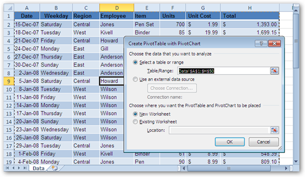
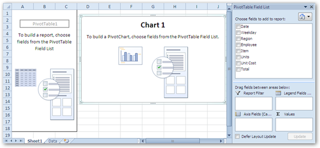
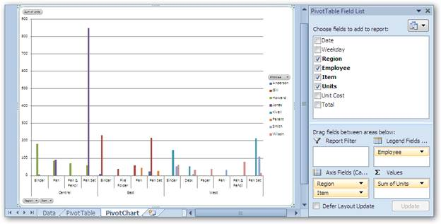

::: {style="DISPLAY: none"}
{#d2h_url_template}{#d2h_package_url style="WIDTH: 0px; DISPLAY: none; HEIGHT: 0px"}
:::

::::: {#nsbanner .d2h_main_nsbanner style="BORDER-BOTTOM: #999999 1px solid; POSITION: relative; PADDING-BOTTOM: 0px; BACKGROUND-COLOR: transparent; PADDING-LEFT: 0px; PADDING-RIGHT: 0px; DISPLAY: none; BORDER-TOP: #999999 1px solid; PADDING-TOP: 0px; LEFT: 0px"}
:::: {#TitleRow .d2h_main_titlerow style="PADDING-BOTTOM: 4px; BACKGROUND-COLOR: transparent; PADDING-LEFT: 22px; WIDTH: 100%; PADDING-RIGHT: 10px; DISPLAY: none; PADDING-TOP: 4px"}
::: {#ienav .d2h_main_ienav style="DISPLAY: none"}
{#D2HPrevious .D2HPreviousEnabled}  {#D2HNext .D2HNextEnabled}
:::
::::
:::::

:::::::: {#nstext .d2h_main_nstext style="PADDING-BOTTOM: 10px; BACKGROUND-COLOR: transparent; PADDING-LEFT: 22px; PADDING-RIGHT: 10px; HEIGHT: 100%; OVERFLOW: auto; PADDING-TOP: 5px" hasuserbackground="true" valign="bottom"}
::: {#d2h_breadcrumbs .d2h_breadcrumbs}
[Essential Studio User Guide Documentation](ms-xhelp:///?Id=12457748-09e3-4d74-a240-8e049cedf030){.d2h_breadcrumbsNormal}[ \> ]{.d2h_breadcrumbsLinkSeparator}[Reporting Edition](ms-xhelp:///?Id=027aa5b6-6676-4f93-ad23-c20e8c45792e){.d2h_breadcrumbsNormal}[ \> ]{.d2h_breadcrumbsLinkSeparator}[Essential XlsIO](ms-xhelp:///?Id=b01a1b50-1d7d-40c0-bc83-af67e57c9005){.d2h_breadcrumbsNormal}[ \> ]{.d2h_breadcrumbsLinkSeparator}[Concepts and Features](ms-xhelp:///?Id=21b26556-5905-4ad9-90b4-40320db25faf){.d2h_breadcrumbsNormal}[ \> ]{.d2h_breadcrumbsLinkSeparator}[Insert](ms-xhelp:///?Id=3b5c8a38-7946-47f2-a4af-0711da3daaa8){.d2h_breadcrumbsNormal}
:::

### PivotCharts {#pivotcharts style="tab-stops: 0pt"}

PivotCharts are interactive graphical representations of the PivotTable data that allows rapid analysis of the displayed data. PivotTable is an Excel feature that helps in summarizing large volume of data such as stock market report, Cash flow report etc. A PivotTable can aggregate data instead of analyzing rows upon large volume of records and with a few clicks the PivotChart allows rapid, dynamic, and flexible data analysis. The following sections describe the creation of PivotTables and PivotCharts.

**[]{style="FONT-FAMILY: 'Trebuchet MS','sans-serif'; COLOR: #15428b"}** 

PivotTable Creation []{style="FONT-SIZE: 9pt"}

[]{style="FONT-FAMILY: 'Trebuchet MS','sans-serif'; COLOR: #15428b; FONT-SIZE: 9pt"} 

Kindly refer to the following topic for PivotTable creation:

[[Excel 2007]{.UGHyperlink}](ms-xhelp:///?Id=5cc1e03c-a07a-4771-9986-eb6c4578ef8f)[]{.UGHyperlink}

 

 

 

PivotChart Creation Using MS Excel 2010

In Microsoft Excel, the PivotChart can be created using the PivotChart Option from the Insert menu. Refer to Figure 96:PivotChart Creation.

{border="0"}

Figure 93: PivotChart Creation Dialog Box

 

By default, MS Excel selects the entire range. However, it is possible to modify the selected range if required. It also allows choosing the position of the PivotChart (New Worksheet is most commonly used to place the PivotChart).

 

{border="0"}

Figure 94: New Sheet to place the PivotTable and PivotChart

Once you select a field, the PivotTable and the PivotChart appear. PivotTable and PivotChart should be popoulated with data fields, which appear on the field list on the right. Fields can be dragged to the PivotTable grid, to one of the defined areas and also there is an option to move the created PivotChart to a separate sheet.

[]{style="FONT-FAMILY: 'Trebuchet MS','sans-serif'; COLOR: #15428b; FONT-SIZE: 9pt"} 

{border="0"}

Figure 95:Adding fields to the PivotChart

 

PivotChart Creation Using XlsIO

XlsIO provides support for the creation of PivotTables and PivotCharts by using simple code snippets. IPivotCache interface caches the data that need to be summarized when filtering. IPivotTable represents a PivotTable in object, and has properties that allow customizing it. IPivotTable interface returns the collection of PivotTables that are present in a worksheet. IPivotField represents the field in the PivotTable. This includes row, column and data field axes. IPivotDataFields get a collection of the data field and once the PivotTable is created, it is required to create a PivotChart by setting the PivotSource property of the IChart interface, which references the created PivotTable.

 

::: {style="BORDER-BOTTOM: windowtext 1pt solid; BORDER-LEFT: medium none; PADDING-BOTTOM: 1pt; MARGIN-TOP: 9pt; PADDING-LEFT: 0pt; PADDING-RIGHT: 0pt; MARGIN-BOTTOM: 9pt; BORDER-TOP: windowtext 1pt solid; BORDER-RIGHT: medium none; PADDING-TOP: 1pt"}
Note: PivotTable and PivotChart are currently not supported for .xls format.
:::

The following code example illustrates the creation of a PivotTable and PivotChart by using XlsIO.

+-------------------------------------------------------------------------------------------------------------------------------------------------------------------------+
| [\[C#\]]{style="FONT-FAMILY: 'Courier New'"}                                                                                                                            |
|                                                                                                                                                                         |
| []{style="FONT-FAMILY: 'Courier New'"}                                                                                                                                  |
|                                                                                                                                                                         |
| [// Insert the Pivotchart sheet to the workbook.]{style="FONT-FAMILY: 'Courier New'; COLOR: green"}                                                                     |
|                                                                                                                                                                         |
| [IChart]{style="FONT-FAMILY: 'Courier New'; COLOR: #2b91af"}[ pivotChartSheet = workbook.Charts.Add();]{style="FONT-FAMILY: 'Courier New'"}                             |
|                                                                                                                                                                         |
| []{style="FONT-FAMILY: 'Courier New'"}                                                                                                                                  |
|                                                                                                                                                                         |
| [// Set the PivotSource for the Chart.]{style="FONT-FAMILY: 'Courier New'; COLOR: green"}                                                                               |
|                                                                                                                                                                         |
| [pivotChartSheet.PivotSource = pivotTable;]{style="FONT-FAMILY: 'Courier New'"}                                                                                         |
|                                                                                                                                                                         |
| []{style="FONT-FAMILY: 'Courier New'"}                                                                                                                                  |
|                                                                                                                                                                         |
| [// Select the PivotChart type.]{style="FONT-FAMILY: 'Courier New'; COLOR: green"}                                                                                      |
|                                                                                                                                                                         |
| [pivotChartSheet.PivotChartType = [ExcelChartType]{style="COLOR: #2b91af"}.Column_Clustered;]{style="FONT-FAMILY: 'Courier New'"}[]{style="FONT-FAMILY: 'Courier New'"} |
|                                                                                                                                                                         |
| []{style="FONT-FAMILY: 'Courier New'; COLOR: black"}                                                                                                                    |
+-------------------------------------------------------------------------------------------------------------------------------------------------------------------------+

[]{style="COLOR: black"} 

+-----------------------------------------------------------------------------------------------------------------------------------------------------------------------+
| **[\[VB\]]{style="FONT-FAMILY: 'Courier New'"}**                                                                                                                      |
|                                                                                                                                                                       |
| []{style="FONT-FAMILY: 'Courier New'"}                                                                                                                                |
|                                                                                                                                                                       |
| [\'Insert the Pivotchart sheet to the workbook]{style="FONT-FAMILY: 'Courier New'; COLOR: green"}[]{style="FONT-FAMILY: 'Courier New'"}                               |
|                                                                                                                                                                       |
| [Dim]{style="FONT-FAMILY: 'Courier New'; COLOR: blue"}[ pivotChartSheet [As]{style="COLOR: blue"} IChart = workbook.Charts.Add()]{style="FONT-FAMILY: 'Courier New'"} |
|                                                                                                                                                                       |
| []{style="FONT-FAMILY: 'Courier New'"}                                                                                                                                |
|                                                                                                                                                                       |
| [\'Set the PivotSource for the Chart.]{style="FONT-FAMILY: 'Courier New'; COLOR: green"}[]{style="FONT-FAMILY: 'Courier New'"}                                        |
|                                                                                                                                                                       |
| [pivotChartSheet.PivotSource = pivotTable]{style="FONT-FAMILY: 'Courier New'"}                                                                                        |
|                                                                                                                                                                       |
| []{style="FONT-FAMILY: 'Courier New'"}                                                                                                                                |
|                                                                                                                                                                       |
| [\'Select the PivotChart type.]{style="FONT-FAMILY: 'Courier New'; COLOR: green"}[]{style="FONT-FAMILY: 'Courier New'"}                                               |
|                                                                                                                                                                       |
| [pivotChartSheet.PivotChartType = ExcelChartType.Column_Clustered]{style="FONT-FAMILY: 'Courier New'"}                                                                |
|                                                                                                                                                                       |
| []{style="FONT-FAMILY: 'Courier New'; COLOR: black"}                                                                                                                  |
+-----------------------------------------------------------------------------------------------------------------------------------------------------------------------+

**[]{style="FONT-FAMILY: 'Trebuchet MS','sans-serif'; COLOR: #15428b"}** 

PivotChart Options

The field buttons of the PivotChart can be displayed or hidden by selecting **PivotChart Tools-\>Analyze-\>Field Buttons**. XlsIO provides an equivalent API to perform simple properties as follows:

 

::: {style="BORDER-BOTTOM: windowtext 1pt solid; BORDER-LEFT: medium none; PADDING-BOTTOM: 1pt; MARGIN-TOP: 9pt; PADDING-LEFT: 0pt; PADDING-RIGHT: 0pt; MARGIN-BOTTOM: 9pt; BORDER-TOP: windowtext 1pt solid; BORDER-RIGHT: medium none; PADDING-TOP: 1pt"}
Note: These properties are exclusive for Excel 2010.
:::

 

+--------------------------------------------------------------------------------------------------------------------------------------------------------------------------------------+
| **[\[C#\]]{style="FONT-FAMILY: 'Courier New'"}**                                                                                                                                     |
|                                                                                                                                                                                      |
| []{style="FONT-FAMILY: 'Courier New'"}                                                                                                                                               |
|                                                                                                                                                                                      |
| [pivotChartSheet.ShowAllFieldButtons = [false]{style="COLOR: blue"};]{style="FONT-FAMILY: 'Courier New'"}                                                                            |
|                                                                                                                                                                                      |
| [pivotChartSheet.ShowAxisFieldButtons = [false]{style="COLOR: blue"};]{style="FONT-FAMILY: 'Courier New'"}                                                                           |
|                                                                                                                                                                                      |
| [pivotChartSheet.ShowLegendFieldButtons = [false]{style="COLOR: blue"};]{style="FONT-FAMILY: 'Courier New'"}                                                                         |
|                                                                                                                                                                                      |
| [pivotChartSheet.ShowReportFilterFieldButtons = [false]{style="COLOR: blue"};]{style="FONT-FAMILY: 'Courier New'"}                                                                   |
|                                                                                                                                                                                      |
| [pivotChartSheet.ShowValueFieldButtons = [false]{style="COLOR: blue"};]{style="FONT-FAMILY: 'Courier New'"}[           []{style="COLOR: green"}]{style="FONT-FAMILY: 'Courier New'"} |
+--------------------------------------------------------------------------------------------------------------------------------------------------------------------------------------+

 

+-------------------------------------------------------------------------------------------------------------------+
| **[\[VB\]]{style="FONT-FAMILY: 'Courier New'"}**                                                                  |
|                                                                                                                   |
| []{style="FONT-FAMILY: 'Courier New'"}                                                                            |
|                                                                                                                   |
| [pivotChartSheet.ShowAllFieldButtons = [False]{style="COLOR: blue"}]{style="FONT-FAMILY: 'Courier New'"}          |
|                                                                                                                   |
| [pivotChartSheet.ShowAxisFieldButtons = [False]{style="COLOR: blue"}]{style="FONT-FAMILY: 'Courier New'"}         |
|                                                                                                                   |
| [pivotChartSheet.ShowLegendFieldButtons = [False]{style="COLOR: blue"}]{style="FONT-FAMILY: 'Courier New'"}       |
|                                                                                                                   |
| [pivotChartSheet.ShowReportFilterFieldButtons = [False]{style="COLOR: blue"}]{style="FONT-FAMILY: 'Courier New'"} |
|                                                                                                                   |
| [pivotChartSheet.ShowValueFieldButtons = [False]{style="COLOR: blue"}]{style="FONT-FAMILY: 'Courier New'"}        |
+-------------------------------------------------------------------------------------------------------------------+

 

Properties

[]{style="FONT-FAMILY: 'Trebuchet MS','sans-serif'; COLOR: #1f497d"} 

Table 2: Properties Table

::: {align="center"}
  Property                       Description                                                                                                                                                                  Type                  Data Type        Reference links
  ------------------------------ ---------------------------------------------------------------------------------------------------------------------------------------------------------------------------- --------------------- ---------------- -----------------
  PivotSource                    The Pivot source will accept the object of the IPivotTable, which will be the source for the Pivot chart sheet. This property is responsible for the Pivot chart creation.   **Public property**   IPivotTable      NA
  PivotChartType                 The PivotChartType property decides the type for the created Pivot chart. It accepts all the chart types supported by MS Excel.                                              **Public property**   ExcelChartType   NA
  ShowAllFieldButtons            It displays all the field buttons of the Pivot chart.                                                                                                                        **Public Property**   True/false       NA
  ShowAxisFieldButtons           It displays all the axis area fields as buttons in the Pivot chart with filtering options for the axis field values.                                                         **Public Property**   True/false       NA
  ShowLegendFieldButtons         It displays all the legend area fields as buttons in the Pivot chart with filtering options for the legend field values.                                                     **Public Property**   True/False       NA
  ShowReportFilterFieldButtons   It displays all the Report filter area fields as buttons in the Pivot chart with filtering options for the Report filter field values.                                       **Public property**   True/False       NA
  ShowValueFieldButtons          It displays all the Values area fields as buttons in the Pivot chart with filtering options for the Values area fields.                                                      **Public property**   True/False       NA
:::

[]{style="FONT-SIZE: 12pt"} 

Sample Link

To understand this process, consider the sample project:

\\EssentialStudio\\\*.\*.\*.\* \\Windows\\XlsIO.Windows\\Samples\\2.0\\Business Intelligence\\Pivot Chart.

 

::: {style="BORDER-BOTTOM: windowtext 1pt solid; BORDER-LEFT: medium none; PADDING-BOTTOM: 1pt; MARGIN-TOP: 9pt; PADDING-LEFT: 0pt; PADDING-RIGHT: 0pt; MARGIN-BOTTOM: 9pt; BORDER-TOP: windowtext 1pt solid; BORDER-RIGHT: medium none; PADDING-TOP: 1pt"}
Note: It is mandatory to have Essential XlsIO installed. MS Excel is not required.

 
:::

[]{#related-topics}
::::::::
