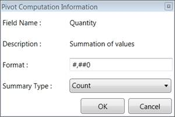

::: {style="DISPLAY: none"}
{#d2h_url_template} {#d2h_package_url style="WIDTH: 0px; DISPLAY: none; HEIGHT: 0px"}
:::

::: {.d2h_secondary_topic style="PADDING-BOTTOM: 10pt; MARGIN: 0pt; PADDING-LEFT: 0pt; PADDING-RIGHT: 0pt; PADDING-TOP: 0pt"}
#### Pivot Computation Information Window {#pivot-computation-information-window style="tab-stops: 0pt"}

The Pivot Computation Information window is used to change or edit value format and summary type.

{border="0"}

 

Figure 51: Pivot Computation Information Window

[]{#related-topics}
:::
