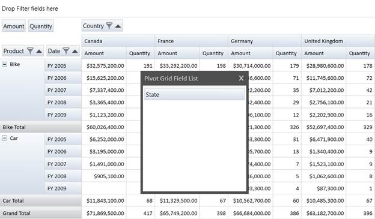

::: {style="DISPLAY: none"}
{#d2h_url_template} {#d2h_package_url style="WIDTH: 0px; DISPLAY: none; HEIGHT: 0px"}
:::

::::: {.d2h_secondary_topic style="PADDING-BOTTOM: 10pt; MARGIN: 0pt; PADDING-LEFT: 0pt; PADDING-RIGHT: 0pt; PADDING-TOP: 0pt"}
#### P[ivotGrid Field List]{.Heading4Char} {#pivotgrid-field-list style="tab-stops: 0pt"}

With the current implementation of 'Grouping bar, users cannot add or delete items in it. The Delete operation can be easily performed using the context menu, but in case of adding an item there should be a separate window, which should hold the fields present in the Item Source. In order to achieve this, a window called PivotGrid Field List is available in PivotGrid control, which is bound to a collection of PivotItems defined in the PivotFields property of PivotGridControl.

Use Case Scenarios

This feature will be useful for applications that need to configure PivotGrid at run-time, that is to add/remove items to/from PivotGrid at run-time

**[]{style="FONT-FAMILY: 'Trebuchet MS','sans-serif'; COLOR: #15428b; FONT-SIZE: 9pt"}**  

Adding PivotGrid Field List

PivotGrid Field List (or Dynamic Field List ) can be launched by setting the ShowFieldList property to true or by clicking on the ShowFieldList menu item of Grouping bar context menu. PivotGrid Field List is bound to PivotFilelds property of PivotGridControl, which is a collection of  PivotItems. PivotFields can be added via code-behind and XAML, as shown in the following code snippets.

 

+---------------------------------------------------------------------------------------------------------------------------------------------------------------------------------------------------------------------------------------------------------------------------------------------------------------------------------------------------------------------------------------------------------------------------------------------------------------------------------------------------------------------------------------------------------------------------------------------------------------------------------------------------------------------------------------------------------------------------------------------------------------+
| **[\[XAML\]]{style="FONT-FAMILY: 'Courier New'"}**                                                                                                                                                                                                                                                                                                                                                                                                                                                                                                                                                                                                                                                                                                            |
|                                                                                                                                                                                                                                                                                                                                                                                                                                                                                                                                                                                                                                                                                                                                                               |
| [        \<]{style="FONT-FAMILY: 'Courier New'; COLOR: blue"} [syncfusion]{style="FONT-FAMILY: 'Courier New'; COLOR: #a31515"} [:]{style="FONT-FAMILY: 'Courier New'; COLOR: blue"} [PivotGridControl ]{style="FONT-FAMILY: 'Courier New'; COLOR: #a31515"} [ShowFieldList]{style="FONT-FAMILY: 'Courier New'; COLOR: red"} [=\"True\"]{style="FONT-FAMILY: 'Courier New'; COLOR: blue"}                                                                                                                                                                                                                                                                                                                                                                      |
|                                                                                                                                                                                                                                                                                                                                                                                                                                                                                                                                                                                                                                                                                                                                                               |
| [           ]{style="FONT-FAMILY: 'Courier New'; COLOR: #a31515"} [\<!\--Specifying PivotRows\--\>]{style="FONT-FAMILY: 'Courier New'; COLOR: green"} []{style="FONT-FAMILY: 'Courier New'"}                                                                                                                                                                                                                                                                                                                                                                                                                                                                                                                                                                  |
|                                                                                                                                                                                                                                                                                                                                                                                                                                                                                                                                                                                                                                                                                                                                                               |
| [            ]{style="FONT-FAMILY: 'Courier New'; COLOR: #a31515"} [\<]{style="FONT-FAMILY: 'Courier New'; COLOR: blue"} [syncfusion]{style="FONT-FAMILY: 'Courier New'; COLOR: #a31515"} [:]{style="FONT-FAMILY: 'Courier New'; COLOR: blue"} [PivotGridControl.PivotRows]{style="FONT-FAMILY: 'Courier New'; COLOR: #a31515"} [\>]{style="FONT-FAMILY: 'Courier New'; COLOR: blue"} []{style="FONT-FAMILY: 'Courier New'"}                                                                                                                                                                                                                                                                                                                                  |
|                                                                                                                                                                                                                                                                                                                                                                                                                                                                                                                                                                                                                                                                                                                                                               |
| [                ]{style="FONT-FAMILY: 'Courier New'; COLOR: #a31515"} [\<]{style="FONT-FAMILY: 'Courier New'; COLOR: blue"} [syncfusion]{style="FONT-FAMILY: 'Courier New'; COLOR: #a31515"} [:]{style="FONT-FAMILY: 'Courier New'; COLOR: blue"} [PivotItem]{style="FONT-FAMILY: 'Courier New'; COLOR: #a31515"} [ FieldMappingName]{style="FONT-FAMILY: 'Courier New'; COLOR: red"} [=\"Product\"]{style="FONT-FAMILY: 'Courier New'; COLOR: blue"} [ TotalHeader]{style="FONT-FAMILY: 'Courier New'; COLOR: red"} [=\"Total\"/\>]{style="FONT-FAMILY: 'Courier New'; COLOR: blue"}                                                                                                                                                                        |
|                                                                                                                                                                                                                                                                                                                                                                                                                                                                                                                                                                                                                                                                                                                                                               |
| [                \<]{style="FONT-FAMILY: 'Courier New'; COLOR: blue"} [syncfusion]{style="FONT-FAMILY: 'Courier New'; COLOR: #a31515"} [:]{style="FONT-FAMILY: 'Courier New'; COLOR: blue"} [PivotItem]{style="FONT-FAMILY: 'Courier New'; COLOR: #a31515"} [ FieldMappingName]{style="FONT-FAMILY: 'Courier New'; COLOR: red"} [=\"Date\"]{style="FONT-FAMILY: 'Courier New'; COLOR: blue"} [ TotalHeader]{style="FONT-FAMILY: 'Courier New'; COLOR: red"} [=\"Total\"/\>]{style="FONT-FAMILY: 'Courier New'; COLOR: blue"} []{style="FONT-FAMILY: 'Courier New'"}                                                                                                                                                                                           |
|                                                                                                                                                                                                                                                                                                                                                                                                                                                                                                                                                                                                                                                                                                                                                               |
| [             ]{style="FONT-FAMILY: 'Courier New'; COLOR: #a31515"} [\</]{style="FONT-FAMILY: 'Courier New'; COLOR: blue"} [syncfusion]{style="FONT-FAMILY: 'Courier New'; COLOR: #a31515"} [:]{style="FONT-FAMILY: 'Courier New'; COLOR: blue"} [PivotGridControl.PivotRows]{style="FONT-FAMILY: 'Courier New'; COLOR: #a31515"} [\>]{style="FONT-FAMILY: 'Courier New'; COLOR: blue"} []{style="FONT-FAMILY: 'Courier New'"}                                                                                                                                                                                                                                                                                                                                |
|                                                                                                                                                                                                                                                                                                                                                                                                                                                                                                                                                                                                                                                                                                                                                               |
| [            ]{style="FONT-FAMILY: 'Courier New'; COLOR: #a31515"} [\<!\--Specifying PivotColumns\--\>]{style="FONT-FAMILY: 'Courier New'; COLOR: green"} []{style="FONT-FAMILY: 'Courier New'"}                                                                                                                                                                                                                                                                                                                                                                                                                                                                                                                                                              |
|                                                                                                                                                                                                                                                                                                                                                                                                                                                                                                                                                                                                                                                                                                                                                               |
| [            ]{style="FONT-FAMILY: 'Courier New'; COLOR: #a31515"} [\<]{style="FONT-FAMILY: 'Courier New'; COLOR: blue"} [syncfusion]{style="FONT-FAMILY: 'Courier New'; COLOR: #a31515"} [:]{style="FONT-FAMILY: 'Courier New'; COLOR: blue"} [PivotGridControl.PivotColumns]{style="FONT-FAMILY: 'Courier New'; COLOR: #a31515"} [\>]{style="FONT-FAMILY: 'Courier New'; COLOR: blue"} []{style="FONT-FAMILY: 'Courier New'"}                                                                                                                                                                                                                                                                                                                               |
|                                                                                                                                                                                                                                                                                                                                                                                                                                                                                                                                                                                                                                                                                                                                                               |
| [                ]{style="FONT-FAMILY: 'Courier New'; COLOR: #a31515"} [\<]{style="FONT-FAMILY: 'Courier New'; COLOR: blue"} [syncfusion]{style="FONT-FAMILY: 'Courier New'; COLOR: #a31515"} [:]{style="FONT-FAMILY: 'Courier New'; COLOR: blue"} [PivotItem]{style="FONT-FAMILY: 'Courier New'; COLOR: #a31515"} [ FieldMappingName]{style="FONT-FAMILY: 'Courier New'; COLOR: red"} [=\"Country\"]{style="FONT-FAMILY: 'Courier New'; COLOR: blue"} [ TotalHeader]{style="FONT-FAMILY: 'Courier New'; COLOR: red"} [=\"Total\"/\>]{style="FONT-FAMILY: 'Courier New'; COLOR: blue"} []{style="FONT-FAMILY: 'Courier New'"}                                                                                                                                 |
|                                                                                                                                                                                                                                                                                                                                                                                                                                                                                                                                                                                                                                                                                                                                                               |
| [            ]{style="FONT-FAMILY: 'Courier New'; COLOR: #a31515"} [\</]{style="FONT-FAMILY: 'Courier New'; COLOR: blue"} [syncfusion]{style="FONT-FAMILY: 'Courier New'; COLOR: #a31515"} [:]{style="FONT-FAMILY: 'Courier New'; COLOR: blue"} [PivotGridControl.PivotColumns]{style="FONT-FAMILY: 'Courier New'; COLOR: #a31515"} [\>]{style="FONT-FAMILY: 'Courier New'; COLOR: blue"} []{style="FONT-FAMILY: 'Courier New'"}                                                                                                                                                                                                                                                                                                                              |
|                                                                                                                                                                                                                                                                                                                                                                                                                                                                                                                                                                                                                                                                                                                                                               |
| [            ]{style="FONT-FAMILY: 'Courier New'; COLOR: #a31515"} [\<!\--Specifying PivotCalculationValues\--\>]{style="FONT-FAMILY: 'Courier New'; COLOR: green"} []{style="FONT-FAMILY: 'Courier New'; COLOR: #a31515"} []{style="FONT-FAMILY: 'Courier New'"}                                                                                                                                                                                                                                                                                                                                                                                                                                                                                             |
|                                                                                                                                                                                                                                                                                                                                                                                                                                                                                                                                                                                                                                                                                                                                                               |
| [            ]{style="FONT-FAMILY: 'Courier New'; COLOR: #a31515"} [\<]{style="FONT-FAMILY: 'Courier New'; COLOR: blue"} [syncfusion]{style="FONT-FAMILY: 'Courier New'; COLOR: #a31515"} [:]{style="FONT-FAMILY: 'Courier New'; COLOR: blue"} [PivotGridControl.PivotCalculations]{style="FONT-FAMILY: 'Courier New'; COLOR: #a31515"} [\>]{style="FONT-FAMILY: 'Courier New'; COLOR: blue"} []{style="FONT-FAMILY: 'Courier New'"}                                                                                                                                                                                                                                                                                                                          |
|                                                                                                                                                                                                                                                                                                                                                                                                                                                                                                                                                                                                                                                                                                                                                               |
| [                ]{style="FONT-FAMILY: 'Courier New'; COLOR: #a31515"} [\<]{style="FONT-FAMILY: 'Courier New'; COLOR: blue"} [syncfusion]{style="FONT-FAMILY: 'Courier New'; COLOR: #a31515"} [:]{style="FONT-FAMILY: 'Courier New'; COLOR: blue"} [PivotComputationInfo]{style="FONT-FAMILY: 'Courier New'; COLOR: #a31515"} [ FieldName]{style="FONT-FAMILY: 'Courier New'; COLOR: red"} [=\"Amount\"]{style="FONT-FAMILY: 'Courier New'; COLOR: blue"} [ Format]{style="FONT-FAMILY: 'Courier New'; COLOR: red"} [=\"C\"]{style="FONT-FAMILY: 'Courier New'; COLOR: blue"} [ SummaryType]{style="FONT-FAMILY: 'Courier New'; COLOR: red"} [=\"DoubleTotalSum\"/\>]{style="FONT-FAMILY: 'Courier New'; COLOR: blue"} []{style="FONT-FAMILY: 'Courier New'"} |
|                                                                                                                                                                                                                                                                                                                                                                                                                                                                                                                                                                                                                                                                                                                                                               |
| [                ]{style="FONT-FAMILY: 'Courier New'; COLOR: #a31515"} [\<]{style="FONT-FAMILY: 'Courier New'; COLOR: blue"} [syncfusion]{style="FONT-FAMILY: 'Courier New'; COLOR: #a31515"} [:]{style="FONT-FAMILY: 'Courier New'; COLOR: blue"} [PivotComputationInfo]{style="FONT-FAMILY: 'Courier New'; COLOR: #a31515"} [ FieldName]{style="FONT-FAMILY: 'Courier New'; COLOR: red"} [=\"Quantity\"]{style="FONT-FAMILY: 'Courier New'; COLOR: blue"} [ Format]{style="FONT-FAMILY: 'Courier New'; COLOR: red"} [=\"#,##0\"/\>]{style="FONT-FAMILY: 'Courier New'; COLOR: blue"} []{style="FONT-FAMILY: 'Courier New'"}                                                                                                                                 |
|                                                                                                                                                                                                                                                                                                                                                                                                                                                                                                                                                                                                                                                                                                                                                               |
| [            ]{style="FONT-FAMILY: 'Courier New'; COLOR: #a31515"} [\</]{style="FONT-FAMILY: 'Courier New'; COLOR: blue"} [syncfusion]{style="FONT-FAMILY: 'Courier New'; COLOR: #a31515"} [:]{style="FONT-FAMILY: 'Courier New'; COLOR: blue"} [PivotGridControl.PivotCalculations]{style="FONT-FAMILY: 'Courier New'; COLOR: #a31515"} [\>]{style="FONT-FAMILY: 'Courier New'; COLOR: blue"}                                                                                                                                                                                                                                                                                                                                                                |
|                                                                                                                                                                                                                                                                                                                                                                                                                                                                                                                                                                                                                                                                                                                                                               |
| [            ]{style="FONT-FAMILY: 'Courier New'; COLOR: #a31515"} [\<!\--Specifying Pivot Fields\--\>]{style="FONT-FAMILY: 'Courier New'; COLOR: green"} []{style="FONT-FAMILY: 'Courier New'; COLOR: #a31515"} []{style="FONT-FAMILY: 'Courier New'"}                                                                                                                                                                                                                                                                                                                                                                                                                                                                                                       |
|                                                                                                                                                                                                                                                                                                                                                                                                                                                                                                                                                                                                                                                                                                                                                               |
| [            ]{style="FONT-FAMILY: 'Courier New'; COLOR: #a31515"} [   ]{style="FONT-FAMILY: 'Courier New'; COLOR: #a31515"} [\<]{style="FONT-FAMILY: 'Courier New'; COLOR: blue"} [syncfusion]{style="FONT-FAMILY: 'Courier New'; COLOR: #a31515"} [:]{style="FONT-FAMILY: 'Courier New'; COLOR: blue"} [PivotGridControl.PivotFields]{style="FONT-FAMILY: 'Courier New'; COLOR: #a31515"} [\>]{style="FONT-FAMILY: 'Courier New'; COLOR: blue"} []{style="FONT-FAMILY: 'Courier New'"}                                                                                                                                                                                                                                                                      |
|                                                                                                                                                                                                                                                                                                                                                                                                                                                                                                                                                                                                                                                                                                                                                               |
| [                ]{style="FONT-FAMILY: 'Courier New'; COLOR: #a31515"} [\<]{style="FONT-FAMILY: 'Courier New'; COLOR: blue"} [syncfusion]{style="FONT-FAMILY: 'Courier New'; COLOR: #a31515"} [:]{style="FONT-FAMILY: 'Courier New'; COLOR: blue"} [PivotItem]{style="FONT-FAMILY: 'Courier New'; COLOR: #a31515"} [ FieldMappingName]{style="FONT-FAMILY: 'Courier New'; COLOR: red"} [=\"State\"]{style="FONT-FAMILY: 'Courier New'; COLOR: blue"} [ FieldHeader]{style="FONT-FAMILY: 'Courier New'; COLOR: red"} [=\"State\"]{style="FONT-FAMILY: 'Courier New'; COLOR: blue"} [ TotalHeader]{style="FONT-FAMILY: 'Courier New'; COLOR: red"} [=\"Total\"/\>]{style="FONT-FAMILY: 'Courier New'; COLOR: blue"} []{style="FONT-FAMILY: 'Courier New'"}      |
|                                                                                                                                                                                                                                                                                                                                                                                                                                                                                                                                                                                                                                                                                                                                                               |
| [            ]{style="FONT-FAMILY: 'Courier New'; COLOR: #a31515"} [\</]{style="FONT-FAMILY: 'Courier New'; COLOR: blue"} [syncfusion]{style="FONT-FAMILY: 'Courier New'; COLOR: #a31515"} [:]{style="FONT-FAMILY: 'Courier New'; COLOR: blue"} [PivotGridControl.PivotFields]{style="FONT-FAMILY: 'Courier New'; COLOR: #a31515"} [\>]{style="FONT-FAMILY: 'Courier New'; COLOR: blue"}                                                                                                                                                                                                                                                                                                                                                                      |
|                                                                                                                                                                                                                                                                                                                                                                                                                                                                                                                                                                                                                                                                                                                                                               |
| [                   ]{style="FONT-FAMILY: 'Courier New'"} [\</]{style="FONT-FAMILY: 'Courier New'; COLOR: blue"} [syncfusion]{style="FONT-FAMILY: 'Courier New'; COLOR: #a31515"} [:]{style="FONT-FAMILY: 'Courier New'; COLOR: blue"} [PivotGridControl]{style="FONT-FAMILY: 'Courier New'; COLOR: #a31515"} [\>]{style="FONT-FAMILY: 'Courier New'; COLOR: blue"}                                                                                                                                                                                                                                                                                                                                                                                           |
|                                                                                                                                                                                                                                                                                                                                                                                                                                                                                                                                                                                                                                                                                                                                                               |
| []{style="FONT-FAMILY: 'Courier New'"}                                                                                                                                                                                                                                                                                                                                                                                                                                                                                                                                                                                                                                                                                                                        |
+---------------------------------------------------------------------------------------------------------------------------------------------------------------------------------------------------------------------------------------------------------------------------------------------------------------------------------------------------------------------------------------------------------------------------------------------------------------------------------------------------------------------------------------------------------------------------------------------------------------------------------------------------------------------------------------------------------------------------------------------------------------+

[]{style="COLOR: #c00000"} 

+-----------------------------------------------------------------------------------------------------------------------------------------------------------------------------------------------------------------------------------------------------------------------------------------------------------------------------------------------------------+
| **[\[C#\]]{style="FONT-FAMILY: 'Courier New'"}**                                                                                                                                                                                                                                                                                                          |
|                                                                                                                                                                                                                                                                                                                                                           |
| []{style="FONT-FAMILY: 'Courier New'"}                                                                                                                                                                                                                                                                                                                    |
|                                                                                                                                                                                                                                                                                                                                                           |
| [  [///]{style="COLOR: gray"}[ Adding Pivot Columns]{style="COLOR: green"}]{style="FONT-FAMILY: 'Courier New'"}                                                                                                                                                                                                                                           |
|                                                                                                                                                                                                                                                                                                                                                           |
| [            [this]{style="COLOR: blue"}.pivotGrid1.PivotColumns.Add([new]{style="COLOR: blue"}[PivotItem]{style="COLOR: #2b91af"}() { FieldHeader=[\"Country\"]{style="COLOR: #a31515"}, FieldMappingName=[\"Country\"]{style="COLOR: #a31515"},TotalHeader=[\"Total\"]{style="COLOR: #a31515"} });]{style="FONT-FAMILY: 'Courier New'"}                 |
|                                                                                                                                                                                                                                                                                                                                                           |
| [            [///]{style="COLOR: gray"}[ Adding Pivot Rows]{style="COLOR: green"}]{style="FONT-FAMILY: 'Courier New'"}                                                                                                                                                                                                                                    |
|                                                                                                                                                                                                                                                                                                                                                           |
| [            [this]{style="COLOR: blue"}.pivotGrid1.PivotRows.Add([new]{style="COLOR: blue"}[PivotItem]{style="COLOR: #2b91af"}() { FieldHeader = [\"Product\"]{style="COLOR: #a31515"}, FieldMappingName = [\"Product\"]{style="COLOR: #a31515"}, TotalHeader = [\"Total\"]{style="COLOR: #a31515"} });]{style="FONT-FAMILY: 'Courier New'"}             |
|                                                                                                                                                                                                                                                                                                                                                           |
| [            [this]{style="COLOR: blue"}.pivotGrid1.PivotRows.Add([new]{style="COLOR: blue"}[PivotItem]{style="COLOR: #2b91af"}() { FieldHeader = [\"Date\"]{style="COLOR: #a31515"}, FieldMappingName = [\"Date\"]{style="COLOR: #a31515"}, TotalHeader = [\"Total\"]{style="COLOR: #a31515"} });]{style="FONT-FAMILY: 'Courier New'"}                   |
|                                                                                                                                                                                                                                                                                                                                                           |
| [            [///]{style="COLOR: gray"}[ Adding Pivot Calculations]{style="COLOR: green"}]{style="FONT-FAMILY: 'Courier New'"}                                                                                                                                                                                                                            |
|                                                                                                                                                                                                                                                                                                                                                           |
| [            [this]{style="COLOR: blue"}.pivotGrid1.PivotCalculations.Add([new]{style="COLOR: blue"}[PivotComputationInfo]{style="COLOR: #2b91af"}() { FieldName=[\"Amount\"]{style="COLOR: #a31515"}, SummaryType= [SummaryType]{style="COLOR: #2b91af"}.DoubleTotalSum, Format=[\"C\"]{style="COLOR: #a31515"} });]{style="FONT-FAMILY: 'Courier New'"} |
|                                                                                                                                                                                                                                                                                                                                                           |
| [            [this]{style="COLOR: blue"}.pivotGrid1.PivotCalculations.Add([new]{style="COLOR: blue"}[PivotComputationInfo]{style="COLOR: #2b91af"}() { FieldName=[\"Quantity\"]{style="COLOR: #a31515"}, Format=[\"#,###\"]{style="COLOR: #a31515"} });]{style="FONT-FAMILY: 'Courier New'"}                                                              |
|                                                                                                                                                                                                                                                                                                                                                           |
| [            [///]{style="COLOR: gray"}[ Adding Pivot Fields]{style="COLOR: green"}]{style="FONT-FAMILY: 'Courier New'"}                                                                                                                                                                                                                                  |
|                                                                                                                                                                                                                                                                                                                                                           |
| [            [this]{style="COLOR: blue"}.pivotGrid1.PivotFields.Add([new]{style="COLOR: blue"}[PivotItem]{style="COLOR: #2b91af"}() { FieldHeader=[\"State\"]{style="COLOR: #a31515"}, FieldMappingName=[\"State\"]{style="COLOR: #a31515"} }); ]{style="FONT-FAMILY: 'Courier New'"}                                                                     |
|                                                                                                                                                                                                                                                                                                                                                           |
| [            [///]{style="COLOR: gray"}[ Displaying Field List]{style="COLOR: green"}]{style="FONT-FAMILY: 'Courier New'"}                                                                                                                                                                                                                                |
|                                                                                                                                                                                                                                                                                                                                                           |
| [            [this]{style="COLOR: blue"}.pivotGrid1.ShowFieldList = [true]{style="COLOR: blue"};]{style="FONT-FAMILY: 'Courier New'"}                                                                                                                                                                                                                     |
|                                                                                                                                                                                                                                                                                                                                                           |
| []{style="FONT-FAMILY: 'Courier New'"}                                                                                                                                                                                                                                                                                                                    |
+-----------------------------------------------------------------------------------------------------------------------------------------------------------------------------------------------------------------------------------------------------------------------------------------------------------------------------------------------------------+

[]{style="COLOR: #c00000"} 

+------------------------------------------------------------------------------------------------------------------------------------------------------------------------------------------------------------------------------------------------------------------------------------------------------------------------------------------------------------------------------------------+
| **[\[VB]{style="FONT-FAMILY: 'Courier New'"}** []{style="FONT-FAMILY: 'Courier New'"}                                                                                                                                                                                                                                                                                                    |
|                                                                                                                                                                                                                                                                                                                                                                                          |
| [            [\' Adding Pivot Columns]{style="COLOR: green"}]{style="FONT-FAMILY: 'Courier New'"}                                                                                                                                                                                                                                                                                        |
|                                                                                                                                                                                                                                                                                                                                                                                          |
| [            [Me]{style="COLOR: blue"}.pivotGrid1.PivotColumns.Add([New]{style="COLOR: blue"}[PivotItem]{style="COLOR: #2b91af"}() [With]{style="COLOR: blue"} {.FieldHeader = [\"Country\"]{style="COLOR: #a31515"}, .FieldMappingName = [\"Country\"]{style="COLOR: #a31515"}, .TotalHeader = [\"Total\"]{style="COLOR: #a31515"}})]{style="FONT-FAMILY: 'Courier New'"}               |
|                                                                                                                                                                                                                                                                                                                                                                                          |
| [            [\' Adding Pivot Rows]{style="COLOR: green"}]{style="FONT-FAMILY: 'Courier New'"}                                                                                                                                                                                                                                                                                           |
|                                                                                                                                                                                                                                                                                                                                                                                          |
| [            [Me]{style="COLOR: blue"}.pivotGrid1.PivotRows.Add([New]{style="COLOR: blue"}[PivotItem]{style="COLOR: #2b91af"}() [With]{style="COLOR: blue"} {.FieldHeader = [\"Product\"]{style="COLOR: #a31515"}, .FieldMappingName = [\"Product\"]{style="COLOR: #a31515"}, .TotalHeader = [\"Total\"]{style="COLOR: #a31515"}})]{style="FONT-FAMILY: 'Courier New'"}                  |
|                                                                                                                                                                                                                                                                                                                                                                                          |
| [            [Me]{style="COLOR: blue"}.pivotGrid1.PivotRows.Add([New]{style="COLOR: blue"}[PivotItem]{style="COLOR: #2b91af"}() [With]{style="COLOR: blue"} {.FieldHeader = [\"Date\"]{style="COLOR: #a31515"}, .FieldMappingName = [\"Date\"]{style="COLOR: #a31515"}, .TotalHeader = [\"Total\"]{style="COLOR: #a31515"}})]{style="FONT-FAMILY: 'Courier New'"}                        |
|                                                                                                                                                                                                                                                                                                                                                                                          |
| [            [\' Adding Pivot Calculations]{style="COLOR: green"}]{style="FONT-FAMILY: 'Courier New'"}                                                                                                                                                                                                                                                                                   |
|                                                                                                                                                                                                                                                                                                                                                                                          |
| [            [Me]{style="COLOR: blue"}.pivotGrid1.PivotCalculations.Add([New]{style="COLOR: blue"}[PivotComputationInfo]{style="COLOR: #2b91af"}() [With]{style="COLOR: blue"} {.FieldName = [\"Amount\"]{style="COLOR: #a31515"}, .SummaryType = [SummaryType]{style="COLOR: #2b91af"}.DoubleTotalSum, .Format = [\"C\"]{style="COLOR: #a31515"}})]{style="FONT-FAMILY: 'Courier New'"} |
|                                                                                                                                                                                                                                                                                                                                                                                          |
| [            [Me]{style="COLOR: blue"}.pivotGrid1.PivotCalculations.Add([New]{style="COLOR: blue"}[PivotComputationInfo]{style="COLOR: #2b91af"}() [With]{style="COLOR: blue"} {.FieldName = [\"Quantity\"]{style="COLOR: #a31515"}, .Format = [\"#,###\"]{style="COLOR: #a31515"}})]{style="FONT-FAMILY: 'Courier New'"}                                                                |
|                                                                                                                                                                                                                                                                                                                                                                                          |
| [            [\' Adding Pivot Fields]{style="COLOR: green"}]{style="FONT-FAMILY: 'Courier New'"}                                                                                                                                                                                                                                                                                         |
|                                                                                                                                                                                                                                                                                                                                                                                          |
| [            [Me]{style="COLOR: blue"}.pivotGrid1.PivotFields.Add([New]{style="COLOR: blue"}[PivotItem]{style="COLOR: #2b91af"}() [With]{style="COLOR: blue"} {.FieldHeader = [\"State\"]{style="COLOR: #a31515"}, .FieldMappingName = [\"State\"]{style="COLOR: #a31515"}})]{style="FONT-FAMILY: 'Courier New'"}                                                                        |
|                                                                                                                                                                                                                                                                                                                                                                                          |
| [            [\' Displaying Field List]{style="COLOR: green"}]{style="FONT-FAMILY: 'Courier New'"}                                                                                                                                                                                                                                                                                       |
|                                                                                                                                                                                                                                                                                                                                                                                          |
| [            [Me]{style="COLOR: blue"}.pivotGrid1.ShowFieldList = [True]{style="COLOR: blue"}]{style="FONT-FAMILY: 'Courier New'"}                                                                                                                                                                                                                                                       |
|                                                                                                                                                                                                                                                                                                                                                                                          |
| **[]{style="FONT-FAMILY: 'Courier New'"}**                                                                                                                                                                                                                                                                                                                                               |
+------------------------------------------------------------------------------------------------------------------------------------------------------------------------------------------------------------------------------------------------------------------------------------------------------------------------------------------------------------------------------------------+

 

{border="0"}

 

Figure 26: PivotGrid Field List

**[]{style="FONT-FAMILY: 'Trebuchet MS','sans-serif'; COLOR: #15428b; FONT-SIZE: 9pt"}**  

**[]{style="FONT-FAMILY: 'Trebuchet MS','sans-serif'; COLOR: #15428b; FONT-SIZE: 9pt"}**  

Properties

Table 2: PivotGridControl Table

::: {align="center"}
  --------------- ---------------------------------------------------------------- ------------ ----------------------------------- -----------------
  Property        Description                                                      Type         Data Type                           Reference links
  PivotFields     Gets the collection of PivotItems to be displayed in FieldList   Normal       ObservableCollection\<PivotItem\>   NA
  ShowFieldList   Gets or sets a value indicating whether to display FieldList     Dependency   bool                                NA
  --------------- ---------------------------------------------------------------- ------------ ----------------------------------- -----------------
:::

 

Table 3: GroupingBar Table

::: {align="center"}
  Property               Description                                                             Type         Data Type   Reference links
  ---------------------- ----------------------------------------------------------------------- ------------ ----------- -----------------
  FieldList              Gets the field list, which is used to add items into the Grouping Bar   Normal       Window      NA
  FieldListBorderBrush   Gets or sets the Border brush for Field List                            Dependency   Brush       NA
:::

 

Sample Link

To access a Conditional Formatting sample:

1.   Open the Syncfusion Dashboard.

2.   Click **Business Intelligence**.

3.   Click the **WPF** drop-down list, and select **Explore Samples**.

4.   Navigate to **PivotAnalysis.WPF** -\> **Samples** -\> **Field List** -\> **Field List Demo**.

[]{style="FONT-FAMILY: 'Trebuchet MS','sans-serif'; COLOR: #15428b; FONT-SIZE: 9pt"} 

[]{#related-topics}
:::::
