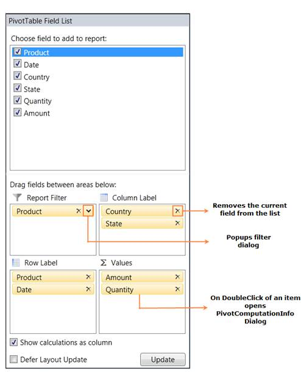

::: {style="DISPLAY: none"}
{#d2h_url_template} {#d2h_package_url style="WIDTH: 0px; DISPLAY: none; HEIGHT: 0px"}
:::

::::: {#nsbanner .d2h_main_nsbanner style="BORDER-BOTTOM: #999999 1px solid; POSITION: relative; PADDING-BOTTOM: 0px; BACKGROUND-COLOR: transparent; PADDING-LEFT: 0px; PADDING-RIGHT: 0px; DISPLAY: none; BORDER-TOP: #999999 1px solid; PADDING-TOP: 0px; LEFT: 0px"}
:::: {#TitleRow .d2h_main_titlerow style="PADDING-BOTTOM: 4px; BACKGROUND-COLOR: transparent; PADDING-LEFT: 22px; WIDTH: 100%; PADDING-RIGHT: 10px; DISPLAY: none; PADDING-TOP: 4px"}
::: {#ienav .d2h_main_ienav style="DISPLAY: none"}
{#D2HPrevious .D2HPreviousEnabled}  {#D2HNext .D2HNextEnabled}
:::
::::
:::::

:::: {#nstext .d2h_main_nstext style="PADDING-BOTTOM: 10px; BACKGROUND-COLOR: transparent; PADDING-LEFT: 22px; PADDING-RIGHT: 10px; HEIGHT: 100%; OVERFLOW: auto; PADDING-TOP: 5px" hasuserbackground="true" valign="bottom"}
::: {#d2h_breadcrumbs .d2h_breadcrumbs}
[Essential Studio User Guide Documentation](ms-xhelp:///?Id=12457748-09e3-4d74-a240-8e049cedf030){.d2h_breadcrumbsNormal} [ \> ]{.d2h_breadcrumbsLinkSeparator} [Business Intelligence Edition](ms-xhelp:///?Id=fdf33dd8-62b2-47b9-ad7b-fc50e590bca5){.d2h_breadcrumbsNormal} [ \> ]{.d2h_breadcrumbsLinkSeparator} [Essential BI WPF](ms-xhelp:///?Id=41e3d586-d922-4a01-8272-679fe4ae7343){.d2h_breadcrumbsNormal} [ \> ]{.d2h_breadcrumbsLinkSeparator} [Essential Pivot Grid]{.d2h_breadcrumbsContentsOnly}
:::

# PivotSchemaDesigner for WPF {#pivotschemadesigner-for-wpf style="tab-stops: 0pt"}

PivotSchemaDesigner for WPF can be support in PivotGrid samples so that PivotGrid can be presented like an ExcelPivotTable. It enables drag and drop feature of fields between different areas like Column, row, value and filter. By using the PivotTable Field List, you can add, rearrange, or remove fields to show data in a PivotGrid exactly the way that you want. The PivotTable Field List displays two sections, consisting of the following items:

[·      ]{style="FONT-FAMILY: Symbol"}A field section at the top for adding fields to and removing fields from the PivotGrid.

[·      ]{style="FONT-FAMILY: Symbol"}A layout section at the bottom for rearranging and repositioning the fields in the PivotGrid.

[]{style="FONT-FAMILY: 'Trebuchet MS','sans-serif'; COLOR: #15428b; FONT-SIZE: 9pt"} 

{border="0"}

Figure 49: PivotTable Field List

More:

[ ]{#related-topics}

[{border="0" align="absMiddle"}Fields Section](ms-xhelp:///?Id=30e2b2bc-ed51-4082-bfaa-c168692dd8ef){style="TEXT-DECORATION: none"}

[{border="0" align="absMiddle"}Layout Section](ms-xhelp:///?Id=8be0dd5a-417c-4808-9814-aa1bf85f27b6){style="TEXT-DECORATION: none"}

[{border="0" align="absMiddle"}Features](ms-xhelp:///?Id=440b4c51-aba4-497a-a486-56dccca496e1){style="TEXT-DECORATION: none"}
::::
