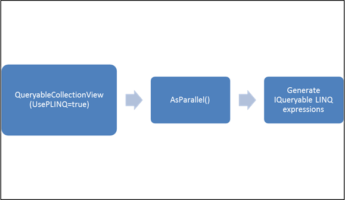

::: {style="DISPLAY: none"}
{#d2h_url_template}{#d2h_package_url style="WIDTH: 0px; DISPLAY: none; HEIGHT: 0px"}
:::

:::: {.d2h_secondary_topic style="PADDING-BOTTOM: 10pt; MARGIN: 0pt; PADDING-LEFT: 0pt; PADDING-RIGHT: 0pt; PADDING-TOP: 0pt"}
#### PLINQ Support in GridDataControl {#plinq-support-in-griddatacontrol style="tab-stops: 0pt"}

[[PLINQ]{.UGHyperlink}](http://msdn.microsoft.com/en-us/library/dd997425.aspx) is the parallel implementation of the standard LINQ. GridDataControl uses a QueryableCollectionView that works on top of LINQ expressions for performing major operations such as Sorting, Filtering, Grouping and Summaries calculation. Since PLINQ works on top of LINQ expression trees, QueryableCollectionView now has a property UsePLINQ = true / false (this class implements *IParallelizableView* interface) that would add a AsParallel() to change it into a Parallel Query. Sorting, Grouping and Summary operations would be automatically done in parallel when this property is set.

 

{border="0"}

 

 

+----------------------------------------------------------------------------------------+
| [  \[XAML\]]{style="FONT-FAMILY: 'Courier New'"}                                       |
|                                                                                        |
| [\<syncfusion:GridDataControl]{style="FONT-FAMILY: 'Courier New'"}                     |
|                                                                                        |
| [                x:Name=\"grid\"  ]{style="FONT-FAMILY: 'Courier New'"}                |
|                                                                                        |
| [                AutoPopulateColumns=\"True\"    ]{style="FONT-FAMILY: 'Courier New'"} |
|                                                                                        |
| [                AutoPopulateRelations=\"False\"]{style="FONT-FAMILY: 'Courier New'"}  |
|                                                                                        |
| [                UsePLINQ=\"True\"]{style="FONT-FAMILY: 'Courier New'"}                |
|                                                                                        |
| [      VisualStyle=\"Office14Silver\"\>]{style="FONT-FAMILY: 'Courier New'"}           |
|                                                                                        |
| [    \</syncfusion:GridDataControl\>]{style="FONT-FAMILY: 'Courier New'"}              |
|                                                                                        |
| []{style="FONT-FAMILY: 'Courier New'"}                                                 |
|                                                                                        |
| []{style="FONT-FAMILY: 'Courier New'"}                                                 |
+----------------------------------------------------------------------------------------+

 

+-----------------------------------------------------------------------+
| *\[C#\]*                                                              |
|                                                                       |
|                                                                       |
|                                                                       |
| this.gridDataControl1.UsePLINQ = true;                                |
+-----------------------------------------------------------------------+

**** 

::: {style="BORDER-BOTTOM: windowtext 1pt solid; BORDER-LEFT: medium none; PADDING-BOTTOM: 1pt; MARGIN-TOP: 9pt; PADDING-LEFT: 0pt; PADDING-RIGHT: 0pt; MARGIN-BOTTOM: 9pt; BORDER-TOP: windowtext 1pt solid; BORDER-RIGHT: medium none; PADDING-TOP: 1pt"}
Note: This only works for strongly-typed collections and not for legacy object models like DataTable.
:::

 

 

[]{#related-topics}
::::
