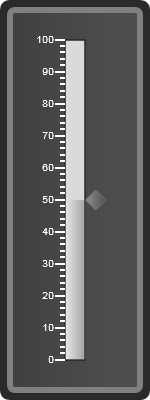

::: {style="DISPLAY: none"}
{#d2h_url_template} {#d2h_package_url style="WIDTH: 0px; DISPLAY: none; HEIGHT: 0px"}
:::

:::: {.d2h_secondary_topic style="PADDING-BOTTOM: 10pt; MARGIN: 0pt; PADDING-LEFT: 0pt; PADDING-RIGHT: 0pt; PADDING-TOP: 0pt"}
#### Pointer Features {#pointer-features style="tab-stops: 0pt"}

Linear Pointers are scale indicators that point to a value along a scale.

The linear gauge can have 12 pointer types:

[·      ]{style="FONT-FAMILY: Symbol"}Rectangle

[·      ]{style="FONT-FAMILY: Symbol"}Triangle

[·      ]{style="FONT-FAMILY: Symbol"}Ellipse

[·      ]{style="FONT-FAMILY: Symbol"}Diamond

[·      ]{style="FONT-FAMILY: Symbol"}Pentagon

[·      ]{style="FONT-FAMILY: Symbol"}Circle

[·      ]{style="FONT-FAMILY: Symbol"}Slider

[·      ]{style="FONT-FAMILY: Symbol"}Pointer

[·      ]{style="FONT-FAMILY: Symbol"}Wedge

[·      ]{style="FONT-FAMILY: Symbol"}Trapezoid

[·      ]{style="FONT-FAMILY: Symbol"}Rounded Rectangle

[·      ]{style="FONT-FAMILY: Symbol"}Star  

The linear pointers in linear gauge of ASP.NET are highly customizable and can be added to the linear scale using different parameters.

The parameters are detailed below:

Two types of pointers are available. They are:

[·      ]{style="FONT-FAMILY: Symbol"} [LinearBar Pointer]{style="FONT-FAMILY: 'Arial','sans-serif'"}

[·      ]{style="FONT-FAMILY: Symbol"} [LinearMarker Pointer]{style="FONT-FAMILY: 'Arial','sans-serif'"}

[]{style="FONT-FAMILY: 'Arial','sans-serif'"} 

Linear bar pointers

These pointers can be customized using the **BarStyle** property. The following are the in-built styles available for the BarStyle property:

[·      ]{style="FONT-FAMILY: Symbol"} [Rectangle]{style="FONT-FAMILY: 'Arial','sans-serif'"}

[·      ]{style="FONT-FAMILY: Symbol"} [Thermometer]{style="FONT-FAMILY: 'Arial','sans-serif'"}

[·      ]{style="FONT-FAMILY: Symbol"} [Rounded Rectangle]{style="FONT-FAMILY: 'Arial','sans-serif'"}

The length and width of a pointer can be controlled using its **PointerLength** and  **PointerWidth** properties.

 

Linear markers

These pointers can be customized using the **MarkerStyle** property. The following are the in-built styles available for the MarkerStyle property:

[·      ]{style="FONT-FAMILY: Symbol"} [Rectangle]{style="FONT-FAMILY: 'Arial','sans-serif'"}

[·      ]{style="FONT-FAMILY: Symbol"} [Triangle]{style="FONT-FAMILY: 'Arial','sans-serif'"}

[·      ]{style="FONT-FAMILY: Symbol"} [Ellipse]{style="FONT-FAMILY: 'Arial','sans-serif'"}

[·      ]{style="FONT-FAMILY: Symbol"} [Diamond]{style="FONT-FAMILY: 'Arial','sans-serif'"}

[·      ]{style="FONT-FAMILY: Symbol"} [Pentagon]{style="FONT-FAMILY: 'Arial','sans-serif'"}

[·      ]{style="FONT-FAMILY: Symbol"} [Circle]{style="FONT-FAMILY: 'Arial','sans-serif'"}

[·      ]{style="FONT-FAMILY: Symbol"} [Slider]{style="FONT-FAMILY: 'Arial','sans-serif'"}

[·      ]{style="FONT-FAMILY: Symbol"} [Pointer]{style="FONT-FAMILY: 'Arial','sans-serif'"}

[·      ]{style="FONT-FAMILY: Symbol"} [Wedge]{style="FONT-FAMILY: 'Arial','sans-serif'"}

[·      ]{style="FONT-FAMILY: Symbol"} [Trapezoid]{style="FONT-FAMILY: 'Arial','sans-serif'"}

[·      ]{style="FONT-FAMILY: Symbol"} [Star]{style="FONT-FAMILY: 'Arial','sans-serif'"}

[·      ]{style="FONT-FAMILY: Symbol"} [RoundedRectangle]{style="FONT-FAMILY: 'Arial','sans-serif'"}

The location of a marker can be controlled using its **PointerPlacement** property.

::: {style="BORDER-BOTTOM: windowtext 1pt solid; BORDER-LEFT: medium none; PADDING-BOTTOM: 1pt; MARGIN-TOP: 9pt; PADDING-LEFT: 0pt; PADDING-RIGHT: 0pt; MARGIN-BOTTOM: 9pt; BORDER-TOP: windowtext 1pt solid; BORDER-RIGHT: medium none; PADDING-TOP: 1pt"}
Note: it is possible to add the linear bar and marker pointers both at the same time to a linear gauge.
:::

 

**[LinearBarPointer properties]{style="FONT-FAMILY: 'Arial','sans-serif'"}** [:]{style="FONT-FAMILY: 'Arial','sans-serif'"}

  ---------------------------------------------------------------------------------------------------------- ------------------------------------------------------------------------------------------------------------- ------------------------------------------------------------------------------------------------------ ----------------------------------------------------------------------------------------------------------- -----------------------------------------------------------------------------------------------------------------
  **[Property ]{style="FONT-FAMILY: 'Arial','sans-serif'"}** []{style="FONT-FAMILY: 'Arial','sans-serif'"}   **[Description ]{style="FONT-FAMILY: 'Arial','sans-serif'"}** []{style="FONT-FAMILY: 'Arial','sans-serif'"}   **[Type ]{style="FONT-FAMILY: 'Arial','sans-serif'"}** []{style="FONT-FAMILY: 'Arial','sans-serif'"}   **[Data Type ]{style="FONT-FAMILY: 'Arial','sans-serif'"}** []{style="FONT-FAMILY: 'Arial','sans-serif'"}   **[Reference links ]{style="FONT-FAMILY: 'Arial','sans-serif'"}** []{style="FONT-FAMILY: 'Arial','sans-serif'"}
  [DistanceFromScale]{style="FONT-FAMILY: 'Arial','sans-serif'"}                                             [Sets the distance of the ticks from the scale]{style="FONT-FAMILY: 'Arial','sans-serif'"}                    [Server-Side/Client-Side]{style="FONT-FAMILY: 'Arial','sans-serif'"}                                   [Double]{style="FONT-FAMILY: 'Arial','sans-serif'"}                                                         [NA]{style="FONT-FAMILY: 'Arial','sans-serif'"}
  [PointerWIdth]{style="FONT-FAMILY: 'Arial','sans-serif'"}                                                  [Sets the width of the pointer]{style="FONT-FAMILY: 'Arial','sans-serif'"}                                    [Server-Side/Client-Side]{style="FONT-FAMILY: 'Arial','sans-serif'"}                                   [Double]{style="FONT-FAMILY: 'Arial','sans-serif'"}                                                         [NA]{style="FONT-FAMILY: 'Arial','sans-serif'"}
  [Value ]{style="FONT-FAMILY: 'Arial','sans-serif'"}                                                        [Sets the value for the pointer]{style="FONT-FAMILY: 'Arial','sans-serif'"}                                   [Server-Side/Client-Side]{style="FONT-FAMILY: 'Arial','sans-serif'"}                                   [Double]{style="FONT-FAMILY: 'Arial','sans-serif'"}                                                         [NA]{style="FONT-FAMILY: 'Arial','sans-serif'"}
  [BorderColor]{style="FONT-FAMILY: 'Arial','sans-serif'"}                                                   [Sets the border color for the pointer]{style="FONT-FAMILY: 'Arial','sans-serif'"}                            [Server-Side/Client-Side]{style="FONT-FAMILY: 'Arial','sans-serif'"}                                   [Color]{style="FONT-FAMILY: 'Arial','sans-serif'"}                                                          [NA]{style="FONT-FAMILY: 'Arial','sans-serif'"}
  [BackgroundColor]{style="FONT-FAMILY: 'Arial','sans-serif'"}                                               [Set the background color for the pointer]{style="FONT-FAMILY: 'Arial','sans-serif'"}                         [Server-Side/Client-Side]{style="FONT-FAMILY: 'Arial','sans-serif'"}                                   [Color]{style="FONT-FAMILY: 'Arial','sans-serif'"}                                                          [NA]{style="FONT-FAMILY: 'Arial','sans-serif'"}
  [ScaleBarGradient]{style="FONT-FAMILY: 'Arial','sans-serif'"}                                              [Sets the gradient background for the scale bar]{style="FONT-FAMILY: 'Arial','sans-serif'"}                   [Server-Side]{style="FONT-FAMILY: 'Arial','sans-serif'"}                                               [ColorInfo]{style="FONT-FAMILY: 'Arial','sans-serif'"}                                                      [NA]{style="FONT-FAMILY: 'Arial','sans-serif'"}
  [Opacity]{style="FONT-FAMILY: 'Arial','sans-serif'"}                                                       [Sets the opacity for the scalebar pointer]{style="FONT-FAMILY: 'Arial','sans-serif'"}                        [Server-Side/Client-Side]{style="FONT-FAMILY: 'Arial','sans-serif'"}                                   [Double]{style="FONT-FAMILY: 'Arial','sans-serif'"}                                                         [NA]{style="FONT-FAMILY: 'Arial','sans-serif'"}
  ---------------------------------------------------------------------------------------------------------- ------------------------------------------------------------------------------------------------------------- ------------------------------------------------------------------------------------------------------ ----------------------------------------------------------------------------------------------------------- -----------------------------------------------------------------------------------------------------------------

 

MarkerPointer properties:

 

+----------------------------------------------------------------------------------------------------------+-------------------------------------------------------------------------------------------------------------+---------------------------------------------------------------------------------------------------------------------+-----------------------------------------------------------------------------------------------------------+-----------------------------------------------------------------------------------------------------------------+
| **[Property ]{style="FONT-FAMILY: 'Arial','sans-serif'"}** []{style="FONT-FAMILY: 'Arial','sans-serif'"} | **[Description ]{style="FONT-FAMILY: 'Arial','sans-serif'"}** []{style="FONT-FAMILY: 'Arial','sans-serif'"} | **[Type ]{style="FONT-FAMILY: 'Arial','sans-serif'"}** []{style="FONT-FAMILY: 'Arial','sans-serif'"}                | **[Data Type ]{style="FONT-FAMILY: 'Arial','sans-serif'"}** []{style="FONT-FAMILY: 'Arial','sans-serif'"} | **[Reference links ]{style="FONT-FAMILY: 'Arial','sans-serif'"}** []{style="FONT-FAMILY: 'Arial','sans-serif'"} |
+----------------------------------------------------------------------------------------------------------+-------------------------------------------------------------------------------------------------------------+---------------------------------------------------------------------------------------------------------------------+-----------------------------------------------------------------------------------------------------------+-----------------------------------------------------------------------------------------------------------------+
| [ PointerLength]{style="FONT-FAMILY: 'Arial','sans-serif'"}                                              | [Sets the length of the pointer]{style="FONT-FAMILY: 'Arial','sans-serif'"}                                 | [Server-Side]{style="FONT-FAMILY: 'Arial','sans-serif'"} [ /Client-Side]{style="FONT-FAMILY: 'Arial','sans-serif'"} | [Double]{style="FONT-FAMILY: 'Arial','sans-serif'"}                                                       | [NA]{style="FONT-FAMILY: 'Arial','sans-serif'"}                                                                 |
+----------------------------------------------------------------------------------------------------------+-------------------------------------------------------------------------------------------------------------+---------------------------------------------------------------------------------------------------------------------+-----------------------------------------------------------------------------------------------------------+-----------------------------------------------------------------------------------------------------------------+
| [PointerWIdth]{style="FONT-FAMILY: 'Arial','sans-serif'"}                                                | [Sets the width of the pointer]{style="FONT-FAMILY: 'Arial','sans-serif'"}                                  | [Server-Side/Client-Side]{style="FONT-FAMILY: 'Arial','sans-serif'"}                                                | [Double]{style="FONT-FAMILY: 'Arial','sans-serif'"}                                                       | [NA]{style="FONT-FAMILY: 'Arial','sans-serif'"}                                                                 |
+----------------------------------------------------------------------------------------------------------+-------------------------------------------------------------------------------------------------------------+---------------------------------------------------------------------------------------------------------------------+-----------------------------------------------------------------------------------------------------------+-----------------------------------------------------------------------------------------------------------------+
| [MarkerStyle]{style="FONT-FAMILY: 'Arial','sans-serif'"}                                                 | [Sets the style for the marker pointer]{style="FONT-FAMILY: 'Arial','sans-serif'"}                          | [Server-Side/Client-Side]{style="FONT-FAMILY: 'Arial','sans-serif'"}                                                | [Enum ]{style="FONT-FAMILY: 'Arial','sans-serif'"}                                                        | [NA]{style="FONT-FAMILY: 'Arial','sans-serif'"}                                                                 |
+----------------------------------------------------------------------------------------------------------+-------------------------------------------------------------------------------------------------------------+---------------------------------------------------------------------------------------------------------------------+-----------------------------------------------------------------------------------------------------------+-----------------------------------------------------------------------------------------------------------------+
| [PointerPlacement]{style="FONT-FAMILY: 'Arial','sans-serif'"}                                            | [Sets the placement for the pointer.]{style="FONT-FAMILY: 'Arial','sans-serif'"}                            | [Server-Side/Client-Side]{style="FONT-FAMILY: 'Arial','sans-serif'"}                                                | [Enum]{style="FONT-FAMILY: 'Arial','sans-serif'"}                                                         | [NA]{style="FONT-FAMILY: 'Arial','sans-serif'"}                                                                 |
|                                                                                                          |                                                                                                             |                                                                                                                     |                                                                                                           |                                                                                                                 |
|                                                                                                          |                                                                                                             |                                                                                                                     | [The default value is Far.]{style="FONT-FAMILY: 'Arial','sans-serif'"}                                    |                                                                                                                 |
|                                                                                                          |                                                                                                             |                                                                                                                     |                                                                                                           |                                                                                                                 |
|                                                                                                          |                                                                                                             |                                                                                                                     | [The values are:]{style="FONT-FAMILY: 'Arial','sans-serif'"}                                              |                                                                                                                 |
|                                                                                                          |                                                                                                             |                                                                                                                     |                                                                                                           |                                                                                                                 |
|                                                                                                          |                                                                                                             |                                                                                                                     | [·      ]{style="FONT-FAMILY: Symbol"} [Far]{style="FONT-FAMILY: 'Arial','sans-serif'"}                   |                                                                                                                 |
|                                                                                                          |                                                                                                             |                                                                                                                     |                                                                                                           |                                                                                                                 |
|                                                                                                          |                                                                                                             |                                                                                                                     | [·      ]{style="FONT-FAMILY: Symbol"} [Near]{style="FONT-FAMILY: 'Arial','sans-serif'"}                  |                                                                                                                 |
|                                                                                                          |                                                                                                             |                                                                                                                     |                                                                                                           |                                                                                                                 |
|                                                                                                          |                                                                                                             |                                                                                                                     | [·      ]{style="FONT-FAMILY: Symbol"} [Center]{style="FONT-FAMILY: 'Arial','sans-serif'"}                |                                                                                                                 |
+----------------------------------------------------------------------------------------------------------+-------------------------------------------------------------------------------------------------------------+---------------------------------------------------------------------------------------------------------------------+-----------------------------------------------------------------------------------------------------------+-----------------------------------------------------------------------------------------------------------------+
| [DistanceFromScale]{style="FONT-FAMILY: 'Arial','sans-serif'"}                                           | [Sets the distance of the ticks from the scale]{style="FONT-FAMILY: 'Arial','sans-serif'"}                  | [Server-Side/Client-Side]{style="FONT-FAMILY: 'Arial','sans-serif'"}                                                | [Double]{style="FONT-FAMILY: 'Arial','sans-serif'"}                                                       | [NA]{style="FONT-FAMILY: 'Arial','sans-serif'"}                                                                 |
+----------------------------------------------------------------------------------------------------------+-------------------------------------------------------------------------------------------------------------+---------------------------------------------------------------------------------------------------------------------+-----------------------------------------------------------------------------------------------------------+-----------------------------------------------------------------------------------------------------------------+
| [Value ]{style="FONT-FAMILY: 'Arial','sans-serif'"}                                                      | [Sets the value for the pointer]{style="FONT-FAMILY: 'Arial','sans-serif'"}                                 | [Server-Side/Client-Side]{style="FONT-FAMILY: 'Arial','sans-serif'"}                                                | [Double]{style="FONT-FAMILY: 'Arial','sans-serif'"}                                                       | [NA]{style="FONT-FAMILY: 'Arial','sans-serif'"}                                                                 |
+----------------------------------------------------------------------------------------------------------+-------------------------------------------------------------------------------------------------------------+---------------------------------------------------------------------------------------------------------------------+-----------------------------------------------------------------------------------------------------------+-----------------------------------------------------------------------------------------------------------------+
| [BorderColor]{style="FONT-FAMILY: 'Arial','sans-serif'"}                                                 | [Sets the border color for the pointer]{style="FONT-FAMILY: 'Arial','sans-serif'"}                          | [Server-Side]{style="FONT-FAMILY: 'Arial','sans-serif'"}                                                            | [Color]{style="FONT-FAMILY: 'Arial','sans-serif'"}                                                        | [NA]{style="FONT-FAMILY: 'Arial','sans-serif'"}                                                                 |
+----------------------------------------------------------------------------------------------------------+-------------------------------------------------------------------------------------------------------------+---------------------------------------------------------------------------------------------------------------------+-----------------------------------------------------------------------------------------------------------+-----------------------------------------------------------------------------------------------------------------+
| [BackgroundColor]{style="FONT-FAMILY: 'Arial','sans-serif'"}                                             | [Set the background color for the pointer]{style="FONT-FAMILY: 'Arial','sans-serif'"}                       | [Server-Side]{style="FONT-FAMILY: 'Arial','sans-serif'"}                                                            | [Color]{style="FONT-FAMILY: 'Arial','sans-serif'"}                                                        | [NA]{style="FONT-FAMILY: 'Arial','sans-serif'"}                                                                 |
+----------------------------------------------------------------------------------------------------------+-------------------------------------------------------------------------------------------------------------+---------------------------------------------------------------------------------------------------------------------+-----------------------------------------------------------------------------------------------------------+-----------------------------------------------------------------------------------------------------------------+
| [PointerGradient]{style="FONT-FAMILY: 'Arial','sans-serif'"}                                             | [Sets the gradient background for the pointer]{style="FONT-FAMILY: 'Arial','sans-serif'"}                   | [Server-Side]{style="FONT-FAMILY: 'Arial','sans-serif'"}                                                            | [ColorInfo]{style="FONT-FAMILY: 'Arial','sans-serif'"}                                                    | [NA]{style="FONT-FAMILY: 'Arial','sans-serif'"}                                                                 |
+----------------------------------------------------------------------------------------------------------+-------------------------------------------------------------------------------------------------------------+---------------------------------------------------------------------------------------------------------------------+-----------------------------------------------------------------------------------------------------------+-----------------------------------------------------------------------------------------------------------------+
| [Opacity]{style="FONT-FAMILY: 'Arial','sans-serif'"}                                                     | [Sets the opacity for the pointers]{style="FONT-FAMILY: 'Arial','sans-serif'"}                              | [Server-Side/Client-Side]{style="FONT-FAMILY: 'Arial','sans-serif'"}                                                | [Double]{style="FONT-FAMILY: 'Arial','sans-serif'"}                                                       | [NA]{style="FONT-FAMILY: 'Arial','sans-serif'"}                                                                 |
+----------------------------------------------------------------------------------------------------------+-------------------------------------------------------------------------------------------------------------+---------------------------------------------------------------------------------------------------------------------+-----------------------------------------------------------------------------------------------------------+-----------------------------------------------------------------------------------------------------------------+

**\**

The code snippets for adding pointers to the linear gauge are given below:

 

+---------------------------------------------------------------------------------------------------------------------------------------------------------------------------------------------------------------------------------------------------------------------------------------------------------------------------------------------------------------------------------------------------------------------------------------------------------------------------------------------------------+
| [\[ASPX\]]{style="FONT-FAMILY: 'Courier New'"}                                                                                                                                                                                                                                                                                                                                                                                                                                                          |
|                                                                                                                                                                                                                                                                                                                                                                                                                                                                                                         |
| []{style="FONT-FAMILY: 'Courier New'"}                                                                                                                                                                                                                                                                                                                                                                                                                                                                  |
|                                                                                                                                                                                                                                                                                                                                                                                                                                                                                                         |
| [\<]{style="FONT-FAMILY: 'Courier New'; COLOR: blue"} [syncfusion]{style="FONT-FAMILY: 'Courier New'; COLOR: #a31515"} [:]{style="FONT-FAMILY: 'Courier New'; COLOR: blue"} [LinearGauge]{style="FONT-FAMILY: 'Courier New'; COLOR: #a31515"} [ [FrameType]{style="COLOR: red"} [=\"RoundedRectangle\"]{style="COLOR: blue"} [AutoFormat]{style="COLOR: red"} [=\"Blend\"]{style="COLOR: blue"} [ID]{style="COLOR: red"} [=\"LinearGauge1\"]{style="COLOR: blue"} ]{style="FONT-FAMILY: 'Courier New'"} |
|                                                                                                                                                                                                                                                                                                                                                                                                                                                                                                         |
| [            [runat]{style="COLOR: red"}[=\"server\"\>]{style="COLOR: blue"}]{style="FONT-FAMILY: 'Courier New'"}                                                                                                                                                                                                                                                                                                                                                                                       |
|                                                                                                                                                                                                                                                                                                                                                                                                                                                                                                         |
| [            [\<]{style="COLOR: blue"}[Scales]{style="COLOR: #a31515"}[\>]{style="COLOR: blue"}]{style="FONT-FAMILY: 'Courier New'"}                                                                                                                                                                                                                                                                                                                                                                    |
|                                                                                                                                                                                                                                                                                                                                                                                                                                                                                                         |
| [                [\<]{style="COLOR: blue"}[syncfusion]{style="COLOR: #a31515"}[:]{style="COLOR: blue"}[LinearScale]{style="COLOR: #a31515"}[ScaleBarSize]{style="COLOR: red"}[=\"20\"]{style="COLOR: blue"}[MajorIntervalValue]{style="COLOR: red"}[=\"10\"]{style="COLOR: blue"}[MinorIntervalValue]{style="COLOR: red"}[=\"2\"\>]{style="COLOR: blue"}]{style="FONT-FAMILY: 'Courier New'"}                                                                                                           |
|                                                                                                                                                                                                                                                                                                                                                                                                                                                                                                         |
| [                    [\<]{style="COLOR: blue"}[Labels]{style="COLOR: #a31515"}[\>]{style="COLOR: blue"}]{style="FONT-FAMILY: 'Courier New'"}                                                                                                                                                                                                                                                                                                                                                            |
|                                                                                                                                                                                                                                                                                                                                                                                                                                                                                                         |
| [                        [\<]{style="COLOR: blue"}[syncfusion]{style="COLOR: #a31515"}[:]{style="COLOR: blue"}[LinearGaugeLabel]{style="COLOR: #a31515"}[LabelPlacement]{style="COLOR: red"}[=\"Near\"]{style="COLOR: blue"}[LabelStyle]{style="COLOR: red"}[=\"MajorInterval\"]{style="COLOR: blue"}[XDistanceFromScale]{style="COLOR: red"}[=\"-10\"]{style="COLOR: blue"}[/\>]{style="COLOR: blue"}]{style="FONT-FAMILY: 'Courier New'"}                                                             |
|                                                                                                                                                                                                                                                                                                                                                                                                                                                                                                         |
| [                    [\</]{style="COLOR: blue"}[Labels]{style="COLOR: #a31515"}[\>]{style="COLOR: blue"}]{style="FONT-FAMILY: 'Courier New'"}                                                                                                                                                                                                                                                                                                                                                           |
|                                                                                                                                                                                                                                                                                                                                                                                                                                                                                                         |
| [                    [\<]{style="COLOR: blue"}[Ticks]{style="COLOR: #a31515"}[\>]{style="COLOR: blue"}]{style="FONT-FAMILY: 'Courier New'"}                                                                                                                                                                                                                                                                                                                                                             |
|                                                                                                                                                                                                                                                                                                                                                                                                                                                                                                         |
| [                        [\<]{style="COLOR: blue"}[syncfusion]{style="COLOR: #a31515"}[:]{style="COLOR: blue"}[LinearGaugeTick]{style="COLOR: #a31515"}[TickPlacement]{style="COLOR: red"}[=\"Near\"]{style="COLOR: blue"}[TickStyle]{style="COLOR: red"}[=\"MajorInterval\"]{style="COLOR: blue"}[TickHeight]{style="COLOR: red"}[=\"10\"]{style="COLOR: blue"}[/\>]{style="COLOR: blue"}]{style="FONT-FAMILY: 'Courier New'"}                                                                         |
|                                                                                                                                                                                                                                                                                                                                                                                                                                                                                                         |
| [                         [\<]{style="COLOR: blue"}[syncfusion]{style="COLOR: #a31515"}[:]{style="COLOR: blue"}[LinearGaugeTick]{style="COLOR: #a31515"}[TickPlacement]{style="COLOR: red"}[=\"Near\"]{style="COLOR: blue"}[TickStyle]{style="COLOR: red"}[=\"MinorInterval\"]{style="COLOR: blue"}[TickHeight]{style="COLOR: red"}[=\"5\"]{style="COLOR: blue"}[/\>]{style="COLOR: blue"}]{style="FONT-FAMILY: 'Courier New'"}                                                                         |
|                                                                                                                                                                                                                                                                                                                                                                                                                                                                                                         |
| [                    [\</]{style="COLOR: blue"}[Ticks]{style="COLOR: #a31515"}[\>]{style="COLOR: blue"}]{style="FONT-FAMILY: 'Courier New'"}                                                                                                                                                                                                                                                                                                                                                            |
|                                                                                                                                                                                                                                                                                                                                                                                                                                                                                                         |
| [                    [\<]{style="COLOR: blue"}[BarPointers]{style="COLOR: #a31515"}[\>]{style="COLOR: blue"}]{style="FONT-FAMILY: 'Courier New'"}                                                                                                                                                                                                                                                                                                                                                       |
|                                                                                                                                                                                                                                                                                                                                                                                                                                                                                                         |
| [                    [\<]{style="COLOR: blue"}[syncfusion]{style="COLOR: #a31515"}[:]{style="COLOR: blue"}[LinearBarPointer]{style="COLOR: #a31515"}[PointerWidth]{style="COLOR: red"}[=\"20\"]{style="COLOR: blue"}[Value]{style="COLOR: red"}[=\"50\"]{style="COLOR: blue"}  [/\>]{style="COLOR: blue"}]{style="FONT-FAMILY: 'Courier New'"}                                                                                                                                                          |
|                                                                                                                                                                                                                                                                                                                                                                                                                                                                                                         |
| [                    ]{style="FONT-FAMILY: 'Courier New'"}                                                                                                                                                                                                                                                                                                                                                                                                                                              |
|                                                                                                                                                                                                                                                                                                                                                                                                                                                                                                         |
| [                    [\</]{style="COLOR: blue"}[BarPointers]{style="COLOR: #a31515"}[\>]{style="COLOR: blue"}]{style="FONT-FAMILY: 'Courier New'"}                                                                                                                                                                                                                                                                                                                                                      |
|                                                                                                                                                                                                                                                                                                                                                                                                                                                                                                         |
| [                    [\<]{style="COLOR: blue"}[MarkerPointers]{style="COLOR: #a31515"}[\>]{style="COLOR: blue"}]{style="FONT-FAMILY: 'Courier New'"}                                                                                                                                                                                                                                                                                                                                                    |
|                                                                                                                                                                                                                                                                                                                                                                                                                                                                                                         |
| [                    [\<]{style="COLOR: blue"}[syncfusion]{style="COLOR: #a31515"}[:]{style="COLOR: blue"}[LinearMarkerPointer]{style="COLOR: #a31515"}[MarkerStyle]{style="COLOR: red"}[=\"Diamond\"]{style="COLOR: blue"}[Value]{style="COLOR: red"}[=\"50\"]{style="COLOR: blue"}[PointerPlacement]{style="COLOR: red"}[=\"Far\"]{style="COLOR: blue"}[/\>]{style="COLOR: blue"}]{style="FONT-FAMILY: 'Courier New'"}                                                                                |
|                                                                                                                                                                                                                                                                                                                                                                                                                                                                                                         |
| [                    [\</]{style="COLOR: blue"}[MarkerPointers]{style="COLOR: #a31515"}[\>]{style="COLOR: blue"}]{style="FONT-FAMILY: 'Courier New'"}                                                                                                                                                                                                                                                                                                                                                   |
|                                                                                                                                                                                                                                                                                                                                                                                                                                                                                                         |
| [                [\</]{style="COLOR: blue"}[syncfusion]{style="COLOR: #a31515"}[:]{style="COLOR: blue"}[LinearScale]{style="COLOR: #a31515"}[\>]{style="COLOR: blue"}]{style="FONT-FAMILY: 'Courier New'"}                                                                                                                                                                                                                                                                                              |
|                                                                                                                                                                                                                                                                                                                                                                                                                                                                                                         |
| [            [\</]{style="COLOR: blue"}[Scales]{style="COLOR: #a31515"}[\>]{style="COLOR: blue"}]{style="FONT-FAMILY: 'Courier New'"}                                                                                                                                                                                                                                                                                                                                                                   |
|                                                                                                                                                                                                                                                                                                                                                                                                                                                                                                         |
| [\</]{style="FONT-FAMILY: 'Courier New'; COLOR: blue"} [syncfusion]{style="FONT-FAMILY: 'Courier New'; COLOR: #a31515"} [:]{style="FONT-FAMILY: 'Courier New'; COLOR: blue"} [LinearGauge]{style="FONT-FAMILY: 'Courier New'; COLOR: #a31515"} [\>]{style="FONT-FAMILY: 'Courier New'; COLOR: blue"} []{style="FONT-FAMILY: 'Courier New'"}                                                                                                                                                             |
+---------------------------------------------------------------------------------------------------------------------------------------------------------------------------------------------------------------------------------------------------------------------------------------------------------------------------------------------------------------------------------------------------------------------------------------------------------------------------------------------------------+

[]{style="FONT-FAMILY: 'Arial','sans-serif'"} 

+------------------------------------------------------------------------------------------------------------------------------------------------------------------------------------------------------------------------+
| [\[C#\]]{style="FONT-FAMILY: 'Courier New'"}                                                                                                                                                                           |
|                                                                                                                                                                                                                        |
| []{style="FONT-FAMILY: 'Courier New'"}                                                                                                                                                                                 |
|                                                                                                                                                                                                                        |
| [protected]{style="FONT-FAMILY: 'Courier New'; COLOR: blue"} [ [void]{style="COLOR: blue"} Page_Load([object]{style="COLOR: blue"} sender, [EventArgs]{style="COLOR: #2b91af"} e)]{style="FONT-FAMILY: 'Courier New'"} |
|                                                                                                                                                                                                                        |
| [    {]{style="FONT-FAMILY: 'Courier New'"}                                                                                                                                                                            |
|                                                                                                                                                                                                                        |
| [        BuildLinearGauge();]{style="FONT-FAMILY: 'Courier New'"}                                                                                                                                                      |
|                                                                                                                                                                                                                        |
| [    }]{style="FONT-FAMILY: 'Courier New'"}                                                                                                                                                                            |
|                                                                                                                                                                                                                        |
| [    [private]{style="COLOR: blue"}[void]{style="COLOR: blue"} BuildLinearGauge()]{style="FONT-FAMILY: 'Courier New'"}                                                                                                 |
|                                                                                                                                                                                                                        |
| [    {]{style="FONT-FAMILY: 'Courier New'"}                                                                                                                                                                            |
|                                                                                                                                                                                                                        |
| [        [LinearGauge]{style="COLOR: #2b91af"} gauge1 = [new]{style="COLOR: blue"}[LinearGauge]{style="COLOR: #2b91af"}();]{style="FONT-FAMILY: 'Courier New'"}                                                        |
|                                                                                                                                                                                                                        |
| [        gauge1.FrameType = [LinearGaugeFrameType]{style="COLOR: #2b91af"}.RoundedRectangle;]{style="FONT-FAMILY: 'Courier New'"}                                                                                      |
|                                                                                                                                                                                                                        |
| [        gauge1.AutoFormat = [GaugeSkins]{style="COLOR: #2b91af"}.Blend;]{style="FONT-FAMILY: 'Courier New'"}                                                                                                          |
|                                                                                                                                                                                                                        |
| []{style="FONT-FAMILY: 'Courier New'"}                                                                                                                                                                                 |
|                                                                                                                                                                                                                        |
| [        [LinearScale]{style="COLOR: #2b91af"} scale1 = [new]{style="COLOR: blue"}[LinearScale]{style="COLOR: #2b91af"}();]{style="FONT-FAMILY: 'Courier New'"}                                                        |
|                                                                                                                                                                                                                        |
| [        scale1.ScaleBarSize = 20;]{style="FONT-FAMILY: 'Courier New'"}                                                                                                                                                |
|                                                                                                                                                                                                                        |
| [        scale1.MajorIntervalValue = 10;]{style="FONT-FAMILY: 'Courier New'"}                                                                                                                                          |
|                                                                                                                                                                                                                        |
| [        scale1.MinorIntervalValue = 2;]{style="FONT-FAMILY: 'Courier New'"}                                                                                                                                           |
|                                                                                                                                                                                                                        |
| [        gauge1.Scales.Add(scale1);]{style="FONT-FAMILY: 'Courier New'"}                                                                                                                                               |
|                                                                                                                                                                                                                        |
| []{style="FONT-FAMILY: 'Courier New'"}                                                                                                                                                                                 |
|                                                                                                                                                                                                                        |
| [        [LinearGaugeLabel]{style="COLOR: #2b91af"} label1 = [new]{style="COLOR: blue"}[LinearGaugeLabel]{style="COLOR: #2b91af"}();]{style="FONT-FAMILY: 'Courier New'"}                                              |
|                                                                                                                                                                                                                        |
| [        label1.LabelPlacement = [ScalePlacement]{style="COLOR: #2b91af"}.Near;]{style="FONT-FAMILY: 'Courier New'"}                                                                                                   |
|                                                                                                                                                                                                                        |
| [        label1.XDistanceFromScale = -10;]{style="FONT-FAMILY: 'Courier New'"}                                                                                                                                         |
|                                                                                                                                                                                                                        |
| [        scale1.Labels.Add(label1);]{style="FONT-FAMILY: 'Courier New'"}                                                                                                                                               |
|                                                                                                                                                                                                                        |
| []{style="FONT-FAMILY: 'Courier New'"}                                                                                                                                                                                 |
|                                                                                                                                                                                                                        |
| [        [LinearGaugeTick]{style="COLOR: #2b91af"} tick1 = [new]{style="COLOR: blue"}[LinearGaugeTick]{style="COLOR: #2b91af"}();]{style="FONT-FAMILY: 'Courier New'"}                                                 |
|                                                                                                                                                                                                                        |
| [        tick1.TickHeight = 10;]{style="FONT-FAMILY: 'Courier New'"}                                                                                                                                                   |
|                                                                                                                                                                                                                        |
| [        scale1.Ticks.Add(tick1);]{style="FONT-FAMILY: 'Courier New'"}                                                                                                                                                 |
|                                                                                                                                                                                                                        |
| []{style="FONT-FAMILY: 'Courier New'"}                                                                                                                                                                                 |
|                                                                                                                                                                                                                        |
| [        LinearGaugeTick]{style="FONT-FAMILY: 'Courier New'; COLOR: #2b91af"} [ tick2 = [new]{style="COLOR: blue"}[LinearGaugeTick]{style="COLOR: #2b91af"}();]{style="FONT-FAMILY: 'Courier New'"}                    |
|                                                                                                                                                                                                                        |
| [        tick2.TickHeight = 5;]{style="FONT-FAMILY: 'Courier New'"}                                                                                                                                                    |
|                                                                                                                                                                                                                        |
| [        tick2.TickStyle = [TickStyle]{style="COLOR: #2b91af"}.MinorInterval;]{style="FONT-FAMILY: 'Courier New'"}                                                                                                     |
|                                                                                                                                                                                                                        |
| [        scale1.Ticks.Add(tick2);]{style="FONT-FAMILY: 'Courier New'"}                                                                                                                                                 |
|                                                                                                                                                                                                                        |
| []{style="FONT-FAMILY: 'Courier New'"}                                                                                                                                                                                 |
|                                                                                                                                                                                                                        |
| [        [LinearBarPointer]{style="COLOR: #2b91af"} barPointer1 = [new]{style="COLOR: blue"}[LinearBarPointer]{style="COLOR: #2b91af"}();]{style="FONT-FAMILY: 'Courier New'"}                                         |
|                                                                                                                                                                                                                        |
| [        barPointer1.Value = 50;]{style="FONT-FAMILY: 'Courier New'"}                                                                                                                                                  |
|                                                                                                                                                                                                                        |
| [        scale1.BarPointers.Add(barPointer1);]{style="FONT-FAMILY: 'Courier New'"}                                                                                                                                     |
|                                                                                                                                                                                                                        |
| []{style="FONT-FAMILY: 'Courier New'"}                                                                                                                                                                                 |
|                                                                                                                                                                                                                        |
| [        [LinearMarkerPointer]{style="COLOR: #2b91af"} markerPointer1 = [new]{style="COLOR: blue"}[LinearMarkerPointer]{style="COLOR: #2b91af"}();]{style="FONT-FAMILY: 'Courier New'"}                                |
|                                                                                                                                                                                                                        |
| [        markerPointer1.Value = 50;]{style="FONT-FAMILY: 'Courier New'"}                                                                                                                                               |
|                                                                                                                                                                                                                        |
| [        markerPointer1.MarkerStyle = [LinearMarkerStyle]{style="COLOR: #2b91af"}.Diamond;]{style="FONT-FAMILY: 'Courier New'"}                                                                                        |
|                                                                                                                                                                                                                        |
| [        markerPointer1.PointerPlacement = [ScalePlacement]{style="COLOR: #2b91af"}.Far;]{style="FONT-FAMILY: 'Courier New'"}                                                                                          |
|                                                                                                                                                                                                                        |
| [        scale1.MarkerPointers.Add(markerPointer1);]{style="FONT-FAMILY: 'Courier New'"}                                                                                                                               |
|                                                                                                                                                                                                                        |
| []{style="FONT-FAMILY: 'Courier New'"}                                                                                                                                                                                 |
|                                                                                                                                                                                                                        |
| [        [this]{style="COLOR: blue"}.form1.Controls.Add(gauge1);]{style="FONT-FAMILY: 'Courier New'"}                                                                                                                  |
|                                                                                                                                                                                                                        |
| [}]{style="FONT-FAMILY: 'Courier New'"}                                                                                                                                                                                |
+------------------------------------------------------------------------------------------------------------------------------------------------------------------------------------------------------------------------+

 

+--------------------------------------------------------------------------------------------------------------------------------------------------------------------------------------------------------------------------------------------------------------------------------------------------------------------------------------------------------------------------------+
| [\[VB\]]{style="FONT-FAMILY: 'Courier New'"}                                                                                                                                                                                                                                                                                                                                   |
|                                                                                                                                                                                                                                                                                                                                                                                |
| []{style="FONT-FAMILY: 'Courier New'"}                                                                                                                                                                                                                                                                                                                                         |
|                                                                                                                                                                                                                                                                                                                                                                                |
| [Private]{style="FONT-FAMILY: 'Courier New'; COLOR: blue"} [ [Sub]{style="COLOR: blue"} Page_Load([ByVal]{style="COLOR: blue"} sender [As]{style="COLOR: blue"}[Object]{style="COLOR: blue"}, [ByVal]{style="COLOR: blue"} e [As]{style="COLOR: blue"} System.EventArgs) [Handles]{style="COLOR: blue"}[MyBase]{style="COLOR: blue"}.Load]{style="FONT-FAMILY: 'Courier New'"} |
|                                                                                                                                                                                                                                                                                                                                                                                |
| [        BuildCircularGauge()]{style="FONT-FAMILY: 'Courier New'"}                                                                                                                                                                                                                                                                                                             |
|                                                                                                                                                                                                                                                                                                                                                                                |
| [End]{style="FONT-FAMILY: 'Courier New'; COLOR: blue"} [ [Sub]{style="COLOR: blue"} ]{style="FONT-FAMILY: 'Courier New'"}                                                                                                                                                                                                                                                      |
|                                                                                                                                                                                                                                                                                                                                                                                |
| []{style="FONT-FAMILY: 'Courier New'"}                                                                                                                                                                                                                                                                                                                                         |
|                                                                                                                                                                                                                                                                                                                                                                                |
| []{style="FONT-FAMILY: 'Courier New'"}                                                                                                                                                                                                                                                                                                                                         |
|                                                                                                                                                                                                                                                                                                                                                                                |
| [Public]{style="FONT-FAMILY: 'Courier New'; COLOR: blue"} [ [Sub]{style="COLOR: blue"} BuildCircularGauge ()]{style="FONT-FAMILY: 'Courier New'"}                                                                                                                                                                                                                              |
|                                                                                                                                                                                                                                                                                                                                                                                |
| [        ]{style="FONT-FAMILY: 'Courier New'; COLOR: #2b91af"} [Dim]{style="FONT-FAMILY: 'Courier New'; COLOR: blue"} [ gauge1 [As]{style="COLOR: blue"}[New]{style="COLOR: blue"}[LinearGauge]{style="COLOR: #2b91af"}()]{style="FONT-FAMILY: 'Courier New'"}                                                                                                                 |
|                                                                                                                                                                                                                                                                                                                                                                                |
| [        gauge1.FrameType = [LinearGaugeFrameType]{style="COLOR: #2b91af"}.RoundedRectangle]{style="FONT-FAMILY: 'Courier New'"}                                                                                                                                                                                                                                               |
|                                                                                                                                                                                                                                                                                                                                                                                |
| [        gauge1.AutoFormat = [GaugeSkins]{style="COLOR: #2b91af"}.Blend]{style="FONT-FAMILY: 'Courier New'"}                                                                                                                                                                                                                                                                   |
|                                                                                                                                                                                                                                                                                                                                                                                |
| []{style="FONT-FAMILY: 'Courier New'"}                                                                                                                                                                                                                                                                                                                                         |
|                                                                                                                                                                                                                                                                                                                                                                                |
| [        ]{style="FONT-FAMILY: 'Courier New'; COLOR: #2b91af"} [Dim]{style="FONT-FAMILY: 'Courier New'; COLOR: blue"} [ scale1 [As]{style="COLOR: blue"}[New]{style="COLOR: blue"}[LinearScale]{style="COLOR: #2b91af"}()]{style="FONT-FAMILY: 'Courier New'"}                                                                                                                 |
|                                                                                                                                                                                                                                                                                                                                                                                |
| [        scale1.ScaleBarSize = 20]{style="FONT-FAMILY: 'Courier New'"}                                                                                                                                                                                                                                                                                                         |
|                                                                                                                                                                                                                                                                                                                                                                                |
| [        scale1.MajorIntervalValue = 10]{style="FONT-FAMILY: 'Courier New'"}                                                                                                                                                                                                                                                                                                   |
|                                                                                                                                                                                                                                                                                                                                                                                |
| [        scale1.MinorIntervalValue = 2]{style="FONT-FAMILY: 'Courier New'"}                                                                                                                                                                                                                                                                                                    |
|                                                                                                                                                                                                                                                                                                                                                                                |
| [        gauge1.Scales.Add(scale1)]{style="FONT-FAMILY: 'Courier New'"}                                                                                                                                                                                                                                                                                                        |
|                                                                                                                                                                                                                                                                                                                                                                                |
| []{style="FONT-FAMILY: 'Courier New'"}                                                                                                                                                                                                                                                                                                                                         |
|                                                                                                                                                                                                                                                                                                                                                                                |
| [        ]{style="FONT-FAMILY: 'Courier New'"} [Dim]{style="FONT-FAMILY: 'Courier New'; COLOR: blue"} [ label1 [As]{style="COLOR: blue"}[New]{style="COLOR: blue"}[LinearGaugeLabel]{style="COLOR: #2b91af"}()]{style="FONT-FAMILY: 'Courier New'"}                                                                                                                            |
|                                                                                                                                                                                                                                                                                                                                                                                |
| [        label1.LabelPlacement = [ScalePlacement]{style="COLOR: #2b91af"}.Near]{style="FONT-FAMILY: 'Courier New'"}                                                                                                                                                                                                                                                            |
|                                                                                                                                                                                                                                                                                                                                                                                |
| [        label1.XDistanceFromScale = -10]{style="FONT-FAMILY: 'Courier New'"}                                                                                                                                                                                                                                                                                                  |
|                                                                                                                                                                                                                                                                                                                                                                                |
| [        scale1.Labels.Add(label1)]{style="FONT-FAMILY: 'Courier New'"}                                                                                                                                                                                                                                                                                                        |
|                                                                                                                                                                                                                                                                                                                                                                                |
| []{style="FONT-FAMILY: 'Courier New'"}                                                                                                                                                                                                                                                                                                                                         |
|                                                                                                                                                                                                                                                                                                                                                                                |
| [        ]{style="FONT-FAMILY: 'Courier New'"} [Dim]{style="FONT-FAMILY: 'Courier New'; COLOR: blue"} [ tick1 [As]{style="COLOR: blue"}[New]{style="COLOR: blue"}[LinearGaugeTick]{style="COLOR: #2b91af"}()]{style="FONT-FAMILY: 'Courier New'"}                                                                                                                              |
|                                                                                                                                                                                                                                                                                                                                                                                |
| [        tick2.TickHeight = 10]{style="FONT-FAMILY: 'Courier New'"}                                                                                                                                                                                                                                                                                                            |
|                                                                                                                                                                                                                                                                                                                                                                                |
| [        scale1.Ticks.Add(tick1)]{style="FONT-FAMILY: 'Courier New'"}                                                                                                                                                                                                                                                                                                          |
|                                                                                                                                                                                                                                                                                                                                                                                |
| []{style="FONT-FAMILY: 'Courier New'"}                                                                                                                                                                                                                                                                                                                                         |
|                                                                                                                                                                                                                                                                                                                                                                                |
| [         Dim]{style="FONT-FAMILY: 'Courier New'; COLOR: blue"} [ tick2 [As]{style="COLOR: blue"}[New]{style="COLOR: blue"}[LinearGaugeTick]{style="COLOR: #2b91af"}()]{style="FONT-FAMILY: 'Courier New'"}                                                                                                                                                                    |
|                                                                                                                                                                                                                                                                                                                                                                                |
| [        tick2.TickHeight = 5]{style="FONT-FAMILY: 'Courier New'"}                                                                                                                                                                                                                                                                                                             |
|                                                                                                                                                                                                                                                                                                                                                                                |
| [        tick2.TickStyle = [TickStyle]{style="COLOR: #2b91af"}.MinorInterval]{style="FONT-FAMILY: 'Courier New'"}                                                                                                                                                                                                                                                              |
|                                                                                                                                                                                                                                                                                                                                                                                |
| [        scale1.Ticks.Add(tick2)]{style="FONT-FAMILY: 'Courier New'"}                                                                                                                                                                                                                                                                                                          |
|                                                                                                                                                                                                                                                                                                                                                                                |
| []{style="FONT-FAMILY: 'Courier New'"}                                                                                                                                                                                                                                                                                                                                         |
|                                                                                                                                                                                                                                                                                                                                                                                |
| []{style="FONT-FAMILY: 'Courier New'"}                                                                                                                                                                                                                                                                                                                                         |
|                                                                                                                                                                                                                                                                                                                                                                                |
| [        ]{style="FONT-FAMILY: 'Courier New'"} [Dim]{style="FONT-FAMILY: 'Courier New'; COLOR: blue"} [ barPointer1 [As]{style="COLOR: blue"}[New]{style="COLOR: blue"}[LinearBarPointer]{style="COLOR: #2b91af"}()]{style="FONT-FAMILY: 'Courier New'"}                                                                                                                       |
|                                                                                                                                                                                                                                                                                                                                                                                |
| [        barPointer1.Value = 50]{style="FONT-FAMILY: 'Courier New'"}                                                                                                                                                                                                                                                                                                           |
|                                                                                                                                                                                                                                                                                                                                                                                |
| [        scale1.BarPointers.Add(barPointer1)]{style="FONT-FAMILY: 'Courier New'"}                                                                                                                                                                                                                                                                                              |
|                                                                                                                                                                                                                                                                                                                                                                                |
| []{style="FONT-FAMILY: 'Courier New'"}                                                                                                                                                                                                                                                                                                                                         |
|                                                                                                                                                                                                                                                                                                                                                                                |
| [        ]{style="FONT-FAMILY: 'Courier New'"} [Dim]{style="FONT-FAMILY: 'Courier New'; COLOR: blue"} [ markerPointer1 [As]{style="COLOR: blue"}[New]{style="COLOR: blue"}[LinearMarkerPointer]{style="COLOR: #2b91af"}()]{style="FONT-FAMILY: 'Courier New'"}                                                                                                                 |
|                                                                                                                                                                                                                                                                                                                                                                                |
| [        markerPointer1.Value = 50]{style="FONT-FAMILY: 'Courier New'"}                                                                                                                                                                                                                                                                                                        |
|                                                                                                                                                                                                                                                                                                                                                                                |
| [        markerPointer1.PointerPlacement = [ScalePlacement]{style="COLOR: #2b91af"}.Far]{style="FONT-FAMILY: 'Courier New'"}                                                                                                                                                                                                                                                   |
|                                                                                                                                                                                                                                                                                                                                                                                |
| [        scale1.MarkerPointers.Add(markerPointer1)]{style="FONT-FAMILY: 'Courier New'"}                                                                                                                                                                                                                                                                                        |
|                                                                                                                                                                                                                                                                                                                                                                                |
| []{style="FONT-FAMILY: 'Courier New'"}                                                                                                                                                                                                                                                                                                                                         |
|                                                                                                                                                                                                                                                                                                                                                                                |
| [        [Me]{style="COLOR: blue"}.form1.Controls.Add(gauge1)]{style="FONT-FAMILY: 'Courier New'"}                                                                                                                                                                                                                                                                             |
|                                                                                                                                                                                                                                                                                                                                                                                |
| [End]{style="FONT-FAMILY: 'Courier New'; COLOR: blue"} [ [Sub]{style="COLOR: blue"} ]{style="FONT-FAMILY: 'Courier New'"}                                                                                                                                                                                                                                                      |
+--------------------------------------------------------------------------------------------------------------------------------------------------------------------------------------------------------------------------------------------------------------------------------------------------------------------------------------------------------------------------------+

[]{style="FONT-FAMILY: 'Arial','sans-serif'"} 

The output, when you follow these code snippets, is as follows:

{border="0"}

Figure 48: Lineargauge with a diamond-shaped pointer

 

[]{#related-topics}
::::
