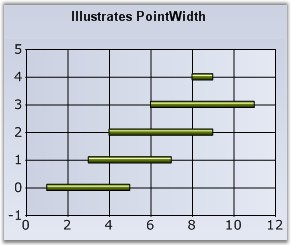

::: {style="DISPLAY: none"}
{#d2h_url_template}{#d2h_package_url style="WIDTH: 0px; DISPLAY: none; HEIGHT: 0px"}
:::

:::: {.d2h_secondary_topic style="PADDING-BOTTOM: 10pt; MARGIN: 0pt; PADDING-LEFT: 0pt; PADDING-RIGHT: 0pt; PADDING-TOP: 0pt"}
#### PointWidth {#pointwidth style="tab-stops: 0pt"}

**[]{style="FONT-FAMILY: 'Trebuchet MS','sans-serif'; FONT-SIZE: 9pt"}** 

Sets the width of this point relative to the total width available. It is very useful to render series that overlap.

[]{style="FONT-FAMILY: 'Trebuchet MS','sans-serif'; FONT-SIZE: 9pt"} 

::: {align="center"}
+---------------------------------------+---------------------------------------+
| **[]{style="FONT-FAMILY: 'Trebuchet MS','sans-serif'; FONT-SIZE: 9pt"}**      |
|                                                                               |
| Details                                                                       |
+---------------------------------------+---------------------------------------+
| Possible Values                       | 0.0F to 1.0F                          |
+---------------------------------------+---------------------------------------+
| Default Value                         | 1.0F                                  |
+---------------------------------------+---------------------------------------+
| 2D / 3D Limitations                   | No                                    |
+---------------------------------------+---------------------------------------+
| Applies to Chart Element              | Any Series                            |
+---------------------------------------+---------------------------------------+
| Applies to Chart Types                | Gantt Chart                           |
+---------------------------------------+---------------------------------------+
:::

**[]{style="FONT-FAMILY: 'Trebuchet MS','sans-serif'; FONT-SIZE: 9pt"}** 

Here is a code snippet using PointWidth in Gantt Chart.

[]{style="FONT-FAMILY: 'Trebuchet MS','sans-serif'; FONT-SIZE: 9pt"} 

Series Wide Setting

[]{style="FONT-FAMILY: 'Trebuchet MS','sans-serif'; FONT-SIZE: 9pt"} 

+-------------------------------------------------------------------------------------------+
| **[\[C#\]]{style="FONT-FAMILY: 'Courier New'; COLOR: black"}**                            |
|                                                                                           |
| **[]{style="FONT-FAMILY: 'Courier New'; COLOR: black"}**                                  |
|                                                                                           |
| [ganttSeries.Style.PointWidth = 0.25f;]{style="FONT-FAMILY: 'Courier New'; COLOR: black"} |
+-------------------------------------------------------------------------------------------+

[]{style="FONT-FAMILY: 'Trebuchet MS','sans-serif'; FONT-SIZE: 9pt"} 

+-----------------------------------------------------------------------------------------------------------------------------------------------------+
| **[\[VB.NET\]]{style="FONT-FAMILY: 'Courier New'; COLOR: black"}**                                                                                  |
|                                                                                                                                                     |
| **[]{style="FONT-FAMILY: 'Courier New'; COLOR: black"}**                                                                                            |
|                                                                                                                                                     |
| [Private]{style="FONT-FAMILY: 'Courier New'; COLOR: blue"}[ ganttSeries.Style.PointWidth = 0.25f]{style="FONT-FAMILY: 'Courier New'; COLOR: black"} |
+-----------------------------------------------------------------------------------------------------------------------------------------------------+

**[]{style="FONT-FAMILY: 'Trebuchet MS','sans-serif'; FONT-SIZE: 9pt"}** 

{border="0"}

**[]{style="FONT-FAMILY: 'Trebuchet MS','sans-serif'; FONT-SIZE: 9pt"}** 

Figure 170: Chart with default PointWidth

**[]{style="FONT-FAMILY: 'Trebuchet MS','sans-serif'; FONT-SIZE: 9pt"}** 

{border="0"}

**[]{style="FONT-FAMILY: 'Courier New'; COLOR: black; FONT-SIZE: 9pt"}** 

Figure 171: Chart with PointWidth set to \"0.25f\"

**[]{style="FONT-FAMILY: 'Trebuchet MS','sans-serif'; FONT-SIZE: 9pt"}** 

Specific Data Point Setting

**[]{style="FONT-FAMILY: 'Trebuchet MS','sans-serif'; FONT-SIZE: 9pt"}** 

You can also set the PointWidth for specific points using **Series.Styles\[0\].PointWidth** for the first data point, **Series.Styles\[1\].PointWidth** for the second data point and so on.

[]{style="FONT-FAMILY: 'Trebuchet MS','sans-serif'; FONT-SIZE: 9pt"} 

+-------------------------------------------------------------------------------------------------+
| **[\[C#\]]{style="FONT-FAMILY: 'Courier New'; COLOR: black"}**                                  |
|                                                                                                 |
| **[]{style="FONT-FAMILY: 'Courier New'; COLOR: black"}**                                        |
|                                                                                                 |
| [ganttSeries.Styles\[0\].PointWidth = 0.25f;]{style="FONT-FAMILY: 'Courier New'; COLOR: black"} |
|                                                                                                 |
| [ganttSeries.Styles\[1\].PointWidth = 0.5f;]{style="FONT-FAMILY: 'Courier New'; COLOR: black"}  |
+-------------------------------------------------------------------------------------------------+

[]{style="FONT-FAMILY: 'Trebuchet MS','sans-serif'; FONT-SIZE: 9pt"} 

+---------------------------------------------------------------------------------------------------------------------------------------------------------+
| **[\[VB.NET\]]{style="FONT-FAMILY: 'Courier New'; COLOR: black"}**                                                                                      |
|                                                                                                                                                         |
| **[]{style="FONT-FAMILY: 'Courier New'; COLOR: black"}**                                                                                                |
|                                                                                                                                                         |
| [Private]{style="FONT-FAMILY: 'Courier New'; COLOR: blue"}[ ganttSeries.Styles(0).PointWidth = 0.25f]{style="FONT-FAMILY: 'Courier New'; COLOR: black"} |
|                                                                                                                                                         |
| [Private]{style="FONT-FAMILY: 'Courier New'; COLOR: blue"}[ ganttSeries.Styles(1).PointWidth = 0.5f]{style="FONT-FAMILY: 'Courier New'; COLOR: black"}  |
+---------------------------------------------------------------------------------------------------------------------------------------------------------+

**[]{style="FONT-FAMILY: 'Trebuchet MS','sans-serif'; FONT-SIZE: 9pt"}** 

See Also

[]{style="FONT-FAMILY: 'Trebuchet MS','sans-serif'; FONT-SIZE: 9pt"} 

[Gantt Chart]{.UGHyperlink}[]{.UGHyperlink}

[]{#p133} 

[]{#related-topics}
::::
