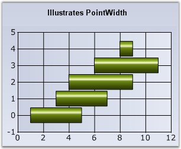

::: {style="DISPLAY: none"}
{#d2h_url_template}{#d2h_package_url style="WIDTH: 0px; DISPLAY: none; HEIGHT: 0px"}
:::

:::: {.d2h_secondary_topic style="PADDING-BOTTOM: 10pt; MARGIN: 0pt; PADDING-LEFT: 0pt; PADDING-RIGHT: 0pt; PADDING-TOP: 0pt"}
#### PointWidth {#pointwidth style="tab-stops: 0pt"}

 

Sets the width of this point relative to the total width available. It is very useful to render series that overlap.

 

::: {align="center"}
+-------------------------------------+-------------------------------------+
|                                                                           |
|                                                                           |
| **Details**                                                               |
+-------------------------------------+-------------------------------------+
| **Possible Values**                 | 0.0F to 1.0F                        |
+-------------------------------------+-------------------------------------+
| **Default Value    **               | **1.0F**                            |
+-------------------------------------+-------------------------------------+
| **2D / 3D Limitations**             | No                                  |
+-------------------------------------+-------------------------------------+
| **Applies to Chart Element**        | Any Series                          |
+-------------------------------------+-------------------------------------+
| **Applies to Chart Types**          | Gantt Chart                         |
+-------------------------------------+-------------------------------------+
:::

 

Here is a code snippet using PointWidth in Gantt Chart.

 

Series Wide Setting

 

+-------------------------------------------------------------------------------------------+
| **[\[C#\]]{style="FONT-FAMILY: 'Courier New'; COLOR: black"}**                            |
|                                                                                           |
| **[]{style="FONT-FAMILY: 'Courier New'; COLOR: black"}**                                  |
|                                                                                           |
| [ganttSeries.Style.PointWidth = 0.25f;]{style="FONT-FAMILY: 'Courier New'; COLOR: black"} |
+-------------------------------------------------------------------------------------------+

 

+-----------------------------------------------------------------------------------------------------------------------------------------------------+
| **[\[VB.NET\]]{style="FONT-FAMILY: 'Courier New'; COLOR: black"}**                                                                                  |
|                                                                                                                                                     |
| **[]{style="FONT-FAMILY: 'Courier New'; COLOR: black"}**                                                                                            |
|                                                                                                                                                     |
| [Private]{style="FONT-FAMILY: 'Courier New'; COLOR: blue"}[ ganttSeries.Style.PointWidth = 0.25f]{style="FONT-FAMILY: 'Courier New'; COLOR: black"} |
+-----------------------------------------------------------------------------------------------------------------------------------------------------+

 

{border="0"}

 

Figure 176: Chart with default PointWidth

 

{border="0"}

**[]{style="FONT-FAMILY: 'Courier New'; COLOR: black"}** 

Figure 177: Chart with PointWidth= 0.25f

 

Specific Data Point Setting

 

You can also set the PointWidth for specific points using **Series.Styles\[0\].PointWidth** for the first data point, **Series.Styles\[1\].PointWidth** for the second data point and so on.

 

+-------------------------------------------------------------------------------------------------+
| **[\[C#\]]{style="FONT-FAMILY: 'Courier New'; COLOR: black"}**                                  |
|                                                                                                 |
| **[]{style="FONT-FAMILY: 'Courier New'; COLOR: black"}**                                        |
|                                                                                                 |
| [ganttSeries.Styles\[0\].PointWidth = 0.25f;]{style="FONT-FAMILY: 'Courier New'; COLOR: black"} |
|                                                                                                 |
| [ganttSeries.Styles\[1\].PointWidth = 0.5f;]{style="FONT-FAMILY: 'Courier New'; COLOR: black"}  |
+-------------------------------------------------------------------------------------------------+

 

+---------------------------------------------------------------------------------------------------------------------------------------------------------+
| **[\[VB.NET\]]{style="FONT-FAMILY: 'Courier New'; COLOR: black"}**                                                                                      |
|                                                                                                                                                         |
| **[]{style="FONT-FAMILY: 'Courier New'; COLOR: black"}**                                                                                                |
|                                                                                                                                                         |
| [Private]{style="FONT-FAMILY: 'Courier New'; COLOR: blue"}[ ganttSeries.Styles(0).PointWidth = 0.25f]{style="FONT-FAMILY: 'Courier New'; COLOR: black"} |
|                                                                                                                                                         |
| [Private]{style="FONT-FAMILY: 'Courier New'; COLOR: blue"}[ ganttSeries.Styles(1).PointWidth = 0.5f]{style="FONT-FAMILY: 'Courier New'; COLOR: black"}  |
+---------------------------------------------------------------------------------------------------------------------------------------------------------+

 

See Also

 

[Gantt Chart]{.UGHyperlink}[]{.UGHyperlink}

 

[]{#p132} 

 

[]{#related-topics}
::::
