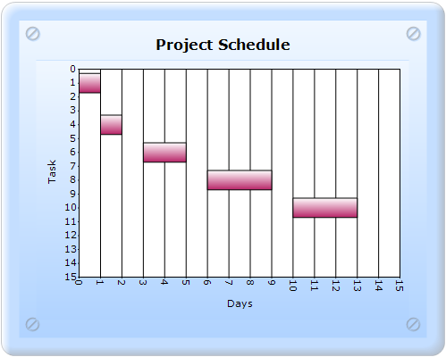
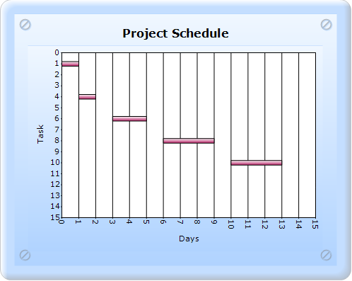
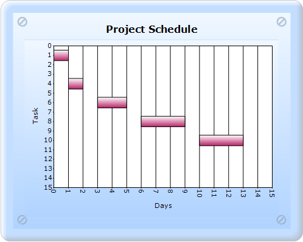

::: {style="DISPLAY: none"}
{#d2h_url_template}{#d2h_package_url style="WIDTH: 0px; DISPLAY: none; HEIGHT: 0px"}
:::

:::::: {.d2h_secondary_topic style="PADDING-BOTTOM: 10pt; MARGIN: 0pt; PADDING-LEFT: 0pt; PADDING-RIGHT: 0pt; PADDING-TOP: 0pt"}
##### PointWidth, PhongAlpha, and Gantt DrawMode {#pointwidth-phongalpha-and-gantt-drawmode style="tab-stops: 0pt"}

###### 5.2.1.3.4.1 PointWidth {#pointwidth style="tab-stops: 0pt"}

PointWidth is used to set the width of the point relative to the available total width. It is very useful to render series that overlap.

 

::: {align="center"}
+------------------------------+--------------+
| Details                                     |
+------------------------------+--------------+
| Possible values              | 0.0F to 1.0F |
+------------------------------+--------------+
| Default value                | 1.0F         |
+------------------------------+--------------+
| 2D/3D limitations            | No           |
+------------------------------+--------------+
| Application to chart element | Any series   |
+------------------------------+--------------+
| Application to chart types   | Gantt chart  |
+------------------------------+--------------+
:::

[]{style="FONT-FAMILY: 'Times New Roman','serif'; FONT-SIZE: 12pt"} 

{border="0"}

Figure 199: Default PointWidth

{border="0"}

Figure 200: PointWidth set as 0.3f

###### 5.2.1.3.4.2 PhongAlpha {#phongalpha style="tab-stops: 0pt"}

PhongAlpha specifies the Phong\'s alpha co-efficient used for calculating specular lighting.

::: {align="center"}
+------------------------------+------------------------------------------------------------------------------------------------------------------------------------------------------------------------------------------+
| Details                                                                                                                                                                                                                 |
+------------------------------+------------------------------------------------------------------------------------------------------------------------------------------------------------------------------------------+
| Possible values              | Any double value.                                                                                                                                                                        |
+------------------------------+------------------------------------------------------------------------------------------------------------------------------------------------------------------------------------------+
| Default value                | 20                                                                                                                                                                                       |
+------------------------------+------------------------------------------------------------------------------------------------------------------------------------------------------------------------------------------+
| 2D/3D limitations            | No                                                                                                                                                                                       |
+------------------------------+------------------------------------------------------------------------------------------------------------------------------------------------------------------------------------------+
| Application to chart element | Any series                                                                                                                                                                               |
+------------------------------+------------------------------------------------------------------------------------------------------------------------------------------------------------------------------------------+
| Application to chart types   | Column chart, Bar chart, Box and Whisker chart, Gantt chart, Histogram chart, Tornado chart, Polar chart, Radar chart, HiLo chart, HiLoOpenClose chart, Candle chart, and Scatter chart. |
+------------------------------+------------------------------------------------------------------------------------------------------------------------------------------------------------------------------------------+
:::

###### 5.2.1.3.4.3 GanttDrawMode {#ganttdrawmode style="tab-stops: 0pt"}

GanttDrawMode specifies the drawing mode of the Gantt chart.

::: {align="center"}
+----------------------------------------------------------------------------------+----------------------------------------------------------------------------------+
| **[                                                                        Details         ]{style="FONT-FAMILY: 'Times New Roman','serif'; FONT-SIZE: 12pt"}**     |
+----------------------------------------------------------------------------------+----------------------------------------------------------------------------------+
| Possible values                                                                  | **AutoSizeMode** - Plots the Gantt chart side-by-side.                           |
|                                                                                  |                                                                                  |
|                                                                                  | **CustomPointWidthMode** - Plots the Gantt chart as overlapped.                  |
+----------------------------------------------------------------------------------+----------------------------------------------------------------------------------+
| Default value                                                                    | CustomPointWidthMode                                                             |
+----------------------------------------------------------------------------------+----------------------------------------------------------------------------------+
| 2D/3D limitations                                                                | None                                                                             |
+----------------------------------------------------------------------------------+----------------------------------------------------------------------------------+
| Application to chart element                                                     | All series                                                                       |
+----------------------------------------------------------------------------------+----------------------------------------------------------------------------------+
| Application to chart types                                                       | Gantt chart                                                                      |
+----------------------------------------------------------------------------------+----------------------------------------------------------------------------------+
:::

{border="0"}

Figure 201: Gantt chart with DrawMode as AutoSizeMode

Gantt chart with PhongAlpha, PointWidth, and GanttDrawMode can be created through two ways:

[·      ]{style="FONT-FAMILY: Symbol"}Builder

[·      ]{style="FONT-FAMILY: Symbol"}ChartModel

###### 5.2.1.3.4.4 Builder {#builder style="tab-stops: 0pt"}

[]{style="FONT-FAMILY: 'Calibri','sans-serif'"} 

To create a Gantt chart with PhongAlpha, PointWidth, and GanttDrawMode through Builder:

1.   In Controller, return view to the corresponding View page.

[]{style="FONT-FAMILY: 'Calibri','sans-serif'"} 

+----------------------------------------------------------------------------------------------------------------------------------+
| \[C#\]                                                                                                                           |
|                                                                                                                                  |
| [        [public]{style="COLOR: blue"} [ActionResult]{style="COLOR: #2b91af"} SimpleChart()]{style="FONT-FAMILY: 'Courier New'"} |
|                                                                                                                                  |
| [        {            ]{style="FONT-FAMILY: 'Courier New'"}                                                                      |
|                                                                                                                                  |
| [            [return]{style="COLOR: blue"} View();]{style="FONT-FAMILY: 'Courier New'"}                                          |
|                                                                                                                                  |
| [        }]{style="FONT-FAMILY: 'Courier New'"}                                                                                  |
|                                                                                                                                  |
| []{style="FONT-FAMILY: Consolas; COLOR: blue; FONT-SIZE: 9.5pt"}                                                                 |
+----------------------------------------------------------------------------------------------------------------------------------+

 

2.   In the View page, invoke the ChartBuilder by using the control ID as the first argument.

3.   Add the **Series** to the ChartModel and set the series type to **Gantt**, and add the **Points** to the series and set the style.

4.   Set the ChartModel and ChartArea properties.

5.   Set PointWidth in Series Style, set GanttConfigItem as **CustomPointWidthMode**, and set ColumnConfigItem.

[]{style="FONT-FAMILY: 'Calibri','sans-serif'"} 

+------------------------------------------------------------------------------------------------------------------------------------------------------------------------------------------------------------------------------------------------------------------------------------------+
| View \[ASPX\]                                                                                                                                                                                                                                                                            |
|                                                                                                                                                                                                                                                                                          |
| [     ]{style="FONT-FAMILY: Consolas; FONT-SIZE: 9.5pt"}[\<%]{style="FONT-FAMILY: 'Courier New'; BACKGROUND: yellow"}[=]{style="FONT-FAMILY: 'Courier New'; COLOR: blue"}[ Html.Chart([\"SimpleChart\"]{style="COLOR: #a31515"}).Series(series =\>{]{style="FONT-FAMILY: 'Courier New'"} |
|                                                                                                                                                                                                                                                                                          |
| [    series.Add().Type(Syncfusion.Windows.Forms.Chart.[ChartSeriesType]{style="COLOR: #2b91af"}.Gantt)]{style="FONT-FAMILY: 'Courier New'"}                                                                                                                                              |
|                                                                                                                                                                                                                                                                                          |
| [                .Text([\"Completion\"]{style="COLOR: #a31515"})]{style="FONT-FAMILY: 'Courier New'"}                                                                                                                                                                                    |
|                                                                                                                                                                                                                                                                                          |
| **[          .Style(style=\>{]{style="FONT-FAMILY: 'Courier New'"}**                                                                                                                                                                                                                     |
|                                                                                                                                                                                                                                                                                          |
| **[              style.PointWidth(0.8f);]{style="FONT-FAMILY: 'Courier New'"}**                                                                                                                                                                                                          |
|                                                                                                                                                                                                                                                                                          |
| **[        })]{style="FONT-FAMILY: 'Courier New'"}**                                                                                                                                                                                                                                     |
|                                                                                                                                                                                                                                                                                          |
| [                .Points(points =\>]{style="FONT-FAMILY: 'Courier New'"}                                                                                                                                                                                                                 |
|                                                                                                                                                                                                                                                                                          |
| [                {]{style="FONT-FAMILY: 'Courier New'"}                                                                                                                                                                                                                                  |
|                                                                                                                                                                                                                                                                                          |
| [                    points.Add(1, 0, 1);]{style="FONT-FAMILY: 'Courier New'"}                                                                                                                                                                                                           |
|                                                                                                                                                                                                                                                                                          |
| [                    points.Add(4, 1, 2);]{style="FONT-FAMILY: 'Courier New'"}                                                                                                                                                                                                           |
|                                                                                                                                                                                                                                                                                          |
| [                    points.Add(6, 3, 5);]{style="FONT-FAMILY: 'Courier New'"}                                                                                                                                                                                                           |
|                                                                                                                                                                                                                                                                                          |
| [                    points.Add(8, 6, 9);]{style="FONT-FAMILY: 'Courier New'"}                                                                                                                                                                                                           |
|                                                                                                                                                                                                                                                                                          |
| [                    points.Add(10, 10, 13);]{style="FONT-FAMILY: 'Courier New'"}                                                                                                                                                                                                        |
|                                                                                                                                                                                                                                                                                          |
| [                    points.Add(12, 15, 18);]{style="FONT-FAMILY: 'Courier New'"}                                                                                                                                                                                                        |
|                                                                                                                                                                                                                                                                                          |
| [                })]{style="FONT-FAMILY: 'Courier New'"}                                                                                                                                                                                                                                 |
|                                                                                                                                                                                                                                                                                          |
| **[                .ConfigItems(configitems =\>]{style="FONT-FAMILY: 'Courier New'"}**                                                                                                                                                                                                   |
|                                                                                                                                                                                                                                                                                          |
| **[                {]{style="FONT-FAMILY: 'Courier New'"}**                                                                                                                                                                                                                              |
|                                                                                                                                                                                                                                                                                          |
| **[                    configitems.GanttItem(item =\>]{style="FONT-FAMILY: 'Courier New'"}**                                                                                                                                                                                             |
|                                                                                                                                                                                                                                                                                          |
| **[                    {]{style="FONT-FAMILY: 'Courier New'"}**                                                                                                                                                                                                                          |
|                                                                                                                                                                                                                                                                                          |
| **[                        item.DrawMode(Syncfusion.Windows.Forms.Chart.[ChartGanttDrawMode]{style="COLOR: #2b91af"}.CustomPointWidthMode);]{style="FONT-FAMILY: 'Courier New'"}**                                                                                                       |
|                                                                                                                                                                                                                                                                                          |
| **[                    });]{style="FONT-FAMILY: 'Courier New'"}**                                                                                                                                                                                                                        |
|                                                                                                                                                                                                                                                                                          |
| **[                    configitems.ColumnItem(item=\>{]{style="FONT-FAMILY: 'Courier New'"}**                                                                                                                                                                                            |
|                                                                                                                                                                                                                                                                                          |
| **[                        item.PhongAlpha(20);]{style="FONT-FAMILY: 'Courier New'"}**                                                                                                                                                                                                   |
|                                                                                                                                                                                                                                                                                          |
| **[                    });]{style="FONT-FAMILY: 'Courier New'"}**                                                                                                                                                                                                                        |
|                                                                                                                                                                                                                                                                                          |
| **[                });  ]{style="FONT-FAMILY: 'Courier New'"}**                                                                                                                                                                                                                          |
|                                                                                                                                                                                                                                                                                          |
| **[            })]{style="FONT-FAMILY: 'Courier New'"}**                                                                                                                                                                                                                                 |
|                                                                                                                                                                                                                                                                                          |
| [//\-\-\-\-\-\-\-\-\-\-\-\-- Set ChartModel and Chart Properties that you want\-\-\-\-\-\-\-\-\--]{style="FONT-FAMILY: 'Courier New'; COLOR: green"}[]{style="FONT-FAMILY: 'Courier New'"}                                                                                               |
|                                                                                                                                                                                                                                                                                          |
| [        ]{style="FONT-FAMILY: 'Courier New'"}                                                                                                                                                                                                                                           |
|                                                                                                                                                                                                                                                                                          |
| [    [%\>]{style="BACKGROUND: yellow"}]{style="FONT-FAMILY: 'Courier New'"}                                                                                                                                                                                                              |
|                                                                                                                                                                                                                                                                                          |
| []{style="FONT-FAMILY: Consolas; COLOR: blue; FONT-SIZE: 9.5pt"}                                                                                                                                                                                                                         |
+------------------------------------------------------------------------------------------------------------------------------------------------------------------------------------------------------------------------------------------------------------------------------------------+

 

+--------------------------------------------------------------------------------------------------------------------------------------------------------------------------------------------------------------------------------------+
| View \[cshtml\]                                                                                                                                                                                                                      |
|                                                                                                                                                                                                                                      |
| [     ]{style="FONT-FAMILY: Consolas; FONT-SIZE: 9.5pt"}[\@{]{style="FONT-FAMILY: 'Courier New'; BACKGROUND: yellow"}[ Html.Chart([\"SimpleChart\"]{style="COLOR: #a31515"}).Series(series =\>{]{style="FONT-FAMILY: 'Courier New'"} |
|                                                                                                                                                                                                                                      |
| [    series.Add().Type(Syncfusion.Windows.Forms.Chart.[ChartSeriesType]{style="COLOR: #2b91af"}.Gantt)]{style="FONT-FAMILY: 'Courier New'"}                                                                                          |
|                                                                                                                                                                                                                                      |
| [                .Text([\"Completion\"]{style="COLOR: #a31515"})]{style="FONT-FAMILY: 'Courier New'"}                                                                                                                                |
|                                                                                                                                                                                                                                      |
| **[          .Style(style=\>{]{style="FONT-FAMILY: 'Courier New'"}**                                                                                                                                                                 |
|                                                                                                                                                                                                                                      |
| **[              style.PointWidth(0.8f);]{style="FONT-FAMILY: 'Courier New'"}**                                                                                                                                                      |
|                                                                                                                                                                                                                                      |
| **[        })]{style="FONT-FAMILY: 'Courier New'"}**                                                                                                                                                                                 |
|                                                                                                                                                                                                                                      |
| [                .Points(points =\>]{style="FONT-FAMILY: 'Courier New'"}                                                                                                                                                             |
|                                                                                                                                                                                                                                      |
| [                {]{style="FONT-FAMILY: 'Courier New'"}                                                                                                                                                                              |
|                                                                                                                                                                                                                                      |
| [                    points.Add(1, 0, 1);]{style="FONT-FAMILY: 'Courier New'"}                                                                                                                                                       |
|                                                                                                                                                                                                                                      |
| [                    points.Add(4, 1, 2);]{style="FONT-FAMILY: 'Courier New'"}                                                                                                                                                       |
|                                                                                                                                                                                                                                      |
| [                    points.Add(6, 3, 5);]{style="FONT-FAMILY: 'Courier New'"}                                                                                                                                                       |
|                                                                                                                                                                                                                                      |
| [                    points.Add(8, 6, 9);]{style="FONT-FAMILY: 'Courier New'"}                                                                                                                                                       |
|                                                                                                                                                                                                                                      |
| [                    points.Add(10, 10, 13);]{style="FONT-FAMILY: 'Courier New'"}                                                                                                                                                    |
|                                                                                                                                                                                                                                      |
| [                    points.Add(12, 15, 18);]{style="FONT-FAMILY: 'Courier New'"}                                                                                                                                                    |
|                                                                                                                                                                                                                                      |
| [                })]{style="FONT-FAMILY: 'Courier New'"}                                                                                                                                                                             |
|                                                                                                                                                                                                                                      |
| **[                .ConfigItems(configitems =\>]{style="FONT-FAMILY: 'Courier New'"}**                                                                                                                                               |
|                                                                                                                                                                                                                                      |
| **[                {]{style="FONT-FAMILY: 'Courier New'"}**                                                                                                                                                                          |
|                                                                                                                                                                                                                                      |
| **[                    configitems.GanttItem(item =\>]{style="FONT-FAMILY: 'Courier New'"}**                                                                                                                                         |
|                                                                                                                                                                                                                                      |
| **[                    {]{style="FONT-FAMILY: 'Courier New'"}**                                                                                                                                                                      |
|                                                                                                                                                                                                                                      |
| **[                        item.DrawMode(Syncfusion.Windows.Forms.Chart.[ChartGanttDrawMode]{style="COLOR: #2b91af"}.CustomPointWidthMode);]{style="FONT-FAMILY: 'Courier New'"}**                                                   |
|                                                                                                                                                                                                                                      |
| **[                    });]{style="FONT-FAMILY: 'Courier New'"}**                                                                                                                                                                    |
|                                                                                                                                                                                                                                      |
| **[                    configitems.ColumnItem(item=\>{]{style="FONT-FAMILY: 'Courier New'"}**                                                                                                                                        |
|                                                                                                                                                                                                                                      |
| **[                        item.PhongAlpha(20);]{style="FONT-FAMILY: 'Courier New'"}**                                                                                                                                               |
|                                                                                                                                                                                                                                      |
| **[                    });]{style="FONT-FAMILY: 'Courier New'"}**                                                                                                                                                                    |
|                                                                                                                                                                                                                                      |
| **[                });  ]{style="FONT-FAMILY: 'Courier New'"}**                                                                                                                                                                      |
|                                                                                                                                                                                                                                      |
| **[            })]{style="FONT-FAMILY: 'Courier New'"}**[.Render();]{style="FONT-FAMILY: 'Courier New'"}                                                                                                                             |
|                                                                                                                                                                                                                                      |
| [//\-\-\-\-\-\-\-\-\-\-\-\-- Set ChartModel and Chart Properties what you want\-\-\-\-\-\-\-\-\--]{style="FONT-FAMILY: 'Courier New'; COLOR: green"}[]{style="FONT-FAMILY: 'Courier New'"}                                           |
|                                                                                                                                                                                                                                      |
| [        ]{style="FONT-FAMILY: 'Courier New'"}                                                                                                                                                                                       |
|                                                                                                                                                                                                                                      |
| [    [}]{style="BACKGROUND: yellow"}]{style="FONT-FAMILY: 'Courier New'"}[]{style="FONT-FAMILY: Consolas; COLOR: blue; FONT-SIZE: 9.5pt"}                                                                                            |
+--------------------------------------------------------------------------------------------------------------------------------------------------------------------------------------------------------------------------------------+

 

 

6.   Build and run the application, to get the following output:

[]{style="FONT-FAMILY: 'Calibri','sans-serif'"} 

{border="0"}

Figure 202: Gantt chart with DrawMode as CustomPointWidthMode,

PointWidth as 0.8f, and PhongAlpha as 20

###### 5.2.1.3.4.5 ChartModel {#chartmodel style="tab-stops: 0pt"}

[]{style="FONT-FAMILY: 'Calibri','sans-serif'"} 

To create a Gantt chart with PhongAlpha, PointWidth, and GanttDrawMode through:

 

1.   In Controller, create an instance of **MVCChartModel**.

2.   Create an instance of **ChartSeries**, and set the SeriesType to **Gantt**.

3.   Set the ChartSeries, ChartArea, and ChartModel properties.

4.   Return view to the corresponding View page after setting the ChartModel to the ViewData.

5.   Set PointWidth in Series Style, set GanttConfigItem as **CustomPointWidthMode**, and set ColumnConfigItem.

[]{style="FONT-FAMILY: 'Calibri','sans-serif'"} 

+-----------------------------------------------------------------------------------------------------------------------------------------------------------------------------------------------------------------------------------------------------------------------+
| \[C#\]                                                                                                                                                                                                                                                                |
|                                                                                                                                                                                                                                                                       |
|                                                                                                                                                                                                                                                                       |
|                                                                                                                                                                                                                                                                       |
| [     ]{style="FONT-FAMILY: Consolas; FONT-SIZE: 9.5pt"}[public]{style="FONT-FAMILY: 'Courier New'; COLOR: blue"}[ [ActionResult]{style="COLOR: #2b91af"} SimpleChart()]{style="FONT-FAMILY: 'Courier New'"}                                                          |
|                                                                                                                                                                                                                                                                       |
| [        {]{style="FONT-FAMILY: 'Courier New'"}                                                                                                                                                                                                                       |
|                                                                                                                                                                                                                                                                       |
| [           [MVCChartModel]{style="COLOR: #2b91af"} chartModel = [new]{style="COLOR: blue"} [MVCChartModel]{style="COLOR: #2b91af"}();]{style="FONT-FAMILY: 'Courier New'"}                                                                                           |
|                                                                                                                                                                                                                                                                       |
| []{style="FONT-FAMILY: 'Courier New'"}                                                                                                                                                                                                                                |
|                                                                                                                                                                                                                                                                       |
| [            [// Create chart series and add data points to it.]{style="COLOR: green"}]{style="FONT-FAMILY: 'Courier New'"}                                                                                                                                           |
|                                                                                                                                                                                                                                                                       |
| **[            [ChartSeries]{style="COLOR: #2b91af"} Completion = [new]{style="COLOR: blue"} [ChartSeries]{style="COLOR: #2b91af"}([\"Completion\"]{style="COLOR: #a31515"}, [ChartSeriesType]{style="COLOR: #2b91af"}.Gantt);]{style="FONT-FAMILY: 'Courier New'"}** |
|                                                                                                                                                                                                                                                                       |
| []{style="FONT-FAMILY: 'Courier New'"}                                                                                                                                                                                                                                |
|                                                                                                                                                                                                                                                                       |
| [            Completion.Points.Add(1, 0, 1);]{style="FONT-FAMILY: 'Courier New'"}                                                                                                                                                                                     |
|                                                                                                                                                                                                                                                                       |
| [            Completion.Points.Add(4, 1, 2);]{style="FONT-FAMILY: 'Courier New'"}                                                                                                                                                                                     |
|                                                                                                                                                                                                                                                                       |
| [            Completion.Points.Add(6, 3, 5);]{style="FONT-FAMILY: 'Courier New'"}                                                                                                                                                                                     |
|                                                                                                                                                                                                                                                                       |
| [            Completion.Points.Add(8, 6, 9);]{style="FONT-FAMILY: 'Courier New'"}                                                                                                                                                                                     |
|                                                                                                                                                                                                                                                                       |
| [            Completion.Points.Add(10, 10, 13);]{style="FONT-FAMILY: 'Courier New'"}                                                                                                                                                                                  |
|                                                                                                                                                                                                                                                                       |
| [            Completion.Points.Add(12, 15, 18);]{style="FONT-FAMILY: 'Courier New'"}                                                                                                                                                                                  |
|                                                                                                                                                                                                                                                                       |
| **[            Completion.Style.PointWidth = 0.8f;]{style="FONT-FAMILY: 'Courier New'"}**                                                                                                                                                                             |
|                                                                                                                                                                                                                                                                       |
| **[            Completion.ConfigItems.GanttItem.DrawMode = [ChartGanttDrawMode]{style="COLOR: #2b91af"}.CustomPointWidthMode;]{style="FONT-FAMILY: 'Courier New'"}**                                                                                                  |
|                                                                                                                                                                                                                                                                       |
| **[            Completion.ConfigItems.ColumnItem.PhongAlpha = 20;]{style="FONT-FAMILY: 'Courier New'"}**                                                                                                                                                              |
|                                                                                                                                                                                                                                                                       |
| []{style="FONT-FAMILY: 'Courier New'"}                                                                                                                                                                                                                                |
|                                                                                                                                                                                                                                                                       |
| [            [// Add the series to the chart series collection.]{style="COLOR: green"}]{style="FONT-FAMILY: 'Courier New'"}                                                                                                                                           |
|                                                                                                                                                                                                                                                                       |
| [            **chartModel.Series.Add(Completion);**]{style="FONT-FAMILY: 'Courier New'"}                                                                                                                                                                              |
|                                                                                                                                                                                                                                                                       |
| []{style="FONT-FAMILY: 'Courier New'"}                                                                                                                                                                                                                                |
|                                                                                                                                                                                                                                                                       |
| [//\-\-\-\-\-\-\-\-\-\-\-\-- Set the ChartModel and Chart Properties that you want\-\-\-\-\-\-\-\-\--]{style="FONT-FAMILY: 'Courier New'; COLOR: green"}[            ViewData.Model = chartModel;]{style="FONT-FAMILY: 'Courier New'"}                                |
|                                                                                                                                                                                                                                                                       |
| []{style="FONT-FAMILY: 'Courier New'"}                                                                                                                                                                                                                                |
|                                                                                                                                                                                                                                                                       |
| [            [return]{style="COLOR: blue"} View();]{style="FONT-FAMILY: 'Courier New'"}                                                                                                                                                                               |
|                                                                                                                                                                                                                                                                       |
| [        }]{style="FONT-FAMILY: 'Courier New'"}                                                                                                                                                                                                                       |
|                                                                                                                                                                                                                                                                       |
| []{style="FONT-FAMILY: Consolas; COLOR: blue; FONT-SIZE: 9.5pt"}                                                                                                                                                                                                      |
+-----------------------------------------------------------------------------------------------------------------------------------------------------------------------------------------------------------------------------------------------------------------------+

[]{style="FONT-FAMILY: Consolas; FONT-SIZE: 9.5pt"} 

[]{style="FONT-FAMILY: Consolas; FONT-SIZE: 9.5pt"} 

6.   In the View page, invoke the ChartBuilder by using the control ID as the first argument, and convert the ViewData to **MVCChartModel** and set it as the second argument.

[]{style="FONT-FAMILY: Consolas; FONT-SIZE: 9.5pt"} 

+---------------------------------------------------------------------------------------------------------------------------------------------------------------------------------------------------------------------------------------------------------------------------------------------------------+
| View \[ASPX\]                                                                                                                                                                                                                                                                                           |
|                                                                                                                                                                                                                                                                                                         |
| []{style="FONT-FAMILY: 'Courier New'; FONT-SIZE: 12pt"}                                                                                                                                                                                                                                                 |
|                                                                                                                                                                                                                                                                                                         |
| [\<%]{style="FONT-FAMILY: 'Courier New'; BACKGROUND: yellow"}[=]{style="FONT-FAMILY: 'Courier New'; COLOR: blue"}[ Html.Chart([\"SimpleChart\"]{style="COLOR: #a31515"},([MVCChartModel]{style="COLOR: #2b91af"})ViewData.Model) [%\>]{style="BACKGROUND: yellow"}]{style="FONT-FAMILY: 'Courier New'"} |
|                                                                                                                                                                                                                                                                                                         |
| []{style="FONT-FAMILY: Consolas; COLOR: blue; FONT-SIZE: 9.5pt"}                                                                                                                                                                                                                                        |
+---------------------------------------------------------------------------------------------------------------------------------------------------------------------------------------------------------------------------------------------------------------------------------------------------------+

[]{style="FONT-FAMILY: 'Calibri','sans-serif'"} 

+--------------------------------------------------------------------------------------------------------------------------------------------------------------------------------------------------------------------------------------------------------------------------------------------------------------------------------------------------------------------------------------------------------+
| View \[cshtml\]                                                                                                                                                                                                                                                                                                                                                                                        |
|                                                                                                                                                                                                                                                                                                                                                                                                        |
| [  [@(]{style="BACKGROUND: yellow"}[new]{style="COLOR: blue"} [HtmlString]{style="COLOR: #2b91af"}(]{style="FONT-FAMILY: Consolas; FONT-SIZE: 9.5pt"}[Html.Chart([\"SimpleChart\"]{style="COLOR: #a31515"},([MVCChartModel]{style="COLOR: #2b91af"})ViewData.Model)]{style="FONT-FAMILY: 'Courier New'"}[.ToString())[)]{style="BACKGROUND: yellow"}]{style="FONT-FAMILY: Consolas; FONT-SIZE: 9.5pt"} |
|                                                                                                                                                                                                                                                                                                                                                                                                        |
| []{style="FONT-FAMILY: Consolas; COLOR: blue; FONT-SIZE: 9.5pt"}                                                                                                                                                                                                                                                                                                                                       |
+--------------------------------------------------------------------------------------------------------------------------------------------------------------------------------------------------------------------------------------------------------------------------------------------------------------------------------------------------------------------------------------------------------+

[]{style="FONT-FAMILY: 'Calibri','sans-serif'"} 

[]{style="FONT-FAMILY: 'Calibri','sans-serif'"} 

7.   Build and run the application, to get the following output:

[]{style="FONT-FAMILY: 'Calibri','sans-serif'"} 

{border="0"}

Figure 203: Gantt chart with DrawMode as CustomPointWidthMode,

PointWidth as 0.8f, and PhongAlpha as 20

See Also

[Column Chart]{style="COLOR: windowtext; TEXT-DECORATION: none; text-underline: none"}, [Bar Chart]{style="COLOR: windowtext; TEXT-DECORATION: none; text-underline: none"}, [Box and Whisker Chart]{style="COLOR: windowtext; TEXT-DECORATION: none; text-underline: none"}, [Gantt Chart]{style="COLOR: windowtext; TEXT-DECORATION: none; text-underline: none"},[ Histogram Chart]{style="COLOR: windowtext; TEXT-DECORATION: none; text-underline: none"}, [Tornado Chart,]{style="COLOR: windowtext; TEXT-DECORATION: none; text-underline: none"} [Polar and Radar Chart]{style="COLOR: windowtext; TEXT-DECORATION: none; text-underline: none"}, [HiLo Chart]{style="COLOR: windowtext; TEXT-DECORATION: none; text-underline: none"}, [HiLoOpenClose Chart]{style="COLOR: windowtext; TEXT-DECORATION: none; text-underline: none"}, [Candle Chart]{style="COLOR: windowtext; TEXT-DECORATION: none; text-underline: none"}, [Scatter Chart]{style="COLOR: windowtext; TEXT-DECORATION: none; text-underline: none"}

[]{style="FONT-FAMILY: 'Times New Roman','serif'; FONT-SIZE: 12pt"} 

[]{#related-topics}
::::::
