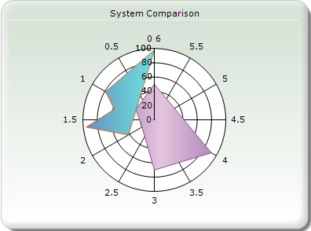
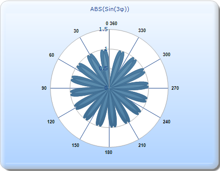

::: {style="DISPLAY: none"}
{#d2h_url_template}{#d2h_package_url style="WIDTH: 0px; DISPLAY: none; HEIGHT: 0px"}
:::

::::: {#nsbanner .d2h_main_nsbanner style="BORDER-BOTTOM: #999999 1px solid; POSITION: relative; PADDING-BOTTOM: 0px; BACKGROUND-COLOR: transparent; PADDING-LEFT: 0px; PADDING-RIGHT: 0px; DISPLAY: none; BORDER-TOP: #999999 1px solid; PADDING-TOP: 0px; LEFT: 0px"}
:::: {#TitleRow .d2h_main_titlerow style="PADDING-BOTTOM: 4px; BACKGROUND-COLOR: transparent; PADDING-LEFT: 22px; WIDTH: 100%; PADDING-RIGHT: 10px; DISPLAY: none; PADDING-TOP: 4px"}
::: {#ienav .d2h_main_ienav style="DISPLAY: none"}
{#D2HPrevious .D2HPreviousEnabled}  {#D2HNext .D2HNextEnabled}
:::
::::
:::::

:::::: {#nstext .d2h_main_nstext style="PADDING-BOTTOM: 10px; BACKGROUND-COLOR: transparent; PADDING-LEFT: 22px; PADDING-RIGHT: 10px; HEIGHT: 100%; OVERFLOW: auto; PADDING-TOP: 5px" hasuserbackground="true" valign="bottom"}
::: {#d2h_breadcrumbs .d2h_breadcrumbs}
[Essential Studio User Guide Documentation](ms-xhelp:///?Id=12457748-09e3-4d74-a240-8e049cedf030){.d2h_breadcrumbsNormal}[ \> ]{.d2h_breadcrumbsLinkSeparator}[User Interface Edition](ms-xhelp:///?Id=c29296b7-531c-413b-a0ec-488ca1f7f669){.d2h_breadcrumbsNormal}[ \> ]{.d2h_breadcrumbsLinkSeparator}[Essential ASP.NET MVC](ms-xhelp:///?Id=4b14e7d1-65c4-4f67-b1aa-2c37709905a5){.d2h_breadcrumbsNormal}[ \> ]{.d2h_breadcrumbsLinkSeparator}[Essential Chart]{.d2h_breadcrumbsContentsOnly}[ \> ]{.d2h_breadcrumbsLinkSeparator}[Concepts and Features](ms-xhelp:///?Id=696f5666-8b81-4685-9bd9-12198f06f3ad){.d2h_breadcrumbsNormal}[ \> ]{.d2h_breadcrumbsLinkSeparator}[Chart Types](ms-xhelp:///?Id=b1c36bab-b337-4f30-b4a8-ef54242458c8){.d2h_breadcrumbsNormal}
:::

### Polar Chart {#polar-chart style="tab-stops: 0pt"}

 

A Polar chart is a circular graph, where data is displayed in terms of values and angles, which are expressed as X and Y axes on the graph. The X value defines the angle at which the data points are plotted, usually on the perimeter of the circle. The Y value defines the distance of the data points from the center of the graph, starting at 0.

This allows a visual comparison between the several quantitative or qualitative aspects of a data and several data points drawn by using the same axes (poles).

[]{style="FONT-FAMILY: 'Times New Roman','serif'; FONT-SIZE: 12pt"} 

{border="0"}

Figure 141: Polar chart

Example

 

The following example shows how a Polar chart can be used. The following table provides the data set for the chart:

 

::: {align="center"}
  ------------------ --------------
  Angle in Degrees   ABS(Sin(3x))
  45                 0.70
  90                 -1
  135                0.70
  180                0
  225                -0.70
  270                1
  315                -0.70
  360                0
  ------------------ --------------
:::

 

In this example, the angles are plotted on the X-axis (0-360). The Y axis points are plotted from 0-1.5. The values of ABS(Sin(3x)) lie between 0-1, hence it can be seen that most of the data points are restricted to the inner circle (till 1) falling under various circular sectors.

[]{style="FONT-FAMILY: 'Times New Roman','serif'; FONT-SIZE: 12pt"} 

{border="0"}[]{style="FONT-FAMILY: 'Times New Roman','serif'; FONT-SIZE: 12pt"}

Figure 142: Example of a Polar chart

Chart Details

The following table provides details pertaining to the Polar chart:

 

::: {align="center"}
+----------------------------------------+-----------------+
| Details                                                  |
+----------------------------------------+-----------------+
| Number of series of Y values per point | One             |
+----------------------------------------+-----------------+
| Number of Series                       | Two             |
+----------------------------------------+-----------------+
| Cannot be Combined with                | Any other type. |
+----------------------------------------+-----------------+
:::

[]{style="FONT-FAMILY: 'Times New Roman','serif'; FONT-SIZE: 12pt"} 

More:

[ ]{#related-topics}

[{border="0" align="absMiddle"}Creating a Polar Chart](ms-xhelp:///?Id=1dd1f3c4-1231-4846-9685-1c3cb1c31c8e){style="TEXT-DECORATION: none"}
::::::
