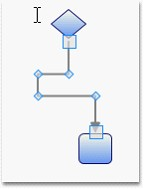

::: {style="DISPLAY: none"}
{#d2h_url_template}{#d2h_package_url style="WIDTH: 0px; DISPLAY: none; HEIGHT: 0px"}
:::

::::: {#nsbanner .d2h_main_nsbanner style="BORDER-BOTTOM: #999999 1px solid; POSITION: relative; PADDING-BOTTOM: 0px; BACKGROUND-COLOR: transparent; PADDING-LEFT: 0px; PADDING-RIGHT: 0px; DISPLAY: none; BORDER-TOP: #999999 1px solid; PADDING-TOP: 0px; LEFT: 0px"}
:::: {#TitleRow .d2h_main_titlerow style="PADDING-BOTTOM: 4px; BACKGROUND-COLOR: transparent; PADDING-LEFT: 22px; WIDTH: 100%; PADDING-RIGHT: 10px; DISPLAY: none; PADDING-TOP: 4px"}
::: {#ienav .d2h_main_ienav style="DISPLAY: none"}
{#D2HPrevious .D2HPreviousEnabled}  {#D2HNext .D2HNextEnabled}
:::
::::
:::::

:::: {#nstext .d2h_main_nstext style="PADDING-BOTTOM: 10px; BACKGROUND-COLOR: transparent; PADDING-LEFT: 22px; PADDING-RIGHT: 10px; HEIGHT: 100%; OVERFLOW: auto; PADDING-TOP: 5px" hasuserbackground="true" valign="bottom"}
::: {#d2h_breadcrumbs .d2h_breadcrumbs}
[Essential Studio User Guide Documentation](ms-xhelp:///?Id=12457748-09e3-4d74-a240-8e049cedf030){.d2h_breadcrumbsNormal}[ \> ]{.d2h_breadcrumbsLinkSeparator}[User Interface Edition](ms-xhelp:///?Id=c29296b7-531c-413b-a0ec-488ca1f7f669){.d2h_breadcrumbsNormal}[ \> ]{.d2h_breadcrumbsLinkSeparator}[Essential Silverlight](ms-xhelp:///?Id=66221bd1-ba2e-43c2-94a7-618f50e01d24){.d2h_breadcrumbsNormal}[ \> ]{.d2h_breadcrumbsLinkSeparator}[Essential Diagram]{.d2h_breadcrumbsContentsOnly}[ \> ]{.d2h_breadcrumbsLinkSeparator}[Concepts and Features](ms-xhelp:///?Id=d592a058-dcc0-44a4-994e-e7901da8db52){.d2h_breadcrumbsNormal}[ \> ]{.d2h_breadcrumbsLinkSeparator}[Line Connectors](ms-xhelp:///?Id=c0725ce8-38f1-496a-8a8e-c6602250e6b6){.d2h_breadcrumbsNormal}
:::

### Polyline {#polyline style="tab-stops: 0pt"}

Line connector can be used to draw polylines using **IntermediatePoints** property. Polylines are drawn using intermediate points for straight lines and orthogonal line connectors. For orthogonal lines, intermediate points are updated so that the adjacent line segments are always perpendicular to each other. These intermediate points are visually represented as vertex.

 

Properties, Methods and Events tables

[]{style="FONT-FAMILY: 'Trebuchet MS','sans-serif'; COLOR: #15428b"} 

  -------------------- --------------------------------------- --------------------- ------------------ -----------------
  Property             Description                             Type                  Value it accepts   Reference links
  IntermediatePoints   Gets or sets the intermediate points.   Dependency property   List\<Point\>      No
  -------------------- --------------------------------------- --------------------- ------------------ -----------------

[]{style="FONT-FAMILY: 'Trebuchet MS','sans-serif'; COLOR: #15428b; FONT-SIZE: 9pt"} 

Polylines

[]{style="FONT-FAMILY: 'Trebuchet MS','sans-serif'; COLOR: #15428b; FONT-SIZE: 9pt"} 

Straight line connectors can be used as poly line by using **IntermediatePoints** property. This can be achieved at run time by holding Ctrl + Shift and Click on the line, or by simply changing the **IntermediatePoints** collection. This will reflect in the line connector.

[]{style="FONT-FAMILY: 'Trebuchet MS','sans-serif'; COLOR: #15428b; FONT-SIZE: 9pt"} 

{border="0"}

Figure 56: Polyline

[]{style="FONT-FAMILY: 'Trebuchet MS','sans-serif'; COLOR: #15428b; FONT-SIZE: 9pt"} 

Poly Orthogonal Lines

**[]{style="FONT-FAMILY: 'Trebuchet MS','sans-serif'; COLOR: #15428b; FONT-SIZE: 9pt"}** 

Orthogonal lines can have more than two intermediate points. All these Intermediate points are can be dragged. Unlike straight lines, orthogonal lines maintain their perpendicularity even after the intermediate points are dragged.

[]{style="FONT-FAMILY: 'Trebuchet MS','sans-serif'; COLOR: #15428b; FONT-SIZE: 9pt"} 

{border="0"}

Figure 57: Poly Orthogonal Lines

[]{style="FONT-FAMILY: 'Trebuchet MS','sans-serif'; COLOR: #15428b; FONT-SIZE: 9pt"} 

More:

[ ]{#related-topics}

[{border="0" align="absMiddle"}Intermediate Points](ms-xhelp:///?Id=568168ce-5521-4391-9ac0-024c0c48eecd){style="TEXT-DECORATION: none"}

[{border="0" align="absMiddle"}Vertex Template for Intermediate Points](ms-xhelp:///?Id=12b503e6-1c81-44da-8ee6-0a57acf54d94){style="TEXT-DECORATION: none"}

[{border="0" align="absMiddle"}Template for End Points](ms-xhelp:///?Id=0a8d8fdc-e14d-4a04-b016-7141826f4332){style="TEXT-DECORATION: none"}

[{border="0" align="absMiddle"}Hide Vertex](ms-xhelp:///?Id=9c69d010-af43-4957-9813-0acbc846310d){style="TEXT-DECORATION: none"}

[{border="0" align="absMiddle"}Hide Decorator Adorner](ms-xhelp:///?Id=2ce62341-3246-46c0-a43e-a0e0359d4bfd){style="TEXT-DECORATION: none"}

[{border="0" align="absMiddle"}Arresting Vertex Drag](ms-xhelp:///?Id=cdec6f87-1a2b-4d36-8161-5b2d63214b96){style="TEXT-DECORATION: none"}

[{border="0" align="absMiddle"}Arresting Decorator Drag](ms-xhelp:///?Id=e9d11c7c-8448-4150-b810-d8e309e7e02c){style="TEXT-DECORATION: none"}
::::
