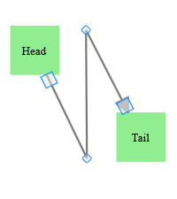
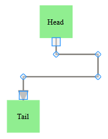

::: {style="DISPLAY: none"}
{#d2h_url_template}{#d2h_package_url style="WIDTH: 0px; DISPLAY: none; HEIGHT: 0px"}
:::

::::: {#nsbanner .d2h_main_nsbanner style="BORDER-BOTTOM: #999999 1px solid; POSITION: relative; PADDING-BOTTOM: 0px; BACKGROUND-COLOR: transparent; PADDING-LEFT: 0px; PADDING-RIGHT: 0px; DISPLAY: none; BORDER-TOP: #999999 1px solid; PADDING-TOP: 0px; LEFT: 0px"}
:::: {#TitleRow .d2h_main_titlerow style="PADDING-BOTTOM: 4px; BACKGROUND-COLOR: transparent; PADDING-LEFT: 22px; WIDTH: 100%; PADDING-RIGHT: 10px; DISPLAY: none; PADDING-TOP: 4px"}
::: {#ienav .d2h_main_ienav style="DISPLAY: none"}
{#D2HPrevious .D2HPreviousEnabled}  {#D2HNext .D2HNextEnabled}
:::
::::
:::::

:::: {#nstext .d2h_main_nstext style="PADDING-BOTTOM: 10px; BACKGROUND-COLOR: transparent; PADDING-LEFT: 22px; PADDING-RIGHT: 10px; HEIGHT: 100%; OVERFLOW: auto; PADDING-TOP: 5px" hasuserbackground="true" valign="bottom"}
::: {#d2h_breadcrumbs .d2h_breadcrumbs}
[Essential Studio User Guide Documentation](ms-xhelp:///?Id=12457748-09e3-4d74-a240-8e049cedf030){.d2h_breadcrumbsNormal}[ \> ]{.d2h_breadcrumbsLinkSeparator}[User Interface Edition](ms-xhelp:///?Id=c29296b7-531c-413b-a0ec-488ca1f7f669){.d2h_breadcrumbsNormal}[ \> ]{.d2h_breadcrumbsLinkSeparator}[Essential ASP.NET MVC](ms-xhelp:///?Id=4b14e7d1-65c4-4f67-b1aa-2c37709905a5){.d2h_breadcrumbsNormal}[ \> ]{.d2h_breadcrumbsLinkSeparator}[Essential Diagram]{.d2h_breadcrumbsContentsOnly}[ \> ]{.d2h_breadcrumbsLinkSeparator}[Concepts and Features](ms-xhelp:///?Id=04839cdf-94fc-4d24-9f6b-119fdbd7bbfb){.d2h_breadcrumbsNormal}[ \> ]{.d2h_breadcrumbsLinkSeparator}[Line Connector](ms-xhelp:///?Id=c7ae1b55-3b10-4b74-889d-cf088e9eca27){.d2h_breadcrumbsNormal}
:::

### Polyline {#polyline style="tab-stops: 0pt"}

Line connectors can be used to draw polylines using the **IntermediatePoints** property. Polylines are drawn using intermediate points for straight lines and orthogonal line connectors. For orthogonal lines, intermediate points are updated so that the adjacent line segments are always perpendicular to each other. These intermediate points are visually represented as vertices.

 

**Polylines**

Straight line connectors can be used as polylines by using the **IntermediatePoints** property. This can be achieved at run time by holding CTRL + SHIFT and clicking on the line, or by simply changing the **IntermediatePoints** collection. This will be reflected in the line connector.

{border="0"}

Figure 65: Polyline

**Poly-Orthogonal Lines**

Orthogonal lines can have more than two intermediate points. All these intermediate points can be dragged. Unlike straight lines, orthogonal lines maintain their perpendicularity even after the intermediate points are dragged.

{border="0"}

Figure 66: Poly-Orthogonal Line

Use Case Scenarios

[[Polylines can be used in such cases as connecting elements in a flow chart.]{style="COLOR: black"}]{.apple-style-span}

 

Properties

+----------------------------------------------+-----------------------------------------------------------------------+-------------------------------------------------------------------------------------+---------------------------------------------------------------------------------------------+
| **Property**                                 | **Description**                                                       | **Type**                                                                            | **Data Type**                                                                               |
+----------------------------------------------+-----------------------------------------------------------------------+-------------------------------------------------------------------------------------+---------------------------------------------------------------------------------------------+
| IntermediatePoints[]{style="COLOR: #c00000"} | Gets or sets the intermediate points.[]{style="COLOR: #c00000"}       | [[Server side.]{style="COLOR: black"}]{.apple-style-span}[]{style="COLOR: #c00000"} | [[List\<DiagramPoint\>]{style="COLOR: black"}]{.apple-style-span}[]{style="COLOR: #c00000"} |
+----------------------------------------------+-----------------------------------------------------------------------+-------------------------------------------------------------------------------------+---------------------------------------------------------------------------------------------+
| LineDistributingEnabled                      | Gets or sets a value indicating whether line distributing is enabled. | [[Server side.]{style="COLOR: black"}]{.apple-style-span}                           | [[Boolean]{style="COLOR: black"}]{.apple-style-span}                                        |
|                                              |                                                                       |                                                                                     |                                                                                             |
|                                              | Default value is False.                                               |                                                                                     |                                                                                             |
+----------------------------------------------+-----------------------------------------------------------------------+-------------------------------------------------------------------------------------+---------------------------------------------------------------------------------------------+

 

Methods

+---------------------------------------------------------------------------------------------------+--------------------------------------------------------------------------------------------------------+-------------------------------------------------------------------------------------------------------+-------------------------------------------------------------------------------------------------+--------------------------------------------------------------------------------------------------------+
| **[Method ]{style="LINE-HEIGHT: 115%; COLOR: black"}**[]{style="LINE-HEIGHT: 115%; COLOR: black"} | **[Description ]{style="LINE-HEIGHT: 115%; COLOR: black"}**[]{style="LINE-HEIGHT: 115%; COLOR: black"} | **[Parameters ]{style="LINE-HEIGHT: 115%; COLOR: black"}**[]{style="LINE-HEIGHT: 115%; COLOR: black"} | **[Type ]{style="LINE-HEIGHT: 115%; COLOR: black"}**[]{style="LINE-HEIGHT: 115%; COLOR: black"} | **[Return Type ]{style="LINE-HEIGHT: 115%; COLOR: black"}**[]{style="LINE-HEIGHT: 115%; COLOR: black"} |
+---------------------------------------------------------------------------------------------------+--------------------------------------------------------------------------------------------------------+-------------------------------------------------------------------------------------------------------+-------------------------------------------------------------------------------------------------+--------------------------------------------------------------------------------------------------------+
| setLineDistributingEnabled                                                                        | sets a value indicating whether line distributing is enabled/disabled.                                 | **LineId**---ID of the LineConnector,                                                                 | Client side                                                                                     | void.                                                                                                  |
|                                                                                                   |                                                                                                        |                                                                                                       |                                                                                                 |                                                                                                        |
|                                                                                                   |                                                                                                        | **Boolean value**---Enable(true)/Disable(false).                                                      |                                                                                                 |                                                                                                        |
+===================================================================================================+========================================================================================================+=======================================================================================================+=================================================================================================+========================================================================================================+

[]{style="FONT-FAMILY: 'Calibri','sans-serif'; COLOR: black"} 

Sample Link

**Dashboard** \> **ASP.NET MVC** \> **Diagram** \> **Getting Started** \> **Line Connector Demo**

More:

[ ]{#related-topics}

[{border="0" align="absMiddle"}Adding Polylines to an Application](ms-xhelp:///?Id=5311c32e-9224-4fb1-9452-447da8346987){style="TEXT-DECORATION: none"}
::::
