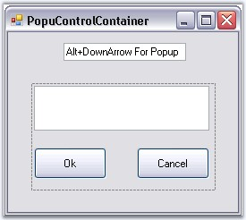
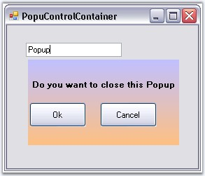

::: {style="DISPLAY: none"}
{#d2h_url_template}{#d2h_package_url style="WIDTH: 0px; DISPLAY: none; HEIGHT: 0px"}
:::

::: {.d2h_secondary_topic style="PADDING-BOTTOM: 10pt; MARGIN: 0pt; PADDING-LEFT: 0pt; PADDING-RIGHT: 0pt; PADDING-TOP: 0pt"}
#### PopupControlContainer {#popupcontrolcontainer style="tab-stops: 0pt"}

[]{style="COLOR: #15428b"} 

A **PopupControlContainer** is a panel-derived control that allows users to populate it with child controls in code or during design-time and then insert it in code with a call to **PopupControlContainer.ShowPopup**. It also provides various options with respect to its border alignment with a popup-parent.

 

The PopupControlContainer was implemented to support creating custom control-rich popups and show them beside a popup-parent, such as a **context** menu.

 

{border="0"}

[]{style="COLOR: #15428b"} 

Figure 379: PopupControlContainer During Design-Time

[]{style="COLOR: #15428b"} 

In code, call ShowPopup to show the popup anywhere in an application. It also allows you to align a popup beside a control (like in combo boxes) or popup at any given point (like in context menus).

[]{style="COLOR: #15428b"} 

{border="0"}

[]{style="COLOR: #15428b"} 

Figure 380: PopupControlContainer during Run Time

 

The PopupControlContainer also exposes its top-level parent host (a form-derived class) that lets you configure the parent form (to make the parent\'s borders resizable, for example).

 

The **Syncfusion XP Menus framework** lets users associate a PopupControlContainer with a menu item and show it from within a menu or toolbar. The **Syncfusion CommandBars** also let you associate a PopupControlContainer with it to be shown when the user clicks on the command bar drop-down button.

More:

[ ]{#related-topics}

[{border="0" align="absMiddle"}Features](ms-xhelp:///?Id=12077773-f65a-4540-9ff0-0b92fe4eace8){style="TEXT-DECORATION: none"}

[{border="0" align="absMiddle"}Creating Simple Popup](ms-xhelp:///?Id=a4d7c9ec-0a5f-49cc-aca4-dd517a9bb979){style="TEXT-DECORATION: none"}

[{border="0" align="absMiddle"}Concepts and Features](ms-xhelp:///?Id=929aa20c-18ae-4fa9-9a38-22a43ecac718){style="TEXT-DECORATION: none"}

[{border="0" align="absMiddle"}Event Handling](ms-xhelp:///?Id=c2efbd6d-f0d3-471d-b478-90713eed89d8){style="TEXT-DECORATION: none"}

[{border="0" align="absMiddle"}Frequently Asked Questions](ms-xhelp:///?Id=c71cbff2-04fe-469a-9256-2653d6352235){style="TEXT-DECORATION: none"}
:::
