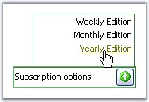

::: {style="DISPLAY: none"}
{#d2h_url_template}{#d2h_package_url style="WIDTH: 0px; DISPLAY: none; HEIGHT: 0px"}
:::

::::::: {.d2h_secondary_topic style="PADDING-BOTTOM: 10pt; MARGIN: 0pt; PADDING-LEFT: 0pt; PADDING-RIGHT: 0pt; PADDING-TOP: 0pt"}
##### Popup Customization {#popup-customization style="tab-stops: 0pt"}

[]{style="FONT-FAMILY: 'Trebuchet MS','sans-serif'; COLOR: #15428b; FONT-SIZE: 9pt"} 

Positioning the dropdown

[]{style="FONT-FAMILY: 'Trebuchet MS','sans-serif'; COLOR: #15428b; FONT-SIZE: 9pt"} 

The dropdown can be aligned with respect to the textbox, horizontally and vertically, by setting the **PopupPositionHorizontal** and **PopupPositionVertical** properties.

[]{style="FONT-FAMILY: 'Trebuchet MS','sans-serif'; COLOR: #15428b; FONT-SIZE: 9pt"} 

::: {align="center"}
+-----------------------------------+-------------------------------------------------------------------------------------------------------------------+
| Property                          | Description                                                                                                       |
+-----------------------------------+-------------------------------------------------------------------------------------------------------------------+
| PopupPositionHorizontal           | Specifies the horizontal position of the popup relative to the Text control. The options included are as follows: |
|                                   |                                                                                                                   |
|                                   |                                                                                                                   |
|                                   |                                                                                                                   |
|                                   | [·      ]{style="FONT-FAMILY: Symbol"}Near                                                                        |
|                                   |                                                                                                                   |
|                                   | [·      ]{style="FONT-FAMILY: Symbol"}Far                                                                         |
+-----------------------------------+-------------------------------------------------------------------------------------------------------------------+
| PopupPositionVertical             | Specifies the vertical position of the popup relative to the Text control. The options included are as follows:   |
|                                   |                                                                                                                   |
|                                   |                                                                                                                   |
|                                   |                                                                                                                   |
|                                   | [·      ]{style="FONT-FAMILY: Symbol"}Bottom                                                                      |
|                                   |                                                                                                                   |
|                                   | [·      ]{style="FONT-FAMILY: Symbol"}Top                                                                         |
+-----------------------------------+-------------------------------------------------------------------------------------------------------------------+
:::

[]{style="FONT-FAMILY: 'Trebuchet MS','sans-serif'; COLOR: #15428b; FONT-SIZE: 9pt"} 

{border="0"}

[]{style="FONT-FAMILY: 'Trebuchet MS','sans-serif'; COLOR: #15428b; FONT-SIZE: 9pt"} 

Figure 99: Horizontal set to Far, vertical set to Top and HorizontalAlign set to Right

[]{style="FONT-FAMILY: 'Trebuchet MS','sans-serif'; COLOR: #15428b; FONT-SIZE: 9pt"} 

Displaying popup and aligning the contents

[]{style="FONT-FAMILY: 'Trebuchet MS','sans-serif'; COLOR: #15428b; FONT-SIZE: 9pt"} 

The dropdown container can be displayed by default at runtime, by enabling the **InitiallyPopupShown** property.

[]{style="FONT-FAMILY: 'Trebuchet MS','sans-serif'; COLOR: #15428b; FONT-SIZE: 9pt"} 

::: {align="center"}
  --------------------- -------------------------------------------------
  Property              Description
  InitiallyPopupShown   Specifies whether to show the popup by default.
  --------------------- -------------------------------------------------
:::

[]{style="FONT-FAMILY: 'Trebuchet MS','sans-serif'; COLOR: black"} 

The contents of the dropdown container can aligned to one of the options of the **HorizontalAlign** property.

[]{style="FONT-FAMILY: 'Trebuchet MS','sans-serif'; COLOR: #15428b; FONT-SIZE: 9pt"} 

::: {align="center"}
+-----------------------------------+--------------------------------------------------------------------------------------------------------+
| Property                          | Description                                                                                            |
+-----------------------------------+--------------------------------------------------------------------------------------------------------+
| HorizontalAlign                   | Specifies the alignment of the text. The default value is NotSet. The options included are as follows: |
|                                   |                                                                                                        |
|                                   | [·      ]{style="FONT-FAMILY: Symbol"}NotSet                                                           |
|                                   |                                                                                                        |
|                                   | [·      ]{style="FONT-FAMILY: Symbol"}Left                                                             |
|                                   |                                                                                                        |
|                                   | [·      ]{style="FONT-FAMILY: Symbol"}Center                                                           |
|                                   |                                                                                                        |
|                                   | [·      ]{style="FONT-FAMILY: Symbol"}Right                                                            |
|                                   |                                                                                                        |
|                                   | [·      ]{style="FONT-FAMILY: Symbol"}Justify                                                          |
+-----------------------------------+--------------------------------------------------------------------------------------------------------+
:::

**[]{style="FONT-FAMILY: 'Trebuchet MS','sans-serif'; COLOR: #15428b; FONT-SIZE: 9pt"}** 

Setting popup Dimensions

**[]{style="FONT-FAMILY: 'Trebuchet MS','sans-serif'; COLOR: #15428b; FONT-SIZE: 9pt"}** 

The height and width of the dropdown can be set through the **PopupHeight** and **PopupWidth** properties respectively.

**[]{style="FONT-FAMILY: 'Trebuchet MS','sans-serif'; COLOR: #15428b; FONT-SIZE: 9pt"}** 

::: {align="center"}
  ------------- -------------------------------------------
  Property      Description
  PopupHeight   Specifies the height of the popup.
  PopupWidth    Specifies the width of the popup control.
  ------------- -------------------------------------------
:::

 

[]{#related-topics}
:::::::
