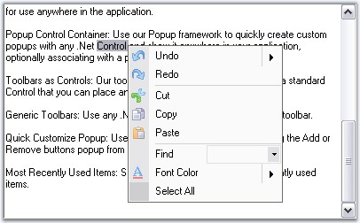

::: {style="DISPLAY: none"}
{#d2h_url_template}{#d2h_package_url style="WIDTH: 0px; DISPLAY: none; HEIGHT: 0px"}
:::

::: {.d2h_secondary_topic style="PADDING-BOTTOM: 10pt; MARGIN: 0pt; PADDING-LEFT: 0pt; PADDING-RIGHT: 0pt; PADDING-TOP: 0pt"}
#### Popup Menu {#popup-menu style="tab-stops: 0pt"}

[]{style="COLOR: #15428b"} 

A **PopupMenu** represents a context menu for XPMenus, that can be shown over any control, when the user right clicks, anywhere in an application. It must be associated with a ParentBarItem whose contents will be displayed in the popup menu. Similar to the **.NET** Context menus, a popup menu can be displayed. **PopupMenusManager** class should be added to the designer to display the PopUp menu.

[]{style="COLOR: #15428b"} 

{border="0"}

[]{style="COLOR: #15428b"} 

Figure 810: Popup Menu display on a TextBox Control

[]{style="COLOR: #15428b"} 

See Also

**[]{style="COLOR: #15428b"}** 

More:

[ ]{#related-topics}

[{border="0" align="absMiddle"}Adding and Filling a PopupMenu](ms-xhelp:///?Id=cc4ec0ba-4988-4050-ab4d-5b7c564355e6){style="TEXT-DECORATION: none"}

[{border="0" align="absMiddle"}Associating Popup Menu to a Control](ms-xhelp:///?Id=cf699cc6-1152-4a48-a394-3db65a7f9b24){style="TEXT-DECORATION: none"}

[{border="0" align="absMiddle"}Grouping Items in a Popup Menu](ms-xhelp:///?Id=05b58a98-a555-4213-ac89-3f9e7fe1531e){style="TEXT-DECORATION: none"}

[{border="0" align="absMiddle"}Visual Styles for the Popup Menu](ms-xhelp:///?Id=0dbf7d9c-9a0e-42fa-934a-cc5ff0709531){style="TEXT-DECORATION: none"}
:::
