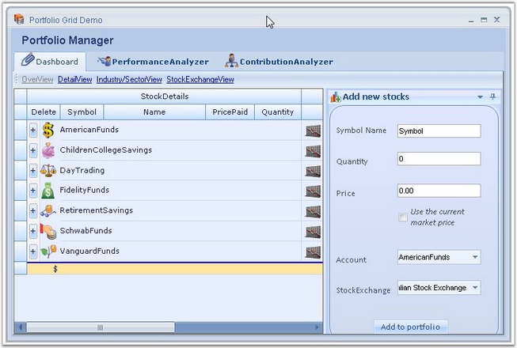
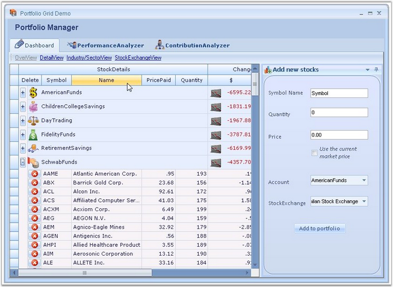
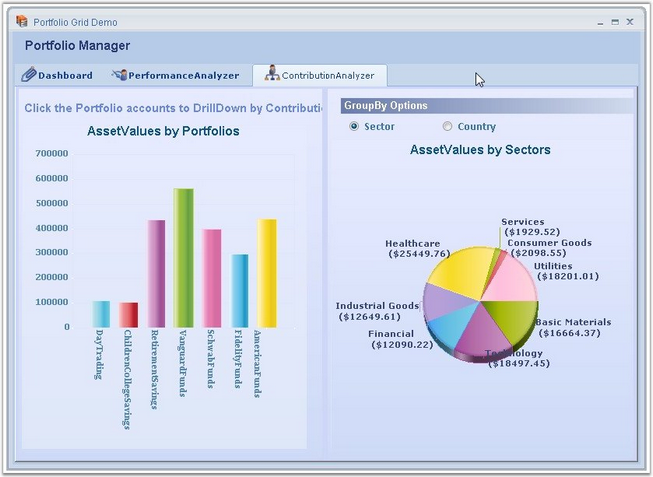
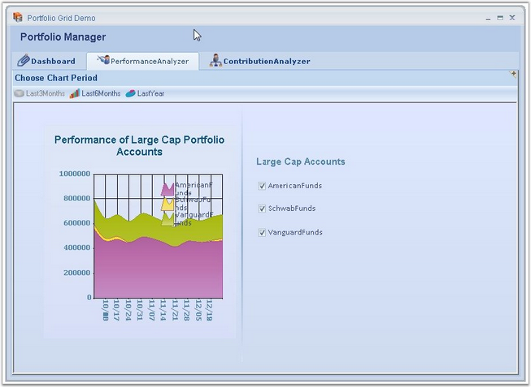

::: {style="DISPLAY: none"}
{#d2h_url_template}{#d2h_package_url style="WIDTH: 0px; DISPLAY: none; HEIGHT: 0px"}
:::

::: {.d2h_secondary_topic style="PADDING-BOTTOM: 10pt; MARGIN: 0pt; PADDING-LEFT: 0pt; PADDING-RIGHT: 0pt; PADDING-TOP: 0pt"}
##### Portfolio Grid {#portfolio-grid style="tab-stops: 0pt"}

 

The user can simulate a Portfolio Manager application by using Essential Grid. It allows you to track all your investments and assets in stocks and mutual funds. It provides you with an insight on current market pricing that would help to plan your future investments.

[]{style="FONT-FAMILY: 'Trebuchet MS','sans-serif'; COLOR: #15428b; FONT-SIZE: 9pt"} 

{border="0"}

[]{style="FONT-FAMILY: 'Trebuchet MS','sans-serif'; COLOR: #15428b; FONT-SIZE: 9pt"} 

*[Figure ]{style="FONT-SIZE: 9pt"}[381]{style="FONT-SIZE: 9pt"}[:  Portfolio Manager]{style="FONT-SIZE: 9pt"}*

[]{style="FONT-FAMILY: 'Trebuchet MS','sans-serif'; COLOR: #15428b; FONT-SIZE: 9pt"} 

Refer the following sample browser for more details:

[]{style="FONT-FAMILY: 'Trebuchet MS','sans-serif'; COLOR: #15428b; FONT-SIZE: 9pt"} 

***\<Install Location\>\\Syncfusion\\EssentialStudio\\\[Version Number\]\\Windows\\Grid.Grouping.Windows\\Samples\\2.0\\Product Showcase\\Portfolio Grid Demo***

***[]{style="FONT-FAMILY: 'Trebuchet MS','sans-serif'; COLOR: #15428b; FONT-SIZE: 9pt"}*** 

**Example** : This sample comes with three modules whose features are explained below.

 

**Dashboard** : This is the place where you can track the status of all your investments. It comes along with a variety of views:

[]{style="FONT-FAMILY: 'Trebuchet MS','sans-serif'; COLOR: #15428b; FONT-SIZE: 9pt"} 

[·      ]{style="FONT-FAMILY: Symbol"}**Overview** - Provides a consolidated view of your mutual fund holdings. You can get useful information on your investments such as rate of change per day, current market price, total returns, etc.  You have options to add or delete desired stocks.

[·      ]{style="FONT-FAMILY: Symbol"}**Detail View** - Provides a more detailed view, allowing you to get the stock details of the mutual funds.

[·      ]{style="FONT-FAMILY: Symbol"}**Industry/Sector View** - Provides a consolidated view of your stock holdings.

[·      ]{style="FONT-FAMILY: Symbol"}**Stock Exchange View** -- Displays the details with respect to the individual stock exchange.

[]{style="FONT-FAMILY: 'Trebuchet MS','sans-serif'; COLOR: #15428b; FONT-SIZE: 9pt"} 

{border="0"}

***[]{style="FONT-FAMILY: 'Trebuchet MS','sans-serif'; COLOR: #15428b; FONT-SIZE: 9pt"}*** 

*[Figure ]{style="FONT-SIZE: 9pt"}[382]{style="FONT-SIZE: 9pt"}[: Portfolio Manager-Dashboard]{style="FONT-SIZE: 9pt"}*

[]{style="FONT-FAMILY: 'Trebuchet MS','sans-serif'; COLOR: #15428b; FONT-SIZE: 9pt"} 

**Contribution Analyzer** : This module illustrates the contributions of different stocks for every portfolio account in a graphical representation by using chart controls. Click the desired portfolio account on the left side chart to view its contributions.

[]{style="FONT-FAMILY: 'Trebuchet MS','sans-serif'; COLOR: #15428b; FONT-SIZE: 9pt"} 

{border="0"}

***[]{style="FONT-FAMILY: 'Trebuchet MS','sans-serif'; COLOR: #15428b; FONT-SIZE: 9pt"}*** 

*[Figure ]{style="FONT-SIZE: 9pt"}[383]{style="FONT-SIZE: 9pt"}[: Portfolio Manager-Contribution Analyzer]{style="FONT-SIZE: 9pt"}*

[]{style="FONT-FAMILY: 'Trebuchet MS','sans-serif'; COLOR: #15428b; FONT-SIZE: 9pt"} 

**Performance Analyzer** : This module does a performance analysis and displays the market history for the top three large cap accounts. You have options to view the history for last three months, last six months, and last year.

[]{style="FONT-FAMILY: 'Trebuchet MS','sans-serif'; COLOR: #15428b; FONT-SIZE: 9pt"} 

{border="0"}

***[]{style="FONT-FAMILY: 'Trebuchet MS','sans-serif'; COLOR: #15428b; FONT-SIZE: 9pt"}*** 

*[Figure ]{style="FONT-SIZE: 9pt"}[384]{style="FONT-SIZE: 9pt"}[: Portfolio Manager-Performance Analyzer]{style="FONT-SIZE: 9pt"}*

 

[]{#p474} 

 

[]{#related-topics}
:::
