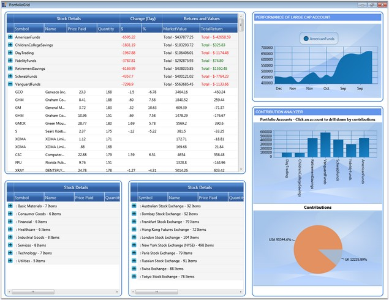

::: {style="DISPLAY: none"}
{#d2h_url_template}{#d2h_package_url style="WIDTH: 0px; DISPLAY: none; HEIGHT: 0px"}
:::

:::: {.d2h_secondary_topic style="PADDING-BOTTOM: 10pt; MARGIN: 0pt; PADDING-LEFT: 0pt; PADDING-RIGHT: 0pt; PADDING-TOP: 0pt"}
#### Portfolio Grid {#portfolio-grid style="tab-stops: 0pt"}

Essential Grid is the proper choice to use in portfolio applications, as it  deals with both huge and real time data without a performance hit. This section illustrates how to employ the grid in portfolio applications.

 

This example displays three GridData controls (GDCs) and three Chart controls hosted in a Grid control using its CellTypes feature. The three GDCs display stock details in three different views -- Overview, Sector Industry View and Stock Exchange View.  Among the charts, one illustrates the performance of large portfolio account, and the other two illustrates the individual country contributions to specific portfolio accounts. You can click any portfolio account in the PortfolioAccounts chart to drill down to its contributions.

 

The GDCs are extremely customized with appropriate groups and summaries in order to provide the desired view. It also highlights the change of stock values. Value increase is indicated by green foreground and decrease in values is indicated by red foreground.

 

The following image shows the Essential Grid being used in a portfolio application:

 

{border="0"}

Figure 244: Portfolio Application using Essential Grid

[]{style="COLOR: #15428b"} 

::: {style="BORDER-BOTTOM: windowtext 1pt solid; BORDER-LEFT: medium none; PADDING-BOTTOM: 1pt; MARGIN-TOP: 9pt; PADDING-LEFT: 0pt; PADDING-RIGHT: 0pt; MARGIN-BOTTOM: 9pt; BORDER-TOP: windowtext 1pt solid; BORDER-RIGHT: medium none; PADDING-TOP: 1pt"}
{border="0"}Note: For complete code of this example, refer to the following browser sample:
:::

[]{style="COLOR: #15428b"} 

\...\\My Documents\\Syncfusion\\EssentialStudio\\\<Version Number\>\\WPF\\Grid.WPF\\Samples\\3.5\\WindowsSamples\\Product Showcase\\Stock Dashboard Demo

 

 

[]{#related-topics}
::::
